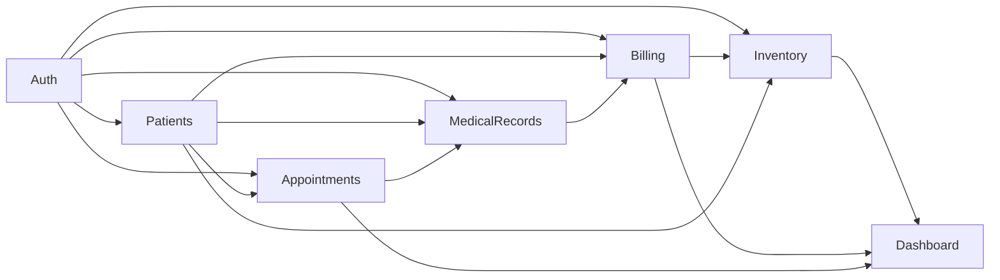

# Business Context — Ngữ cảnh nghiệp vụ

> **Mục đích:** Giải thích vì sao phòng khám nha khoa vận hành theo cách này, trước khi vào spec từng module.
> **Ai nên đọc:** Dev muốn hiểu nghiệp vụ, BA mới onboard, AI đọc để khỏi "hiểu nhầm".

---

## 1. Tổng quan vận hành phòng khám nha khoa

### 1.1 Một ngày điển hình

```
07:30  Chuẩn bị:      Lễ tân mở lịch làm việc, đặt ca bác sĩ (nếu lịch động).
08:00  Tiếp nhận:      Bệnh nhân đến → lễ tân check-in → vào waiting queue.
08:30  Khám:           Bác sĩ gọi bệnh nhân từ queue → khám → ghi encounter.
        ... (lặp lại)
12:00  Nghỉ trưa.
13:00  Tiếp tục khám.
17:00  Thu ngân:       Lễ tân in hóa đơn tổng cuối ngày, thanh toán.
18:00  Đóng ca:        Bác sĩ review các ca cần follow-up ngày mai.
```

### 1.2 Dòng tiền

```
Điều trị
   ↓
Phiếu điều trị (Treatment)  ← do bác sĩ tạo khi khám xong
   ↓
Hóa đơn (Invoice)           ← lễ tân tổng hợp sau encounter
   ↓
Thanh toán (Payment)        ← bệnh nhân trả (tiền mặt / chuyển khoản / thẻ)
```

### 1.3 Quản lý tồn kho

- Khi BS dùng vật tư trong điều trị, phòng khám ghi nhận sử dụng → trừ kho.
- Nhà cung cấp giao hàng → nhập kho.
- Định kỳ kiểm kê → điều chỉnh.

---

## 2. Một ca bệnh đi qua hệ thống

Đây là dòng chính của hệ thống, gọi tắt là **"patient journey"**.

```
        ┌─────────────┐
        │  Bệnh nhân   │ (entity, không phải User)
        └──────┬──────┘
               │
               ↓
        ┌─────────────┐
        │  Tạo Patient │  (1 lần duy nhất, hoặc tìm bệnh nhân cũ)
        └──────┬──────┘
               ↓
        ┌─────────────┐
        │ Appointment  │  Đặt lịch (lễ tân)
        └──────┬──────┘
               ↓
        ┌─────────────┐
        │  Check-in    │  Bệnh nhân đến (lễ tân)
        └──────┬──────┘
               ↓
        ┌──────────────┐
        │ Encounter     │  BS khám (bác sĩ)
        │  + Treatment  │  Ghi điều trị
        │  + Prescription (nếu có)
        │  + Clinical Note
        │  + Dental Chart cập nhật
        └──────┬───────┘
               ↓
        ┌──────────────┐
        │ Invoice       │  Lễ tân tổng hợp hóa đơn
        └──────┬───────┘
               ↓
        ┌──────────────┐
        │ Payment       │  Bệnh nhân thanh toán
        └──────┬───────┘
               ↓
        ┌──────────────┐
        │ Inventory -N  │  Vật tư bị trừ tự động (nếu đã map)
        └───────────────┘
```

Mỗi bước là một module cụ thể:

| Bước | Module sở hữu | Permission chính |
| ---- | -------------- | ---------------- |
| Tạo Patient | Patients | `patient.create` |
| Appointment | Appointments | `appointment.create` |
| Check-in | Appointments | `appointment.check_in` |
| Encounter + Treatment + Note + Chart | MedicalRecords | `encounter.create` |
| Invoice | Billing | `invoice.create` |
| Payment | Billing | `invoice.mark_paid` |
| Trừ tồn kho | Inventory | `inventory.adjust` (tự động) |

---

## 3. Qui định ngoài (compliance)

### 3.1 Lưu trữ hồ sơ y tế

- **Việt Nam (Luật Khám bệnh, chữa bệnh 2023):** lưu trữ hồ sơ bệnh án **tối thiểu 10 năm** kể từ ngày kết thúc điều trị.
- Khi xóa bệnh nhân (soft-delete), record vẫn giữ lại. Không hard delete.
- Một số trường hợp (HIV, tâm thần, ...) có thể yêu cầu 20 năm — không nằm trong phạm vi MVP nhưng thiết kế phải **không ngăn cản** mở rộng sau.

### 3.2 Bảo mật dữ liệu

- Dữ liệu y tế là **dữ liệu nhạy cảm** theo Nghị định 13/2023/NĐ-CP về bảo vệ dữ liệu cá nhân.
- Cần: audit log truy cập dữ liệu bệnh nhân, mã hóa at-rest (DB), TLS in-transit.
- MVP: audit log + TLS. Mã hóa at-rest = trách nhiệm hạ tầng (PostgreSQL TDE / cloud KMS) — không phải việc của code app.

### 3.3 Standard y tế (để ý khi thiết kế)

| Standard | Mục đích | MVP xử lý thế nào |
| -------- | -------- | ----------------- |
| ICD-10 | Mã bệnh (chẩn đoán) | Cho phép nhập tự do (text). Mapping ICD-10 ở lần release sau. |
| SNOMED CT | Mã hóa lâm sàng | Sau MVP. |
| LOINC | Mã xét nghiệm | Sau MVP. |
| FHIR | Chuẩn trao đổi dữ liệu | Sau MVP. |

> MVP chọn: **text tự do + autocomplete** thay vì force ICD-10 ngay từ đầu. Vì:
> 1. Bác sĩ Việt Nam chưa quen gõ ICD-10 trên phần mềm.
> 2. Văn bản mô tả đầy đủ hơn mã (cho lưu trữ ngắn hạn).
> 3. Có thể thêm ICD picker ở version 1.1 mà không phá schema.

---

## 4. Tổng quan Actors

Xem chi tiết ở [`business-flow-overview.md`](business-flow-overview.md) và [`actor-permissions-matrix.md`](actor-permissions-matrix.md).

| Actor | Mục tiêu chính | "Pain point" giải quyết |
| ----- | -------------- | ---------------------- |
| Clinic Admin | Báo cáo tài chính, quản lý nhân sự | Excel tổng hợp mỗi tuần |
| Receptionist | Đặt lịch + thu tiền đúng | Trùng lịch, thu thiếu |
| Dentist | Khám + ghi chép hiệu quả | Mất ghi chú giấy, phải viết 2 lần |

---

## 5. Tổng quan khối lượng (target)

| Metric | MVP target | Lưu ý |
| ------ | ---------- | ----- |
| Bệnh nhân / năm | ~2.000 | Phòng khám nhỏ |
| Appointment / tuần | ~80 | Hợp lý |
| Encounter / ngày / BS | ~12 | Bao gồm tái khám |
| Invoice / tháng | ~300 | Hợp lý |
| Item tồn kho | ~100 | SKU thấp |

> Performance target cho MVP: <200ms response ở p95 (đọc), <500ms (ghi). Đây **không phải** production SLA — là target cho test nội bộ.

---

## 6. Phạm vi MVP và những thứ KHÔNG có

### 6.1 Có

- Một phòng khám duy nhất.
- 7 module chính: Auth, Patients, Appointments, Medical Records, Billing, Inventory, Dashboard.
- AI features cơ bản (sau khi MVP core chạy).
- Hóa đơn điện tử (nếu phòng khám yêu cầu) — có thể thêm ở release sau.

### 6.2 Không có ở MVP

| Tính năng | Lý do |
| --------- | ----- |
| Multi-clinic | ADR-0002 chốt MVP 1 phòng khám |
| Patient portal | ADR-0003 cần PatientAccount riêng |
| App mobile native | Sau MVP |
| Email/SMS reminder thật | Mock trước; tích hợp sau |
| Tích hợp VNPay/MoMo | Sau MVP |
| Hình ảnh X-ray / ảnh nội soi | BD-0005 |
| Lô hàng + hạn vật tư | BD-0004 |
| Đặt cọc trước điều trị | BD-0003 |
| ICD-10 / SNOMED | Sau MVP |

### 6.3 Có thể thêm sau mà không phá schema

- Treatment plan (nhiều appointment → 1 kế hoạch điều trị dài hạn).
- Recall / tái khám (auto-reschedule).
- Teledentistry.
- Insurance claim (e-claim với BHXH VN).
- Pricing per doctor / per shift.
- Loyalty / discount.

---

## 7. Tương tác giữa các module (preview)



> Sơ đồ chi tiết từng cung sẽ vẽ khi viết API spec.

---

## 8. Domain hotspots — những chỗ dễ "hiểu nhầm"

| Hotspot | Tóm tắt dễ nhầm | Định nghĩa chuẩn |
| ------- | --------------- | ---------------- |
| Appointment ↔ Encounter | "Nhiều Encounter cho 1 Appointment"? | Một-1 (BD-0002) |
| Patient ↔ User | "Patient là User"? | Khác (ADR-0003) |
| Treatment ↔ Invoice | "Treatment tự động thành Invoice"? | Treatment sinh ra InvoiceItem **sau khi** lễ tân issue invoice |
| Check-in ↔ Encounter | "Check-in xong là Encounter"? | Check-in chỉ là chuyển trạng thái; Encounter tạo khi BS vào khám |
| Dental Chart | "Dental Chart là bảng riêng"? | Dental Chart = JSON snapshot trong Encounter |
| Invoice ↔ Payment | "Invoice thanh toán xong là xóa được"? | Không xóa — chỉ chuyển state |

---

## 9. Liên kết

- [`business-decisions.md`](business-decisions.md) — log 5 quyết định nghiệp vụ đã chốt.
- [`actor-permissions-matrix.md`](actor-permissions-matrix.md) — ma trận role × action × permission.
- [`business-flow-overview.md`](business-flow-overview.md) — 5 flow chính.
- [`../02_Glossary/GLOSSARY.md`](../02_Glossary/GLOSSARY.md) — định nghĩa thuật ngữ.
- [`../../PROJECT_RULES.md`](../../PROJECT_RULES.md) — quy tắc dự án.
