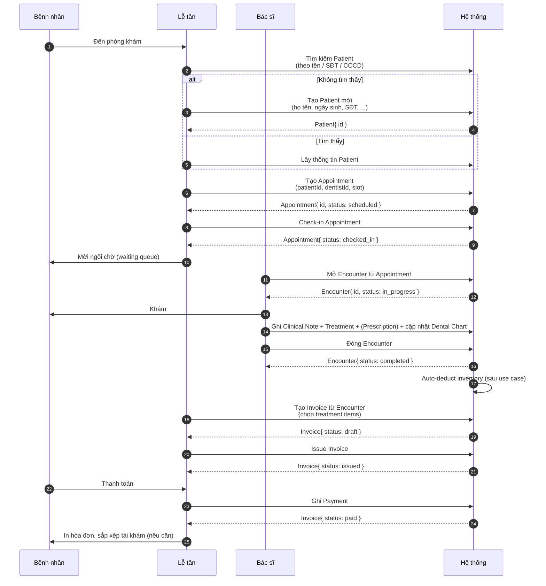
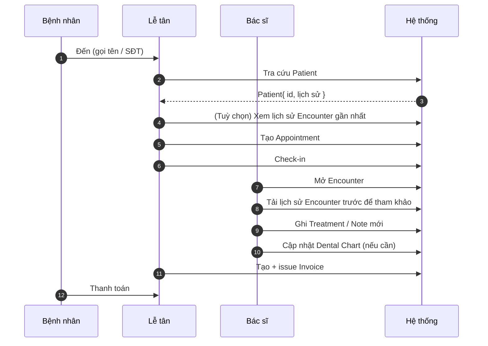
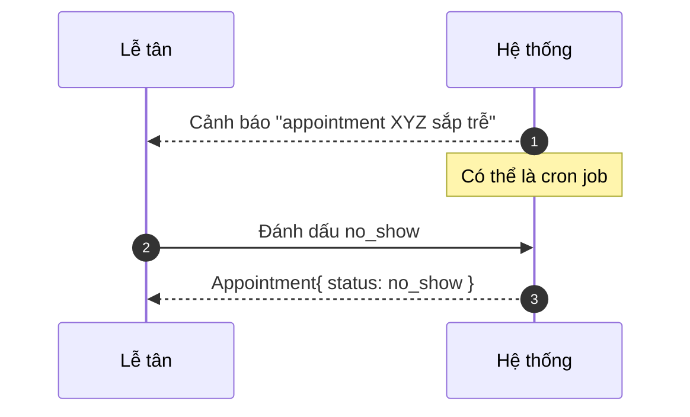
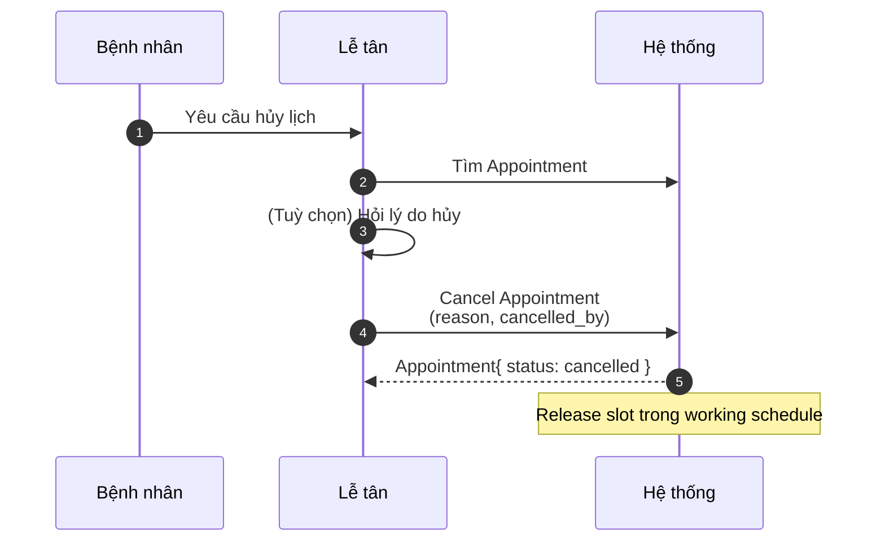
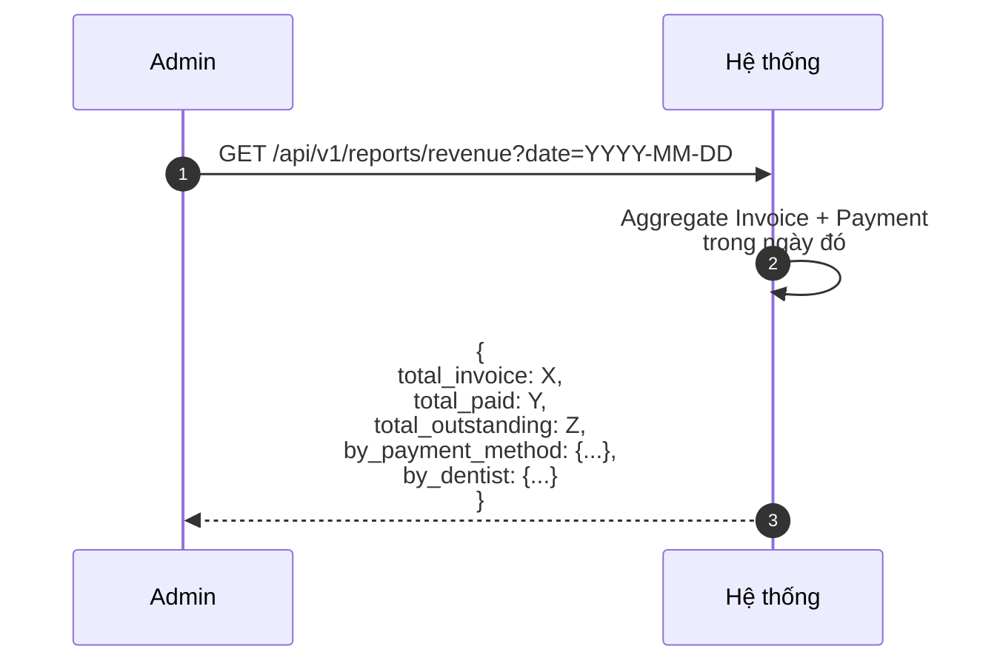

# Business Flow Overview — 5 luồng nghiệp vụ chính

> **Mục đích:** Mô tả 5 luồng nghiệp vụ MVP bằng sơ đồ và use case narrative.
> **Tại sao chỉ 5?** Vì MVP bản chất chỉ xoay quanh 5 luồng đó. Mọi flow khác là biến thể (xem mục 7).
>
> Mỗi flow dùng chuẩn:
> - **Trigger** — sự kiện khởi động
> - **Pre-condition** — điều kiện cần có trước
> - **Steps** — từng bước (có actor)
> - **Post-condition** — trạng thái sau khi xong
> - **Exception** — luồng lỗi chính

---

## 1. FLOW #1 — Bệnh nhân mới đến lần đầu (Walk-in)

> Đây là luồng "nặng" nhất vì chạm tất cả module.

### 1.1 Trigger

Bệnh nhân (chưa có trong DB) đến phòng khám, muốn khám.

### 1.2 Pre-condition

- Receptionist đã đăng nhập.

### 1.3 Steps

### 1.4 Post-condition

- Patient, Appointment, Encounter, Treatment, Invoice, Payment đều được tạo.
- Inventory items bị trừ (nếu map được).
- Trạng thái cuối: tất cả status khác biệt (`paid`, `completed`, `no_show` tùy).

### 1.5 Exception

| Exception | Xử lý |
| --------- | ----- |
| BN không có CCCD | Cho phép đăng ký với SĐT + họ tên. Flag `identification_verified = false`. |
| Trùng giờ với BS khác | Hệ thống cảnh báo lễ tân. Lễ tân chọn ca khác hoặc BS khác. |
| BN chỉ muốn tư vấn, không điều trị | Tạo Appointment nhưng không tạo Encounter. Đóng appointment với `status = completed`. |
| BS gọi ca này nhưng BN chưa check-in | UI cảnh báo; lễ tân check-in thủ công. |

---

## 2. FLOW #2 — Tái khám (Existing Patient)

### 2.1 Trigger

Bệnh nhân cũ quay lại.

### 2.2 Pre-condition

- Patient đã tồn tại trong DB.

### 2.3 Steps

### 2.4 Post-condition

- Thêm một Encounter mới cho bệnh nhân.
- Dental Chart được cập nhật với tình trạng mới (lưu lịch sử, không ghi đè).

### 2.5 Exception

| Exception | Xử lý |
| --------- | ----- |
| Patient đã soft-delete | Cho phép "khôi phục" thay vì tạo mới, để giữ lịch sử. |
| BN không nhớ thông tin | Tìm theo SĐT (partial match). Lễ tân xác minh thêm (CMND/CCCD). |

---

## 3. FLOW #3 — Bệnh nhân không đến (No-show)

### 3.1 Trigger

Đã qua giờ hẹn + 15 phút, bệnh nhân chưa check-in.

### 3.2 Pre-condition

- Appointment tồn tại, status = `scheduled` hoặc `confirmed`.

### 3.3 Steps

### 3.4 Post-condition

- Appointment ở status `no_show`.
- Lịch sử giữ lại (audit).
- (Tương lai) Tự động ghi nhận "BN hay no-show" để cảnh báo lễ tân trước khi hẹn.

### 3.5 Exception

| Exception | Xử lý |
| --------- | ----- |
| BN đến trễ sau khi đã đánh dấu no_show | Lễ tân chuyển lại status về `checked_in` (có log lý do). |

---

## 4. FLOW #4 — Bệnh nhân hủy lịch (Cancel Appointment)

### 4.1 Trigger

BN gọi điện / đến trực tiếp yêu cầu hủy trước giờ khám.

### 4.2 Pre-condition

- Appointment status ∈ { `scheduled`, `confirmed` }.
- Chưa đến giờ khám (hoặc trước 24h nếu do BS yêu cầu hủy).

### 4.3 Steps

### 4.4 Post-condition

- Appointment: status = `cancelled`.
- Slot được giải phóng cho lịch khác.
- Lý do + actor lưu audit.

### 4.5 Exception

| Exception | Xử lý |
| --------- | ----- |
| BN hủy sau khi đã check-in | Phải BS xác nhận. Nếu đã có Encounter → không hủy được, chỉ "close encounter as no_treatment". |
| BS muốn hủy lịch của mình | Permission `appointment.cancel` với rule đặc biệt: BS chỉ hủy được lịch mình ≥ 24h trước. |

---

## 5. FLOW #5 — Báo cáo doanh thu cuối ngày

### 5.1 Trigger

Admin / Receptionist muốn xem doanh thu ngày.

### 5.2 Pre-condition

- User có permission `report.revenue.read` (chỉ Admin).

### 5.3 Steps

### 5.4 Post-condition

- Hiển thị report cho Admin.
- Có thể export CSV (tuỳ chọn).

### 5.5 Exception

| Exception | Xử lý |
| --------- | ----- |
| Ngày có nhiều payment method khác nhau | Tách group theo method. |

---

## 6. Luồng phụ (Secondary flows)

| Tên | Mô tả ngắn | Quyết định tham chiếu |
| --- | ---------- | --------------------- |
| Walk-in chỉ mua dịch vụ (không khám) | Tạo invoice ad-hoc + payment | BD-0003 |
| Điều chỉnh tồn kho thủ công | Admin nhập kho hoặc kiểm kê | BD-0004 |
| Bác sĩ nghỉ phép | Cập nhật working schedule | BD-0002 (slot release) |
| Khám lần đầu cho trẻ em | Dental chart có răng sữa riêng | Glossary |

---

## 7. Edge cases cần lưu ý khi viết spec

| Case | Nguy cơ | Ghi vào spec nào |
| ---- | ------- | ---------------- |
| Patient thay đổi SDT | Lưu lịch sử SDT cũ (audit) hoặc chỉ update? | Patients |
| 1 Bệnh nhân khám 2 BS cùng lúc | 2 Appointment khác BS, 2 Encounter | Appointments (giải thích rule overlap) |
| Lễ tân nhầm appointment | Cho sửa hoặc undo? Audit lịch sử | Appointments |
| Hóa đơn phát sinh ngoài giờ | Cho ra invoice 0h? Có cần batch? | Billing |
| Hoàn tiền 1 phần | Phải audit nguồn tiền | Billing |
| Hết vật tư khi đang khám | Cảnh báo BS, dừng treatment hay thay thế? | Inventory + Medical Records |
| Hết slot khám cho cả tuần | Cảnh báo lễ tân đặt tuần khác? | Appointments |

---

## 8. Liên kết

- [`business-context.md`](business-context.md) — overview.
- [`actor-permissions-matrix.md`](actor-permissions-matrix.md) — ma trận RBAC.
- [`business-decisions.md`](business-decisions.md) — 5 BD.
- [`../02_Glossary/GLOSSARY.md`](../02_Glossary/GLOSSARY.md) — thuật ngữ.
- Spec của từng module sẽ tham chiếu flow tương ứng.
