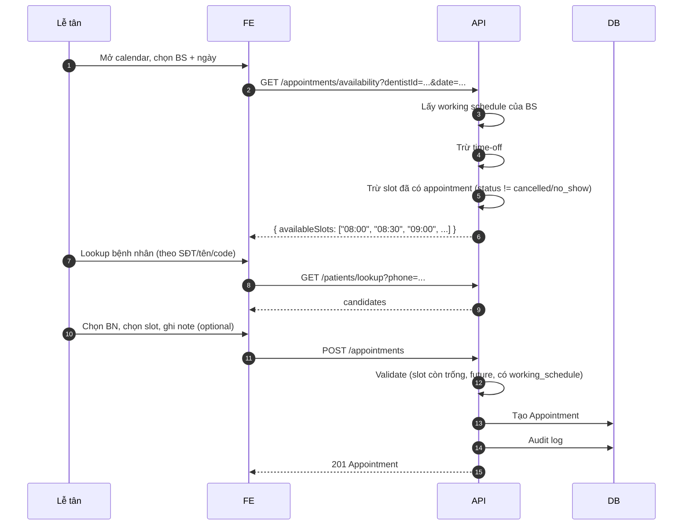
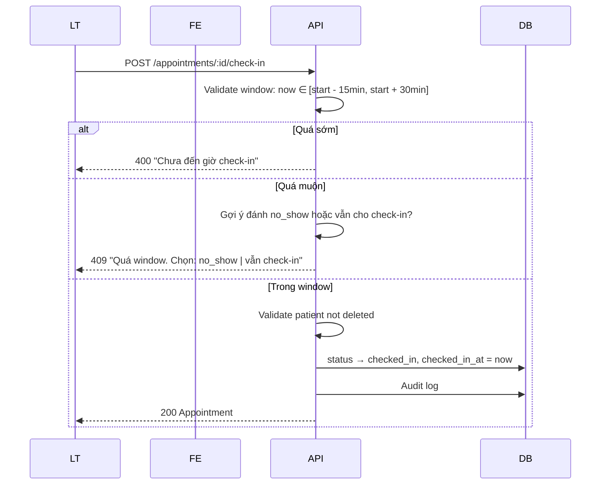
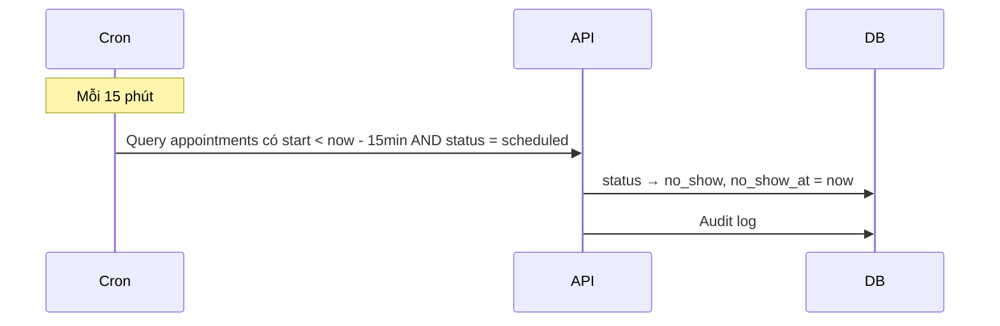
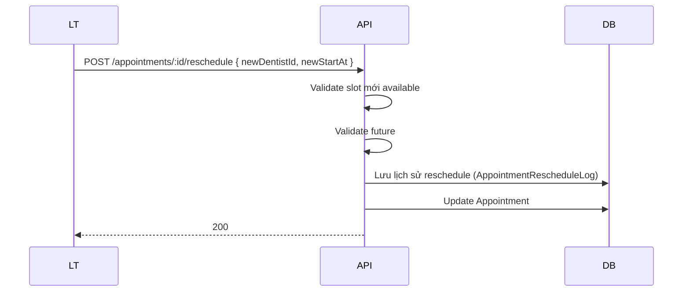

# Blueprint: Appointments Module

> **Loại tài liệu:** Blueprint (khám phá trước spec).
> **Module:** `Appointments` — Quản lý lịch hẹn, working schedule, waiting queue, check-in.

---

## Vấn đề

Phòng khám cần:

1. Đặt lịch trước cho bệnh nhân (BS biết trước có ca nào trong ngày).
2. Theo dõi bệnh nhân đã đến (check-in) → vào hàng đợi.
3. Bác sĩ gọi bệnh nhân vào khám (FIFO queue).
4. Đánh dấu no-show / hủy lịch khi cần.
5. Cấu hình giờ làm việc của BS để tránh đặt lịch ngoài giờ.

## Phạm vi giả định (Assumptions)

- **MVP:** Lịch định kỳ đơn giản theo tuần (mỗi thứ X, BS làm từ 8h-12h + 13h-17h), có thể đăng ký time-off.
- 1 Appointment ↔ 0 hoặc 1 Encounter (xem BD-0002).
- Slot mặc định 30 phút, configurable per-slot.
- Working schedule thuộc Auth/User (không phải resource riêng) — có thể là API riêng dưới module này.
- Lễ tân là người đặt lịch & check-in; BS chỉ xem lịch của mình.
- Không có reminder tự động (sau MVP).
- Lịch hẹn chỉ tạo cho tương lai (cấm past — chốt ở Q2).
- Check-in window: `[start - 15min, start + 30min]` (chốt ở Q3).

## Câu hỏi cần trả lời (Open Questions)

Sẽ trả lời chi tiết trong SPEC.md:

1. **Slot duration:** 30 phút mặc định — có phải hard-code hay config per-slot?
2. **Slot còn trống:** Lễ tân có thể đặt chính xác slot hay chỉ "khoảng thời gian"?
3. **Multi-BS cùng slot:** Cùng 1 giờ, 2 BS khác nhau — có cho cùng BN khám 2 BS không?
4. **Reminder:** Out of scope MVP, nhưng có cần ghi nhận "đã gửi reminder" trong DB?
5. **Reschedule:** Cho phép chuyển lịch từ slot này sang slot khác?
6. **Walk-in không đặt trước:** Lễ tân tạo BN mới + appointment luôn trong ngày — đã có ở flow #1. Có flow riêng không?
7. **Working schedule conflict:** BS hủy lịch giữa chừng → bệnh nhân đã đặt phải thông báo?

## Workflow dự kiến

### Workflow 1: Đặt lịch mới



### Workflow 2: Check-in



### Workflow 3: Hủy lịch

```mermaid
sequenceDiagram
  participant Actor
  participant API
  participant DB

  Actor->>API: POST /appointments/:id/cancel { reason }
  API->>API: Validate (status ∈ {scheduled, confirmed})
  API->>API: BR-APPT-009: BS chỉ hủy được lịch của mình ≥ 24h trước
  API->>DB: status → cancelled
  API->>DB: Audit log
  API-->>Actor: 200
```

### Workflow 4: No-show



Hoặc manual:

```mermaid
  LT->>API: POST /appointments/:id/no-show { reason }
  API->>DB: status → no_show
  API-->>LT: 200
```

### Workflow 5: Reschedule



## Màn hình dự kiến

| Màn hình | Mục đích | Actor |
| -------- | -------- | ----- |
| Calendar (week/day view) | Xem lịch BS theo tuần/ngày | Lễ tân, Admin |
| My schedule | BS xem lịch của mình | BS |
| Appointment create | Form đặt lịch (có patient lookup) | Lễ tân |
| Appointment detail | Xem chi tiết + check-in | Lễ tân |
| Waiting queue (live) | Danh sách BN đang chờ | Lễ tân, BS |
| Working schedule editor | Cấu hình giờ làm việc BS | Admin, BS (của mình) |
| Time-off request/manager | Quản lý nghỉ phép | Admin, BS (của mình) |
| Reschedule | Đổi lịch | Lễ tân, Admin |
| My appointments (BS) | BS xem lịch sắp tới của mình | BS |

## Entity dự kiến

| Entity | Field chính |
| ------ | ----------- |
| **Appointment** | id, patientId, dentistId, startAt, endAt, status, reason, notes, source (walk-in / phone / online), confirmedAt, checkedInAt, completedAt, cancelledAt, cancelledReason, cancelledBy, noShowAt |
| **WorkingSchedule** | id, dentistId, dayOfWeek (0–6), startTime, endTime, slotDurationMin, validFrom, validTo |
| **TimeOff** | id, dentistId, startAt, endAt, reason, type (vacation / sick / training) |
| **AppointmentRescheduleLog** | id, appointmentId, oldStartAt, oldDentistId, newStartAt, newDentistId, reason, changedBy, changedAt |

## Rule dự kiến (preview)

| Rule ID | Mô tả |
| ------- | ----- |
| BR-APPT-001 | Slot duration mặc định 30 phút (cấu hình per-schedule) |
| BR-APPT-002 | 1 slot = 1 appointment (unique theo dentistId + startAt) |
| BR-APPT-003 | Slot phải nằm trong working schedule của BS |
| BR-APPT-004 | Không trùng time-off |
| BR-APPT-005 | Appointment chỉ tạo cho future (now + 1 min trở đi) |
| BR-APPT-006 | Check-in window: `[start - 15min, start + 30min]` |
| BR-APPT-007 | Ngoài check-in window: phải confirm "vẫn check-in" hoặc chọn "no_show" |
| BR-APPT-008 | Patient không được soft-delete để check-in / bắt đầu encounter |
| BR-APPT-009 | BS chỉ cancel appointment của mình ≥ 24h trước startAt |
| BR-APPT-010 | Lễ tân/Admin cancel được bất kỳ lúc nào (trước khi encounter bắt đầu) |
| BR-APPT-011 | Cancel sau khi encounter bắt đầu → không cancel được, phải đóng encounter |
| BR-APPT-012 | Auto no-show: status `scheduled` mà quá 15 phút sau startAt → tự động no_show |
| BR-APPT-013 | Status state machine: `scheduled → confirmed → checked_in → in_progress → completed` hoặc → `cancelled` / `no_show` |
| BR-APPT-014 | Working schedule có validFrom/validTo cho phép lịch thay đổi theo thời gian |
| BR-APPT-015 | Reschedule giữ appointmentId, chỉ đổi dentist/startAt; lưu log |
| BR-APPT-016 | Reschedule max 3 lần / appointment (chống lạm dụng) |
| BR-APPT-017 | Working schedule của BS khác nhau cho từng ngày trong tuần |

## API dự kiến

| Endpoint | Method | Permission |
| -------- | ------ | ---------- |
| /appointments/availability | GET | `appointment.read.any` |
| /appointments | GET | `appointment.read.*` (any hoặc own) |
| /appointments | POST | `appointment.create` |
| /appointments/:id | GET | `appointment.read.*` |
| /appointments/:id | PATCH | `appointment.update` |
| /appointments/:id/cancel | POST | `appointment.cancel` |
| /appointments/:id/check-in | POST | `appointment.check_in` |
| /appointments/:id/no-show | POST | `appointment.mark_no_show` |
| /appointments/:id/reschedule | POST | `appointment.update` |
| /appointments/:id/start | POST | `encounter.create` (BS, tạo encounter) |
| /appointments/waiting-queue | GET | `appointment.check_in` |
| /appointments/today | GET | `appointment.read.*` (lịch hôm nay) |
| /working-schedules | GET | `schedule.update` (own) hoặc admin |
| /working-schedules | POST | `schedule.update` (own) |
| /working-schedules/:id | PATCH | `schedule.update` (own) |
| /working-schedules/:id | DELETE | `schedule.update` (own) |
| /time-offs | GET | `schedule.update` |
| /time-offs | POST | `schedule.update` (own) |
| /time-offs/:id | DELETE | `schedule.update` (own) |

## Rủi ro & giảm thiểu

| Rủi ro | Giảm thiểu |
| ------ | ---------- |
| Race condition 2 người đặt cùng slot | Unique index `(dentist_id, start_at)` cho slot; validate tại application service với transaction |
| BN quên check-in | Cron job auto no-show sau 15 phút |
| BS nghỉ giữa ca (không cập nhật time-off) | Cảnh báo cho BS; vẫn cho BN khám BS khác (reschedule) |
| Lịch lặp lại (recurring) | Validation validFrom/validTo của schedule |
| Holiday/tet | Có thể tạo "global time-off" (sau MVP). MVP: tạo time-off cho từng BS thủ công |

---

## Tiếp theo

Sau khi xác nhận phạm vi → viết `SPEC.md` đầy đủ 10 mục.