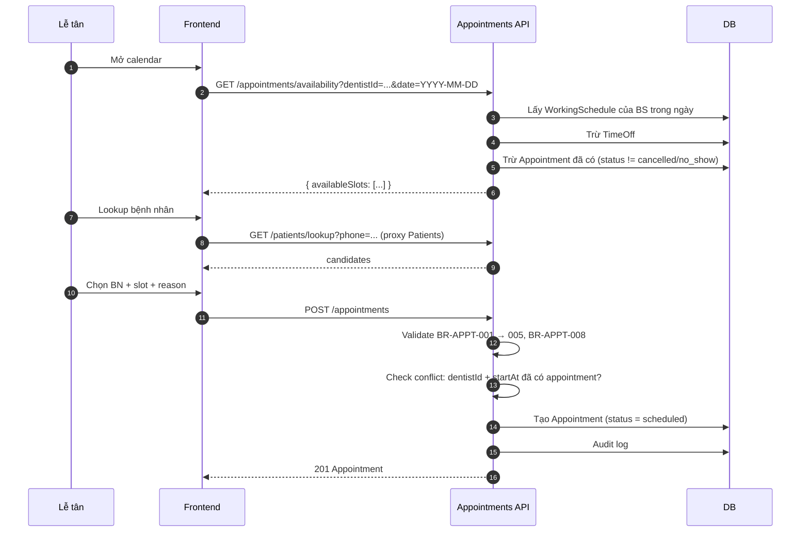
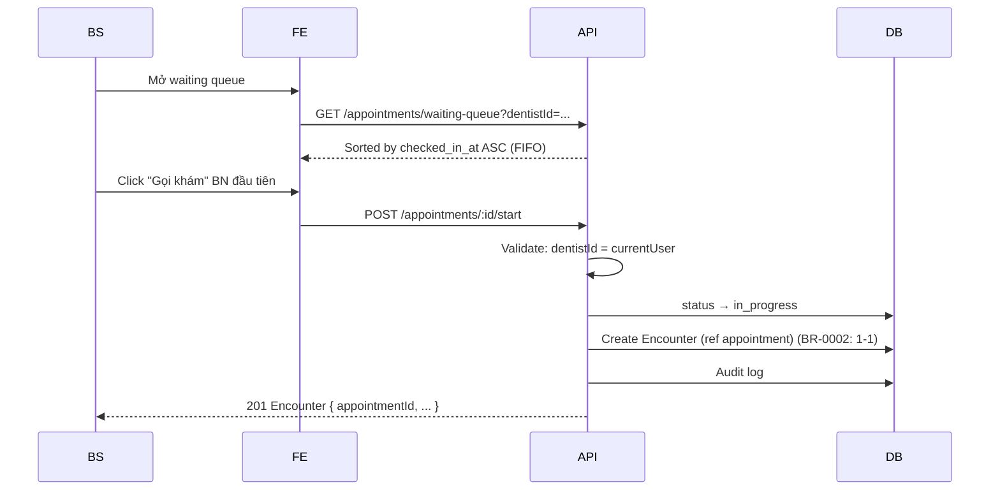
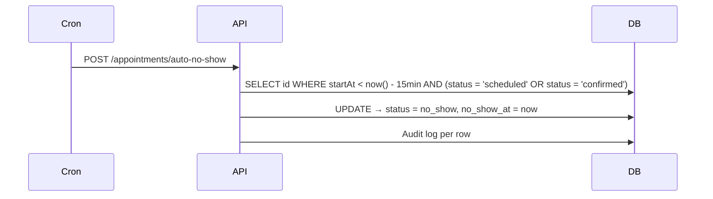
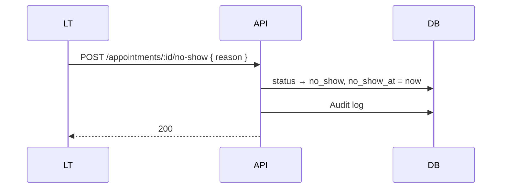
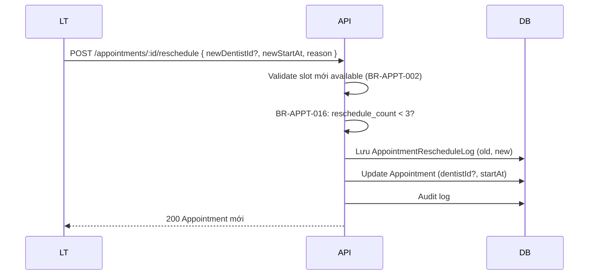
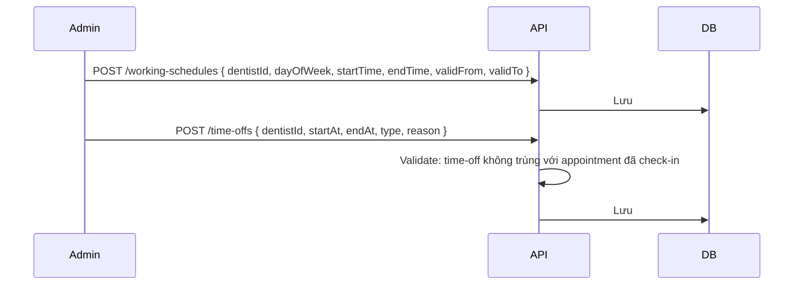
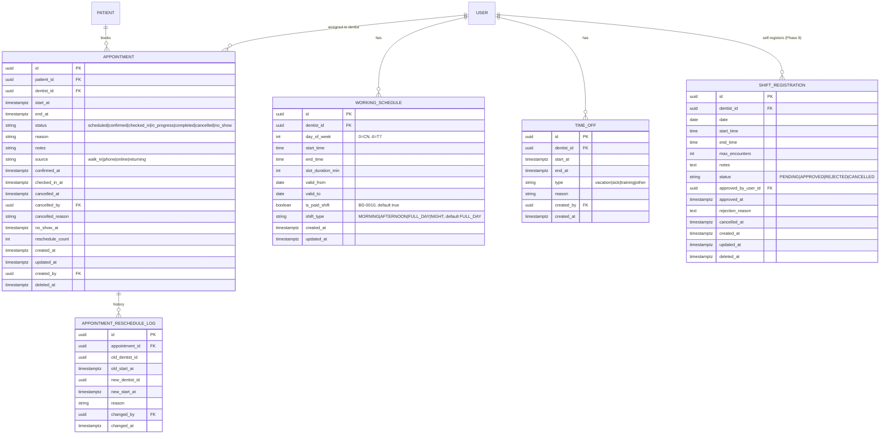

# SPEC — Appointments Module

> **Module:** `Appointments`
> **Ngày tạo:** 2026-07-13
> **Trạng thái:** Draft (chờ review)
> **Phiên bản:** 1.0
>
> **Đây là spec duy nhất cho module Appointments.** Mọi implementation, code, test, API đều phải tham chiếu file này.

---

## Tổng quan nhanh

| Phần | Tóm tắt |
| ---- | ------- |
| Purpose | Quản lý lịch hẹn, working schedule, waiting queue |
| Bounded context | Appointments — module độc lập |
| Modules phụ thuộc | _(không — root entity)_ |
| Được dùng bởi | Medical Records (Encounter ref Appointment), Billing |
| Permission riêng | `appointment.*`, `schedule.update` |

---

## 1. Purpose (Mục đích)

### 1.1 Bối cảnh

Phòng khám cần:

1. **Đặt lịch trước** cho bệnh nhân — bác sĩ biết trước ca nào trong ngày.
2. **Check-in** khi BN đến — chuyển sang hàng đợi.
3. **Hàng đợi (waiting queue)** — FIFO (xem BD-0001) để BS gọi BN vào khám.
4. **Hủy / no-show** — quản lý lịch không diễn ra.
5. **Working schedule** — cấu hình giờ làm việc của BS để tránh đặt ngoài giờ.

### 1.2 Phạm vi (Scope)

#### ✅ Có

- CRUD Appointment (create, read, update, cancel, no-show, reschedule).
- Check-in với validation window thời gian.
- Waiting queue live cho lễ tân/BS xem.
- Working schedule (lịch định kỳ đơn giản, validFrom/validTo).
- Time-off (nghỉ phép, nghỉ ốm, training).
- Auto no-show cron job (mỗi 15 phút).
- Status state machine đầy đủ.
- Tính slot available theo working schedule − time-off − appointment đã đặt.

#### ❌ Không có ở MVP

- SMS / email reminder tự động.
- Patient tự đặt lịch online (patient portal).
- Recurring schedule phức tạp (theo pattern "mỗi 2 tuần").
- Holiday/tet calendar tự động.
- Multi-BS appointment (1 ca khám nhiều BS cùng lúc).
- Reschedule tự động khi BS cancel (chỉ manual).
- Audit khách hàng "đã gửi reminder" (sẽ có khi tích hợp SMS).

---

## 2. Business Flow (Luồng nghiệp vụ)

### 2.1 Đặt lịch (Create Appointment)



**Post-condition:** Appointment tồn tại với status `scheduled`. Slot bị "khóa" (sẽ không xuất hiện trong availability cho người khác).

### 2.2 Check-in

```mermaid
sequenceDiagram
  participant LT
  participant FE
  participant API
  participant DB

  LT->>API: POST /appointments/:id/check-in
  API->>API: Lấy Appointment.startAt
  API->>API: Tính window: [startAt - 15min, startAt + 30min]

  alt now < window_start (quá sớm)
    API-->>LT: 400 "Chưa đến giờ check-in" + window_start
  else now > window_end (quá muộn)
    API-->>LT: 409 với options:
    Note over LT,API: A) no_show (auto chuyển status)
    Note over LT,API: B) still_check_in (override, có reason)
    Note over LT,API: C) cancel

    LT->>API: Chọn option + confirm
    API apply tương ứng
  else Trong window
    API->>API: Validate patient not deleted (BR-APPT-008)
    API->>DB: status → checked_in, checked_in_at = now
    API->>DB: Audit log
    API-->>LT: 200 Appointment
  end
```

**Post-condition:** Status `checked_in`. BN xuất hiện trong waiting queue (sort by `checked_in_at ASC`).

### 2.3 Bác sĩ gọi BN vào khám (Start encounter)



> **Endpoint `/start` thuộc permission `encounter.create`** (Medical Records module). BS dùng endpoint này chuyển từ Appointments sang Medical Records.

### 2.4 Hủy lịch (Cancel)

```mermaid
sequenceDiagram
  participant Actor
  participant API
  participant DB
  participant EventBus

  Actor->>API: POST /appointments/:id/cancel { reason }
  API->>API: Validate status ∈ {scheduled, confirmed}
  API->>API: BR-APPT-023: nếu đã completed → 409

  alt Actor là Dentist
    API->>API: BR-APPT-009: now < startAt - 24h?
    alt Không đủ 24h
      API-->>Actor: 403 "BS chỉ hủy được lịch trước 24h"
    else
      API->>DB: BEGIN TRANSACTION
      API->>DB: status → cancelled
      API->>DB: Audit log
      API->>EventBus: Emit "appointment.cancelled" (sync)
      EventBus->>DB: Cascade cancel Encounter nếu có (BR-MR-026)
      API->>DB: COMMIT
      API-->>Actor: 200
    end
  else Actor là Receptionist/Admin
    API->>API: BR-APPT-010: now < startAt (chưa encounter active)?
    API->>DB: BEGIN TRANSACTION
    API->>DB: status → cancelled
    API->>DB: Audit log
    API->>EventBus: Emit "appointment.cancelled" (sync)
    EventBus->>DB: Cascade cancel Encounter nếu in_progress (BR-MR-026)
    API->>DB: COMMIT
    API-->>Actor: 200
  end
```

> **Cascade cancel (BD-0008):** nếu Encounter đang `in_progress`, event handler đồng bộ update Encounter → `cancelled`. Không trigger `EncounterClosed` event. Không stock-out. Không tạo Invoice.
> Nếu Encounter đã `completed`, BR-APPT-023 chặn cancel Appointment (trả 409). Admin có thể force qua override endpoint riêng (chưa có ở MVP scope).

### 2.5 No-show

#### Auto (cron mỗi 15 phút):



#### Manual (lễ tân):



### 2.6 Reschedule



### 2.7 Working schedule & Time-off



### 2.8 Status state machine

```
        ┌─────────────┐
        │  scheduled   │ (mặc định khi tạo)
        └──────┬──────┘
               │ (lễ tân confirm qua điện thoại)
               ↓
        ┌─────────────┐
        │  confirmed   │ (optional)
        └──────┬──────┘
               │ (BN đến, lễ tân check-in)
               ↓
        ┌─────────────┐
        │  checked_in  │
        └──────┬──────┘
               │ (BS gọi vào khám)
               ↓
        ┌──────────────┐
        │  in_progress │
        └──────┬───────┘
               │ (BS đóng encounter)
               ↓
        ┌─────────────┐
        │  completed   │ (terminal)
        └─────────────┘

Từ bất kỳ state trước `in_progress` có thể đi tới:
  - cancelled (lễ tân/BS hủy)
  - no_show (auto/manual)
```

### 2.9 Edge cases thường gặp

| Case | Xử lý |
| ---- | ----- |
| 2 người đặt cùng slot cùng lúc | Unique index `(dentistId, startAt)`. Người thứ 2 nhận 409. |
| BN đến sớm 1 tiếng | Lễ tân có thể tạo appointment ad-hoc (walk-in) cho giờ đó, hoặc BN chờ. |
| BS cancel giữa ca | Cảnh báo admin reschedule BN sang BS khác. |
| BN đã check-in nhưng BS về trước | Đóng encounter = `in_progress → completed` (BS chưa xong → có thể reschedule appointment mới cùng ngày). |
| Lịch BS thay đổi tuần sau | `validFrom/validTo` của schedule đảm bảo lịch cũ vẫn hoạt động. |
| BN đặt lịch 2 ca cùng giờ 2 BS khác nhau | OK (BR không cấm). Lễ tân check-in 1, BS kia vẫn khám. |
| Reschedule > 3 lần | 422 "Quá số lần đổi lịch". Admin có thể force. |
| Đặt lịch BS không có working schedule | 422 "BS chưa có lịch làm việc". Admin phải cấu hình trước. |

---

## 3. Actors

| Actor | Vai trò với module | Xem chi tiết |
| ----- | ------------------ | ------------ |
| **Clinic Administrator** | Tất cả appointment.* + schedule | [`../../01_Architecture/actor-permissions-matrix.md`](../../01_Architecture/actor-permissions-matrix.md) §3.2 |
| **Receptionist** | Tạo, đọc, update, cancel, check-in, no-show, reschedule | |
| **Dentist** | Đọc own, cancel own (≥24h trước), start encounter | |

---

## 4. Screens (Danh sách màn hình)

| Tên màn hình | Mục đích | Primary actor | Route dự kiến |
| ------------ | -------- | ------------- | ------------- |
| Calendar week view | Lịch tuần của BS | Lễ tân, Admin | `/appointments?view=week&dentistId=...` |
| Calendar day view | Lịch ngày | Lễ tân, Admin | `/appointments?view=day&date=...` |
| Appointment create | Form đặt lịch | Lễ tân | `/appointments/new` |
| Appointment detail | Xem chi tiết, action (check-in, cancel, reschedule, no-show) | Lễ tân, BS | `/appointments/:id` |
| Waiting queue (live) | Danh sách BN đang chờ | Lễ tân, BS | `/waiting-queue` |
| My schedule | BS xem lịch của mình | BS | `/my-schedule` |
| Working schedule editor | Cấu hình giờ làm việc | Admin, BS (của mình) | `/admin/working-schedules` |
| Time-off list/manager | Quản lý nghỉ | Admin, BS | `/admin/time-offs` |
| Reschedule dialog | Modal đổi lịch | Lễ tân, Admin | (modal) |

> Wireframe chi tiết → `docs/06_UI/` (Giai đoạn 7).

---

## 5. Entities (Thực thể)



### 5.1 Status enum

```text
Appointment.status ∈ {
  'scheduled',    -- mặc định khi tạo
  'confirmed',    -- lễ tân xác nhận qua điện thoại (optional)
  'checked_in',   -- BN đã đến, trong window
  'in_progress',  -- encounter đang diễn ra
  'completed',    -- encounter kết thúc
  'cancelled',    -- hủy (có reason)
  'no_show'       -- BN không đến
}

-- Nguồn tạo appointment
Appointment.source ∈ {
  'walk_in',    -- BN đến trực tiếp
  'phone',      -- Lễ tân tạo qua điện thoại
  'online',     -- BN tự đặt qua web/app (post-MVP, MVP chỉ tạo nội bộ)
  'returning'   -- BN cũ đã từng khám (lễ tân nhập)
}
-- Default: 'walk_in' nếu không truyền. Required trên UI nhưng optional ở API (backward compat).
```

---

## 6. Business Rules

| Rule ID | Mô tả | Chi tiết |
| ------- | ----- | -------- |
| BR-APPT-001 | Slot duration | Mặc định 30 phút. Cấu hình per `WorkingSchedule`. |
| BR-APPT-002 | Slot unique | `(dentistId, startAt)` unique trong bảng `appointments` (trừ status `cancelled`/`no_show`). |
| BR-APPT-003 | Slot phải trong working schedule | `startAt` phải nằm trong `[schedule.startTime, schedule.endTime]` của BS trong `dayOfWeek = startAt.dayOfWeek`. |
| BR-APPT-004 | Không trùng time-off | `startAt`/`endAt` không được overlap với `TimeOff` của BS. |
| BR-APPT-005 | Future only | `startAt > now()` (cho phép sai số 1 phút). Không cho back-dated. |
| BR-APPT-006 | Check-in window strict | `[startAt - 15min, startAt + 30min]`. Ngoài window → phải chọn override/no_show/cancel. |
| BR-APPT-007 | Override check-in có reason | Khi lễ tân check-in ngoài window: bắt buộc nhập lý do, audit log. |
| BR-APPT-008 | Patient not deleted | BN phải active để check-in và tạo encounter. |
| BR-APPT-009 | Dentist cancel own ≥ 24h | BS chỉ cancel được lịch của mình nếu `now < startAt - 24h`. |
| BR-APPT-010 | Receptionist/Admin cancel | Lễ tân/Admin cancel được nếu `now < startAt` (trước khi encounter). |
| BR-APPT-011 | Không cancel khi encounter đang chạy | Status `in_progress` → không cancel được. |
| BR-APPT-012 | Auto no-show | Status `scheduled`/`confirmed` mà `now > startAt + 15min` → cron tự `no_show`. **`checked_in` KHÔNG auto no_show** — BN đã đến, BS có thể vẫn gặp; nếu bỏ về sau khi check-in → manual `no_show` (xem BR-APPT-025). |
| BR-APPT-013 | State machine | BR §2.8. Validate mỗi transition. |
| BR-APPT-014 | Schedule có valid range | `WorkingSchedule` có `validFrom`/`validTo`. Cho phép lịch thay đổi theo thời gian. |
| BR-APPT-015 | Reschedule giữ id | Chỉ update `dentistId`/`startAt`. Lưu log vào `AppointmentRescheduleLog`. |
| BR-APPT-016 | Reschedule max 3 | `reschedule_count < 3` để chống lạm dụng. |
| BR-APPT-017 | Day-of-week recurring | `WorkingSchedule` không yêu cầu mỗi ngày trong tuần — có thể BS chỉ làm 4 ngày. |
| BR-APPT-018 | Working schedule không trùng giờ | Cùng dentist + dayOfWeek không được overlap giờ giữa 2 schedule. |
| BR-APPT-019 | Time-off validate | `TimeOff.startAt < TimeOff.endAt`. Không cho tạo time-off trong quá khứ (trừ admin với lý do). |
| BR-APPT-020 | Time-off block appointment | Không cho check-in appointment nếu `TimeOff` của BS overlap. |
| BR-APPT-021 | 1 Appointment ↔ 1 Encounter | (xem BD-0002). Khi `start encounter` chỉ tạo nếu chưa có encounter. |
| BR-APPT-022 | Completed = immutable | Sau khi `completed`, không update. Trừ admin override. |
| BR-APPT-023 | Cascade cancel (BD-0008) | Khi Appointment chuyển sang `cancelled`: nếu Encounter `in_progress` → Encounter tự động `cancelled`, không trigger stock-out, không tạo Invoice. Nếu Encounter `completed` → 409, không cho cancel (admin override). |
| BR-APPT-024 | Cancel before start for non-Dentist | Admin/Receptionist: `now < startAt` mới được cancel (trừ admin force với lý do). |
| BR-APPT-025 | `checked_in` → no_show rule | Manual `no_show` chỉ áp dụng cho `scheduled`/`confirmed`. Sau khi `checked_in` mà BN không gặp BS, **KHÔNG** chuyển `no_show` (BN đã đến). Thay vào đó → cancel nếu cần, hoặc để encounter ở `in_progress` cho BS xử lý. Auto cron chỉ select `(status = 'scheduled' OR status = 'confirmed')` (đã đúng). |
| BR-APPT-024 | Cancel before start for non-Dentist | Receptionist/Admin cancel được nếu `now < startAt` (BR-APPT-010). Hành vi khác BS: BR-APPT-009. |
| BR-APPT-026 | ShiftRegistration conflict check | BS tạo ShiftRegistration phải KHÔNG overlap giờ với WorkingSchedule cùng ngày (BD-0010, BR-PAY-020). Validate ở API + application layer (không enforce ở DB vì overlap 2 giờ không phải range overlap đơn giản). |
| BR-APPT-027 | ShiftRegistration admin approval | Status PENDING → APPROVED cần admin/receptionist duyệt (`shift.approve` permission). Chỉ APPROVED mới tính lương (BR-PAY-021) và mở slot appointment. |
| BR-APPT-028 | BS cancel ShiftRegistration ≥ 24h | BS chỉ cancel được ShiftRegistration APPROVED của mình nếu `now < startAt - 24h`. Admin cancel được mọi lúc. Cancel < 24h có thể trigger PayrollAdjustment PENALTY (BR-PAY-014). |
| BR-APPT-029 | Auto-cancel pending ShiftRegistration | Cron job daily 00:30: ShiftRegistration PENDING với `date < today` → auto CANCELLED với `cancelled_reason = 'auto: past date unapproved'`. Admin không duyệt được nữa (422). |
| BR-APPT-030 | WorkingSchedule isPaidShift | Ca working schedule có `isPaidShift = false` → không tính lương (BR-PAY-021). Mặc định `true`. Admin chỉnh để tạm ngưng lương ca đó (vd: BS nghỉ phép dài hạn). |
| BR-APPT-031 | WorkingSchedule shiftType | `shiftType ∈ {MORNING, AFTERNOON, FULL_DAY, NIGHT}` để payroll phân loại. Mặc định FULL_DAY. Validate slot time theo shiftType (sáng ≤ 12h, chiều > 12h, etc.) — BR mới, sẽ chi tiết ở Phase 9.1. |

### 5.5 ShiftRegistration entity (Phase 9 — BD-0010)

> Cross-module entity, thuộc module Appointments nhưng dùng cho cả Payroll.

```text
ShiftRegistration.status ∈ {
  'PENDING',    -- BS vừa tạo, chờ admin duyệt
  'APPROVED',   -- đã duyệt → có hiệu lực + tính lương
  'REJECTED',   -- admin từ chối (có reason)
  'CANCELLED'   -- BS hoặc admin hủy
}
```

---

## 7. Permissions

> Xem danh sách đầy đủ: [`../../01_Architecture/actor-permissions-matrix.md`](../../01_Architecture/actor-permissions-matrix.md) §3.2

### 7.1 Permission của module Appointments

| Permission code | Admin | Receptionist | Dentist |
| --------------- | :---: | :----------: | :-----: |
| `appointment.create` | ✅ | ✅ | ❌ |
| `appointment.read.any` | ✅ | ✅ | ❌ |
| `appointment.read.own` | ✅ | ❌ | ✅ |
| `appointment.update` | ✅ | ✅ | ❌ |
| `appointment.check_in` | ✅ | ✅ | ❌ |
| `appointment.cancel` | ✅ | ✅ | ✅ (own, ≥24h) |
| `appointment.mark_no_show` | ✅ | ✅ | ❌ |
| `schedule.update` | ✅ | ❌ | ✅ (own) |

### 7.2 Ma trận endpoint × permission

| Endpoint | Method | Permission | Note |
| -------- | ------ | ---------- | ---- |
| `/appointments/availability` | GET | `appointment.read.any` | Lấy slot trống |
| `/appointments` | GET | `appointment.read.*` | Row-level: dentist chỉ own |
| `/appointments` | POST | `appointment.create` | |
| `/appointments/:id` | GET | `appointment.read.*` | |
| `/appointments/:id` | PATCH | `appointment.update` | |
| `/appointments/:id/cancel` | POST | `appointment.cancel` | BR-APPT-009/010 |
| `/appointments/:id/check-in` | POST | `appointment.check_in` | |
| `/appointments/:id/no-show` | POST | `appointment.mark_no_show` | |
| `/appointments/:id/reschedule` | POST | `appointment.update` | BR-APPT-016 |
| `/appointments/:id/start` | POST | `encounter.create` | Tạo encounter (Medical Records) |
| `/appointments/waiting-queue` | GET | `appointment.check_in` | |
| `/appointments/today` | GET | `appointment.read.*` | |
| `/appointments/auto-no-show` | POST | (cron internal) | System-only |
| `/working-schedules` | GET | `schedule.update` (own) hoặc admin | |
| `/working-schedules` | POST | `schedule.update` (own) hoặc admin | |
| `/working-schedules/:id` | PATCH | `schedule.update` (own) hoặc admin | |
| `/working-schedules/:id` | DELETE | `schedule.update` (own) hoặc admin | |
| `/time-offs` | GET | `schedule.update` | |
| `/time-offs` | POST | `schedule.update` (own) hoặc admin | |
| `/time-offs/:id` | DELETE | `schedule.update` (own) hoặc admin | |

---

## 8. API

### 8.1 GET `/api/v1/appointments/availability`

**Query:**

| Param | Type | Required | Description |
| ----- | ---- | -------- | ----------- |
| `dentistId` | uuid | ✅ | BS cần xem slot |
| `date` | date | ✅ | Ngày cần xem (YYYY-MM-DD) |
| `slotDuration` | int | optional | Override slot (mặc định từ schedule) |

**Response 200:**

```json
{
  "dentistId": "uuid",
  "date": "2026-07-15",
  "dayOfWeek": 3,
  "workingHours": { "startTime": "08:00", "endTime": "17:00" },
  "slotDuration": 30,
  "availableSlots": [
    "08:00", "08:30", "09:00", "10:30", "11:00",
    "13:30", "14:00", "14:30", "15:00", "15:30", "16:00", "16:30"
  ],
  "blockedReason": null
}
```

Nếu BS không có working schedule: `404 Not Found`.

### 8.2 POST `/api/v1/appointments`

**Body:**

```json
{
  "patientId": "uuid",
  "dentistId": "uuid",
  "startAt": "2026-07-15T08:00:00+07:00",
  "reason": "Tái khám sau nhổ răng",
  "source": "phone",
  "notes": "BN yêu cầu BS A"
}
```

**Response 201:** Appointment.

**Response 409 (BR-APPT-002):** slot đã có người đặt.

**Response 422 (BR-APPT-003/004):** ngoài working schedule hoặc trùng time-off.

**Response 422 (BR-APPT-005):** startAt trong quá khứ.

### 8.3 GET `/api/v1/appointments`

**Query:**

| Param | Description |
| ----- | ----------- |
| `dentistId` | Lọc theo BS |
| `patientId` | Lọc theo BN |
| `from` / `to` | Date range |
| `status` | Filter status (multi) |
| `view` | `day` / `week` / `list` |
| `page`, `pageSize` | Pagination cho `list` view |

**Response 200:** danh sách Appointment + pagination.

### 8.4 POST `/api/v1/appointments/:id/check-in`

**Body:**

```json
{
  "override": false,
  "overrideReason": null
}
```

**Response 200:** Appointment với status `checked_in`.

**Response 400 (BR-APPT-006):** chưa đến window.

**Response 409:** quá window. Body trả:

```json
{
  "type": "...",
  "title": "Outside check-in window",
  "status": 409,
  "detail": "Now is 09:00, slot started at 08:00",
  "options": [
    { "code": "no_show", "label": "Mark no-show" },
    { "code": "still_check_in", "label": "Force check-in (reason required)" },
    { "code": "cancel", "label": "Cancel appointment" }
  ]
}
```

### 8.5 POST `/api/v1/appointments/:id/cancel`

**Body:**

```json
{ "reason": "BN gọi điện hủy" }
```

**Response 200.**

**Response 403 (BR-APPT-009):** BS hủy lịch < 24h.

**Response 409 (BR-APPT-011):** encounter đang chạy.

### 8.6 POST `/api/v1/appointments/:id/no-show`

**Body:**

```json
{ "reason": "BN không đến" }
```

### 8.7 POST `/api/v1/appointments/:id/reschedule`

**Body:**

```json
{
  "newDentistId": "uuid",
  "newStartAt": "2026-07-16T08:30:00+07:00",
  "reason": "BS A bận"
}
```

### 8.8 GET `/api/v1/appointments/waiting-queue?dentistId=...&date=YYYY-MM-DD`

**Response 200:**

```json
{
  "data": [
    {
      "id": "uuid",
      "patient": { "code": "PAT-2026-00012", "fullName": "Nguyen Van A" },
      "appointmentStartAt": "2026-07-15T08:00:00Z",
      "checkedInAt": "2026-07-15T08:05:00Z",
      "waitingMinutes": 25
    }
  ]
}
```

Sort: `checkedInAt ASC` (FIFO, BD-0001).

### 8.9 GET `/api/v1/appointments/today`

Lịch hôm nay của BS hiện tại (nếu là dentist) hoặc tất cả (nếu admin/lễ tân).

### 8.10 Working Schedule CRUD

```http
POST /api/v1/working-schedules
{
  "dentistId": "uuid",
  "dayOfWeek": 1,         // 1 = Thứ 2
  "startTime": "08:00",
  "endTime": "12:00",
  "slotDurationMin": 30,
  "validFrom": "2026-01-01",
  "validTo": "2026-12-31"
}
```

Validation: BR-APPT-017/018.

### 8.11 Time-off CRUD

```http
POST /api/v1/time-offs
{
  "dentistId": "uuid",
  "startAt": "2026-08-15T00:00:00Z",
  "endAt": "2026-08-20T23:59:59Z",
  "type": "vacation",
  "reason": "Nghỉ phép thường niên"
}
```

Validation: BR-APPT-019/020.

---

## 9. Database

### 9.1 Tables summary

| Table | Note |
| ----- | ---- |
| `appointments` | Index `(dentist_id, start_at)`, `(patient_id, start_at DESC)`, `(status, start_at)` cho cron |
| `working_schedules` | Index `(dentist_id, day_of_week, valid_from)` |
| `time_offs` | Index `(dentist_id, start_at)` |
| `appointment_reschedule_logs` | Index `(appointment_id, changed_at DESC)` |

### 9.2 Indexes quan trọng

```sql
CREATE UNIQUE INDEX idx_appointments_slot_active
  ON appointments (dentist_id, start_at)
  WHERE status NOT IN ('cancelled', 'no_show');

CREATE INDEX idx_appointments_status_start
  ON appointments (status, start_at);
```

> Unique partial index cho slot active. Slot cancelled/no_show không block việc đặt lại.

### 9.3 Migration

Migration `002_appointments.sql` + `.md`:

```markdown
# Migration 002 — Appointments tables

Tạo schema cho module Appointments theo SPEC.md §5.
- appointments (với partial unique index cho slot active)
- working_schedules (recurring weekly + validFrom/validTo)
- time_offs
- appointment_reschedule_logs (audit history)
- Index cho cron auto-no-show performance
```

---

## 10. Validation & Acceptance Criteria

### 10.1 Validation rules

| Field | Rule | Thông báo |
| ----- | ---- | --------- |
| `patientId` | Required, FK tồn tại + active | "BN không tồn tại hoặc đã soft-delete" |
| `dentistId` | Required, FK tồn tại + có role dentist | "BS không hợp lệ" |
| `startAt` | Future, ≥ 1 phút từ bây giờ, < + 90 ngày | "Thời gian không hợp lệ" |
| `reason` | Optional, ≤ 500 ký tự | — |
| `notes` | Optional, ≤ 2000 ký tự | — |

### 10.2 Acceptance criteria (Gherkin)

```gherkin
Feature: Appointment Creation
  Scenario: Tạo appointment thành công
    Given BS có working schedule Thứ 3 8h-17h
    And BN "Nguyen Van A" active
    When POST /appointments với dentistId, patientId, startAt = Thứ 3 09:00
    Then response 201
    And DB có 1 row appointment status = scheduled

  Scenario: Conflict slot
    Given slot 09:00 Thứ 3 đã có appointment active
    When POST /appointments cùng slot
    Then response 409 "Slot already booked"

  Scenario: Ngoài working schedule
    Given BS làm từ 8h-12h + 13h-17h
    When POST /appointments slot 12:30 (giờ nghỉ trưa)
    Then response 422 "Outside working hours"

  Scenario: Trùng time-off
    Given BS có time-off từ 10:00-11:00 ngày X
    When POST /appointments slot 10:30
    Then response 422 "Dentist unavailable (time-off)"

  Scenario: Back-dated appointment
    When POST /appointments startAt trong quá khứ
    Then response 422 "startAt must be in the future"

Feature: Check-in
  Scenario: Check-in trong window
    Given appointment 09:00, now = 08:50
    When POST /appointments/:id/check-in
    Then response 200, status = checked_in

  Scenario: Check-in quá sớm
    Given appointment 09:00, now = 08:00
    When POST /appointments/:id/check-in
    Then response 400 "Not yet in check-in window"

  Scenario: Check-in quá muộn
    Given appointment 09:00, now = 09:45
    When POST /appointments/:id/check-in
    Then response 409 với 3 options

  Scenario: Force check-in ngoài window có reason
    Given appointment 09:00, now = 09:45
    When POST /appointments/:id/check-in với override = true, reason = "BN đến muộn do kẹt xe"
    Then response 200, status = checked_in, audit log có reason

Feature: Cancel
  Scenario: Receptionist cancel trước giờ
    Given appointment 09:00 ngày mai, now = hôm nay
    When POST /appointments/:id/cancel
    Then response 200, status = cancelled

  Scenario: Dentist cancel trong 24h
    Given appointment 09:00 còn 12h
    When dentist POST /appointments/:id/cancel
    Then response 403 "BS chỉ hủy trước 24h"

  Scenario: Cancel khi encounter đang chạy
    Given appointment status = in_progress
    When POST /appointments/:id/cancel
    Then response 409 "Cannot cancel in-progress appointment"

Feature: Auto no-show
  Scenario: Cron chạy
    Given có 3 appointment status = scheduled, startAt < now - 15min
    When cron /appointments/auto-no-show chạy
    Then cả 3 chuyển status = no_show, audit log có auto_no_show

Feature: Reschedule
  Scenario: Reschedule thành công
    Given appointment 09:00 ngày X, BS A có lịch trống 14:00 ngày Y
    When POST /appointments/:id/reschedule
    Then response 200, status = scheduled, startAt mới, reschedule_count tăng 1
    And appointment_reschedule_logs có 1 row

  Scenario: Reschedule quá 3 lần
    Given appointment reschedule_count = 3
    When POST /appointments/:id/reschedule
    Then response 422 "Max reschedule count reached"

Feature: Working Schedule
  Scenario: Tạo working schedule cho BS Thứ 2
    When POST /working-schedules { dentistId, dayOfWeek: 1, startTime: 08:00, endTime: 17:00 }
    Then response 201
    And schedule áp dụng từ validFrom

  Scenario: Tạo 2 schedule trùng giờ
    Given schedule 1: dayOfWeek 1, 08-12
    When POST /working-schedules { dayOfWeek 1, 13-17 }
    Then response 201 (không overlap với 08-12)
    When POST /working-schedules { dayOfWeek 1, 11-13 }
    Then response 422 "Schedule overlap"

Feature: Waiting queue
  Scenario: 3 BN check-in, FIFO
    Given BN A check-in 08:00, BN B 08:05, BN C 08:10
    When GET /appointments/waiting-queue?dentistId=...
    Then order trả về: A, B, C

Feature: Permission row-level
  Scenario: Dentist A chỉ thấy appointment của mình
    Given có appointment của BS A và BS B
    When dentist A GET /appointments
    Then chỉ thấy appointment của A
```

### 10.3 Test plan

| Layer | Test |
| ----- | ---- |
| Domain | State machine transitions, slot uniqueness invariant |
| Application | Use cases với mock repo; test BR-APPT-002 (slot conflict), BR-APPT-009/010 (cancel rule) |
| Infrastructure | Prisma repo integration test với PostgreSQL test container |
| HTTP | Controller + Supertest; check-in flow, reschedule flow |
| Cron | Auto-no-show test với time mocking |
| Security | Permission check từng endpoint; row-level cho dentist |
| E2E (sau) | Playwright: full flow từ calendar → check-in → start encounter |

### 10.4 Tiêu chí "xong" module Appointments

- [ ] Spec đã review + chốt.
- [ ] Migration `002_appointments.sql` + `.md`.
- [ ] Domain entities + unit test ≥ 90%.
- [ ] Use cases: CreateAppointment, CheckInAppointment, CancelAppointment, RescheduleAppointment, MarkNoShowAppointment, GetAvailability.
- [ ] State machine validator (BR-APPT-013).
- [ ] Slot availability calculator (working_schedule − time_off − active_appointments).
- [ ] Cron job `auto-no-show` mỗi 15 phút (NestJS Schedule).
- [ ] Controller + DTO + Zod + Swagger.
- [ ] Audit log cho mọi action.
- [ ] Frontend: calendar view (week/day), waiting queue live, working schedule editor.
- [ ] CI pass.
- [ ] Integration test chạy được full flow (đặt → check-in → start → complete).

---

## Liên kết

- [`BLUEPRINT.md`](./BLUEPRINT.md) — bản blueprint trước spec.
- Template: [`../../Templates/MODULE_SPEC_TEMPLATE.md`](../../Templates/MODULE_SPEC_TEMPLATE.md).
- [`../../01_Architecture/actor-permissions-matrix.md`](../../01_Architecture/actor-permissions-matrix.md) §3.2.
- [`../../01_Architecture/business-flow-overview.md`](../../01_Architecture/business-flow-overview.md) — flow #1, #2, #3, #4 dùng Appointments.
- [`../../01_Architecture/business-decisions.md`](../../01_Architecture/business-decisions.md) — BD-0001 (FIFO), BD-0002 (1-1 Encounter).
- [`../../02_Glossary/GLOSSARY.md`](../../02_Glossary/GLOSSARY.md).
- ADR: [`../../ADR/0006-soft-delete.md`](../../ADR/0006-soft-delete.md).
- Spec phụ thuộc:
  - [`../Auth/SPEC.md`](../Auth/SPEC.md)
  - [`../Patients/SPEC.md`](../Patients/SPEC.md) — ref `patientId`.
  - Spec Medical Records (sẽ viết) — Encounter ↔ Appointment.
- API spec chi tiết (Giai đoạn 6): `docs/05_API/appointments.md` _(sẽ viết)_.
- UI spec (Giai đoạn 7): `docs/06_UI/screens/appointments-*.md` _(sẽ viết)_.