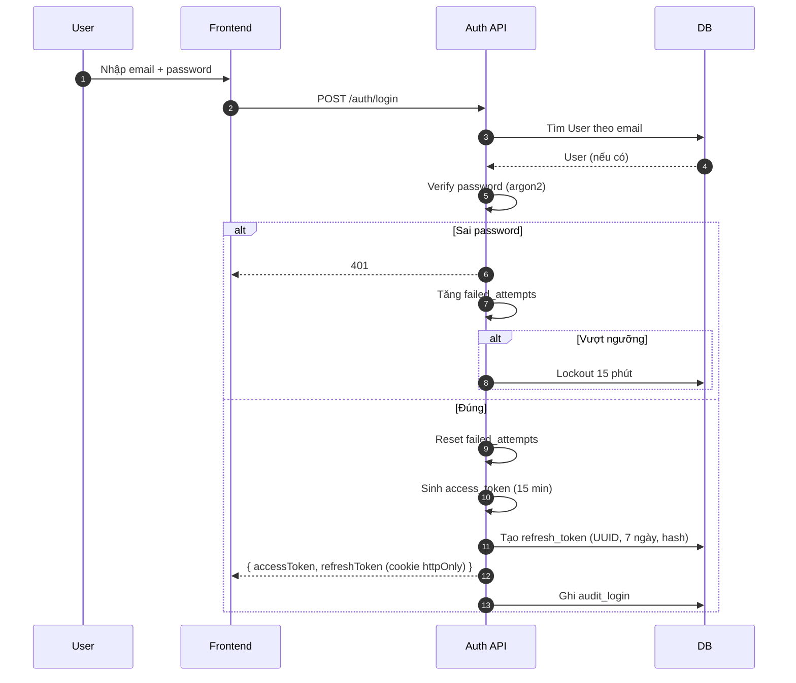
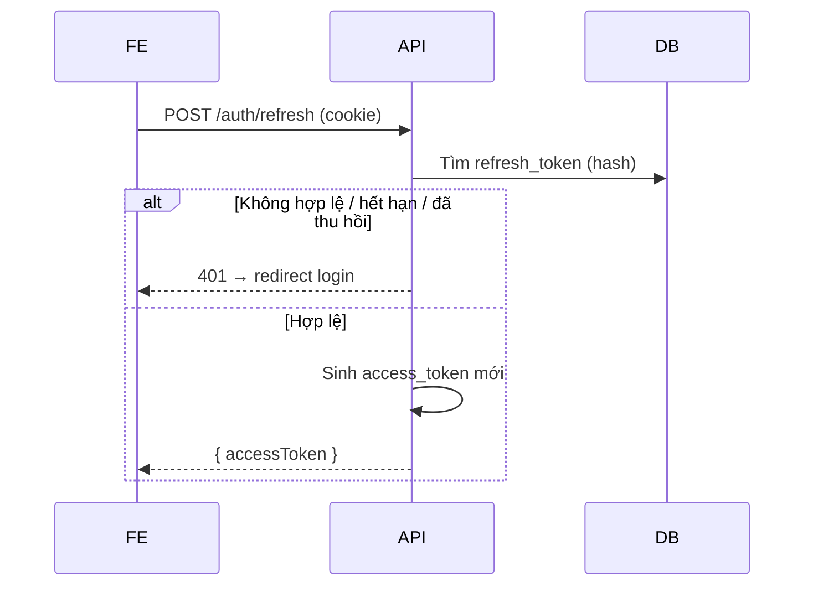
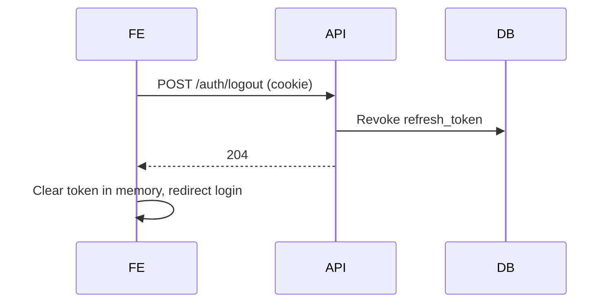
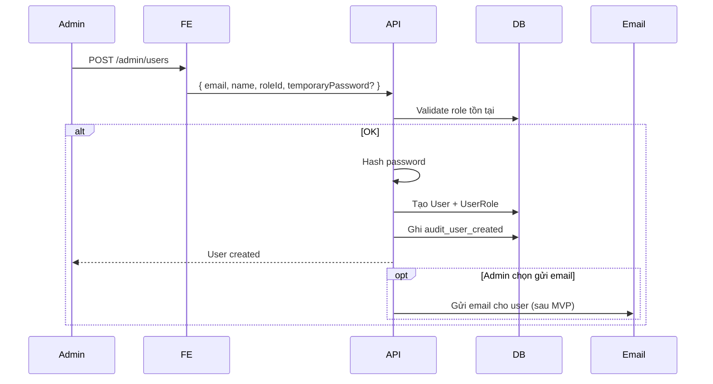
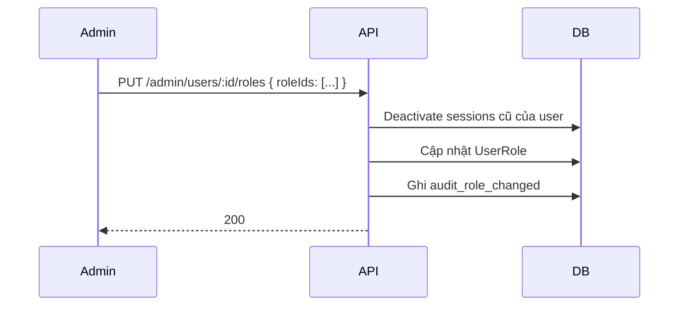

# Blueprint: Authentication & Identity Module

> **Loại tài liệu:** Blueprint (khám phá trước spec).
> **Module:** `Auth` (Authentication & Identity).
> **Mục đích:** Khám phá nhanh phạm vi trước khi viết SPEC.md đầy đủ 10 mục.

---

## Vấn đề

Phòng khám có nhiều nhân viên (admin, lễ tân, BS). Mỗi người có quyền khác nhau. Cần một cách để:

1. Xác minh người dùng là ai (authentication).
2. Kiểm tra người đó được làm gì (authorization).
3. Cho phép xem / ẩn / cấu hình quyền linh hoạt.

## Phạm vi giả định (Assumptions)

- Một phòng khám duy nhất (single-tenant) → không cần tách theo tenant.
- 3 role cố định trong MVP: `clinic_admin`, `receptionist`, `dentist`. Role có thể custom thêm (qua `role.upsert`).
- User là nhân viên — KHÔNG bao gồm Patient.
- Login qua email + password (chưa có SSO/OAuth).
- Refresh token qua httpOnly cookie.
- Access token JWT ngắn hạn (15 phút).
- Audit log cho hành động nhạy cảm (login, đổi role, đổi password).

## Câu hỏi cần trả lời (Open Questions)

Sẽ trả lời chi tiết trong SPEC.md. Liệt kê nhanh:

1. **Session:** Có cho login nhiều thiết bị? Refresh token có thu hồi từ xa?
2. **Password policy:** Độ dài tối thiểu? Yêu cầu complexity? Reset password qua email hay chỉ admin tạo?
3. **Lockout:** Sai mật khẩu bao nhiêu lần thì khóa? Khóa tạm thời hay admin can thiệp?
4. **2FA:** Cần ở MVP không? *(recommend: không)*
5. **Deactivation vs delete:** Khi nhân viên nghỉ, dùng `deactivated_at` hay `deleted_at`?
6. **Role/permission UI:** Admin quản lý role/permission qua UI hay qua seeder script?
7. **Audit:** Mọi hành động Auth phải log? Hay chỉ một số?

## Workflow dự kiến

### Workflow 1: Đăng nhập

### Workflow 2: Refresh access token

### Workflow 3: Logout

### Workflow 4: Admin tạo user

### Workflow 5: Admin đổi role cho user

## Màn hình dự kiến (tổng quan)

| Màn hình | Mục đích | Actor |
| -------- | -------- | ----- |
| Login | Nhập email + password | User (mọi role) |
| Forgot password | Yêu cầu reset | User (mọi role) |
| Reset password (qua token) | Đổi mật khẩu | User (mọi role) |
| Change password (đã login) | Đổi mật khẩu của mình | User (mọi role) |
| User list | Danh sách nhân viên | Admin |
| User create form | Tạo nhân viên | Admin |
| User detail/edit | Sửa nhân viên, đổi role | Admin |
| Role list | Danh sách role + permissions | Admin |
| Role edit | Gán permission cho role | Admin |
| My profile | Xem/sửa thông tin cá nhân | Mọi role |
| Login history (self) | Xem các lần đăng nhập gần đây | Mọi role |
| Login history (any user) | Xem audit của user | Admin |

## Entity dự kiến

| Entity | Field chính |
| ------ | ----------- |
| **User** | id, email, passwordHash, fullName, status, failedLoginAttempts, lockedUntil, lastLoginAt, deactivatedAt |
| **Role** | id, code, name, description, isSystem |
| **Permission** | id, code, description, resource, action |
| **UserRole** | userId, roleId, assignedAt, assignedBy |
| **RolePermission** | roleId, permissionId |
| **RefreshToken** | id (UUID v7), userId, tokenHash, expiresAt, revokedAt, replacedByToken, userAgent, ip |
| **AuditLog** | id, actorId, action, targetType, targetId, metadata, occurredAt |

## Rule dự kiến (preview)

| Rule ID | Mô tả |
| ------- | ----- |
| BR-AUTH-001 | Email unique across active users (deactivated thì không tính) |
| BR-AUTH-002 | Password tối thiểu 8 ký tự, gồm chữ + số |
| BR-AUTH-003 | Sau 5 lần sai, tài khoản tạm khóa 15 phút |
| BR-AUTH-004 | Refresh token có TTL 7 ngày, hash lưu DB |
| BR-AUTH-005 | Mỗi refresh chỉ dùng 1 lần (rotation); token cũ bị revoke |
| BR-AUTH-006 | Refresh token reuse → thu hồi toàn bộ session của user |
| BR-AUTH-007 | Access token TTL 15 phút |
| BR-AUTH-008 | Khi đổi password → thu hồi tất cả refresh token đang active |
| BR-AUTH-009 | Khi deactivate user → thu hồi tất cả refresh token |
| BR-AUTH-010 | Khi đổi role user → thu hồi refresh token (buộc login lại) |
| BR-AUTH-011 | Permission `isSystem = true` không được xóa (vd: `patient.read`) |
| BR-AUTH-012 | Role `isSystem = true` không được xóa (3 role MVP) |

## API dự kiến

| Endpoint | Method | Permission | Description |
| -------- | ------ | ---------- | ----------- |
| /api/v1/auth/login | POST | (public) | Đăng nhập |
| /api/v1/auth/refresh | POST | (cookie) | Refresh access token |
| /api/v1/auth/logout | POST | (cookie) | Logout session hiện tại |
| /api/v1/auth/logout-all | POST | (login) | Logout tất cả thiết bị |
| /api/v1/auth/me | GET | (login) | Lấy thông tin user hiện tại |
| /api/v1/auth/change-password | POST | (login) | Đổi mật khẩu |
| /api/v1/auth/forgot-password | POST | (public) | Yêu cầu reset |
| /api/v1/auth/reset-password | POST | (public token) | Đổi mật khẩu qua token |
| /api/v1/auth/me/login-history | GET | (login) | Lịch sử đăng nhập của tôi |
| /api/v1/admin/users | GET | `user.read` | List users |
| /api/v1/admin/users | POST | `user.create` | Tạo user |
| /api/v1/admin/users/:id | GET | `user.read` | Chi tiết user |
| /api/v1/admin/users/:id | PATCH | `user.update` | Cập nhật user info |
| /api/v1/admin/users/:id/roles | PUT | `user.update` | Đổi role |
| /api/v1/admin/users/:id/deactivate | POST | `user.deactivate` | Vô hiệu hóa user |
| /api/v1/admin/users/:id/reactivate | POST | `user.deactivate` | Mở lại user |
| /api/v1/admin/users/:id/reset-password | POST | `user.reset_password` | Admin reset pass |
| /api/v1/admin/roles | GET | `role.upsert` | List roles |
| /api/v1/admin/roles | POST | `role.upsert` | Tạo role mới |
| /api/v1/admin/roles/:id | PATCH | `role.upsert` | Sửa role (không system) |
| /api/v1/admin/permissions | GET | `role.upsert` | List permissions |
| /api/v1/admin/audit-logs | GET | `system.audit.read` | Xem audit log |

## Rủi ro & giảm thiểu

| Rủi ro | Giảm thiểu |
| ------ | ---------- |
| JWT bị leak do lưu localStorage | Dùng cookie httpOnly + chỉ access token mới lưu memory |
| Refresh token bị đánh cắp | Rotation + phát hiện reuse → thu hồi hết |
| Brute force | Rate limit + lockout 15p sau 5 lần sai |
| Permission bị sửa từ UI mà không audit | Mọi thay đổi role/permission phải audit_log |
| Admin tự gỡ quyền của mình | Có ít nhất 1 super admin; không cho xóa role cuối cùng có quyền admin |

---

## Tiếp theo

Sau khi xác nhận phạm vi → viết `SPEC.md` đầy đủ 10 mục.
