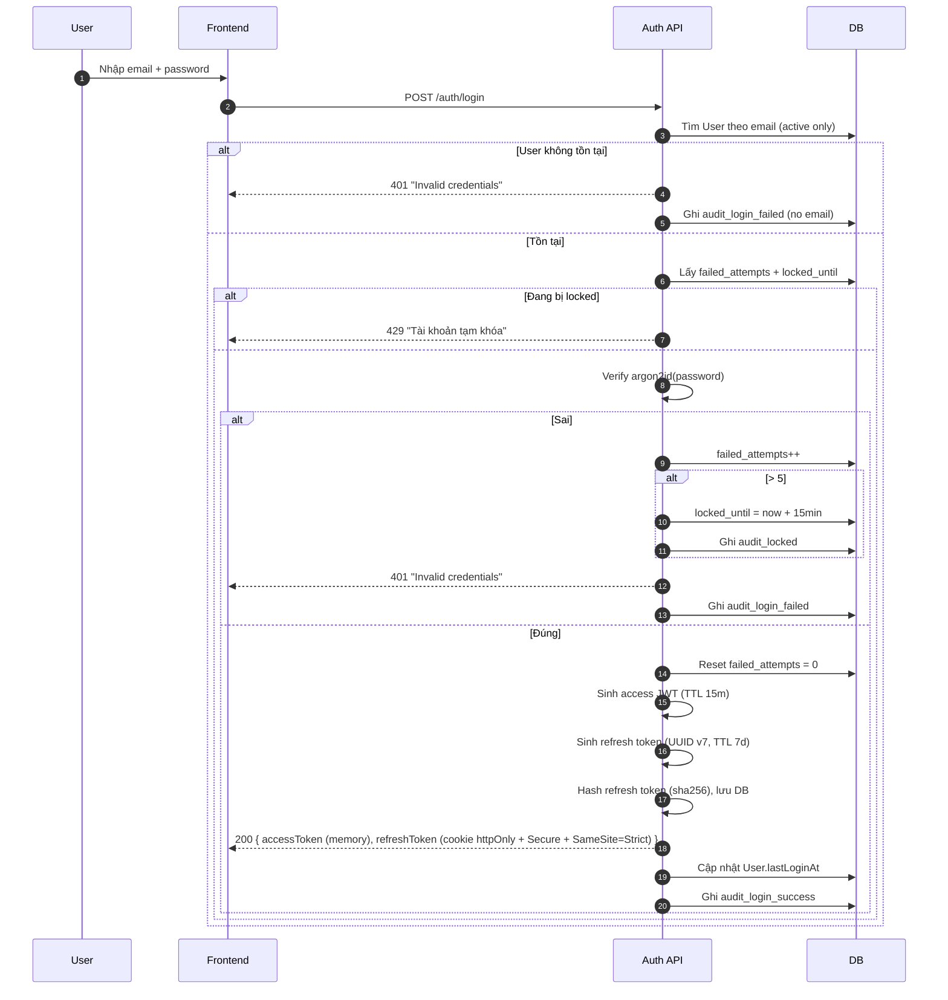
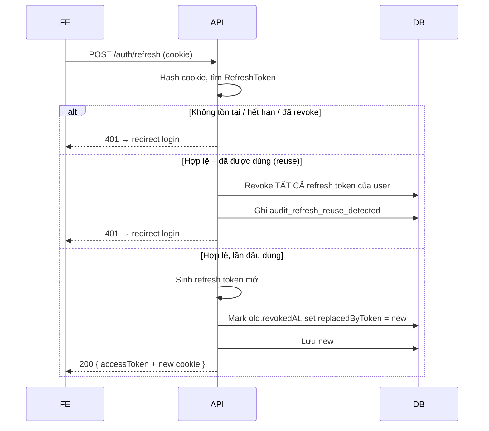
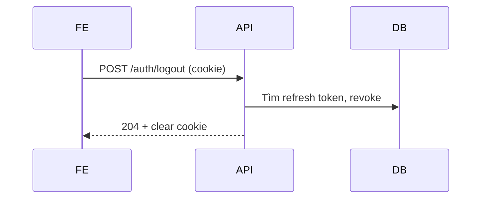
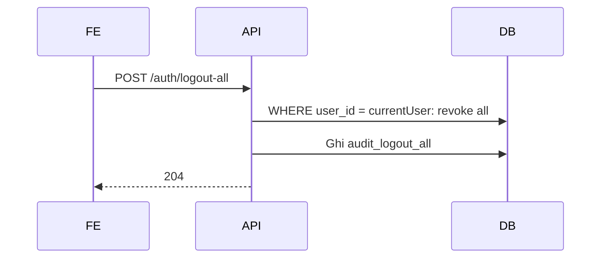
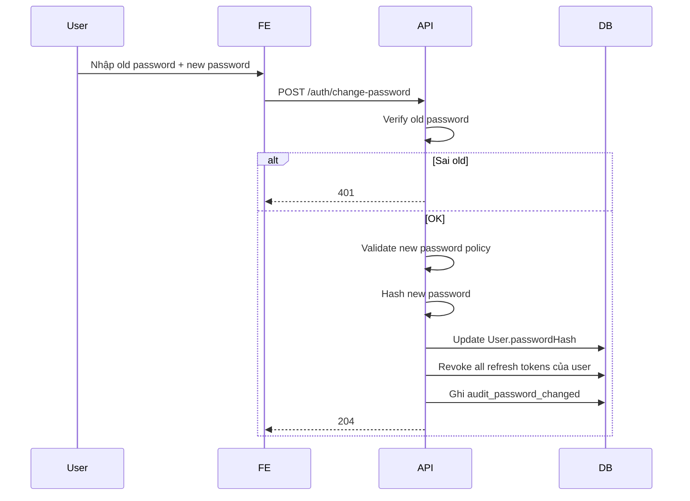
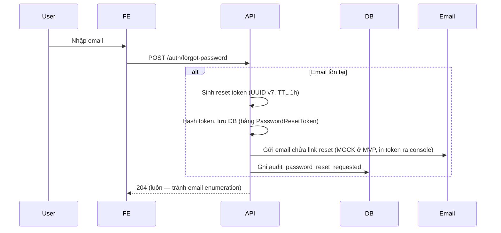
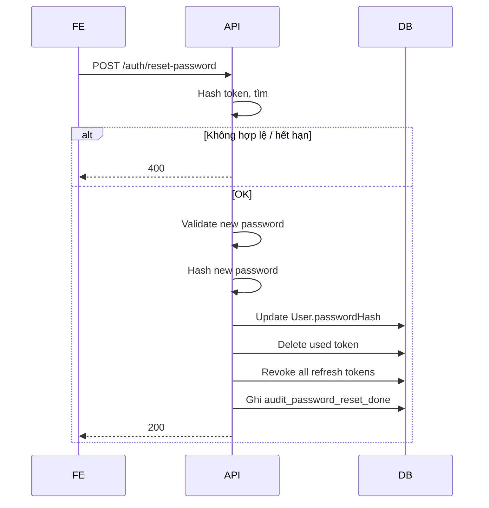
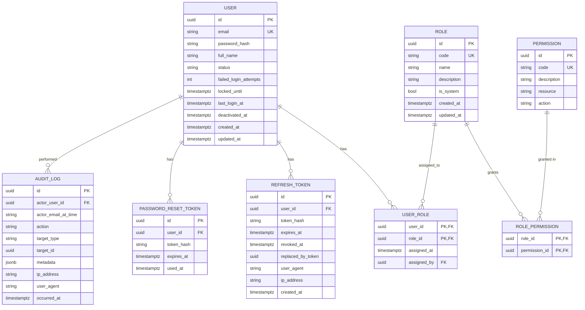

# SPEC — Authentication & Identity Module

> **Module:** `Auth`
> **Ngày tạo:** 2026-07-12
> **Trạng thái:** Draft (chờ review)
> **Phiên bản:** 1.0
>
> **Đây là spec duy nhất cho module Auth.** Mọi implementation, code, test, API đều phải tham chiếu file này.

---

## Tổng quan nhanh

| Phần | Tóm tắt |
| ---- | ------- |
| Purpose | Quản lý nhân viên, phân quyền, xác thực |
| Bounded context | Auth & Identity — module độc lập |
| Modules phụ thuộc | _(không có — root module)_ |
| Được dùng bởi | Tất cả module còn lại |
| Permission riêng của module | `user.*`, `role.upsert`, `system.audit.read` |

---

## 1. Purpose (Mục đích)

### 1.1 Bối cảnh

Phòng khám có nhiều nhân viên (admin, lễ tân, BS) cần một hệ thống để:

1. **Xác minh** người đang dùng hệ thống là ai (authentication).
2. **Phân quyền** ai được làm gì trên tài nguyên nào (authorization).
3. **Quản lý** tài khoản nhân viên: tạo, vô hiệu hóa, đổi role, đổi mật khẩu.
4. **Audit** các hành động nhạy cảm để phục vụ compliance & debug.

### 1.2 Phạm vi (Scope)

#### ✅ Có

- Đăng nhập email + password (JWT access + refresh).
- Đăng xuất (1 thiết bị + tất cả thiết bị).
- Refresh token rotation.
- Đổi mật khẩu (do user đang đăng nhập).
- Quên mật khẩu → reset qua token (email mock ở MVP).
- Quản lý User (admin).
- Quản lý Role (admin, có thể thêm role mới).
- Quản lý Permission (đọc; chỉ seed, không thêm mới qua UI ở MVP).
- Audit log cho: login thành công, login fail, đổi password, đổi role, de/reactivate user, tạo user, đổi permission.
- Profile cá nhân (xem + sửa thông tin cơ bản).
- Xem lịch sử đăng nhập (self & any).

#### ❌ Không có ở MVP

- 2FA / MFA.
- OAuth / SSO (Google, Microsoft...).
- SAML.
- Magic link.
- Audit log retention policy (chỉ log, không tự xoá).
- Password-less login.
- WebAuthn / passkey.

> Mở rộng 2FA ở V1.1 nếu phòng khám yêu cầu.

---

## 2. Business Flow (Luồng nghiệp vụ)

### 2.1 Đăng nhập (Login)



**Post-condition:** User có session, có thể gọi API khác.

### 2.2 Refresh token



### 2.3 Logout

#### 2.3.1 Logout 1 session



#### 2.3.2 Logout tất cả thiết bị



### 2.4 Đổi mật khẩu (khi đang đăng nhập)



### 2.5 Quên mật khẩu



Sau đó BN/NV truy cập link → nhập new password → `POST /auth/reset-password { token, newPassword }`:



### 2.6 Admin quản lý User

Xem chi tiết các operation ở mục 10 (Acceptance Criteria).

### 2.7 Admin quản lý Role

Cho phép:

- Tạo role mới (không trùng `code`, không trùng `name`).
- Sửa `name`, `description`.
- Thêm/bớt permission cho role (trừ role system).
- Không xóa role system. Role custom có thể xóa nếu không còn user nào dùng.

### 2.8 Cases thường gặp

| Case | Xử lý |
| ---- | ----- |
| User quên mật khẩu 3 lần liên tiếp | Không tăng failed_attempts riêng cho forgot (gộp vào login attempt) |
| Admin đổi role của chính mình | Cho phép nhưng buộc logout ngay |
| Admin xóa role cuối cùng có `clinic_admin` | Không cho phép |
| User deactive cố gắng login | 401 "Invalid credentials" (không leak user tồn tại) |
| User deactive nhưng access token chưa hết | Vẫn 401 vì refresh sẽ fail; middleware không "revoke live" access token (TTL 15m) |

---

## 3. Actors

| Actor | Sử dụng module này để | Xem chi tiết |
| ----- | ---------------------- | ------------ |
| **Clinic Administrator** | Quản lý user, role, xem audit log | [`../../01_Architecture/actor-permissions-matrix.md`](../../01_Architecture/actor-permissions-matrix.md) §3.6 |
| **Receptionist** | Đăng nhập, đổi mật khẩu của mình, xem login history | (chỉ các action chung) |
| **Dentist** | Tương tự Receptionist | (chỉ các action chung) |
| **Patient** | ❌ KHÔNG — không phải user (xem ADR-0003) | — |

---

## 4. Screens (Danh sách màn hình)

| Tên màn hình | Mục đích | Primary actor | Route dự kiến |
| ------------ | -------- | ------------- | ------------- |
| Login | Nhập email + password | Mọi user | `/login` |
| Forgot password | Yêu cầu reset qua email | Mọi user (chưa login) | `/forgot-password` |
| Reset password | Đổi mật khẩu qua token từ email | User click link | `/reset-password?token=...` |
| My profile | Xem/sửa thông tin cá nhân, đổi mật khẩu | User (đã login) | `/profile` |
| My login history | Xem các lần đăng nhập gần đây | User | `/profile/login-history` |
| User list (admin) | Danh sách tất cả nhân viên | Admin | `/admin/users` |
| User create (admin) | Tạo nhân viên mới | Admin | `/admin/users/new` |
| User detail (admin) | Xem / sửa / đổi role | Admin | `/admin/users/:id` |
| Role list (admin) | Danh sách role + permission | Admin | `/admin/roles` |
| Role edit (admin) | Sửa role, gán permission | Admin | `/admin/roles/:id` |
| Audit log (admin) | Xem log | Admin | `/admin/audit-logs` |

> Wireframe chi tiết → `docs/06_UI/` (Giai đoạn 7).

---

## 5. Entities (Thực thể)



### 5.1 Status enum

```text
User.status ∈ { 'active', 'pending_setup' }
  - 'active' = bình thường
  - 'pending_setup' = mới tạo, chưa đổi password lần đầu

User.deactivated_at: NULL = đang hoạt động; có giá trị = vô hiệu
```

---

## 6. Business Rules

| Rule ID | Mô tả | Chi tiết |
| ------- | ----- | -------- |
| BR-AUTH-001 | Email unique cho active user | Email không trùng giữa user đang active hoặc pending_setup |
| BR-AUTH-002 | Password policy | ≥ 8 ký tự; có ≥ 1 chữ + ≥ 1 số; không chứa local-part của email (case-insensitive); không nằm trong top 100k password phổ biến (Pwned Passwords API hoặc local denylist) |
| BR-AUTH-003 | Lockout | `failed_attempts > 5` → `locked_until = now() + 15min`. Reset khi login thành công hoặc admin reset |
| BR-AUTH-004 | Access token TTL | 15 phút |
| BR-AUTH-005 | Refresh token TTL | 7 ngày |
| BR-AUTH-006 | Refresh token rotation | Mỗi refresh sinh token mới; token cũ mark revoked, `replacedByToken = new.id` |
| BR-AUTH-007 | Refresh token reuse detection | Nếu dùng token đã revoked → revoke TẤT CẢ refresh token của user |
| BR-AUTH-008 | Password hashing | argon2id với timeCost=3, memoryCost=65536 (64 MiB), parallelism=4, hashLength=32, saltLength=16 (theo OWASP Password Storage Cheat Sheet 2024) |
| BR-AUTH-009 | System roles không xóa được | `code ∈ { 'clinic_admin', 'receptionist', 'dentist' }` |
| BR-AUTH-010 | System permissions không xóa được | Permission tạo qua migration, không qua API |
| BR-AUTH-011 | Admin cuối cùng không gỡ role admin được | Nếu user là super admin cuối cùng → không cho xóa role của user đó |
| BR-AUTH-012 | Đổi password → revoke all sessions | Sau khi đổi password thành công, mọi refresh token đang active của user bị revoke |
| BR-AUTH-013 | Đổi role → revoke all sessions | Sau khi admin đổi role user, mọi refresh token của user bị revoke |
| BR-AUTH-014 | Deactivate user → revoke all sessions | Sau khi admin deactivate user, mọi refresh token bị revoke ngay |
| BR-AUTH-015 | Last admin guard | Không cho phép hành động làm giảm user có role `clinic_admin` xuống 0 |
| BR-AUTH-016 | Audit log immutable | Không API nào sửa/xóa audit log. Chỉ DB admin mới purge (out-of-band) |
| BR-AUTH-017 | Audit log cho action nhạy cảm (Auth scope) | Auth-scope audit actions bắt buộc: `login_success`, `login_failed`, `password_reset_requested`, `password_reset_done`, `password_changed`, `user_created`, `user_role_changed`, `user_deactivated`, `user_reactivated`, `user_password_reset_by_admin`, `role_created`, `role_permissions_changed`, `refresh_reuse_detected`, `logout_all`. Actions của module khác (Appointment/Encounter/Invoice/Stock/Patient merge/Patient identifier) xem **BR-LOG-001** (master audit action registry). |
| BR-AUTH-018 | Soft delete user | Xóa user = set `deactivated_at`. KHÔNG xóa cứng (xem ADR-0006) |
| BR-LOG-001 | Master audit action registry | Action codes audit bắt buộc cho non-Auth modules: <br>• **Patient:** `patient_created`, `patient_updated`, `patient_merged`, `patient_identifier_added`, `patient_identifier_removed`, `patient_restored`, `patient_soft_deleted` <br>• **Appointment:** `appointment_created`, `appointment_updated`, `appointment_rescheduled`, `appointment_cancelled`, `appointment_checked_in`, `appointment_no_show`, `appointment_completed`, `appointment_auto_no_show` <br>• **Medical Records:** `encounter_created`, `encounter_closed`, `encounter_cancelled`, `encounter_addendum_added`, `clinical_note_added`, `treatment_added`, `treatment_removed`, `prescription_added`, `prescription_removed`, `dental_chart_updated` <br>• **Billing:** `invoice_created`, `invoice_issued`, `invoice_voided`, `payment_created`, `payment_reversed` <br>• **Inventory:** `stock_movement_created`, `item_created`, `item_updated`, `item_deactivated`, `low_stock_alert_sent` |

---

## 7. Permissions

> Xem danh sách đầy đủ: [`../../01_Architecture/actor-permissions-matrix.md`](../../01_Architecture/actor-permissions-matrix.md) §3.6

### 7.1 Permission mới của module Auth

| Permission code | Admin | Receptionist | Dentist |
| --------------- | :---: | :----------: | :-----: |
| `user.create` | ✅ | ❌ | ❌ |
| `user.read` | ✅ | ❌ | ❌ |
| `user.update` | ✅ | ❌ | ❌ |
| `user.deactivate` | ✅ | ❌ | ❌ |
| `user.reset_password` | ✅ | ❌ | ❌ |
| `user.change_password.own` | ✅ | ✅ | ✅ |
| `role.upsert` | ✅ | ❌ | ❌ |
| `system.audit.read` | ✅ | ❌ | ❌ |

> **Naming convention (BR-AUTH-019):** Permission codes tuân format `<resource>.<action>` hoặc `<resource>.<action>.<scope>` (e.g., `appointment.read.own`, `patient.read.medical_history`). Không ghép action+scope thành 1 token (e.g., KHÔNG dùng `user.change_own_password` → đổi thành `user.change_password.own`).

### 7.2 Ma trận endpoint × permission

| Endpoint | Method | Permission |
| -------- | ------ | ---------- |
| POST `/auth/login` |  | (public — rate limit) |
| POST `/auth/refresh` |  | (cookie, no perm) |
| POST `/auth/logout` |  | (login required) |
| POST `/auth/logout-all` |  | (login required) |
| GET `/auth/me` |  | (login required) |
| POST `/auth/change-password` |  | (login required, `user.change_password.own`) |
| POST `/auth/forgot-password` |  | (public — rate limit) |
| POST `/auth/reset-password` |  | (public — token) |
| GET `/auth/me/login-history` |  | (login required) |
| GET `/admin/users` |  | `user.read` |
| POST `/admin/users` |  | `user.create` |
| GET `/admin/users/:id` |  | `user.read` |
| PATCH `/admin/users/:id` |  | `user.update` |
| PUT `/admin/users/:id/roles` |  | `user.update` |
| POST `/admin/users/:id/deactivate` |  | `user.deactivate` |
| POST `/admin/users/:id/reactivate` |  | `user.deactivate` |
| POST `/admin/users/:id/reset-password` |  | `user.reset_password` |
| GET `/admin/roles` |  | `role.upsert` |
| POST `/admin/roles` |  | `role.upsert` |
| PATCH `/admin/roles/:id` |  | `role.upsert` |
| DELETE `/admin/roles/:id` |  | `role.upsert` |
| GET `/admin/permissions` |  | `role.upsert` |
| GET `/admin/audit-logs` |  | `system.audit.read` |
| GET `/admin/users/:id/login-history` |  | `user.read` |

---

## 8. API

### 8.1 Authentication

#### POST `/api/v1/auth/login`

Request:
```json
{
  "email": "user@example.com",
  "password": "Secret123"
}
```

Response 200:
```json
{
  "accessToken": "eyJ...",
  "accessTokenExpiresIn": 900,
  "user": {
    "id": "uuid",
    "email": "user@example.com",
    "fullName": "Nguyen Van A",
    "roles": ["clinic_admin"],
    "permissions": ["user.create", ...]
  }
}
```
+ Set cookie `refreshToken` httpOnly, Secure, SameSite=Strict, Path=/api/v1/auth, Max-Age=604800.

Response 401 (sai credentials):
```json
{
  "type": "about:blank",
  "title": "Invalid credentials",
  "status": 401
}
```

Response 429 (locked):
```json
{
  "type": "about:blank",
  "title": "Account temporarily locked",
  "status": 429,
  "retryAfter": 600
}
```

#### POST `/api/v1/auth/refresh`

Request: (cookie only)
Response 200: giống login.
Response 401: nếu refresh invalid / hết hạn / reuse detected.

#### POST `/api/v1/auth/logout`

Request: (cookie only)
Response 204: clear cookie.

#### POST `/api/v1/auth/logout-all`

Response 204.

#### GET `/api/v1/auth/me`

Response 200:
```json
{
  "id": "uuid",
  "email": "user@example.com",
  "fullName": "Nguyen Van A",
  "status": "active",
  "roles": ["clinic_admin"],
  "permissions": ["user.create", "patient.create", ...]
}
```

#### POST `/api/v1/auth/change-password`

Request:
```json
{
  "currentPassword": "Secret123",
  "newPassword": "NewSecret456"
}
```
Response 204.

#### POST `/api/v1/auth/forgot-password`

Request:
```json
{ "email": "user@example.com" }
```
Response 204 (always — chống enumeration).

**MVP:** không gửi email thật; token in ra console của backend (hoặc log file).

#### POST `/api/v1/auth/reset-password`

Request:
```json
{
  "token": "uuid-from-email",
  "newPassword": "NewSecret456"
}
```
Response 200.

#### GET `/api/v1/auth/me/login-history?pageSize=20&cursor=<lastId>&sort=occurredAt:desc`

Response 200:
```json
{
  "data": [
    {
      "occurredAt": "2026-07-12T08:00:00Z",
      "action": "login_success",
      "ipAddress": "10.0.0.5",
      "userAgent": "Mozilla/5.0..."
    }
  ],
  "pagination": {
    "pageSize": 20,
    "nextCursor": "uuid",
    "hasMore": true
  }
}
```

### 8.2 Admin endpoints (tóm tắt — chi tiết sẽ ở `docs/05_API/auth.md` ở Giai đoạn 6)

| Method | Path | Permission | Body / Output |
| ------ | ---- | ---------- | --------------|
| GET | `/admin/users` | `user.read` | Query `?q=&status=&pageSize=&cursor=&sort=`; cursor-based pagination |
| POST | `/admin/users` | `user.create` | Body `{ email, fullName, roleIds[], sendInvite? }`; tạo với `passwordHash` random, status `pending_setup` |
| GET | `/admin/users/:id` | `user.read` | Return User + roles + permissions |
| PATCH | `/admin/users/:id` | `user.update` | Body `{ fullName?, status? }` — không cho đổi email |
| PUT | `/admin/users/:id/roles` | `user.update` | Body `{ roleIds: [...] }`. Apply BR-AUTH-013, BR-AUTH-015 |
| POST | `/admin/users/:id/deactivate` | `user.deactivate` | Body `{ reason }`. Apply BR-AUTH-014, BR-AUTH-015 |
| POST | `/admin/users/:id/reactivate` | `user.deactivate` | Apply BR-AUTH-014 |
| POST | `/admin/users/:id/reset-password` | `user.reset_password` | Body `{ sendEmail?: boolean }`. Random password mới, status→`pending_setup`, revoke tokens |
| GET | `/admin/roles` | `role.upsert` | Return list roles + permissions count |
| POST | `/admin/roles` | `role.upsert` | Body `{ code, name, description?, permissionCodes: [...] }` |
| PATCH | `/admin/roles/:id` | `role.upsert` | Body `{ name?, description?, permissionCodes?: [...] }` (không cho đổi `code`) |
| DELETE | `/admin/roles/:id` | `role.upsert` | 204 nếu không còn user; 409 nếu còn user nào |
| GET | `/admin/permissions` | `role.upsert` | Return tất cả permission |
| GET | `/admin/audit-logs` | `system.audit.read` | Query `?actor=&action=&targetType=&from=&to=&pageSize=&cursor=&sort=`; cursor-based paginated |
| GET | `/admin/users/:id/login-history` | `user.read` | Như `/auth/me/login-history` nhưng xem của user khác |

### 8.3 Error format

Mọi lỗi trả theo **RFC 7807 (Problem Details)**:

```json
{
  "type": "https://example.com/probs/invalid-input",
  "title": "Invalid input",
  "status": 400,
  "detail": "...",
  "instance": "/api/v1/auth/login",
  "errors": [
    { "field": "password", "code": "too_short" }
  ]
}
```

---

## 9. Database

### 9.1 Tables summary

| Table | Note |
| ----- | ---- |
| `users` | Xem ERD ở §5 |
| `roles` | Seed 3 role + có thể add thêm |
| `permissions` | Seed từ `actor-permissions-matrix.md` |
| `user_roles` | Composite PK (user_id, role_id) |
| `role_permissions` | Composite PK (role_id, permission_id) |
| `refresh_tokens` | Index `token_hash`, `user_id`, `(expires_at)` |
| `password_reset_tokens` | Index `token_hash` |
| `audit_logs` | Index `(occurred_at DESC)`, `(actor_user_id, occurred_at DESC)` |

### 9.2 Seed data

- 3 roles: `clinic_admin`, `receptionist`, `dentist` (is_system = true).
- ~30 permissions theo `actor-permissions-matrix.md` (is_system = true).
- 1 super admin user mặc định: tạo qua seed script; in ra console lần đầu để người dùng tự đổi mật khẩu.

### 9.3 Migration

Mỗi migration là file `.sql` + `.md` mô tả nghiệp vụ (xem `PROJECT_RULES.md` §8).

---

## 10. Validation & Acceptance Criteria

### 10.1 Validation rules

| Field | Rule |
| ----- | ---- |
| email | RFC 5322, lower case trước khi lưu |
| password (new) | ≥ 8 chars; có ≥ 1 chữ + ≥ 1 số; không chứa email local-part (case-insensitive); không nằm trong top 100k password phổ biến (Pwned Passwords API hoặc local denylist) |
| fullName | 1–200 chars; trim |
| role code | snake_case; 3–50 chars |
| reset token | UUID v7; TTL 1h; chỉ dùng 1 lần |

### 10.2 Acceptance criteria (Gherkin)

```gherkin
Feature: Login
  Scenario: Login thành công với credentials đúng
    Given có 1 user với email "a@b.com" và password hợp lệ và status "active"
    When POST /auth/login { email: "a@b.com", password: "..." }
    Then response 200
    And response.accessToken hợp lệ (decode được)
    And cookie refreshToken được set với httpOnly+Secure+SameSite=Strict
    And DB có 1 audit log "login_success" với actor_user_id = user.id

  Scenario: Sai password
    When POST /auth/login với password sai
    Then response 401
    And user.failed_login_attempts tăng 1
    Nếu đây là lần thứ 6:
      And user.locked_until = now() + 15min
      And response 429 với retryAfter

  Scenario: Locked account
    Given user.locked_until > now()
    When POST /auth/login với password đúng
    Then response 429

  Scenario: Forgot password enumeration
    When POST /auth/forgot-password với email chưa tồn tại
    Then response 204 (giống như email tồn tại)

  Scenario: Refresh token reuse
    Given có 1 refresh token đã bị revoked
    When POST /auth/refresh với token đó
    Then response 401
    And TẤT CẢ refresh token của user bị revoke
    And có audit log "refresh_reuse_detected"

  Scenario: Đổi role user
    Given admin A đang login, target user U có role "receptionist"
    When admin A PUT /admin/users/U/roles với roleIds = [dentist]
    Then U có 1 role "dentist"
    And TẤT CẢ refresh token của U bị revoke
    And có audit log "user_role_changed"
    And U phải login lại

  Scenario: Last admin guard
    Given chỉ còn 1 user có role "clinic_admin"
    When admin đó PUT /admin/users/:self/roles với roleIds = []
    Then response 409 "Cannot remove last admin"

  Scenario: Soft delete (deactivate)
    When admin POST /admin/users/:id/deactivate với reason
    Then user X vẫn còn trong DB
    And user X.deactivated_at != null
    And user X không thể login (401 invalid credentials)
    And Tất cả refresh tokens của X bị revoke (BR-AUTH-014)
    And Audit log: action = "user_deactivated"

  Scenario: Reactivation
    When admin POST /admin/users/:id/reactivate
    Then user X.status = "active"
    And user X.deactivated_at = null
    And user X có thể login lại được
    And Audit log: action = "user_reactivated"

  Scenario: Audit log immutable
    When user đã login
    Then KHÔNG có API nào (admin hay không) cho phép update / delete audit_log
```

### 10.3 Test plan (sơ lược)

| Layer | Test |
| ----- | ---- |
| Domain | Entity invariants (User không thể login khi deactive, etc.) |
| Application | Use cases với mock repository |
| Infrastructure | Prisma repo integration test |
| HTTP | Controller + guard qua Supertest |
| Security | Pen-test cơ bản: SQLi, brute force, jwt none algorithm, refresh reuse |
| E2E (sau) | Playwright: full login flow |

### 10.4 Tiêu chí "xong" module Auth

- [ ] Spec đã review + chốt ở file này.
- [ ] Domain entities viết + unit test ≥ 90% coverage.
- [ ] Use case viết + unit test.
- [ ] Auth controller + DTO + Zod validation.
- [ ] Argon2id hashing + JWT lib + refresh token repo.
- [ ] Migration tạo 8 bảng + seed 3 role + ~30 permission + 1 super admin.
- [ ] Audit log integration cho 14 action ở BR-AUTH-017.
- [ ] Guard NestJS `@RequirePermission('xxx')` chạy đúng.
- [ ] Rate limit trên `/auth/login`, `/auth/forgot-password`.
- [ ] Swagger annotate toàn bộ endpoint Auth.
- [ ] Frontend: trang Login + Forgot + Reset + Profile + User management (admin) + Role management (admin) + Audit log viewer (admin).
- [ ] CI chạy Lint + Test + Build pass.
- [ ] 1 file migration `.md` cho mỗi migration có mô tả nghiệp vụ.

---

## Liên kết

- [`BLUEPRINT.md`](./BLUEPRINT.md) — bản blueprint dùng để khám phá trước khi viết spec này.
- Template: [`../../Templates/MODULE_SPEC_TEMPLATE.md`](../../Templates/MODULE_SPEC_TEMPLATE.md).
- [`../../01_Architecture/actor-permissions-matrix.md`](../../01_Architecture/actor-permissions-matrix.md) — RBAC.
- [`../../01_Architecture/business-flow-overview.md`](../../01_Architecture/business-flow-overview.md).
- [`../../01_Architecture/business-decisions.md`](../../01_Architecture/business-decisions.md).
- [`../../02_Glossary/GLOSSARY.md`](../../02_Glossary/GLOSSARY.md).
- ADR liên quan:
  - [`../../ADR/0003-patient-is-not-user.md`](../../ADR/0003-patient-is-not-user.md) — giải thích vì sao Patient không ở module này.
  - [`../../ADR/0004-permission-based-rbac.md`](../../ADR/0004-permission-based-rbac.md) — gốc RBAC.
  - [`../../ADR/0005-id-strategy.md`](../../ADR/0005-id-strategy.md) — UUID v7.
  - [`../../ADR/0006-soft-delete.md`](../../ADR/0006-soft-delete.md) — deactivate.
- API spec chi tiết (Giai đoạn 6): `docs/05_API/auth.md` _(sẽ viết)_
- UI spec (Giai đoạn 7): `docs/06_UI/screens/auth-*.md` _(sẽ viết)_
