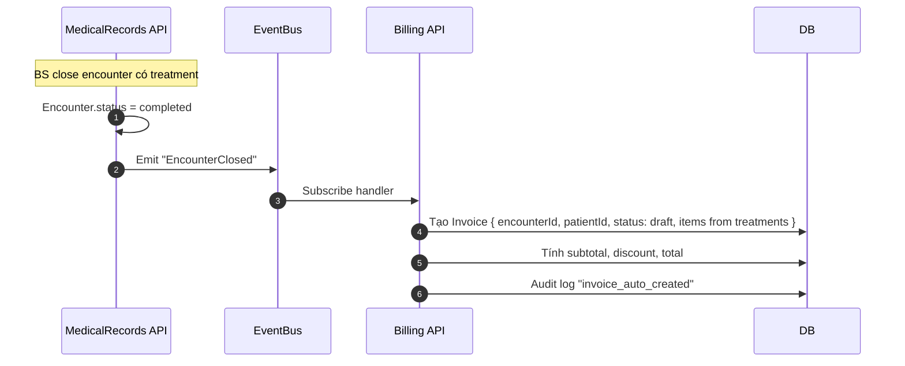
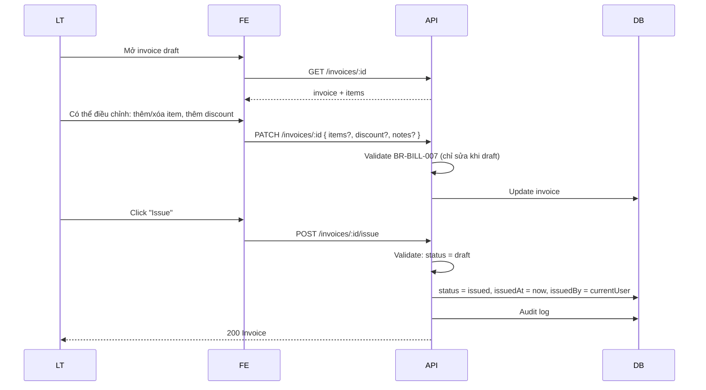
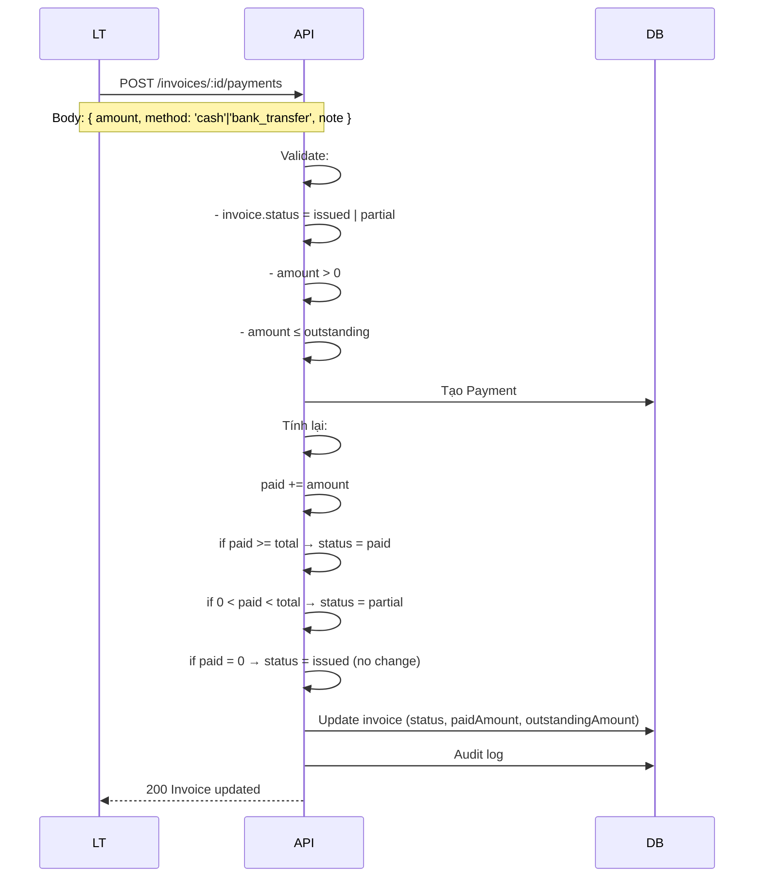
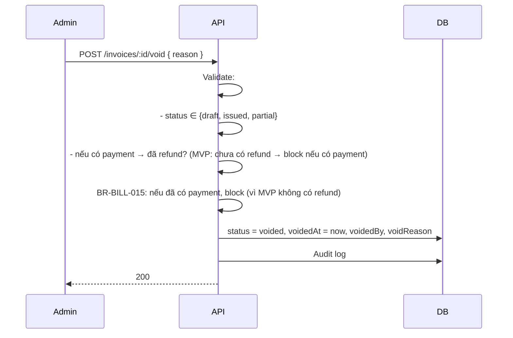
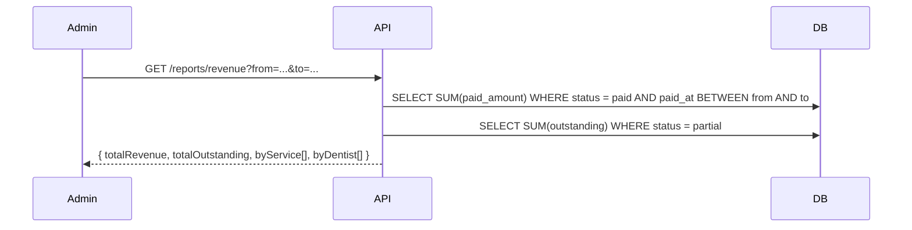
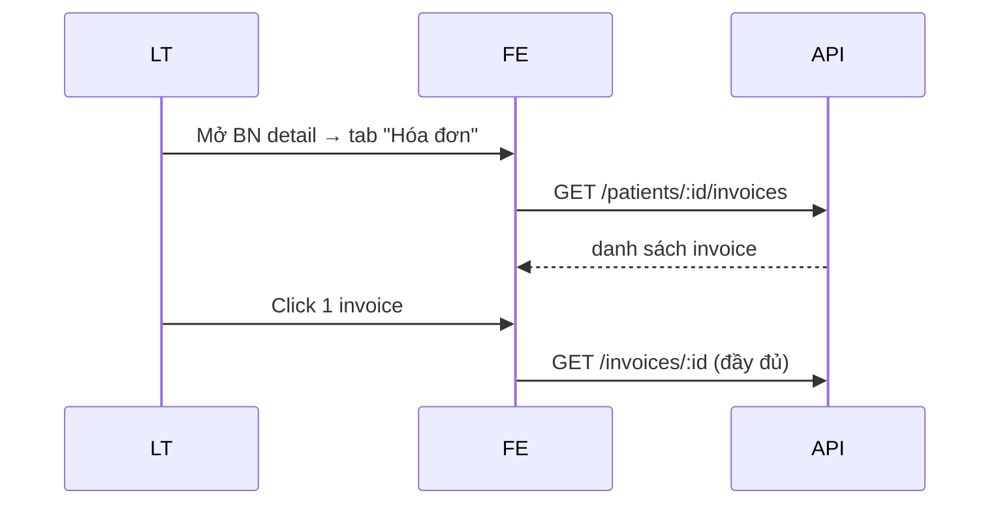

# Blueprint: Billing Module

> **Loại tài liệu:** Blueprint (khám phá trước spec).
> **Module:** `Billing` — Hóa đơn, thanh toán, công nợ.

---

## Vấn đề

Phòng khám cần:

1. Tự động sinh hóa đơn từ Treatment trong encounter.
2. Lễ tân thu tiền sau khi khám xong (BD-0003).
3. Theo dõi BN còn nợ bao nhiêu (outstanding).
4. In/xem hóa đơn cho BN.
5. Báo cáo doanh thu (theo ngày, theo BS, theo dịch vụ).

## Phạm vi giả định (Assumptions)

- BN trả sau khi khám xong (BD-0003, không cọc trước).
- Invoice auto tạo (status = draft) khi encounter closed có treatment → lễ tân review, issue, thu tiền (chốt ở Q1).
- Partial payment: cho phép BN trả 1 phần → invoice status = partial → trả nốt lần 2 (chốt ở Q2).
- Phương thức thanh toán: cash + bank_transfer cho MVP.
- Không tích hợp cổng online (VNPay, MoMo) ở MVP — để sau.
- Hóa đơn có thể hủy (`voided`) thay vì refund phức tạp.
- Discount cho phép theo % hoặc số tiền (vd: giảm giá thường xuyên).
- Mỗi Invoice = 1 Encounter (1-1) — tránh gộp nhiều encounter vào 1 hóa đơn ở MVP.
- Audit log cho mọi payment + void.

## Câu hỏi cần trả lời (Open Questions)

1. **Hóa đơn gộp nhiều encounter?** Out of scope MVP. 1 invoice = 1 encounter.
2. **Thuế VAT?** MVP không có. Thêm sau.
3. **Xuất hóa đơn điện tử (TCT)?** Out of scope MVP.
4. **Refund?** Không cho MVP — chỉ void.
5. **Multi-currency?** VNĐ only.
6. **Recurring payment** (subscription)? Không có ở y tế.
7. **Settlement cuối ngày:** Có báo cáo tổng tiền thu/đã nợ? Có.
8. **Lễ tân nhận tiền đại diện BS** — doanh thu thuộc phòng khám, không chia cho BS ở MVP.

## Workflow dự kiến

### Workflow 1: Auto-sinh Invoice từ Encounter (sau khi đóng)

### Workflow 2: Lễ tân review + issue Invoice

### Workflow 3: Thu tiền (full hoặc partial)

### Workflow 4: Hủy invoice (void)

### Workflow 5: Báo cáo doanh thu

### Workflow 6: Lễ tân xem invoice của BN

## Màn hình dự kiến

| Màn hình | Mục đích | Actor |
| -------- | -------- | ----- |
| Invoice list | Danh sách invoice (filter theo status, date, BN) | Lễ tân, Admin, BS (own) |
| Invoice detail (review) | Xem chi tiết, điều chỉnh items, discount | Lễ tân |
| Invoice print | View in hóa đơn cho BN | Lễ tân, BS |
| Payment entry | Modal nhập khoản thanh toán | Lễ tân |
| Invoice void | Modal lý do hủy | Admin |
| Revenue report | Báo cáo doanh thu | Admin |
| Outstanding report | Báo cáo công nợ | Admin |
| Patient invoices tab | Tab hóa đơn trong BN detail | Lễ tân |

## Entity dự kiến

| Entity | Field chính |
| ------ | ----------- |
| **Invoice** | id, code (INV-YYYY-NNNNN), encounterId (unique), patientId, status (draft/issued/partial/paid/voided), subtotal, discountType (percent/amount), discountValue, total, paidAmount, outstandingAmount, issuedAt, issuedBy, voidedAt, voidedBy, voidReason, notes, createdAt |
| **InvoiceItem** | id, invoiceId, treatmentId (optional), description, quantity, unitPrice, lineTotal, sequence |
| **Payment** | id, invoiceId, amount, method (cash/bank_transfer), receivedBy, receivedAt, note, status (pending/completed/reversed) |
| **InvoiceAudit** | id, invoiceId, action, actorId, before, after, occurredAt |

## Rule dự kiến (preview)

| Rule ID | Mô tả |
| ------- | ----- |
| BR-BILL-001 | Invoice auto-create từ EncounterClosed event (nếu có treatment) |
| BR-BILL-002 | Invoice chỉ có 1 per encounter (unique FK encounterId) |
| BR-BILL-003 | Invoice subtotal = Σ (InvoiceItem.lineTotal) |
| BR-BILL-004 | Invoice total = subtotal − discount |
| BR-BILL-005 | Discount = percent hoặc amount, ≥ 0, không vượt subtotal |
| BR-BILL-006 | Invoice status state machine: `draft → issued → partial → paid` hoặc `→ voided` |
| BR-BILL-007 | Chỉ sửa invoice ở status = draft |
| BR-BILL-008 | Lễ tân issue (chuyển draft → issued) |
| BR-BILL-009 | Payment amount > 0, ≤ outstanding |
| BR-BILL-010 | Partial payment: status = partial nếu 0 < paid < total |
| BR-BILL-011 | Full payment: status = paid khi paid >= total |
| BR-BILL-012 | Không cho payment khi invoice voided |
| BR-BILL-013 | Code invoice: `INV-YYYY-NNNNN` auto-sinh |
| BR-BILL-014 | BS chỉ xem invoice của encounter mình tạo |
| BR-BILL-015 | Void invoice có payment: ở MVP block (chưa có refund flow) |
| BR-BILL-016 | Invoice không cho xóa cứng, chỉ void |
| BR-BILL-017 | Invoice phải có ≥ 1 InvoiceItem |
| BR-BILL-018 | InvoiceItem.unitPrice snapshot tại thời điểm sinh |
| BR-BILL-019 | Invoice auto-create không có treatment: KHÔNG tạo (BN chỉ tư vấn) |
| BR-BILL-020 | Discount audit khi đổi |
| BR-BILL-021 | Payment.note optional |
| BR-BILL-022 | Invoice mỗi patient liên kết encounter đã closed (không draft cho encounter in_progress) |
| BR-BILL-023 | Lễ tân có thể refund = void ngược cho invoice chưa thanh toán toàn bộ |

## API dự kiến

| Endpoint | Method | Permission |
| -------- | ------ | ---------- |
| /invoices | GET | `invoice.read.*` |
| /invoices/:id | GET | `invoice.read.*` |
| /invoices/:id | PATCH | `invoice.update` (chỉ draft) |
| /invoices/:id/issue | POST | `invoice.update` |
| /invoices/:id/payments | GET | `invoice.read.*` |
| /invoices/:id/payments | POST | `payment.create` |
| /invoices/:id/void | POST | `invoice.void` (admin only) |
| /patients/:id/invoices | GET | `invoice.read.*` (proxy) |
| /reports/revenue | GET | admin only |
| /reports/outstanding | GET | admin only |
| /invoices/:id/audit | GET | admin only |

## Rủi ro & giảm thiểu

| Rủi ro | Giảm thiểu |
| ------ | ---------- |
| Race condition 2 lễ tân thu cùng invoice | Optimistic locking (etag/version). Validate outstanding tại server. |
| Lễ tân issue invoice sai | Review screen trước khi issue. Sau issue chỉ có thể void (admin). |
| Payment lỗi số tiền | Validation strict. Không cho amount > outstanding. Audit log. |
| BS sửa treatment sau close → invoice sai | EncounterImmutable sau close (BR-MR-004). Nếu BS muốn sửa → admin reopen → invoice invalid cần update. |
| Discount quá lớn | Validation BR-BILL-005 (≤ subtotal). |
| Void có payment | Block + admin manual intervention. Sau MVP sẽ có refund. |
| Cross-module coupling cao | Event `EncounterClosed` → auto-create. Không gọi HTTP giữa modules. |
| Report performance | Materialized view cho revenue (sau MVP). MVP dùng query thường. |

---

## Tiếp theo

Viết `SPEC.md` đầy đủ 10 mục.