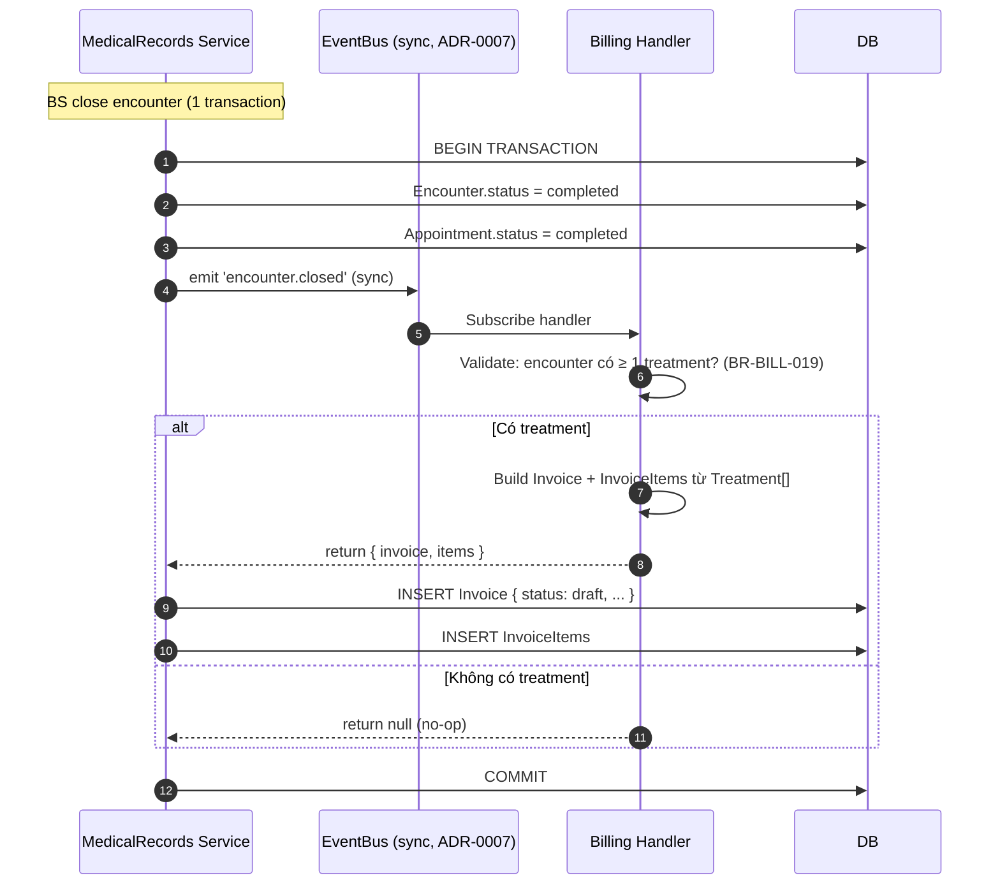
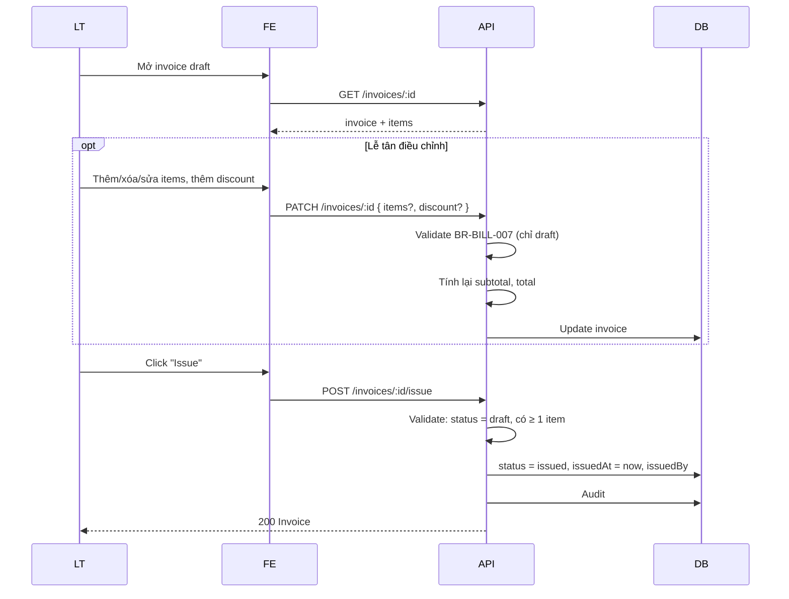
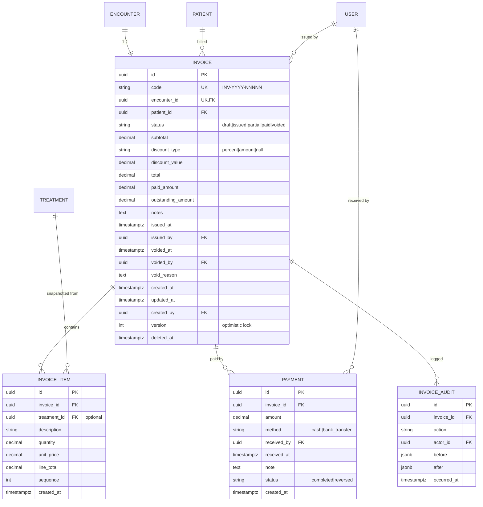

# SPEC — Billing Module

> **Module:** `Billing`
> **Ngày tạo:** 2026-07-13
> **Trạng thái:** Draft (chờ review)
> **Phiên bản:** 1.0
>
> **Đây là spec duy nhất cho module Billing.** Mọi implementation, code, test, API đều phải tham chiếu file này.

---

## Tổng quan nhanh

| Phần | Tóm tắt |
| ---- | ------- |
| Purpose | Hóa đơn, thanh toán, công nợ, báo cáo doanh thu |
| Bounded context | Billing — module độc lập |
| Modules phụ thuộc | _(không — root entity)_ |
| Được dùng bởi | _(không — leaf module)_ |
| Lắng nghe event | `EncounterClosed` (từ MedicalRecords) |
| Permission riêng | `invoice.*`, `payment.*`, `report.*` |

---

## 1. Purpose (Mục đích)

### 1.1 Bối cảnh

Phòng khám cần:

1. **Sinh hóa đơn tự động** từ Treatment trong encounter đã đóng.
2. **Thu tiền sau khám** (BD-0003 — không cọc trước).
3. **Theo dõi công nợ** (partial payment — chốt ở Q2).
4. **In hóa đơn** cho bệnh nhân.
5. **Báo cáo doanh thu** theo ngày / tuần / tháng, theo dịch vụ, theo BS.

### 1.2 Phạm vi (Scope)

#### ✅ Có

- Auto-create invoice (status `draft`) từ `EncounterClosed` event (nếu có Treatment).
- Invoice CRUD với state machine.
- Invoice items (auto từ Treatment + manual add/sửa khi draft).
- Discount (percent hoặc amount).
- Partial payment + full payment.
- Payment methods: `cash`, `bank_transfer`.
- Void invoice (admin only, block nếu đã có payment).
- Invoice print (HTML/PDF view).
- Báo cáo doanh thu, công nợ.
- Audit log cho mọi action.

#### ❌ Không có ở MVP

- VAT / thuế.
- Hóa đơn điện tử (TCT VN).
- Tích hợp cổng thanh toán online (VNPay, MoMo, ZaloPay).
- Refund flow (chỉ void).
- Multi-currency (chỉ VNĐ).
- Gộp nhiều encounter vào 1 invoice.
- Invoice recurrence / subscription.
- Chia doanh thu cho BS.
- Xuất CSV / Excel (PDF only).

---

## 2. Business Flow (Luồng nghiệp vụ)

### 2.1 Auto-create Invoice từ Encounter



> **Quan trọng (BR-BILL-019 + ADR-0008):** Invoice draft được INSERT trong **cùng transaction** với Encounter close. Nếu Billing handler fail (validation / DB error) → ROLLBACK toàn bộ (kể cả Encounter close, stock-out).
> Nếu encounter closed không có treatment → handler return null → publisher chỉ COMMIT state của MedicalRecords (không có Invoice).
> Cascade cancel (BD-0008): nếu Appointment bị cancel trong khi Encounter `in_progress` → Encounter cancel, KHÔNG trigger `encounter.closed` event, KHÔNG tạo Invoice.

### 2.2 Lễ tân Review + Issue Invoice



### 2.3 Thu tiền (Full hoặc Partial)

```mermaid
sequenceDiagram
  participant LT
  participant API
  participant DB

  LT->>API: POST /invoices/:id/payments { amount, method, note? }
  API->>API: Validate:
  API->>API: - status ∈ {issued, partial} (BR-BILL-012)
  API->>API: - amount > 0
  API->>API: - amount ≤ outstanding (BR-BILL-009)
  API->>API: - method ∈ {cash, bank_transfer}
  API->>DB: Tạo Payment { status: completed }
  API->>API: Tính:
  API->>API: - paidAmount += amount
  API->: outstandingAmount = total - paidAmount
  API->>API: Determine status:
  API->>API: - paidAmount == 0 → status = issued
  API->>API: - 0 < paidAmount < total → status = partial
  API->>API: - paidAmount >= total → status = paid
  API->>DB: Update invoice (status, paidAmount, outstandingAmount)
  API->: BR-BILL-020 audit
  API-->>LT: 200 Invoice + Payment
```

**Response nếu amount > outstanding:**

```json
{
  "type": "...",
  "title": "Payment exceeds outstanding",
  "status": 422,
  "detail": "Payment amount 500000 exceeds outstanding 400000"
}
```

### 2.4 Hủy Invoice (Void)

```mermaid
sequenceDiagram
  participant Admin
  participant API
  participant DB

  Admin->>API: POST /invoices/:id/void { reason }
  API->>API: Validate:
  API->: status ∈ {draft, issued, partial}
  API->: BR-BILL-015: không có payment completed nào
  alt Có payment
    API-->>Admin: 409 "Cannot void invoice with payments. Use admin override or write-off."
  else OK
    API->: status = voided, voidedAt, voidedBy, voidReason
    API->: Audit
    API-->>Admin: 200
  end
```

### 2.5 Báo cáo doanh thu

```mermaid
sequenceDiagram
  participant Admin
  participant API
  participant DB

  Admin->>API: GET /reports/revenue?from=...&to=...&groupBy=dentist|service|day
  API->: SELECT SUM(paid_amount) ... WHERE paid_at BETWEEN ?
  API->: SELECT SUM(outstanding_amount) ... WHERE status = partial
  API-->>Admin: {
  API-->>Admin:   totalRevenue,
  API-->>Admin:   totalOutstanding,
  API-->>Admin:   byGroup: [{ group, revenue, outstanding, count }],
  API-->>Admin:   from, to
  API-->>Admin: }
```

### 2.6 Báo cáo công nợ

```mermaid
sequenceDiagram
  participant Admin
  participant API
  participant DB

  Admin->>API: GET /reports/outstanding?minAmount=0&maxAge=90
  API->: SELECT i.*, p.* FROM invoices i JOIN patients p
  API->: WHERE status = partial AND outstanding_amount > 0
  API->: AND issued_at < now - maxAge days (optional filter)
  API->: ORDER BY issued_at ASC
  API-->>Admin: danh sách invoice còn nợ
```

### 2.7 Lễ tân xem hóa đơn của BN

```mermaid
sequenceDiagram
  LT->>FE: Mở BN → tab "Hóa đơn"
  FE->: GET /patients/:id/invoices
  API->: SELECT * WHERE patient_id = ? ORDER BY created_at DESC
  API-->>FE: danh sách
  LT->>FE: Click invoice
  FE->: GET /invoices/:id
  API-->>FE: detail + items + payments
```

### 2.8 In hóa đơn

```mermaid
sequenceDiagram
  LT->>FE: Click "In"
  FE->>FE: Mở tab mới với /invoices/:id/print
  FE->: GET /invoices/:id/print (HTML optimized for print)
  API-->>FE: HTML template
  LT->>FE: Ctrl+P → Print → Save PDF
```

### 2.9 Edge cases thường gặp

| Case | Xử lý |
| ---- | ----- |
| Encounter đóng không có Treatment | Handler không tạo Invoice (BR-BILL-019). BN chỉ tư vấn. |
| Invoice void đã có payment | Block (BR-BILL-015). Admin phải xử lý thủ công. |
| Lễ tân issue sai | Admin void + (sau MVP có refund). |
| Discount > subtotal | 422 BR-BILL-005. |
| Payment amount = outstanding | Status → paid. |
| BN đổi treatment sau invoice issue | Encounter immutable (BR-MR-004). Lễ tân phải admin-reopen encounter (BR-MR-024). |
| 2 lễ tân thu tiền cùng lúc | Optimistic locking + validate outstanding lúc POST. |
| Invoice đã paid → sửa items | 403 "Invoice immutable when not draft". |

---

## 3. Actors

| Actor | Vai trò | Xem chi tiết |
| ----- | ------- | ------------ |
| **Clinic Administrator** | Tất cả + void + reports | [`../../01_Architecture/actor-permissions-matrix.md`](../../01_Architecture/actor-permissions-matrix.md) §3.4 |
| **Receptionist** | Tạo/sửa invoice (draft), issue, payment, xem tất cả | |
| **Dentist** | Xem invoice của encounter mình tạo (read-only) | |

---

## 4. Screens

| Tên màn hình | Mục đích | Primary actor | Route |
| ------------ | -------- | ------------- | ----- |
| Invoice list | Danh sách invoice (filter status/date/BN) | Lễ tân, Admin, BS (own) | `/invoices` |
| Invoice detail (review/edit) | Xem + sửa items + discount | Lễ tân, Admin | `/invoices/:code` |
| Invoice print | View in | Lễ tân, BS | `/invoices/:code/print` |
| Payment modal | Nhập khoản thanh toán | Lễ tân | (modal) |
| Invoice void | Form lý do hủy | Admin | (modal admin) |
| Revenue report | Báo cáo doanh thu | Admin | `/admin/reports/revenue` |
| Outstanding report | Báo cáo công nợ | Admin | `/admin/reports/outstanding` |
| Patient invoices tab | Tab trong BN detail | Lễ tân | (tab) |
| Invoice audit | Lịch sử thay đổi | Admin | `/admin/invoices/:code/audit` |

---

## 5. Entities



### 5.1 Enum

```text
Invoice.status ∈ { 'draft', 'issued', 'partial', 'paid', 'voided' }
Invoice.discountType ∈ { 'percent', 'amount', null }
Payment.method ∈ { 'cash', 'bank_transfer' }
Payment.status ∈ { 'completed', 'reversed' }
```

---

## 6. Business Rules

| Rule ID | Mô tả | Chi tiết |
| ------- | ----- | -------- |
| BR-BILL-001 | Auto-create | `EncounterClosed` event → Billing handler tạo invoice draft. |
| BR-BILL-002 | 1 Invoice per Encounter | Unique FK `encounter_id`. |
| BR-BILL-003 | Subtotal = Σ lineTotal | Sau mỗi update items. |
| BR-BILL-004 | Total = subtotal − discount | Tính lại sau khi đổi discount. |
| BR-BILL-005 | Discount validation | `discountValue ≥ 0`, total discount ≤ subtotal. |
| BR-BILL-006 | State machine | `draft → issued → partial → paid` hoặc `→ voided` (từ draft/issued/partial). |
| BR-BILL-007 | Chỉ sửa ở draft | PATCH /invoices/:id 403 nếu status ≠ draft. |
| BR-BILL-008 | Issue = draft → issued | Lễ tân/admin. Validate ≥ 1 item. |
| BR-BILL-009 | Payment amount validate | `0 < amount ≤ outstanding`. |
| BR-BILL-010 | Partial logic | `0 < paidAmount < total` → status = partial. |
| BR-BILL-011 | Paid logic | `paidAmount >= total` → status = paid. |
| BR-BILL-012 | Void không payment | status = voided thì POST /payments 403. |
| BR-BILL-013 | Code auto-sinh | `INV-YYYY-NNNNN`, sequence chung (giống Patient). |
| BR-BILL-014 | BS row-level | BS chỉ thấy invoice của encounter mình tạo. |
| BR-BILL-015 | Void có payment block | Invoice có ≥ 1 payment completed → void bị block. |
| BR-BILL-016 | Không xóa cứng | Chỉ void. |
| BR-BILL-017 | Invoice ≥ 1 item | Validate khi issue. |
| BR-BILL-018 | Item price snapshot | `unit_price` lưu tại thời điểm tạo, không tự cập nhật theo service catalog. |
| BR-BILL-019 | Encounter không treatment = no invoice | Handler check `COUNT(treatments) > 0` trước khi tạo. |
| BR-BILL-020 | Audit mọi action | Auto-create, edit, issue, payment, void, discount change. |
| BR-BILL-021 | Payment.note optional | ≤ 500 chars. |
| BR-BILL-022 | Invoice chỉ từ closed encounter | Validate `encounter.status = completed`. |
| BR-BILL-023 | Optimistic lock | `version` tăng mỗi update. 409 nếu version conflict. |
| BR-BILL-024 | Refund = void | MVP không có refund riêng. Void là cách "refund" duy nhất. |
| BR-BILL-025 | Admin override discount | Admin có thể áp discount lớn (>50%) với reason. Audit rõ. |
| BR-BILL-026 | Discount áp dụng trước khi issue | Sau issued không đổi discount. |
| BR-BILL-027 | Payment reversed | Admin có thể reverse payment (vd: nhập sai) → quay lại status trước. Audit. |
| BR-BILL-028 | Revenue cache | Có thể cache 1 phút cho dashboard (sau MVP). MVP query trực tiếp. |

---

## 7. Permissions

> Xem danh sách đầy đủ: [`../../01_Architecture/actor-permissions-matrix.md`](../../01_Architecture/actor-permissions-matrix.md) §3.4

### 7.1 Permission của module Billing

| Permission code | Admin | Receptionist | Dentist |
| --------------- | :---: | :----------: | :-----: |
| `invoice.read.any` | ✅ | ✅ | 🔒 (own encounter) |
| `invoice.create` | ✅ (auto qua event) | ❌ (auto) | ❌ |
| `invoice.update` | ✅ | ✅ (draft only) | ❌ |
| `invoice.issue` | ✅ | ✅ | ❌ |
| `invoice.void` | ✅ | ❌ | ❌ |
| `payment.create` | ✅ | ✅ | ❌ |
| `payment.reverse` | ✅ | ❌ | ❌ |
| `report.revenue.read` | ✅ | ❌ | ❌ |
| `report.outstanding.read` | ✅ | ❌ | ❌ |

### 7.2 Ma trận endpoint × permission

| Endpoint | Method | Permission |
| -------- | ------ | ---------- |
| `/invoices` | GET | `invoice.read.*` |
| `/invoices/:id` | GET | `invoice.read.*` |
| `/invoices/:id` | PATCH | `invoice.update` (draft only) |
| `/invoices/:id/issue` | POST | `invoice.issue` |
| `/invoices/:id/payments` | GET | `invoice.read.*` |
| `/invoices/:id/payments` | POST | `payment.create` |
| `/invoices/:id/payments/:pid/reverse` | POST | `payment.reverse` |
| `/invoices/:id/void` | POST | `invoice.void` (admin) |
| `/invoices/:id/print` | GET | `invoice.read.*` |
| `/invoices/:id/audit` | GET | admin only |
| `/patients/:id/invoices` | GET | `invoice.read.*` |
| `/reports/revenue` | GET | `report.revenue.read` |
| `/reports/outstanding` | GET | `report.outstanding.read` |

---

## 8. API

### 8.1 GET `/api/v1/invoices`

**Query:**

| Param | Description |
| ----- | ----------- |
| `status` | Filter multi |
| `patientId` | Lọc theo BN |
| `dentistId` | Lọc theo BS |
| `from` / `to` | Date range (issuedAt) |
| `page`, `pageSize` | Pagination |

**Response 200:**

```json
{
  "data": [
    {
      "id": "uuid",
      "code": "INV-2026-00123",
      "encounterId": "uuid",
      "patient": { "id": "uuid", "code": "PAT-2026-00012", "fullName": "Nguyen Van A" },
      "dentist": { "id": "uuid", "fullName": "Tran Thi C" },
      "status": "paid",
      "subtotal": 600000,
      "discountType": null,
      "discountValue": 0,
      "total": 600000,
      "paidAmount": 600000,
      "outstandingAmount": 0,
      "issuedAt": "2026-07-15T09:00:00Z",
      "createdAt": "2026-07-15T08:30:00Z"
    }
  ],
  "pagination": {...}
}
```

### 8.2 GET `/api/v1/invoices/:id`

**Response 200:**

```json
{
  "id": "uuid",
  "code": "INV-2026-00123",
  "encounterId": "uuid",
  "patient": { ... },
  "dentist": { ... },
  "status": "partial",
  "subtotal": 600000,
  "discountType": "percent",
  "discountValue": 10,
  "total": 540000,
  "paidAmount": 300000,
  "outstandingAmount": 240000,
  "notes": "BN hứa trả nốt tuần sau",
  "items": [
    {
      "id": "uuid",
      "description": "Hàn composite răng 16",
      "quantity": 1,
      "unitPrice": 300000,
      "lineTotal": 300000,
      "treatmentId": "uuid",
      "sequence": 1
    },
    {
      "id": "uuid",
      "description": "Lấy cao răng 2 hàm",
      "quantity": 1,
      "unitPrice": 300000,
      "lineTotal": 300000,
      "treatmentId": "uuid",
      "sequence": 2
    }
  ],
  "payments": [
    {
      "id": "uuid",
      "amount": 300000,
      "method": "cash",
      "receivedBy": { "id": "uuid", "fullName": "Le Thi LT" },
      "receivedAt": "2026-07-15T09:30:00Z",
      "note": "Trả trước 300k"
    }
  ],
  "issuedAt": "2026-07-15T09:00:00Z",
  "issuedBy": { "id": "uuid", "fullName": "Le Thi LT" },
  "version": 3,
  "createdAt": "2026-07-15T08:30:00Z"
}
```

### 8.3 PATCH `/api/v1/invoices/:id`

**Body:**

```json
{
  "items": [
    { "description": "Hàn composite răng 16", "quantity": 1, "unitPrice": 350000 }
  ],
  "discountType": "percent",
  "discountValue": 10,
  "notes": "Giảm giá BN quen"
}
```

**Header:** `If-Match: <version>` (optimistic lock).

**Response 200:** invoice updated.
**Response 403 (BR-BILL-007):** status ≠ draft.
**Response 412:** version conflict.

### 8.4 POST `/api/v1/invoices/:id/issue`

**Response 200:** invoice status = issued.
**Response 422 (BR-BILL-017):** không có item.

### 8.5 POST `/api/v1/invoices/:id/payments`

**Body:**

```json
{
  "amount": 300000,
  "method": "cash",
  "note": "Trả trước 300k"
}
```

**Response 200:**

```json
{
  "payment": { "id": "uuid", "amount": 300000, "method": "cash", "receivedAt": "..." },
  "invoice": { ... with updated status, paidAmount, outstandingAmount }
}
```

**Response 422 (BR-BILL-009):** amount > outstanding.
**Response 403 (BR-BILL-012):** invoice voided.

### 8.6 POST `/api/v1/invoices/:id/payments/:pid/reverse`

Admin only.

**Body:**

```json
{ "reason": "Nhập sai" }
```

**Effect:** `payment.status = reversed`, recalculate invoice.paidAmount và status (revert về status trước payment này).

**Response 200:** updated invoice + payment.

### 8.7 POST `/api/v1/invoices/:id/void`

**Body:**

```json
{ "reason": "Lễ tân issue nhầm" }
```

**Response 200.**
**Response 409 (BR-BILL-015):** có payment.

### 8.8 GET `/api/v1/invoices/:id/print`

Trả về HTML page optimized cho in (CSS print media). Frontend mở tab mới → Ctrl+P.

### 8.9 GET `/api/v1/patients/:id/invoices`

Proxy. Row-level filter theo dentist nếu BS.

### 8.10 GET `/api/v1/reports/revenue`

**Query:**

| Param | Description |
| ----- | ----------- |
| `from`, `to` | Date range (bắt buộc) |
| `groupBy` | `day` (default) / `dentist` / `service` |

**Response 200:**

```json
{
  "from": "2026-07-01",
  "to": "2026-07-31",
  "totalRevenue": 45000000,
  "totalOutstanding": 3200000,
  "byGroup": [
    {
      "group": "Tran Thi C",
      "revenue": 18000000,
      "outstanding": 1200000,
      "invoiceCount": 35,
      "paidCount": 30,
      "partialCount": 5
    }
  ]
}
```

### 8.11 GET `/api/v1/reports/outstanding`

**Query:**

| Param | Description |
| ----- | ----------- |
| `minAmount` | Lọc amount tối thiểu |
| `maxAgeDays` | Lọc chỉ invoice cũ hơn N ngày |
| `patientId` | Filter BN |

**Response 200:**

```json
{
  "data": [
    {
      "invoiceId": "uuid",
      "code": "INV-2026-00089",
      "patient": { "code": "PAT-...", "fullName": "..." },
      "total": 1500000,
      "paidAmount": 500000,
      "outstandingAmount": 1000000,
      "issuedAt": "2026-06-15T...",
      "daysOutstanding": 30
    }
  ],
  "totalOutstanding": 5000000,
  "count": 12
}
```

---

## 9. Database

### 9.1 Tables summary

| Table | Note |
| ----- | ---- |
| `invoices` | Unique `(encounter_id)`. Index `(patient_id, created_at DESC)`, `(status, issued_at)` cho cron/report, `(code)` unique. |
| `invoice_items` | Index `(invoice_id, sequence)`. |
| `payments` | Index `(invoice_id, received_at DESC)`, `(received_by, received_at DESC)` cho báo cáo. |
| `invoice_audits` | Append-only. Index `(invoice_id, occurred_at DESC)`. |

### 9.2 Indexes quan trọng

```sql
CREATE UNIQUE INDEX idx_invoices_encounter ON invoices (encounter_id) WHERE deleted_at IS NULL;
CREATE UNIQUE INDEX idx_invoices_code ON invoices (code);
CREATE INDEX idx_invoices_status_issued ON invoices (status, issued_at);
CREATE INDEX idx_payments_invoice ON payments (invoice_id, received_at DESC);
```

### 9.3 Migration

`004_billing.sql` + `.md`:

```markdown
# Migration 004 — Billing tables

Tạo schema cho module Billing theo SPEC.md §5.
- 4 bảng: invoices, invoice_items, payments, invoice_audits.
- Unique FK encounter_id.
- Code sequence chung (cùng pattern với Patient).
- Index cho report performance.
- Optimistic lock version field.
```

---

## 10. Validation & Acceptance Criteria

### 10.1 Validation rules

| Field | Rule | Thông báo |
| ----- | ---- | --------- |
| `amount` (payment) | > 0, ≤ outstanding | "Số tiền vượt quá công nợ" |
| `method` (payment) | Enum {cash, bank_transfer} | "Phương thức không hợp lệ" |
| `discountType` | null \| percent \| amount | — |
| `discountValue` | ≥ 0, ≤ subtotal (nếu amount) hoặc ≤ 100 (nếu percent) | "Discount không hợp lệ" |
| `unitPrice` (item) | ≥ 0 | "Đơn giá không hợp lệ" |
| `quantity` (item) | > 0 | "Số lượng phải > 0" |

### 10.2 Acceptance criteria (Gherkin)

```gherkin
Feature: Auto-create Invoice
  Scenario: Encounter có 2 treatment, đóng thành công
    Given encounter với 2 treatment, total = 600k
    When encounter.status → completed
    Then invoice tự động tạo status = draft, total = 600k
    And có 2 InvoiceItem

  Scenario: Encounter không có treatment
    Given encounter closed không có treatment
    When encounter.status → completed
    Then KHÔNG tạo invoice

Feature: Invoice Lifecycle
  Scenario: Issue draft → issued
    Given invoice status = draft, có ≥ 1 item
    When POST /invoices/:id/issue
    Then status = issued, issuedAt = now

  Scenario: Sửa invoice đã issued
    Given invoice status = issued
    When PATCH /invoices/:id
    Then response 403 "Cannot edit non-draft invoice"

  Scenario: Payment full
    Given invoice status = issued, total = 600k, paidAmount = 0, outstanding = 600k
    When POST /invoices/:id/payments { amount: 600000, method: cash }
    Then status = paid, paidAmount = 600k, outstanding = 0

  Scenario: Payment partial
    Given invoice total = 600k
    When POST /payments { amount: 300000 }
    Then status = partial, paidAmount = 300k, outstanding = 300k

  Scenario: Payment > outstanding
    Given invoice outstanding = 300k
    When POST /payments { amount: 500000 }
    Then response 422

Feature: Void
  Scenario: Void draft, không có payment
    Given invoice status = draft
    When POST /invoices/:id/void
    Then status = voided

  Scenario: Void invoice có payment
    Given invoice có 1 payment
    When POST /invoices/:id/void
    Then response 409

Feature: Payment Reverse
  Scenario: Reverse payment
    Given invoice có 1 payment 300k, status = partial
    When POST /payments/:pid/reverse
    Then payment.status = reversed, invoice.paidAmount -= 300k, status revert

Feature: Reports
  Scenario: Revenue report theo ngày
    Given có 5 invoice paid trong 1 ngày, tổng = 3tr
    When GET /reports/revenue?from=2026-07-15&to=2026-07-15&groupBy=day
    Then totalRevenue = 3000000

  Scenario: Outstanding report
    Given có 3 invoice partial, tổng outstanding = 1.5tr
    When GET /reports/outstanding
    Then trả về 3 invoice + totalOutstanding = 1500000

Feature: Permission
  Scenario: Dentist chỉ thấy invoice của encounter mình
    Given dentist A có 1 invoice, dentist B có 1 invoice
    When dentist A GET /invoices
    Then chỉ thấy invoice của A

  Scenario: Receptionist không void
    Given invoice status = issued
    When receptionist POST /invoices/:id/void
    Then response 403
```

### 10.3 Test plan

| Layer | Test |
| ----- | ---- |
| Domain | State machine; discount/total calc; payment recalc |
| Application | Use cases: CreateInvoice (handler), UpdateInvoice, IssueInvoice, AddPayment, VoidInvoice, ReversePayment, GetRevenueReport |
| Infrastructure | Prisma + EventBus test (EncounterClosed → auto-create) |
| HTTP | Controller + Supertest với optimistic lock header |
| Security | Permission + row-level (BS) |
| E2E (sau) | Playwright: full invoice lifecycle |

### 10.4 Tiêu chí "xong" module Billing

- [ ] Spec đã review.
- [ ] Migration `004_billing.sql` + `.md`.
- [ ] 4 entities + unit test ≥ 90%.
- [ ] State machine validator (BR-BILL-006).
- [ ] Discount calculator (BR-BILL-004/005).
- [ ] Payment recalc (BR-BILL-010/011).
- [ ] EventBus subscriber cho `EncounterClosed` → auto-create (BR-BILL-001/019).
- [ ] Optimistic lock trên update (BR-BILL-023).
- [ ] Void block khi có payment (BR-BILL-015).
- [ ] Print HTML template.
- [ ] Reports (revenue + outstanding).
- [ ] Frontend:
  - [ ] Invoice list với filter
  - [ ] Invoice review/edit (draft)
  - [ ] Payment modal
  - [ ] Print view
  - [ ] Revenue dashboard (admin)
- [ ] CI pass.

---

## Liên kết

- [`BLUEPRINT.md`](./BLUEPRINT.md) — blueprint trước spec.
- Template: [`../../Templates/MODULE_SPEC_TEMPLATE.md`](../../Templates/MODULE_SPEC_TEMPLATE.md).
- [`../../01_Architecture/actor-permissions-matrix.md`](../../01_Architecture/actor-permissions-matrix.md) §3.4.
- [`../../01_Architecture/business-decisions.md`](../../01_Architecture/business-decisions.md) — BD-0003 (pay-after, no deposit).
- [`../../02_Glossary/GLOSSARY.md`](../../02_Glossary/GLOSSARY.md).
- ADR: [`../../ADR/0002-modular-monolith.md`](../../ADR/0002-modular-monolith.md) — event-driven giữa modules.
- Spec phụ thuộc:
  - [`../MedicalRecords/SPEC.md`](../MedicalRecords/SPEC.md) — emit `EncounterClosed` event.
- Spec tương lai:
  - Spec Inventory (sẽ viết) — độc lập về data nhưng cùng event-driven pattern.