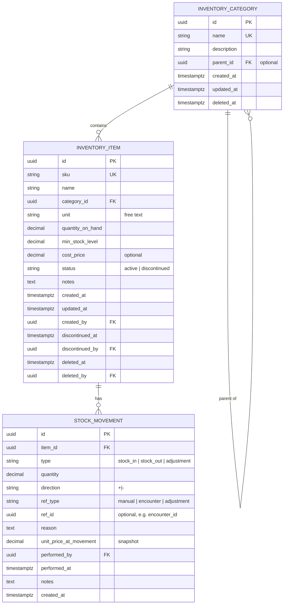

# SPEC — Inventory Module

> **Module:** `Inventory`
> **Ngày tạo:** 2026-07-13
> **Trạng thái:** Draft (chờ review)
> **Phiên bản:** 1.0
>
> **Đây là spec duy nhất cho module Inventory.** Mọi implementation, code, test, API đều phải tham chiếu file này.

---

## Tổng quan nhanh

| Phần | Tóm tắt |
| ---- | ------- |
| Purpose | Quản lý vật tư tiêu hao, nhập/xuất kho, low-stock alert |
| Bounded context | Inventory — module độc lập |
| Modules phụ thuộc | _(không — root entity)_ |
| Được dùng bởi | _(không — leaf module)_ |
| Lắng nghe event | `EncounterClosed` (từ MedicalRecords) → auto stock-out |
| Permission riêng | `inventory.*` |

---

## 1. Purpose (Mục đích)

### 1.1 Bối cảnh

Phòng khám cần:

1. **Danh mục vật tư** (composite, thuốc tê, găng tay, khẩu trang…).
2. **Theo dõi tồn kho** real-time.
3. **Tự động trừ kho** khi encounter đóng có sử dụng vật tư (qua event `EncounterClosed`).
4. **Nhập kho** thủ công khi mua thêm.
5. **Hao phí/spoilage** ghi nhận riêng.
6. **Kiểm kê (adjustment)** khi cần.
7. **Cảnh báo sắp hết** (badge dashboard).
8. **Lịch sử mọi thay đổi** tồn kho (audit).

### 1.2 Phạm vi (Scope)

#### ✅ Có

- CRUD inventory item.
- CRUD category (1 cấp parent, không multi-level).
- Stock-in (nhập kho) không cần approval.
- Stock-out manual (hao phí/spoilage).
- Adjustment (kiểm kê) với reason, admin only.
- Auto stock-out từ event `EncounterClosed`.
- StockMovement append-only (audit).
- Low-stock alert (badge dashboard).
- Soft-delete item.
- Discontinued status (ngừng sử dụng).

#### ❌ Không có ở MVP

- Quản lý lô/hạn (BD-0004).
- Barcode / QR scan.
- Multi-location (chỉ 1 kho).
- Reorder point tự động đề xuất nhập.
- Email/SMS notification khi low-stock.
- Báo cáo chi tiết giá vốn (chỉ snapshot cost tại stock-in).
- Supplier management.
- Purchase order / GRN workflow.
- Inventory transfer giữa locations.

---

## 2. Business Flow (Luồng nghiệp vụ)

### 2.1 Tạo Inventory Item

```mermaid
sequenceDiagram
  participant Admin
  participant API
  participant DB

  Admin->>API: POST /inventory/items
  Note over Admin: Body: { name, sku?, categoryId, unit, minStockLevel, costPrice?, notes? }
  API->: Validate: name unique + category tồn tại
  API->: quantityOnHand = 0
  API->DB: Tạo InventoryItem { status: active }
  API-->>Admin: 201 Item
```

### 2.2 Stock-in (nhập kho)

```mermaid
sequenceDiagram
  participant LT
  participant API
  participant DB

  LT->>API: POST /inventory/items/:id/stock-in
  Note over LT: Body: { quantity, unitPrice?, supplierName?, note? }
  API->: Validate: quantity > 0, item.status = active, item not deleted
  API->: BEGIN TRANSACTION
  API->DB: quantityOnHand += quantity
  API->DB: Tạo StockMovement { type: stock_in, refType: manual, performedBy }
  API->: COMMIT
  API-->>LT: 200 { item, movement }
```

### 2.3 Auto Stock-out từ EncounterClosed (event)

```mermaid
sequenceDiagram
  participant MR as MedicalRecords API
  participant EB as EventBus
  participant INV as Inventory API
  participant DB

  Note over MR: Encounter closed với inventory usages
  MR->>DB: Encounter.status = completed (BR-MR-003)
  MR->>EB: Emit "EncounterClosed" { inventoryUsages }

  EB->>INV: Subscribe handler
  Note over INV: Bắt đầu transaction

  loop Cho mỗi usage
    INV->: SELECT quantityOnHand FOR UPDATE
    alt quantityOnHand < usage.quantity
      INV->: ROLLBACK
      INV->MR: NACK qua outbox (MedicalRecords sẽ rollback encounter close)
    else OK
      INV->DB: quantityOnHand -= usage.quantity
      INV->DB: Tạo StockMovement { type: stock_out, refType: encounter, refId }
    end
  end

  INV->: COMMIT
  INV-->>EB: ACK
```

> **Quan trọng:** Handler này tham gia transaction của encounter close (BR-INV-005). Nếu stock fail → encounter KHÔNG đóng.

### 2.4 Stock-out Manual (Hao phí / Spoilage)

```mermaid
sequenceDiagram
  participant LT
  participant API
  participant DB

  LT->>API: POST /inventory/items/:id/stock-out
  Note over LT: Body: { quantity, reason }
  API->: Validate: quantity > 0, ≤ quantityOnHand (BR-INV-007), reason required
  API->: BEGIN TRANSACTION
  API->DB: quantityOnHand -= quantity
  API->DB: Tạo StockMovement { type: stock_out, refType: manual, reason }
  API->: COMMIT
  API-->>LT: 200
```

### 2.5 Adjustment (Kiểm kê)

```mermaid
sequenceDiagram
  participant Admin
  participant API
  participant DB

  Admin->>API: POST /inventory/items/:id/adjust
  Note over Admin: Body: { newQuantity, reason }
  API->: Validate: newQuantity ≥ 0, reason required
  API->: BEGIN TRANSACTION
  API->: diff = newQuantity - currentQuantity
  API->DB: quantityOnHand = newQuantity
  API->DB: Tạo StockMovement { type: adjustment, refType: adjustment, diff, reason }
  API->: COMMIT
  API-->>Admin: 200
```

### 2.6 Low-stock Dashboard

```mermaid
sequenceDiagram
  participant User
  participant FE
  participant API
  participant DB

  User->>FE: Mở dashboard
  FE->: GET /inventory/low-stock?limit=20
  API->: SELECT WHERE quantityOnHand < minStockLevel AND status = active AND deleted_at IS NULL
  API->: ORDER BY (minStockLevel - quantityOnHand) DESC
  API-->>FE: { count, items[] }
  FE-->>User: Badge số lượng + danh sách top 20
```

### 2.7 Lịch sử Stock Movement

```mermaid
sequenceDiagram
  participant Actor
  participant API
  participant DB

  Actor->>API: GET /inventory/items/:id/movements?from=&to=&type=&page=
  API->: SELECT * WHERE itemId = ? ORDER BY performed_at DESC
  API-->>Actor: danh sách movements + pagination
```

### 2.8 Soft-delete / Discontinue

```mermaid
sequenceDiagram
  Admin->>API: DELETE /inventory/items/:id
  API->: Set deletedAt + deletedBy
  API-->>Admin: 204

  alt Admin muốn ngừng SD nhưng chưa xóa
    Admin->>API: PATCH /inventory/items/:id { status: discontinued }
    API->: status = discontinued
  end
```

### 2.9 Edge cases thường gặp

| Case | Xử lý |
| ---- | ----- |
| Item name trùng khi tạo | Validate unique + trả 409. |
| Stock-out manual vượt tồn | 422 "Insufficient stock". |
| Encounter close mà 1 item không đủ | Transaction rollback, encounter KHÔNG đóng. |
| Adjust newQuantity = current | Vẫn tạo StockMovement diff = 0? — Không. BR-INV-023: skip nếu diff = 0. |
| Discontinued item còn dùng trong treatment cũ | OK (read-only), nhưng UI không cho pick trong encounter mới. |
| Soft-delete item còn stock | OK, giữ nguyên quantityOnHand. Admin phải stock-out hết trước khi xóa (khuyến nghị, không bắt buộc). |
| 2 lễ tân nhập kho cùng lúc | SELECT FOR UPDATE chống race condition. |

---

## 3. Actors

| Actor | Vai trò | Xem chi tiết |
| ----- | ------- | ------------ |
| **Clinic Administrator** | Tất cả + adjust + delete + discontinue | [`../../01_Architecture/actor-permissions-matrix.md`](../../01_Architecture/actor-permissions-matrix.md) §3.5 |
| **Receptionist** | Xem, stock-in, stock-out manual | |
| **Dentist** | Xem item list (read-only) để pick khi ghi treatment | |

---

## 4. Screens

| Tên màn hình | Mục đích | Primary actor | Route |
| ------------ | -------- | ------------- | ----- |
| Inventory item list | Danh sách, filter category, low-stock highlight | Lễ tân, Admin, BS | `/inventory` |
| Item detail | Chi tiết + movements history | Lễ tân, Admin | `/inventory/items/:sku` |
| Item create/edit | Tạo / sửa item | Admin | `/admin/inventory/items/new` |
| Stock-in modal | Form nhập kho | Lễ tân, Admin | (modal) |
| Stock-out modal | Form xuất kho manual (hao phí) | Lễ tân, Admin | (modal) |
| Adjust modal | Form kiểm kê | Admin | (modal) |
| Category manager | CRUD category | Admin | `/admin/inventory/categories` |
| Low-stock badge | Trên dashboard | All (view) | (badge trên `/`) |
| Item picker | Chọn vật tư trong Treatment | BS | (component trong encounter) |

---

## 5. Entities



### 5.1 Enum

```text
InventoryItem.status ∈ { 'active', 'discontinued' }
StockMovement.type ∈ { 'stock_in', 'stock_out', 'adjustment' }
StockMovement.direction ∈ { '+', '-' }
StockMovement.refType ∈ { 'manual', 'encounter', 'adjustment' }
```

---

## 6. Business Rules

| Rule ID | Mô tả | Chi tiết |
| ------- | ----- | -------- |
| BR-INV-001 | Item name unique | Trong cùng active status. Soft-delete cho phép tên lặp. |
| BR-INV-002 | Quantity ≥ 0 | Không bao giờ âm. |
| BR-INV-003 | Stock-in/out quantity > 0 | Decimal ≥ 0, nhưng reject nếu = 0. |
| BR-INV-004 | Auto stock-out | Subscribe event `encounter.closed` từ MedicalRecords (ADR-0007). Handler chạy sync trong cùng transaction (ADR-0008). Tạo StockMovement(type=stock_out, refType=encounter, refId=encounterId) + giảm quantityOnHand theo TreatmentInventoryUsage. |
| BR-INV-005 | Atomic transaction (xem ADR-0008) | Auto stock-out chạy trong transaction encounter close. Fail → rollback toàn bộ chain (Encounter close + Appointment close + Stock-out + Invoice draft). Xem [ADR-0008](../../ADR/0008-transactional-encounter-close.md). |
| BR-INV-006 | Manual stock-out có reason | `reason` required, ≤ 500 chars. |
| BR-INV-007 | Không vượt quantityOnHand | Manual stock-out: `quantity ≤ quantityOnHand`. |
| BR-INV-008 | Adjustment có reason | Admin only, reason required. |
| BR-INV-009 | StockMovement append-only | Không update/delete trong application layer. |
| BR-INV-010 | Unit free text | "g", "ml", "cái", "hộp" — tự do, không enum. |
| BR-INV-011 | Cost price ≥ 0 | Decimal(12,4), optional. |
| BR-INV-012 | Low-stock condition | `quantityOnHand < minStockLevel AND status = active AND deletedAt IS NULL`. |
| BR-INV-013 | Soft-delete giữ stock | Soft-delete: quantityOnHand giữ nguyên, không cho stock-in/out mới. |
| BR-INV-014 | Discontinued ≠ deleted | Discontinued: vẫn stock-in/out được, nhưng không pick trong encounter mới. |
| BR-INV-015 | Category phải tồn tại | Validate khi tạo/update item. |
| BR-INV-016 | Category name unique per parent | Cho phép cùng tên ở 2 parent khác nhau. |
| BR-INV-017 | Không cycle category | `parent_id` không được là chính nó hoặc descendants. |
| BR-INV-018 | Cost price snapshot | Tại thời điểm stock-in, lưu vào StockMovement (sau tính giá vốn TB). |
| BR-INV-019 | QuantityOnHand chỉ qua Movement | Không cho PATCH trực tiếp quantityOnHand. |
| BR-INV-020 | Low-stock query | Partial index cho performance. |
| BR-INV-021 | BS xem read-only | BS chỉ GET, không POST/PATCH/DELETE. |
| BR-INV-022 | Admin only cho create/delete | Lễ tân chỉ stock-in/out manual. |
| BR-INV-023 | Skip no-op adjustment | Adjustment với `newQuantity = currentQuantity` thì không tạo `StockMovement` (tránh audit log rác). |

---

## 7. Permissions

> Xem danh sách đầy đủ: [`../../01_Architecture/actor-permissions-matrix.md`](../../01_Architecture/actor-permissions-matrix.md) §3.5

### 7.1 Permission của module Inventory

| Permission code | Admin | Receptionist | Dentist |
| --------------- | :---: | :----------: | :-----: |
| `inventory.read` | ✅ | ✅ | ✅ |
| `inventory.create` | ✅ | ❌ | ❌ |
| `inventory.update` | ✅ | ❌ | ❌ |
| `inventory.delete` | ✅ | ❌ | ❌ |
| `inventory.stock_in` | ✅ | ✅ | ❌ |
| `inventory.stock_out` | ✅ | ✅ | ❌ |
| `inventory.adjust` | ✅ | ❌ | ❌ |

### 7.2 Ma trận endpoint × permission

| Endpoint | Method | Permission |
| -------- | ------ | ---------- |
| `/inventory/items` | GET | `inventory.read` |
| `/inventory/items` | POST | `inventory.create` (admin) |
| `/inventory/items/:id` | GET | `inventory.read` |
| `/inventory/items/:id` | PATCH | `inventory.update` (admin) |
| `/inventory/items/:id` | DELETE | `inventory.delete` (admin) |
| `/inventory/items/:id/restore` | POST | `inventory.delete` (admin) |
| `/inventory/items/:id/stock-in` | POST | `inventory.stock_in` |
| `/inventory/items/:id/stock-out` | POST | `inventory.stock_out` |
| `/inventory/items/:id/adjust` | POST | `inventory.adjust` (admin) |
| `/inventory/items/:id/movements` | GET | `inventory.read` |
| `/inventory/categories` | GET | `inventory.read` |
| `/inventory/categories` | POST | `inventory.create` (admin) |
| `/inventory/categories/:id` | PATCH / DELETE | `inventory.update` / `.delete` (admin) |
| `/inventory/low-stock` | GET | `inventory.read` |

---

## 8. API

### 8.1 GET `/api/v1/inventory/items`

**Query:**

| Param | Description |
| ----- | ----------- |
| `q` | Search name/sku |
| `categoryId` | Filter |
| `status` | Filter `active` / `discontinued` |
| `lowStockOnly` | Bool, default false |
| `includeDeleted` | Bool, admin only |
| `page`, `pageSize` | Pagination |

**Response 200:**

```json
{
  "data": [
    {
      "id": "uuid",
      "sku": "COMP-A2",
      "name": "Composite A2",
      "category": { "id": "uuid", "name": "Vật liệu hàn" },
      "unit": "g",
      "quantityOnHand": 5.5,
      "minStockLevel": 10,
      "isLowStock": true,
      "status": "active",
      "costPrice": 250000,
      "updatedAt": "2026-07-15T..."
    }
  ],
  "pagination": {...}
}
```

### 8.2 POST `/api/v1/inventory/items`

**Body:**

```json
{
  "sku": "COMP-A2",
  "name": "Composite A2",
  "categoryId": "uuid",
  "unit": "g",
  "minStockLevel": 10,
  "costPrice": 250000,
  "notes": "Composite màu A2, hạn 2 năm"
}
```

**Response 201.** **Response 409 (BR-INV-001):** name trùng.

### 8.3 POST `/api/v1/inventory/items/:id/stock-in`

**Body:**

```json
{
  "quantity": 50,
  "unitPrice": 250000,
  "supplierName": "Cty TNHH Nha Khoa X",
  "note": "Đợt 1 tháng 7"
}
```

**Response 200:** Item + Movement.

### 8.4 POST `/api/v1/inventory/items/:id/stock-out`

**Body:**

```json
{
  "quantity": 2,
  "reason": "Hao phí do lấy thừa"
}
```

**Response 200.** **Response 422 (BR-INV-007):** vượt quantityOnHand.

### 8.5 POST `/api/v1/inventory/items/:id/adjust`

**Body:**

```json
{
  "newQuantity": 8,
  "reason": "Kiểm kê cuối tháng: thiếu 2g so với sổ"
}
```

**Response 200:** Item + Movement.

### 8.6 GET `/api/v1/inventory/items/:id/movements`

**Query:** `from`, `to`, `type`, `page`, `pageSize`.

**Response 200:**

```json
{
  "data": [
    {
      "id": "uuid",
      "type": "stock_out",
      "quantity": 0.5,
      "direction": "-",
      "refType": "encounter",
      "refId": "uuid-encounter",
      "reason": null,
      "performedBy": { "fullName": "Tran Thi C" },
      "performedAt": "2026-07-15T08:30:00Z",
      "notes": null
    }
  ],
  "pagination": {...}
}
```

### 8.7 GET `/api/v1/inventory/low-stock`

**Response 200:**

```json
{
  "count": 7,
  "items": [
    {
      "id": "uuid",
      "sku": "COMP-A2",
      "name": "Composite A2",
      "quantityOnHand": 5.5,
      "minStockLevel": 10,
      "deficit": 4.5,
      "unit": "g"
    }
  ]
}
```

### 8.8 Category CRUD

```http
POST /api/v1/inventory/categories
{
  "name": "Vật liệu hàn",
  "description": "...",
  "parentId": null
}
```

Validation: BR-INV-016/017.

---

## 9. Database

### 9.1 Tables summary

| Table | Note |
| ----- | ---- |
| `inventory_categories` | Self-reference optional. Index `name`, `(parent_id, name)` unique. |
| `inventory_items` | Unique `sku`, unique `name` (active only via partial index). Index `(status, quantity_on_hand)` cho low-stock query. |
| `stock_movements` | Append-only. Index `(item_id, performed_at DESC)`, `(ref_type, ref_id)` cho query từ encounter. |

### 9.2 Indexes quan trọng

```sql
CREATE UNIQUE INDEX idx_inventory_items_sku ON inventory_items (sku) WHERE deleted_at IS NULL;
CREATE UNIQUE INDEX idx_inventory_items_name_active
  ON inventory_items (name)
  WHERE deleted_at IS NULL AND status = 'active';

CREATE INDEX idx_inventory_items_low_stock
  ON inventory_items (quantity_on_hand, min_stock_level)
  WHERE status = 'active' AND deleted_at IS NULL;

CREATE INDEX idx_stock_movements_item
  ON stock_movements (item_id, performed_at DESC);

CREATE INDEX idx_stock_movements_ref
  ON stock_movements (ref_type, ref_id);
```

### 9.3 Migration

`005_inventory.sql` + `.md`:

```markdown
# Migration 005 — Inventory tables

Tạo schema cho module Inventory theo SPEC.md §5.
- 3 bảng: inventory_categories, inventory_items, stock_movements.
- Partial unique indexes cho soft-delete.
- Partial index cho low-stock query performance.
- StockMovement append-only (không có application update).
```

---

## 10. Validation & Acceptance Criteria

### 10.1 Validation rules

| Field | Rule | Thông báo |
| ----- | ---- | --------- |
| `name` (item) | Required, 1-200 chars, unique active | "Tên vật tư đã tồn tại" |
| `sku` (item) | Optional, alphanumeric | "SKU không hợp lệ" |
| `unit` | Required, 1-20 chars | — |
| `quantityOnHand` | ≥ 0 | "Số lượng không được âm" |
| `minStockLevel` | ≥ 0 | "Ngưỡng tối thiểu không hợp lệ" |
| `costPrice` | ≥ 0, optional | — |
| `quantity` (stock-in/out) | > 0 | "Số lượng phải > 0" |
| `reason` (stock-out, adjust) | Required, 1-500 chars | "Lý do là bắt buộc" |
| `newQuantity` (adjust) | ≥ 0 | — |

### 10.2 Acceptance criteria (Gherkin)

```gherkin
Feature: Inventory CRUD
  Scenario: Tạo item thành công
    When POST /inventory/items với data hợp lệ
    Then response 201
    And quantityOnHand = 0, status = active

  Scenario: Tạo item trùng name
    Given có item "Composite A2"
    When POST /inventory/items với name = "Composite A2"
    Then response 409

  Scenario: Soft-delete item
    When DELETE /inventory/items/:id
    Then response 204
    And item.deleted_at != null
    And item vẫn query được kèm includeDeleted=true

Feature: Stock-in
  Scenario: Stock-in thành công
    Given item "Composite A2" có quantityOnHand = 5
    When POST /inventory/items/:id/stock-in { quantity: 10 }
    Then response 200
    And quantityOnHand = 15
    And có StockMovement type = stock_in

Feature: Stock-out manual
  Scenario: Stock-out trong quantityOnHand
    Given quantityOnHand = 5
    When POST /stock-out { quantity: 2, reason: "hao phí" }
    Then response 200
    And quantityOnHand = 3

  Scenario: Stock-out vượt quantityOnHand
    Given quantityOnHand = 2
    When POST /stock-out { quantity: 5 }
    Then response 422

  Scenario: Stock-out thiếu reason
    When POST /stock-out { quantity: 1 }
    Then response 400 "Reason required"

Feature: Adjustment
  Scenario: Adjust tăng
    Given quantityOnHand = 5
    When POST /adjust { newQuantity: 8, reason: "..." }
    Then quantityOnHand = 8
    And StockMovement type = adjustment, quantity = 3, direction = +

  Scenario: Adjust giảm
    Given quantityOnHand = 5
    When POST /adjust { newQuantity: 3 }
    Then quantityOnHand = 3
    And StockMovement type = adjustment, quantity = 2, direction = -

  Scenario: Adjust không đổi
    Given quantityOnHand = 5
    When POST /adjust { newQuantity: 5 }
    Then KHÔNG tạo StockMovement (BR-INV-005)

Feature: Auto stock-out
  Scenario: Encounter close thành công có vật tư
    Given encounter close có treatment dùng 0.5g composite, stock = 5
    When encounter closed
    Then quantityOnHand = 4.5
    And có StockMovement type = stock_out, refType = encounter

  Scenario: Encounter close fail vì stock không đủ
    Given stock = 0.2g
    When encounter close cần 0.5g
    Then encounter KHÔNG đóng
    And quantityOnHand giữ nguyên 0.2g
    And KHÔNG có StockMovement

Feature: Low-stock
  Scenario: Dashboard hiển thị
    Given 3 item low-stock (quantityOnHand < minStockLevel)
    When GET /inventory/low-stock
    Then response trả 3 items + count = 3
    And sorted by deficit DESC

Feature: Permission
  Scenario: Receptionist không tạo item
    When POST /inventory/items
    Then response 403

  Scenario: Receptionist không adjust
    When POST /adjust
    Then response 403

  Scenario: BS chỉ xem read-only
    When POST /stock-in (BS)
    Then response 403
    And GET /items vẫn OK
```

### 10.3 Test plan

| Layer | Test |
| ----- | ---- |
| Domain | Stock movement invariants; quantity ≥ 0 |
| Application | Use cases: CreateItem, StockIn, StockOut, Adjust, GetLowStock, HandleEncounterClosed |
| Infrastructure | Prisma + SELECT FOR UPDATE test |
| Event | EncounterClosed → Inventory handler integration test (atomic rollback) |
| HTTP | Controller + Supertest |
| Security | Permission per endpoint |
| E2E (sau) | Playwright: stock-in, encounter close trigger stock-out |

### 10.4 Tiêu chí "xong" module Inventory

- [ ] Spec đã review.
- [ ] Migration `005_inventory.sql` + `.md`.
- [ ] 3 entities + unit test ≥ 90%.
- [ ] Stock movement service (transaction-safe với SELECT FOR UPDATE).
- [ ] EventBus subscriber cho `EncounterClosed` → atomic stock-out.
- [ ] Adjustment service với audit.
- [ ] Low-stock query với partial index.
- [ ] Soft-delete + restore.
- [ ] Controller + DTO + Zod + Swagger.
- [ ] Frontend:
  - [ ] Item list với filter + low-stock highlight
  - [ ] Item detail với movements history
  - [ ] Stock-in/out modal
  - [ ] Adjust modal (admin)
  - [ ] Category manager (admin)
  - [ ] Item picker trong encounter treatment
- [ ] CI pass.

---

## Liên kết

- [`BLUEPRINT.md`](./BLUEPRINT.md) — blueprint trước spec.
- Template: [`../../Templates/MODULE_SPEC_TEMPLATE.md`](../../Templates/MODULE_SPEC_TEMPLATE.md).
- [`../../01_Architecture/actor-permissions-matrix.md`](../../01_Architecture/actor-permissions-matrix.md) §3.5.
- [`../../01_Architecture/business-decisions.md`](../../01_Architecture/business-decisions.md) — BD-0004 (simple inventory, no lot/expiry).
- [`../../02_Glossary/GLOSSARY.md`](../../02_Glossary/GLOSSARY.md).
- ADR: [`../../ADR/0002-modular-monolith.md`](../../ADR/0002-modular-monolith.md).
- Spec liên quan:
  - [`../MedicalRecords/SPEC.md`](../MedicalRecords/SPEC.md) — BR-MR-010/011/016/017/018 liên quan trực tiếp.