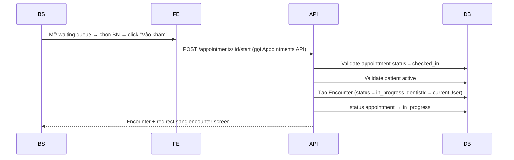
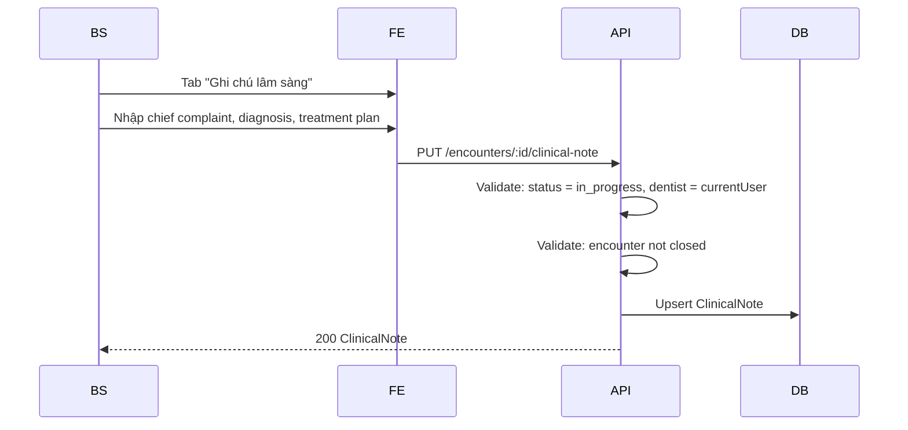
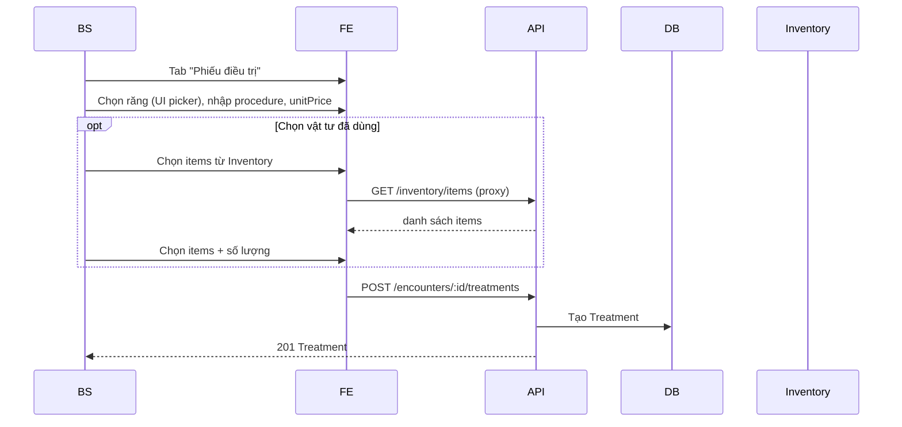
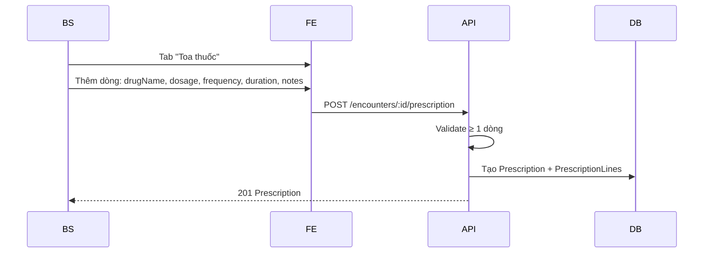
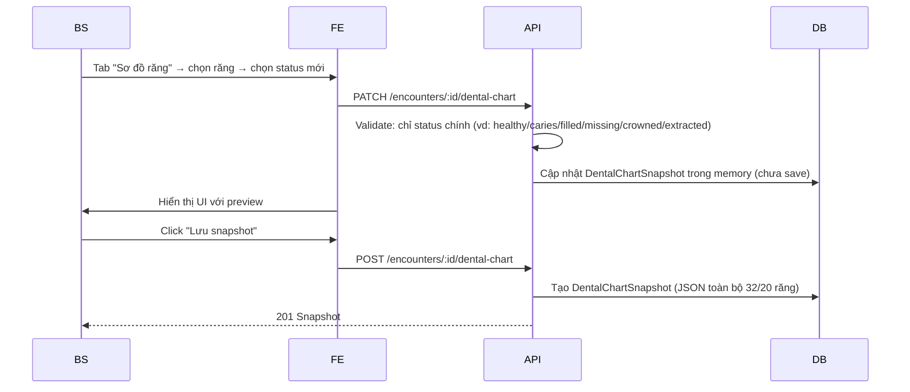
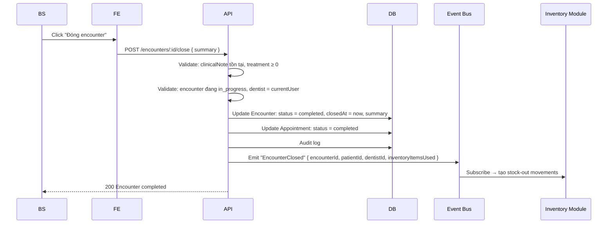
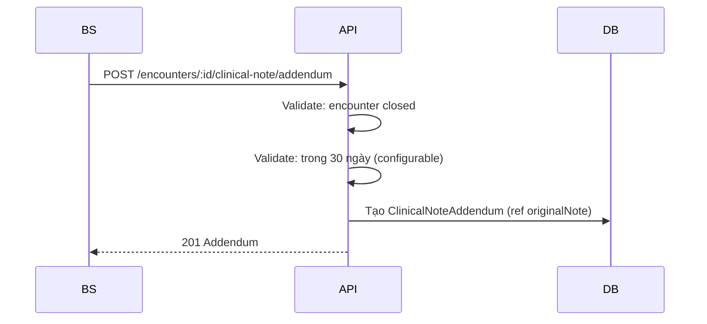

# Blueprint: Medical Records Module

> **Loại tài liệu:** Blueprint (khám phá trước spec).
> **Module:** `MedicalRecords` — Hồ sơ y tế, encounter, clinical note, treatment, prescription, dental chart.

---

## Vấn đề

Phòng khám cần:

1. Lưu lại **hồ sơ y tế** đầy đủ sau mỗi lần khám (theo quy định lưu trữ 10 năm).
2. Bác sĩ **xem lịch sử** bệnh nhân trước khi khám.
3. Ghi **clinical note** (chẩn đoán, chỉ định).
4. Ghi **treatment** (phiếu điều trị từng răng).
5. Kê **prescription** (toa thuốc).
6. Cập nhật **dental chart** (sơ đồ tình trạng từng răng theo thời gian).
7. Khi đóng encounter → tự động trừ kho vật tư đã dùng.

## Phạm vi giả định (Assumptions)

- 1 Appointment ↔ 1 Encounter (BD-0002 đã chốt).
- Clinical Note immutable sau khi encounter closed → chỉ thêm **Addendum** (chốt ở Q1).
- Dental Chart mỗi encounter là 1 snapshot JSON (chốt ở Q2).
- Treatment có field `inventoryItemsUsed` → khi encounter closed emit event `EncounterClosed` → Inventory tự trừ kho (chốt ở Q3).
- Dùng Palmer notation cho ký hiệu răng (Glossary đã định nghĩa).
- BS chỉ thấy encounter mình tạo (row-level).
- Lễ tân **không thấy** clinical note/treatment/prescription.
- Patient không thể bị soft-delete nếu còn encounter.

## Câu hỏi cần trả lời (Open Questions)

Sẽ trả lời chi tiết trong SPEC.md:

1. **ICD-10:** Out of scope MVP (xem business-context.md). BS gõ text tự do.
2. **Prescription template:** Có cho lưu "toa mẫu" để reuse không?
3. **Treatment price:** Treatment lưu `unitPrice` để sinh invoice item, hay chỉ sau này mapping?
4. **Dental Chart cho trẻ em:** Auto-detect age → dùng 20 răng sữa hay 32 răng?
5. **History timeline:** UI hiển thị thế nào? Sort by date desc, có filter theo BS?
6. **Addendum visibility:** Addendum hiển thị ngay sau note gốc, hay phân biệt?
7. **Image attachment:** Out of scope MVP (BD-0005).
8. **Treatment → Invoice item:** Auto-mapping (treatment name = service name) hay manual?

## Workflow dự kiến

### Workflow 1: Mở Encounter (từ Appointment)



### Workflow 2: Trong encounter — ghi clinical note



### Workflow 3: Trong encounter — ghi Treatment



### Workflow 4: Trong encounter — kê Prescription



### Workflow 5: Trong encounter — cập nhật Dental Chart



### Workflow 6: Đóng Encounter



### Workflow 7: Addendum (sau khi đóng)



### Workflow 8: Xem lịch sử BN

```mermaid
sequenceDiagram
  participant Actor
  participant FE
  participant API
  participant DB

  Actor->>FE: Mở BN detail → tab "Lịch sử khám"
  FE->>API: GET /patients/:id/encounters
  API->>API: Validate permission + row-level
  API->>DB: Query encounter sorted by createdAt DESC
  API-->>FE: Danh sách encounter (id, date, dentist, summary)
  Actor->>FE: Click 1 encounter
  FE->>API: GET /encounters/:id
  API-->>FE: Encounter + ClinicalNote + Treatments + Prescription + DentalChartSnapshot
```

## Màn hình dự kiến

| Màn hình | Mục đích | Actor |
| -------- | -------- | ----- |
| Encounter workspace | Màn hình khám chính (tabs: note/treatment/Rx/chart) | BS |
| Clinical note editor | Rich text cho chief complaint / diagnosis / plan | BS |
| Treatment entry | Chọn răng + procedure + giá + vật tư | BS |
| Prescription editor | Thêm dòng thuốc | BS |
| Dental chart UI | Click răng → chọn status | BS |
| Encounter list | Lịch sử encounter của BN | Lễ tân (rút gọn), BS (full), Admin |
| Encounter detail (read-only) | Xem encounter đã đóng | BS, Lễ tân (chỉ date/dentist), Admin |
| Addendum editor | Thêm addendum cho note cũ | BS (của mình) |

## Entity dự kiến

| Entity | Field chính |
| ------ | ----------- |
| **Encounter** | id, appointmentId (unique), patientId, dentistId, status (in_progress/completed/cancelled), startedAt, closedAt, summary, chiefComplaint, diagnosis, treatmentPlanText |
| **ClinicalNote** | id, encounterId (unique), chiefComplaint, diagnosis, treatmentPlan, notes, createdAt, updatedAt |
| **ClinicalNoteAddendum** | id, clinicalNoteId, content, addedBy, addedAt |
| **Treatment** | id, encounterId, toothNumbers (string[]), procedure (text), description, unitPrice, duration (optional) |
| **TreatmentInventoryUsage** | id, treatmentId, inventoryItemId, quantity, unit (cho stock-out) |
| **Prescription** | id, encounterId (unique), notes, createdAt |
| **PrescriptionLine** | id, prescriptionId, drugName, dosage, frequency, duration, instructions, sequence |
| **DentalChartSnapshot** | id, encounterId (unique), patientType (adult/child), teeth (JSON: { "16": "caries", "17": "filled", ... }), snapshotAt |
| **EncounterAudit** | id, encounterId, action, actorId, before (JSON), after (JSON), occurredAt |

## Rule dự kiến (preview)

| Rule ID | Mô tả |
| ------- | ----- |
| BR-MR-001 | 1 Appointment ↔ 1 Encounter (unique FK) |
| BR-MR-002 | Chỉ BS (dentist) của encounter mới sửa được khi status = in_progress |
| BR-MR-003 | Encounter.status chuyển in_progress → completed là 1 chiều |
| BR-MR-004 | Clinical Note immutable sau khi encounter completed |
| BR-MR-005 | Addendum allowed trong 30 ngày sau encounter closed |
| BR-MR-006 | Dental Chart snapshot = JSON toàn bộ 32 răng (adult) hoặc 20 răng sữa (child) |
| BR-MR-007 | Tooth number format: Palmer hoặc FDI (tự nhận dạng) |
| BR-MR-008 | Tooth status ∈ { healthy, caries, filled, missing, crowned, extracted, root_canal, implant, bridge, partial_denture, watch } |
| BR-MR-009 | Treatment ≥ 0 (có thể encounter không có treatment — vd: chỉ tư vấn) |
| BR-MR-010 | Nếu có Treatment có inventoryItemsUsed → khi đóng encounter phải đủ stock |
| BR-MR-011 | Nếu stock không đủ → KHÔNG đóng encounter, trả lỗi BR-MR-010 |
| BR-MR-012 | Prescription ≥ 1 PrescriptionLine |
| BR-MR-013 | Encounter closed chỉ khi có ClinicalNote |
| BR-MR-014 | Addendum không được sửa (immutable) |
| BR-MR-015 | EncounterAudit chỉ append, không update/delete |
| BR-MR-016 | Auto stock-out khi encounter closed (qua event EncounterClosed) |
| BR-MR-017 | Stock-out atomic với encounter close (transaction) |
| BR-MR-018 | Nếu stock-out fail → encounter KHÔNG đóng (rollback) |
| BR-MR-019 | Dental chart chỉ update khi encounter đang in_progress |
| BR-MR-020 | Treatment.toothNumbers có thể rỗng (cho tư vấn toàn hàm) |
| BR-MR-021 | Treatment.unitPrice ≥ 0 |
| BR-MR-022 | Lễ tân thấy encounter nhưng KHÔNG thấy clinical_note/treatment/prescription |

## API dự kiến

| Endpoint | Method | Permission |
| -------- | ------ | ---------- |
| /encounters/:id | GET | `clinical_note.read` / `treatment.read` / `prescription.read` |
| /encounters/:id/clinical-note | GET / PUT | `clinical_note.read` / `.create` (PUT chỉ khi in_progress) |
| /encounters/:id/clinical-note/addendum | POST | `clinical_note.create` (của mình) |
| /encounters/:id/treatments | GET / POST | `treatment.read` / `.create` |
| /encounters/:id/treatments/:tid | GET / PATCH / DELETE | `treatment.read` / `.update` |
| /encounters/:id/prescription | GET / PUT / DELETE | `prescription.read` / `.create` |
| /encounters/:id/prescription/lines | POST | `prescription.create` |
| /encounters/:id/dental-chart | GET / POST | `dental_chart.read` / `.update` |
| /encounters/:id/close | POST | `encounter.close` |
| /encounters/:id/reopen | POST | admin override |
| /encounters | GET | `encounter.read.*` (any hoặc own) |
| /encounters/:id/audit | GET | admin only |

## Rủi ro & giảm thiểu

| Rủi ro | Giảm thiểu |
| ------ | ---------- |
| BS sửa note sau khi đóng → phá audit | BR-MR-004 + addendum pattern |
| Stock không đủ khi đóng encounter | BR-MR-010/011/018 + transaction |
| Dental chart ghi nhầm răng | UI picker rõ ràng + confirmation trước save |
| Encounter có treatment đè giá | Treatment.unitPrice snapshot tại thời điểm ghi (không tự cập nhật theo service catalog) |
| Cross-module coupling cao | Dùng domain event `EncounterClosed` thay vì gọi trực tiếp Inventory module |
| BS xem encounter của BS khác | Row-level filter; admin có thể xem all |
| Performance load 1 BN có 50+ encounter | Index `(patient_id, started_at DESC)`; paginate encounter list |

---

## Tiếp theo

Viết `SPEC.md` đầy đủ 10 mục.