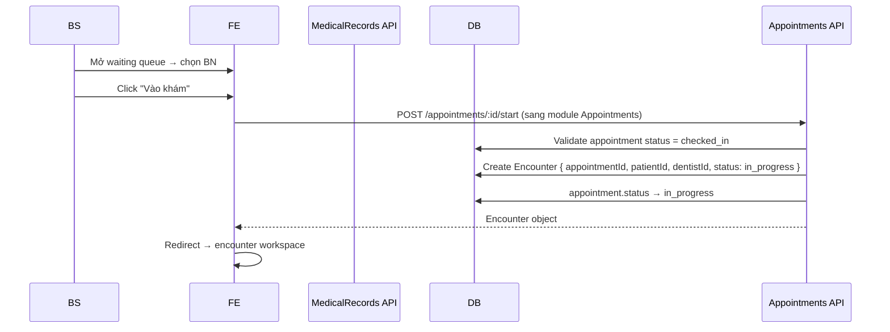
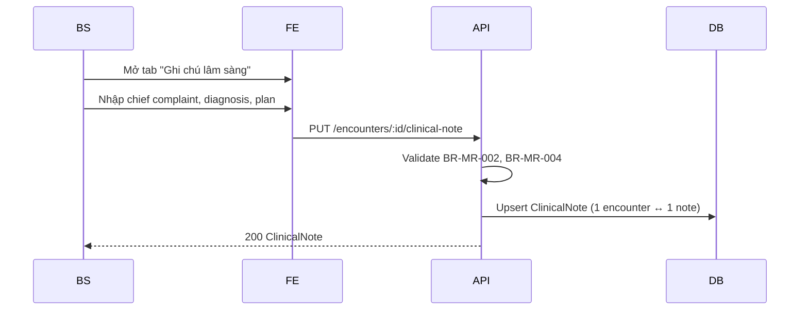
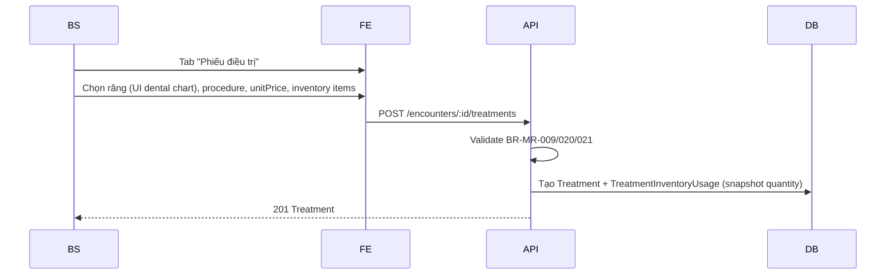
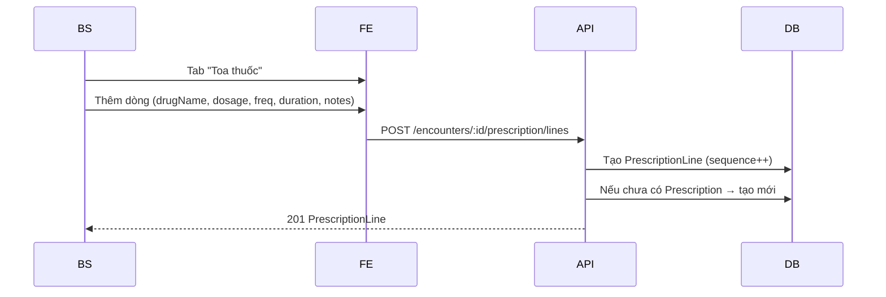
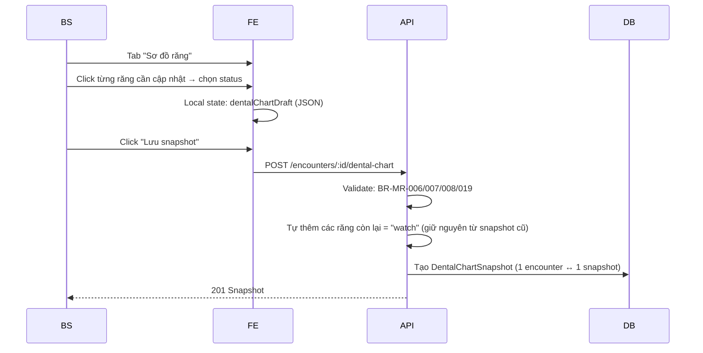
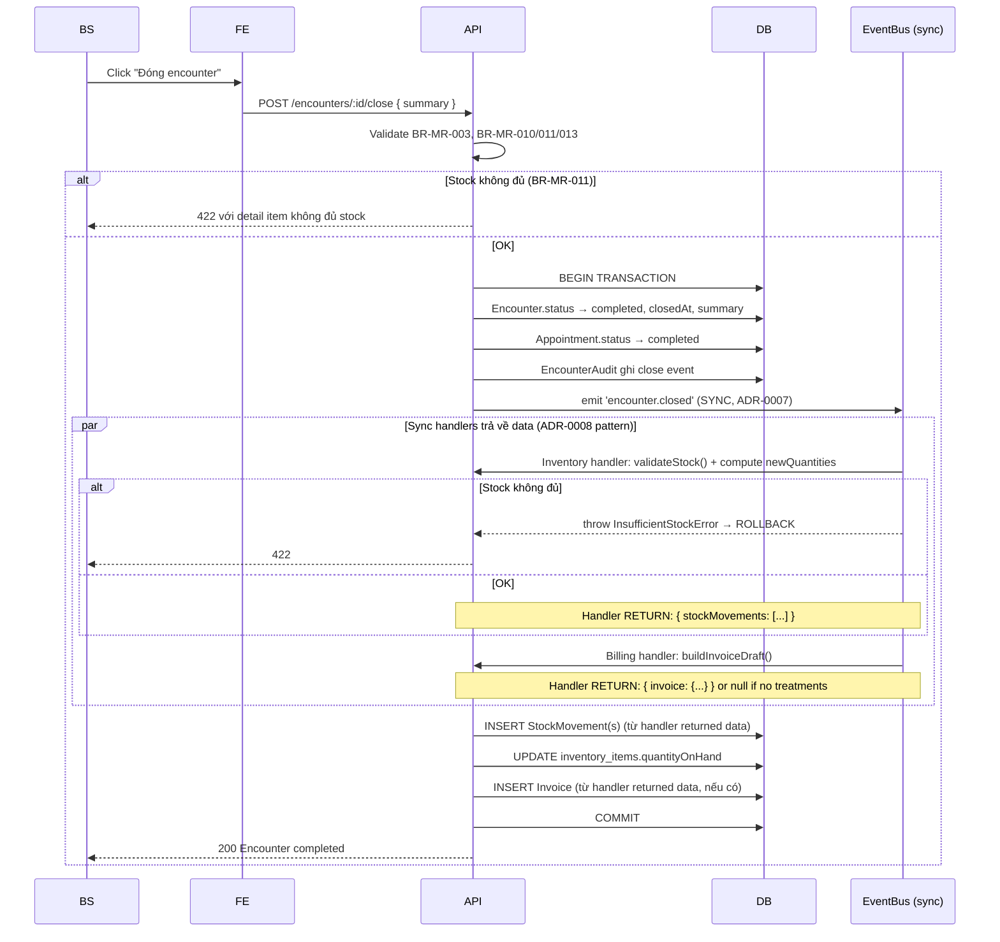
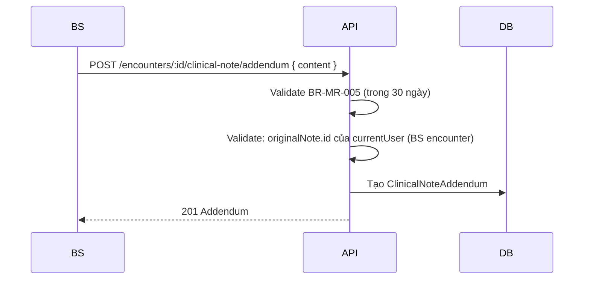

# SPEC — Medical Records Module

> **Module:** `MedicalRecords`
> **Ngày tạo:** 2026-07-13
> **Trạng thái:** Draft (chờ review)
> **Phiên bản:** 1.0
>
> **Đây là spec duy nhất cho module Medical Records.** Mọi implementation, code, test, API đều phải tham chiếu file này.

---

## Tổng quan nhanh

| Phần | Tóm tắt |
| ---- | ------- |
| Purpose | Lưu trữ hồ sơ y tế: encounter, clinical note, treatment, prescription, dental chart |
| Bounded context | Medical Records — module độc lập |
| Modules phụ thuộc | _(không — root entity)_ |
| Được dùng bởi | Billing (đọc Treatment để sinh InvoiceItem) |
| Phát event | `EncounterClosed` (cho Inventory module lắng nghe) |
| Lắng nghe event | _(không)_ |
| Permission riêng | `encounter.*`, `clinical_note.*`, `treatment.*`, `prescription.*`, `dental_chart.*` |

---

## 1. Purpose (Mục đích)

### 1.1 Bối cảnh

Phòng khám cần lưu trữ hồ sơ y tế đầy đủ cho:

1. **Bác sĩ** tham khảo lịch sử trước khi khám.
2. **Compliance:** Tuân thủ Luật Khám chữa bệnh VN 2023 (lưu trữ tối thiểu 10 năm).
3. **Billing:** Treatment ghi nhận sẽ sinh InvoiceItem.
4. **Inventory:** Đóng encounter → tự động trừ vật tư đã dùng.
5. **AI tương lai:** Phân tích xu hướng điều trị, gợi ý lâm sàng (sau MVP).

### 1.2 Phạm vi (Scope)

#### ✅ Có

- Encounter lifecycle (mở → đóng).
- Clinical Note (chief complaint, diagnosis, treatment plan, notes).
- Addendum cho Clinical Note (sau khi đóng encounter).
- Treatment (răng, procedure, giá, vật tư dùng).
- Prescription (toa thuốc, nhiều dòng).
- Dental Chart snapshot JSON cho cả encounter (32 răng người lớn / 20 răng sữa).
- EncounterAudit (log mọi thay đổi).
- Event `EncounterClosed` → Inventory auto stock-out.
- Reopen encounter (admin override, có audit).

#### ❌ Không có ở MVP

- Upload ảnh X-ray / intra-oral (xem BD-0005).
- ICD-10 / SNOMED code (xem business-context.md).
- Voice-to-text cho clinical note (sau MVP).
- AI gợi ý clinical (sau MVP).
- Treatment plan dài hạn nhiều encounter (Glossary: chỉ thêm khi có yêu cầu).
- Template prescription/treatment (chỉ thêm nếu có yêu cầu).
- Integration với PACS / DICOM (sau MVP).

---

## 2. Business Flow (Luồng nghiệp vụ)

### 2.1 Mở Encounter (từ Appointment)



> **Quan trọng:** Endpoint `/appointments/:id/start` thuộc **Appointments module** (vì Appointment là aggregate root của nó). Appointments module phối hợp tạo Encounter trong MedicalRecords qua application service interface — không qua HTTP. Implementation dùng shared event hoặc direct call.

### 2.2 Ghi Clinical Note (trong encounter)



### 2.3 Ghi Treatment



### 2.4 Kê Prescription



### 2.5 Cập nhật Dental Chart



### 2.6 Đóng Encounter (event quan trọng)



> **Quan trọng:** Toàn bộ chain (Encounter update + Appointment update + Stock-out + Invoice draft) chạy trong **1 transaction duy nhất** (BR-MR-018, ADR-0008). Nếu bất kỳ handler nào throw → ROLLBACK toàn bộ.
> Subscribers **trả về data**, publisher INSERTs data trong cùng tx. Xem ADR-0008 cho pattern chi tiết.

### 2.7 Addendum (sau khi đóng)



### 2.8 Xem hồ sơ (read)

```mermaid
sequenceDiagram
  Actor->>FE: Mở BN detail → tab "Lịch sử khám"
  FE->>API: GET /patients/:id/encounters?page=1
  API->>API: Row-level filter (BR-MR-022)
  API->>DB: SELECT ... ORDER BY started_at DESC LIMIT 20
  API-->>FE: Encounter list (rút gọn)

  Actor->>FE: Click encounter
  FE->>API: GET /encounters/:id
  API->>API: Validate permission
  API->>DB: Load encounter + note + treatments + prescription + dental_chart
  API-->>FE: Full encounter object
```

### 2.9 Edge cases thường gặp

| Case | Xử lý |
| ---- | ----- |
| BS mở 2 tab encounter cùng lúc | Optimistic locking (etag/version). Tab 2 phải reload. |
| Network lỗi khi đang lưu | Frontend retry; backend idempotent qua clientRequestId. |
| BS muốn đóng encounter nhưng stock không đủ | BR-MR-011: trả 422 với detail. Có thể xóa Treatment có vật tư rồi đóng. |
| Encounter đã đóng muốn sửa | Addendum pattern. Không sửa trực tiếp. |
| Patient có 50+ encounter | Phân trang. Lazy load encounter detail. |
| BS nghỉ việc, encounter in_progress | Admin có thể force close hoặc reassign. |
| Treatment chưa có vật tư gắn | OK — chỉ ghi dịch vụ, không stock-out. |
| Dental chart người lớn có răng khôn đã nhổ | Status = "missing" trong snapshot. |

---

## 3. Actors

| Actor | Vai trò | Xem chi tiết |
| ----- | ------- | ------------ |
| **Clinic Administrator** | Đọc tất cả, override đóng/mở encounter, xem audit | [`../../01_Architecture/actor-permissions-matrix.md`](../../01_Architecture/actor-permissions-matrix.md) §3.3 |
| **Receptionist** | **KHÔNG** truy cập clinical_note/treatment/prescription. Chỉ xem encounter date + dentist. | |
| **Dentist** | Tạo/sửa encounter của mình (khi in_progress). Đọc encounter của mình hoặc encounter BN mình khám. | |

---

## 4. Screens (Danh sách màn hình)

| Tên màn hình | Mục đích | Primary actor | Route |
| ------------ | -------- | ------------- | ----- |
| Encounter workspace | Màn hình khám chính, tabs Note/Treatment/Rx/Chart | BS | `/encounters/:id` |
| Clinical note editor | Rich text | BS | (tab trong workspace) |
| Treatment entry | Chọn răng + procedure + giá + vật tư | BS | (tab trong workspace) |
| Prescription editor | Dòng thuốc | BS | (tab trong workspace) |
| Dental chart editor | Click răng | BS | (tab trong workspace) |
| Patient encounter list | Lịch sử encounter của BN | BS (own), Admin (all) | `/patients/:code/encounters` |
| Encounter detail (read-only) | Xem encounter đã đóng | BS, Lễ tân (rút gọn), Admin | `/encounters/:id/readonly` |
| Addendum editor | Thêm addendum | BS (của mình) | (modal trong read-only) |
| Encounter audit | Xem lịch sử thay đổi | Admin | `/admin/encounters/:id/audit` |

---

## 5. Entities (Thực thể)

```mermaid
erDiagram
  APPOINTMENT ||--|| ENCOUNTER : "1-1"
  PATIENT ||--o{ ENCOUNTER : "has"
  USER ||--o{ ENCOUNTER : "as dentist"
  ENCOUNTER ||--|| CLINICAL_NOTE : "has"
  CLINICAL_NOTE ||--o{ CLINICAL_NOTE_ADDENDUM : "amended by"
  ENCOUNTER ||--o{ TREATMENT : "contains"
  TREATMENT ||--o{ TREATMENT_INVENTORY_USAGE : "uses"
  ENCOUNTER ||--|| PRESCRIPTION : "has"
  PRESCRIPTION ||--o{ PRESCRIPTION_LINE : "has"
  ENCOUNTER ||--|| DENTAL_CHART_SNAPSHOT : "has"
  ENCOUNTER ||--o{ ENCOUNTER_AUDIT : "logged"

  ENCOUNTER {
    uuid id PK
    uuid appointment_id UK,FK
    uuid patient_id FK
    uuid dentist_id FK
    string status "in_progress | completed | cancelled"
    timestamptz started_at
    timestamptz closed_at
    text summary
    text chief_complaint
    text diagnosis
    text treatment_plan_text
    timestamptz created_at
    timestamptz updated_at
  }

  CLINICAL_NOTE {
    uuid id PK
    uuid encounter_id UK,FK
    text chief_complaint
    text diagnosis
    text treatment_plan
    text notes
    timestamptz created_at
    timestamptz updated_at
    uuid last_edited_by FK
    bool is_locked
  }

  CLINICAL_NOTE_ADDENDUM {
    uuid id PK
    uuid clinical_note_id FK
    text content
    uuid added_by FK
    timestamptz added_at
  }

  TREATMENT {
    uuid id PK
    uuid encounter_id FK
    jsonb tooth_numbers "string[]"
    text procedure
    text description
    decimal unit_price
    int duration_minutes
    timestamptz created_at
    timestamptz updated_at
    uuid created_by FK
  }

  TREATMENT_INVENTORY_USAGE {
    uuid id PK
    uuid treatment_id FK
    uuid inventory_item_id FK
    decimal quantity
    string unit
  }

  PRESCRIPTION {
    uuid id PK
    uuid encounter_id UK,FK
    text notes
    timestamptz created_at
    uuid created_by FK
  }

  PRESCRIPTION_LINE {
    uuid id PK
    uuid prescription_id FK
    int sequence
    string drug_name
    string dosage
    string frequency
    string duration
    text instructions
  }

  DENTAL_CHART_SNAPSHOT {
    uuid id PK
    uuid encounter_id UK,FK
    string patient_type "adult | child"
    jsonb teeth "{\"16\": \"caries\", ...}"
    timestamptz snapshot_at
  }

  ENCOUNTER_AUDIT {
    uuid id PK
    uuid encounter_id FK
    string action
    uuid actor_id FK
    jsonb before
    jsonb after
    timestamptz occurred_at
  }
```

### 5.1 Enum

```text
Encounter.status ∈ { 'in_progress', 'completed', 'cancelled' }

Tooth status ∈ {
  'healthy',
  'caries',
  'filled',
  'missing',
  'crowned',
  'extracted',
  'root_canal',
  'implant',
  'bridge',
  'partial_denture',
  'watch'  // chưa có vấn đề gì nhưng cần theo dõi
}

PatientType ∈ { 'adult' (32 răng), 'child' (20 răng sữa) }
```

---

## 6. Business Rules

| Rule ID | Mô tả | Chi tiết |
| ------- | ----- | -------- |
| BR-MR-001 | 1 Appointment ↔ 1 Encounter | Unique FK `appointment_id` trên Encounter. Tạo qua Appointments `/start`. |
| BR-MR-002 | BS chỉ sửa encounter của mình | `dentist_id == currentUserId`. Admin có thể override. |
| BR-MR-003 | Status encounter 1 chiều | `in_progress → completed` (BR-MR-022: cancelled sau). Không back-step. |
| BR-MR-004 | Clinical Note immutable sau close | `PUT /encounters/:id/clinical-note` 403 nếu encounter đã `completed`. |
| BR-MR-005 | Addendum trong 30 ngày | Sau encounter closed, BS có 30 ngày thêm addendum. Sau đó 403. |
| BR-MR-006 | Dental Chart snapshot format | Adult = 32 răng (key: 11-18, 21-28, 31-38, 41-48 FDI). Child = 20 răng sữa (51-55, 61-65, 71-75, 81-85). |
| BR-MR-007 | Tooth number tự nhận dạng | UI/validator phát hiện Palmer (1-8) hay FDI (11-48), map về FDI nội bộ. |
| BR-MR-008 | Tooth status whitelist | Đúng enum ở §5.1. |
| BR-MR-009 | Treatment ≥ 0 | Encounter có thể không có Treatment (vd: tư vấn). |
| BR-MR-010 | Validate stock khi close | Trước khi đóng, kiểm tra đủ stock cho mọi `TreatmentInventoryUsage`. |
| BR-MR-011 | Stock không đủ → không close | Trả 422 với item detail. Encounter giữ in_progress. |
| BR-MR-012 | Prescription ≥ 1 line | Prescription chỉ lưu khi có ≥ 1 PrescriptionLine. |
| BR-MR-013 | Encounter closed cần ClinicalNote | Validate: encounter có ClinicalNote (BR-MR-013). |
| BR-MR-014 | Addendum immutable | Sau khi thêm, không sửa / xóa. |
| BR-MR-015 | EncounterAudit append-only | Không update/delete. |
| BR-MR-016 | Auto stock-out khi close | Emit event `EncounterClosed` với `inventoryUsages`. |
| BR-MR-017 | Stock-out transaction | Inventory handler chạy trong transaction với encounter close. |
| BR-MR-018 | Stock-out fail → rollback encounter close | Nếu stock-out fail, encounter KHÔNG đóng. |
| BR-MR-019 | Dental chart update chỉ khi in_progress | Snapshot chỉ tạo khi encounter đang in_progress. |
| BR-MR-020 | Treatment.toothNumbers có thể rỗng | Cho tư vấn toàn hàm, tổng quát. |
| BR-MR-021 | Treatment.unitPrice ≥ 0 | decimal(12,2). |
| BR-MR-022 | Receptionist không thấy clinical | Row-level filter: receptionist chỉ thấy `{id, startedAt, dentistName, status}`. |
| BR-MR-023 | Encounter.cancel = soft close | Khi hủy: status = cancelled, ghi reason, KHÔNG tạo stock-out. |
| BR-MR-024 | Reopen chỉ admin | Admin POST `/encounters/:id/reopen` → status = in_progress, có audit log. |
| BR-MR-025 | Patient soft-delete block | Nếu patient đã soft-delete → không cho tạo encounter mới (BR-PT-018). |
| BR-MR-026 | Cascade cancel handler | Subscribe `AppointmentCancelled` event từ Appointments module (ADR-0007, BD-0008). Nếu encounter status = `in_progress` → update status = `cancelled`, ghi `cancelledReason = "appointment cancelled"`. KHÔNG trigger EncounterClosed event, KHÔNG stock-out, KHÔNG tạo Invoice. Handler chạy sync trong cùng transaction với AppointmentService.cancel() (ADR-0008). |

---

## 7. Permissions

> Xem danh sách đầy đủ: [`../../01_Architecture/actor-permissions-matrix.md`](../../01_Architecture/actor-permissions-matrix.md) §3.3

### 7.1 Permission của module Medical Records

| Permission code | Admin | Receptionist | Dentist |
| --------------- | :---: | :----------: | :-----: |
| `encounter.create` | ✅ (qua Appointments) | ❌ | ✅ (qua Appointments) |
| `encounter.read.any` | ✅ | ❌ (rút gọn) | 🔒 (own) |
| `encounter.read.own` | ✅ | ✅ (rút gọn) | ✅ |
| `encounter.close` | ✅ | ❌ | 🔒 (own) |
| `clinical_note.create` | ✅ | ❌ | 🔒 (own encounter) |
| `clinical_note.read` | ✅ | ❌ | 🔒 (own) |
| `clinical_note.update` | ✅ | ❌ | 🔒 (own, khi in_progress) |
| `treatment.create` | ✅ | ❌ | 🔒 (own encounter) |
| `treatment.read` | ✅ | ❌ | 🔒 (own) |
| `treatment.update` | ✅ | ❌ | 🔒 (own, khi in_progress) |
| `prescription.create` | ✅ | ❌ | 🔒 (own encounter) |
| `prescription.read` | ✅ | ❌ | 🔒 (own) |
| `dental_chart.update` | ✅ | ❌ | 🔒 (own, khi in_progress) |
| `dental_chart.read` | ✅ | ❌ | ✅ |

### 7.2 Ma trận endpoint × permission

| Endpoint | Method | Permission |
| -------- | ------ | ---------- |
| `/encounters` | GET | `encounter.read.any` / `.own` |
| `/encounters/:id` | GET | `encounter.read.*` (+ row-level) |
| `/encounters/:id/clinical-note` | GET | `clinical_note.read` |
| `/encounters/:id/clinical-note` | PUT | `clinical_note.update` |
| `/encounters/:id/clinical-note/addendum` | POST | `clinical_note.create` (trong 30 ngày) |
| `/encounters/:id/treatments` | GET | `treatment.read` |
| `/encounters/:id/treatments` | POST | `treatment.create` |
| `/encounters/:id/treatments/:tid` | GET / PATCH / DELETE | `treatment.read` / `.update` |
| `/encounters/:id/prescription` | GET | `prescription.read` |
| `/encounters/:id/prescription` | PUT | `prescription.create` (create-or-replace) |
| `/encounters/:id/prescription/lines` | POST | `prescription.create` |
| `/encounters/:id/prescription/lines/:lid` | PATCH / DELETE | `prescription.update` |
| `/encounters/:id/dental-chart` | GET | `dental_chart.read` |
| `/encounters/:id/dental-chart` | POST | `dental_chart.update` (khi in_progress) |
| `/encounters/:id/close` | POST | `encounter.close` |
| `/encounters/:id/cancel` | POST | `encounter.close` (admin only) |
| `/encounters/:id/reopen` | POST | admin only |
| `/encounters/:id/audit` | GET | admin only |

---

## 8. API

### 8.1 GET `/api/v1/encounters/:id`

**Response 200 (BS view):**

```json
{
  "id": "uuid",
  "appointmentId": "uuid",
  "patient": { "id": "uuid", "code": "PAT-2026-00012", "fullName": "Nguyen Van A" },
  "dentist": { "id": "uuid", "fullName": "Tran Thi C" },
  "status": "completed",
  "startedAt": "2026-07-15T08:00:00Z",
  "closedAt": "2026-07-15T08:30:00Z",
  "summary": "Hàn răng số 16, lấy cao răng",
  "chiefComplaint": "Đau răng hàm trên bên phải",
  "diagnosis": "Sâu răng số 16",
  "treatmentPlanText": "Hàn composite, tái khám 2 tuần",
  "clinicalNote": {
    "id": "uuid",
    "chiefComplaint": "...",
    "diagnosis": "...",
    "treatmentPlan": "...",
    "notes": "...",
    "isLocked": true,
    "addendums": [
      { "id": "uuid", "content": "BN gọi lại 3 ngày sau vẫn đau nhẹ, hẹn tái khám", "addedAt": "...", "addedBy": "Tran Thi C" }
    ]
  },
  "treatments": [
    {
      "id": "uuid",
      "toothNumbers": ["16"],
      "procedure": "Hàn composite",
      "description": "Sâu răng độ III",
      "unitPrice": 300000,
      "durationMinutes": 30,
      "inventoryUsages": [
        { "inventoryItemId": "uuid", "itemName": "Composite A2", "quantity": 0.5, "unit": "g" }
      ]
    }
  ],
  "prescription": {
    "id": "uuid",
    "notes": "Sau khi ăn",
    "lines": [
      { "sequence": 1, "drugName": "Paracetamol 500mg", "dosage": "1 viên", "frequency": "Khi đau, tối đa 3 lần/ngày", "duration": "3 ngày", "instructions": "Uống sau ăn" }
    ]
  },
  "dentalChart": {
    "id": "uuid",
    "patientType": "adult",
    "teeth": { "16": "filled", "17": "healthy", "18": "watch", ... },
    "snapshotAt": "2026-07-15T08:25:00Z"
  }
}
```

**Response 200 (Receptionist view — BR-MR-022):**

```json
{
  "id": "uuid",
  "patient": { "code": "PAT-2026-00012", "fullName": "Nguyen Van A" },
  "dentist": { "fullName": "Tran Thi C" },
  "status": "completed",
  "startedAt": "2026-07-15T08:00:00Z",
  "closedAt": "2026-07-15T08:30:00Z"
  // KHÔNG có chiefComplaint, diagnosis, treatment, prescription, dentalChart
}
```

### 8.2 PUT `/api/v1/encounters/:id/clinical-note`

**Body:**

```json
{
  "chiefComplaint": "...",
  "diagnosis": "...",
  "treatmentPlan": "...",
  "notes": "..."
}
```

**Response 200:** ClinicalNote.

**Response 403 (BR-MR-004):** nếu encounter đã closed.
**Response 403 (BR-MR-002):** nếu currentUser không phải dentist của encounter.

### 8.3 POST `/api/v1/encounters/:id/clinical-note/addendum`

**Body:**

```json
{ "content": "BN gọi lại ngày 18/7 vẫn đau nhẹ, kê thêm..." }
```

**Response 201:** Addendum.

**Response 403 (BR-MR-005):** quá 30 ngày sau close.

### 8.4 POST `/api/v1/encounters/:id/treatments`

**Body:**

```json
{
  "toothNumbers": ["16"],
  "procedure": "Hàn composite",
  "description": "Sâu răng độ III",
  "unitPrice": 300000,
  "durationMinutes": 30,
  "inventoryUsages": [
    { "inventoryItemId": "uuid", "quantity": 0.5, "unit": "g" }
  ]
}
```

**Response 201:** Treatment.

### 8.5 POST `/api/v1/encounters/:id/prescription/lines`

**Body:**

```json
{
  "drugName": "Paracetamol 500mg",
  "dosage": "1 viên",
  "frequency": "Khi đau, tối đa 3 lần/ngày",
  "duration": "3 ngày",
  "instructions": "Uống sau ăn"
}
```

**Response 201:** PrescriptionLine.

### 8.6 POST `/api/v1/encounters/:id/dental-chart`

**Body:**

```json
{
  "patientType": "adult",
  "teeth": { "16": "filled", "17": "healthy" }
}
```

> Service tự merge với snapshot gần nhất (nếu có) — các răng không thay đổi giữ giá trị cũ.

**Response 201:** DentalChartSnapshot.

### 8.7 POST `/api/v1/encounters/:id/close`

**Body:**

```json
{
  "summary": "Hàn răng 16, lấy cao răng 2 hàm"
}
```

**Response 200:** Encounter updated status `completed`.

**Response 422 (BR-MR-011):**

```json
{
  "type": "...",
  "title": "Insufficient stock",
  "status": 422,
  "detail": "Cannot close encounter due to insufficient inventory",
  "errors": [
    { "code": "insufficient_stock", "itemId": "uuid", "itemName": "Composite A2", "required": 0.5, "available": 0.2 }
  ]
}
```

**Response 422 (BR-MR-013):** thiếu ClinicalNote.

### 8.8 POST `/api/v1/encounters/:id/cancel`

**Body:**

```json
{ "reason": "BN yêu cầu dừng do kinh tế" }
```

**Response 200.**

### 8.9 POST `/api/v1/encounters/:id/reopen`

**Body:**

```json
{ "reason": "BS nhờ reopen để bổ sung" }
```

Admin only. Status → in_progress. Audit log.

### 8.10 GET `/api/v1/encounters/:id/audit`

Admin only.

**Response 200:**

```json
{
  "data": [
    {
      "id": "uuid",
      "action": "close",
      "actorId": "uuid",
      "actorName": "Tran Thi C",
      "before": { "status": "in_progress" },
      "after": { "status": "completed", "closedAt": "..." },
      "occurredAt": "2026-07-15T08:30:00Z"
    }
  ]
}
```

---

## 9. Database

### 9.1 Tables summary

| Table | Note |
| ----- | ---- |
| `encounters` | Unique `(appointment_id)`. Index `(patient_id, started_at DESC)`, `(dentist_id, started_at DESC)`. |
| `clinical_notes` | Unique `(encounter_id)`. |
| `clinical_note_addendums` | Index `(clinical_note_id, added_at DESC)`. |
| `treatments` | Index `(encounter_id)`, `(encounter_id, created_at)`. |
| `treatment_inventory_usages` | Index `(treatment_id)`, `(inventory_item_id)`. |
| `prescriptions` | Unique `(encounter_id)`. |
| `prescription_lines` | Index `(prescription_id, sequence)`. |
| `dental_chart_snapshots` | Unique `(encounter_id)`. |
| `encounter_audits` | Append-only. Index `(encounter_id, occurred_at DESC)`. |

### 9.2 Migration

Migration `003_medical_records.sql` + `.md`:

```markdown
# Migration 003 — Medical Records tables

Tạo schema cho module Medical Records theo SPEC.md §5.
- 9 bảng với unique FK constraint cho 1-1 relations.
- Dental chart lưu JSONB (32 hoặc 20 răng).
- EncounterAudit append-only (không có update permission ở application layer).
- Index cho performance query lịch sử BN.
```

---

## 10. Validation & Acceptance Criteria

### 10.1 Validation rules

| Field | Rule | Thông báo |
| ----- | ---- | --------- |
| `chiefComplaint` | ≤ 5000 chars | — |
| `diagnosis` | ≤ 5000 chars | — |
| `treatmentPlan` | ≤ 10000 chars | — |
| `notes` | ≤ 20000 chars | — |
| `toothNumbers` | Array of valid FDI numbers | "Răng không hợp lệ: <number>" |
| `procedure` | Required, 1-200 chars | "Procedure là bắt buộc" |
| `unitPrice` | ≥ 0 | "Đơn giá không hợp lệ" |
| `durationMinutes` | Optional, 1-480 | — |
| `drugName` | Required, 1-200 chars | — |
| `dosage`, `frequency`, `duration` | Required for each line | — |

### 10.2 Acceptance criteria (Gherkin)

```gherkin
Feature: Encounter Lifecycle
  Scenario: Mở encounter từ appointment
    Given appointment status = checked_in
    When BS click "Vào khám"
    Then encounter tạo với status in_progress, dentist = currentUser
    And appointment.status → in_progress

  Scenario: Close encounter thành công
    Given encounter in_progress, có ClinicalNote, không có inventory usage
    When POST /encounters/:id/close
    Then encounter.status = completed
    And appointment.status = completed

  Scenario: Close fail vì stock không đủ
    Given encounter có treatment dùng 0.5g composite, stock hiện tại = 0.2g
    When POST /encounters/:id/close
    Then response 422 với item detail
    And encounter vẫn in_progress
    And KHÔNG có stock-out movement

  Scenario: Stock-out auto sau close thành công
    Given encounter có treatment dùng composite
    When encounter đóng thành công
    Then inventory_items.quantity_on_hand giảm tương ứng
    And stock_movements có 1 row type='stock_out' ref encounter

Feature: Clinical Note Lock
  Scenario: Sửa note sau khi đóng
    Given encounter status = completed
    When PUT /encounters/:id/clinical-note
    Then response 403 "Note is locked"

  Scenario: Addendum trong 30 ngày
    Given encounter closed 5 ngày trước
    When POST /encounters/:id/clinical-note/addendum
    Then response 201

  Scenario: Addendum sau 30 ngày
    Given encounter closed 31 ngày trước
    When POST /encounters/:id/clinical-note/addendum
    Then response 403 "Addendum window expired"

Feature: Dental Chart
  Scenario: Snapshot adult
    Given patient age = 30
    When POST /encounters/:id/dental-chart với 2 răng thay đổi
    Then snapshot có patient_type = adult, teeth chứa 32 răng (merge từ trước)

  Scenario: Snapshot child
    Given patient age = 8
    When POST /encounters/:id/dental-chart
    Then snapshot có patient_type = child, teeth chứa 20 răng sữa

  Scenario: Snapshot không thể update khi encounter closed
    Given encounter completed
    When POST /encounters/:id/dental-chart
    Then response 403 "Encounter not editable"

Feature: Permission
  Scenario: Receptionist xem encounter — không thấy clinical
    Given receptionist R login
    When GET /encounters/:id
    Then response KHÔNG có chiefComplaint, diagnosis, treatment, prescription, dentalChart

  Scenario: Dentist A không thấy encounter của BS B
    Given BS B có encounter X
    When BS A GET /encounters/X
    Then response 403 hoặc 404

Feature: Auto stock-out event
  Scenario: Event được emit
    Given encounter close thành công có inventory usage
    When encounter.status → completed
    Then event "EncounterClosed" được emit
    And Inventory module handler chạy trong < 5s
    And stock_out movement tạo với ref encounterId
```

### 10.3 Test plan

| Layer | Test |
| ----- | ---- |
| Domain | State machine; lock rules |
| Application | Use cases: StartEncounter, UpdateClinicalNote, AddTreatment, CloseEncounter (kèm stock check) |
| Infrastructure | Prisma repo + EventBus in-process test |
| HTTP | Controller via Supertest |
| Event | EncounterClosed → Inventory handler integration test |
| Security | Permission + row-level (BS chỉ thấy own) |
| E2E (sau) | Playwright: full encounter workflow |

### 10.4 Tiêu chí "xong" module Medical Records

- [ ] Spec đã review.
- [ ] Migration `003_medical_records.sql` + `.md`.
- [ ] 9 entities + unit test ≥ 90%.
- [ ] Use cases + state machine validator.
- [ ] EventBus + Inventory integration handler.
- [ ] Stock validation TRONG transaction encounter close.
- [ ] Lock rule cho Clinical Note + addendum.
- [ ] Controller + DTO + Zod + Swagger.
- [ ] Audit log append-only cho encounter.
- [ ] Frontend:
  - [ ] Encounter workspace (4 tabs)
  - [ ] Dental chart picker UI
  - [ ] Addendum editor
  - [ ] Encounter read-only view (rút gọn cho lễ tân)
- [ ] CI pass.

---

## Liên kết

- [`BLUEPRINT.md`](./BLUEPRINT.md) — blueprint trước spec.
- Template: [`../../Templates/MODULE_SPEC_TEMPLATE.md`](../../Templates/MODULE_SPEC_TEMPLATE.md).
- [`../../01_Architecture/actor-permissions-matrix.md`](../../01_Architecture/actor-permissions-matrix.md) §3.3.
- [`../../01_Architecture/business-flow-overview.md`](../../01_Architecture/business-flow-overview.md) — flow #1, #2 dùng Medical Records.
- [`../../01_Architecture/business-decisions.md`](../../01_Architecture/business-decisions.md) — BD-0002 (1-1 Encounter), BD-0005 (clinical v1, không ảnh).
- [`../../02_Glossary/GLOSSARY.md`](../../02_Glossary/GLOSSARY.md).
- ADR: [`../../ADR/0002-modular-monolith.md`](../../ADR/0002-modular-monolith.md) — event-driven ở chỗ cần.
- Spec phụ thuộc:
  - [`../Auth/SPEC.md`](../Auth/SPEC.md)
  - [`../Patients/SPEC.md`](../Patients/SPEC.md)
  - [`../Appointments/SPEC.md`](../Appointments/SPEC.md) — `/appointments/:id/start` tạo Encounter.
- Spec tương lai dùng data:
  - Spec Billing (sẽ viết) — đọc Treatment để sinh InvoiceItem.
  - Spec Inventory (sẽ viết) — lắng nghe `EncounterClosed`.