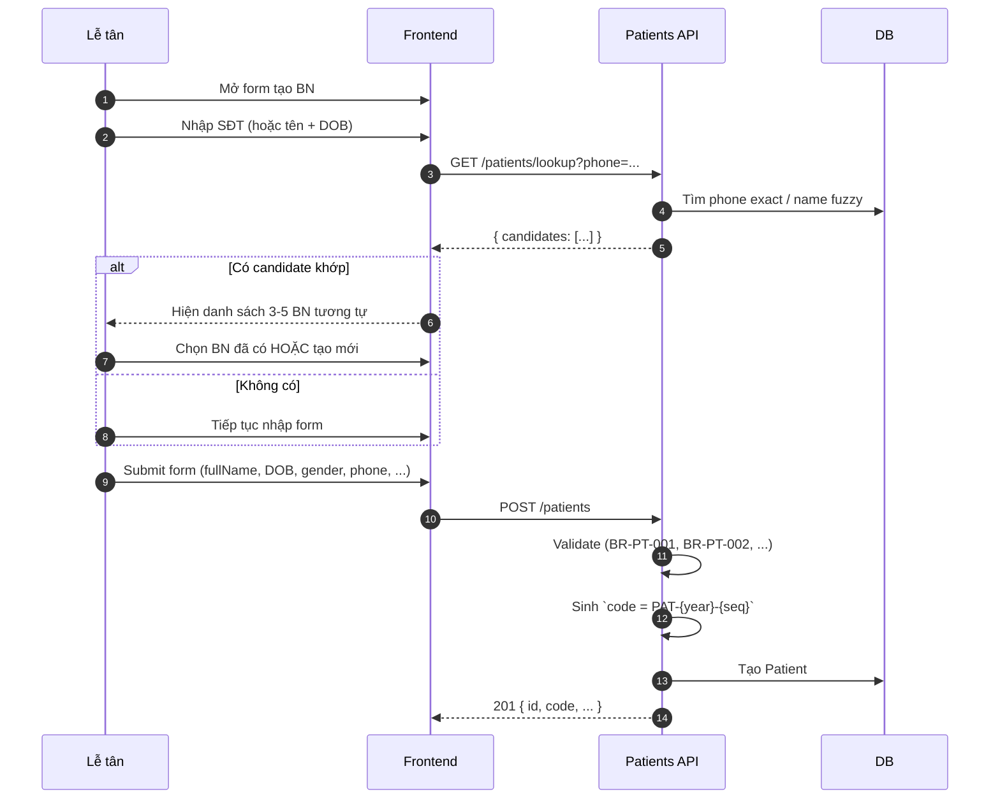
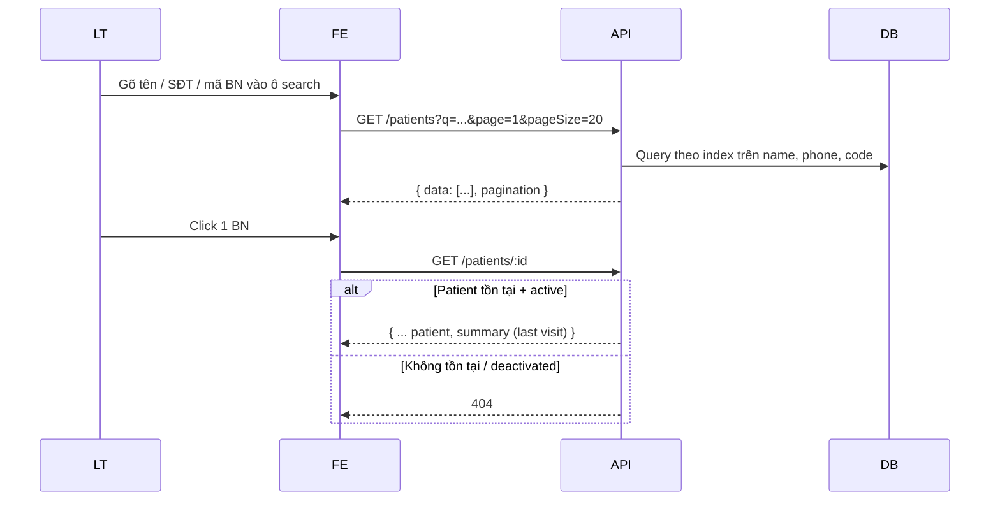
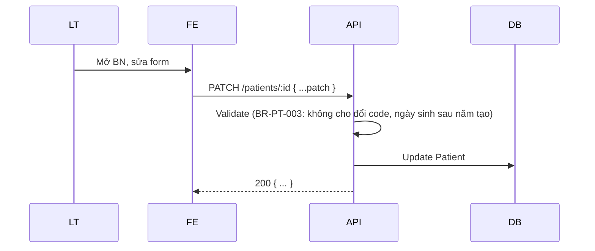
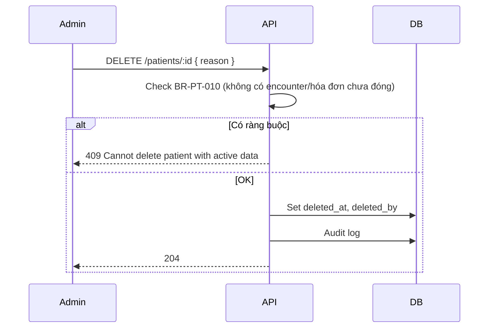
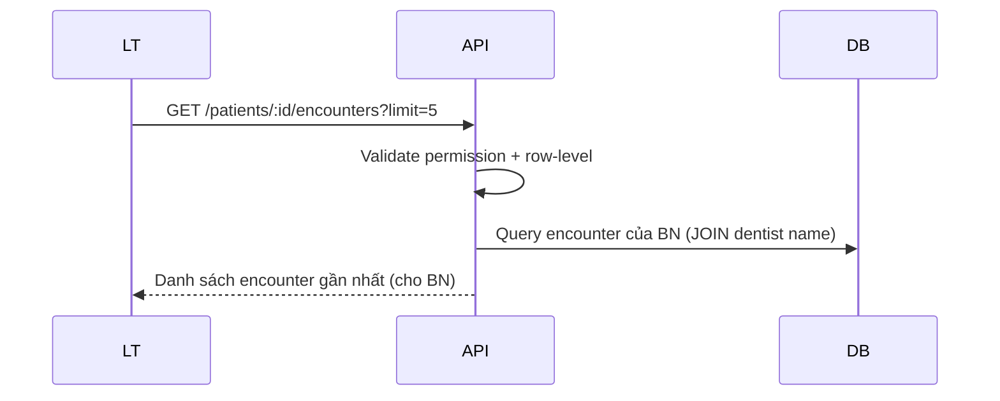

# Blueprint: Patients Module

> **Loại tài liệu:** Blueprint (khám phá trước spec).
> **Module:** `Patients` — Quản lý hồ sơ bệnh nhân.
> **Mục đích:** Khám phá phạm vi trước khi viết SPEC.md đầy đủ.

---

## Vấn đề

Phòng khám cần quản lý thông tin bệnh nhân (hồ sơ cá nhân, lịch sử khám) phục vụ:

1. Lễ tân tra cứu nhanh khi BN đến.
2. Bác sĩ xem lịch sử khám trước đó.
3. Tạo appointment / encounter mà không phải nhập lại.
4. Phục vụ compliance (lưu trữ dài hạn, audit).

## Phạm vi giả định (Assumptions)

- Patient là entity riêng, **KHÔNG phải User** (xem ADR-0003).
- Mỗi Patient có `id` UUID v7 (nội bộ) **+** `code` thân thiện dạng `PAT-YYYY-NNNNN` (xem BD-0006).
- Lưu trữ 10 năm tối thiểu theo luật VN (soft-delete mặc định, xem ADR-0006).
- Hỗ trợ cả người lớn và trẻ em (răng sữa).
- Hỗ trợ Tiếng Việt full (tên, địa chỉ).
- Có thể có nhiều SĐT (mobile, cố định, người thân).
- Lịch sử thay đổi SĐT (audit) — chưa chốt: lưu lịch sử hay chỉ update.

## Câu hỏi cần trả lời (Open Questions)

Sẽ trả lời chi tiết trong SPEC.md. Liệt kê nhanh:

1. **Trùng SĐT:** Cho phép 1 SĐT dùng chung (gia đình) hay unique? → xem BD-0007 (đã chốt: gợi ý, không ép unique).
2. **Lưu lịch sử SĐT:** Update SĐT cũ thành mới, hay giữ cả lịch sử?
3. **Patient phụ thuộc (người thân):** Cho tạo "người liên hệ" riêng hay gộp vào bệnh nhân?
4. **Y tế đặc biệt:** Allergy, chronic disease, medication đang dùng — lưu ở Patient hay MedicalRecord?
5. **CCCD/CMND:** Bắt buộc nhập hay optional? MVP có lưu không?
6. **Địa chỉ:** Cấu trúc hóa (tỉnh/quận) hay text tự do?
7. **Liên hệ khẩn cấp:** Bắt buộc nhập?
8. **Nghề nghiệp:** Có ích cho AI phân tích, có cần không?
9. **Ngày khám gần nhất:** Cache field hay tính động?
10. **Export dữ liệu:** Cần endpoint export CSV/Excel?

## Workflow dự kiến

### Workflow 1: Tạo bệnh nhân mới

### Workflow 2: Tra cứu / xem bệnh nhân

### Workflow 3: Cập nhật thông tin

### Workflow 4: Soft delete

### Workflow 5: Lễ tân xem lịch sử khám (tóm tắt)

## Màn hình dự kiến

| Màn hình | Mục đích | Actor |
| -------- | -------- | ----- |
| Patient list | Danh sách + search/filter | Lễ tân, Admin, BS (giới hạn) |
| Patient detail | Xem chi tiết + lịch sử khám + Dental Chart | Lễ tân, Admin, BS |
| Patient create form | Tạo BN mới | Lễ tân, Admin |
| Patient edit form | Cập nhật | Lễ tân, Admin |
| Patient lookup modal | Tra cứu nhanh (khi tạo appointment) | Lễ tân |
| Patient merge | Gộp 2 BN trùng (nếu có) | Admin |

## Entity dự kiến

| Entity | Field chính |
| ------ | ----------- |
| **Patient** | id (UUID v7), code (PAT-YYYY-NNNNN), fullName, dob, gender, primaryPhone, additionalPhones, email, address, occupation, allergies[], chronicDiseases[], currentMedications, contactPersonName, contactPersonPhone, identityNumber (CCCD/CMND), notes, createdAt, updatedAt, deletedAt, deletedBy |
| **PatientPhoneHistory** | id, patientId, oldPhone, newPhone, changedBy, changedAt |
| **PatientIdentifier** | id, patientId, type (CCCD/CMND/PASSPORT), value, issuedAt, issuedBy |

## Rule dự kiến (preview)

| Rule ID | Mô tả |
| ------- | ----- |
| BR-PT-001 | Code auto-sinh theo format `PAT-{year}-{seq 5 số}`, unique |
| BR-PT-002 | Phone format VN: 10 số, bắt đầu bằng 0, mã nhà mạng hợp lệ (optional MVP) |
| BR-PT-003 | Ngày sinh phải < today, > 1900 |
| BR-PT-004 | Họ tên: 1–200 ký tự, trim, viết hoa chữ cái đầu mỗi từ khi lưu |
| BR-PT-005 | Email format chuẩn nếu có |
| BR-PT-006 | CCCD: 9 hoặc 12 chữ số (Việt Nam) — optional |
| BR-PT-007 | Address text 1–500 ký tự — optional |
| BR-PT-008 | SĐT KHÔNG unique (1 SĐT có thể dùng chung gia đình) |
| BR-PT-009 | Khi update phone → lưu lịch sử (audit) |
| BR-PT-010 | Không xóa cứng patient nếu còn appointment chưa completed hoặc invoice chưa paid |
| BR-PT-011 | Soft-delete patient → giữ lại toàn bộ lịch sử |
| BR-PT-012 | Patient của trẻ em < 12 tuổi: yêu cầu contactPerson |
| BR-PT-013 | Có ít nhất 1 trong 2: phone hoặc contactPersonPhone |
| BR-PT-014 | Lễ tân/Admin xem được toàn bộ BN; Dentist chỉ thấy BN đã từng khám với mình (xem ma trận §3.1) |
| BR-PT-015 | Receptionist thấy BN không có clinical note (row-level filter) |

## API dự kiến

| Endpoint | Method | Permission | Description |
| -------- | ------ | ---------- | ----------- |
| /api/v1/patients/lookup | GET | `patient.read` | Tra cứu nhanh (gợi ý duplicate) |
| /api/v1/patients | GET | `patient.read` | List (paginated, search) |
| /api/v1/patients | POST | `patient.create` | Tạo BN mới |
| /api/v1/patients/:id | GET | `patient.read` | Chi tiết |
| /api/v1/patients/:id | PATCH | `patient.update` | Cập nhật |
| /api/v1/patients/:id | DELETE | `patient.delete` | Soft-delete |
| /api/v1/patients/:id/restore | POST | `patient.delete` | Khôi phục soft-delete |
| /api/v1/patients/:id/phones | GET | `patient.read` | Lịch sử phone |
| /api/v1/patients/:id/encounters | GET | `patient.read` | List encounters (gọi sang Medical Records) |
| /api/v1/patients/:id/invoices | GET | `patient.read` | List invoices (gọi sang Billing) |
| /api/v1/patients/:id/dental-chart | GET | `patient.read` | Dental chart hiện tại (gọi sang Medical Records) |
| /api/v1/patients/merge | POST | `patient.delete` | Gộp 2 BN (admin only) |

## Rủi ro & giảm thiểu

| Rủi ro | Giảm thiểu |
| ------ | ---------- |
| Tạo trùng BN | Lookup gợi ý + validate fuzzy name+dob (BD-0007) |
| Xóa nhầm BN | Soft-delete + restore window (BR-PT-011) |
| Leak thông tin y tế qua BN list | Row-level filter cho dentist; receptionist không thấy clinical_note |
| Phone VN format quá nhiều edge case | MVP chỉ validate format đơn giản (10 số, đầu 0); nâng cấp sau |
| Nhập CCCD nhầm của BN khác | Lookup CCCD trước khi lưu |
| AI đọc sai cấu trúc allergies vs chronic | Phân biệt rõ trong Glossary + Spec |
| Gộp BN có lịch sử khác nhau | Chỉ cho phép merge BN có cùng name+dob, không có encounter khác biệt lớn |

---

## Tiếp theo

Sau khi xác nhận phạm vi → viết `SPEC.md` đầy đủ 10 mục.