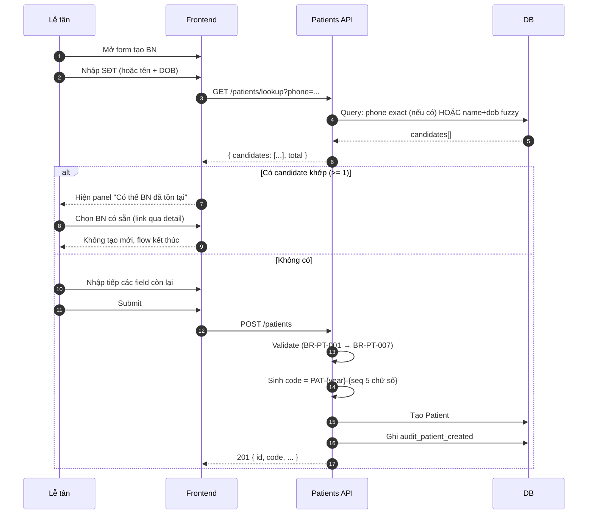
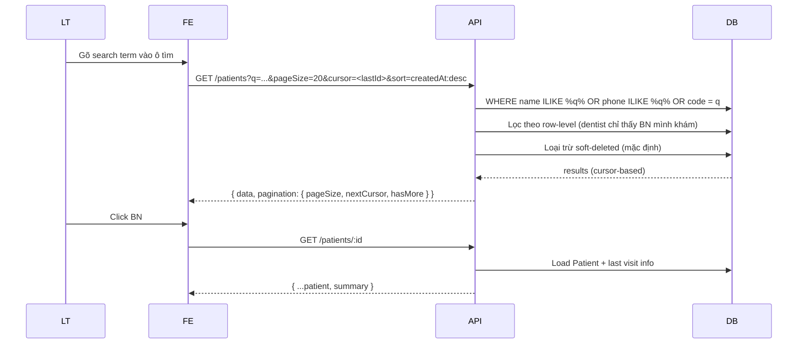
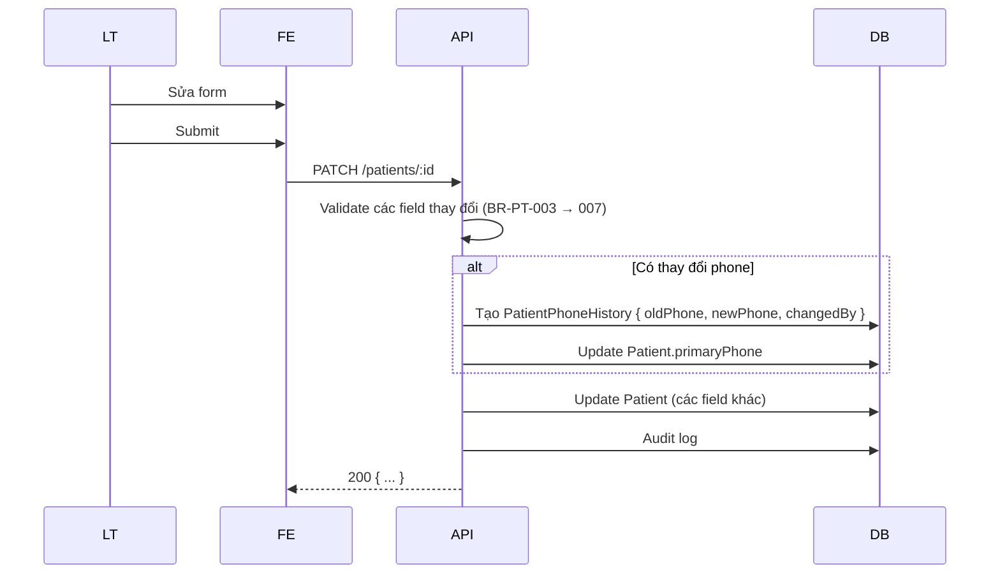
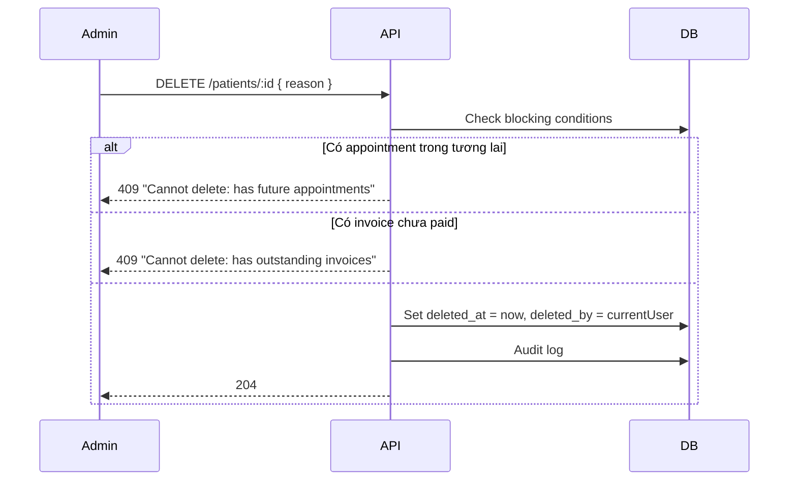
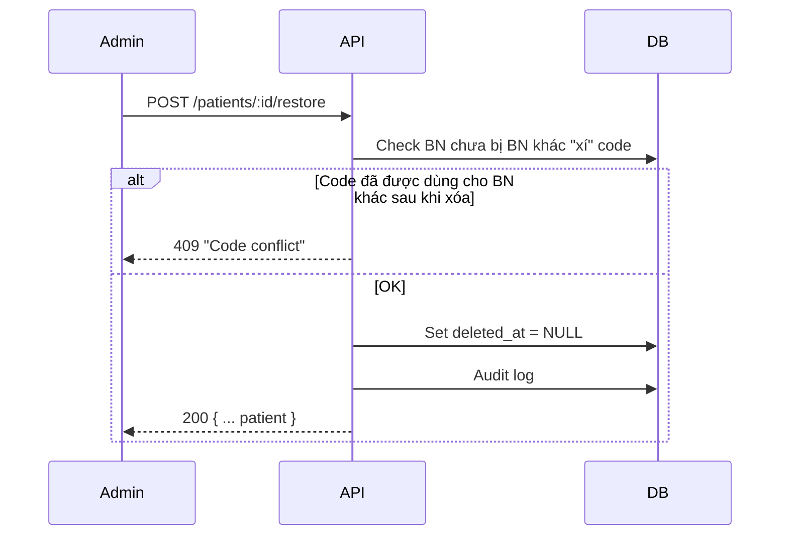
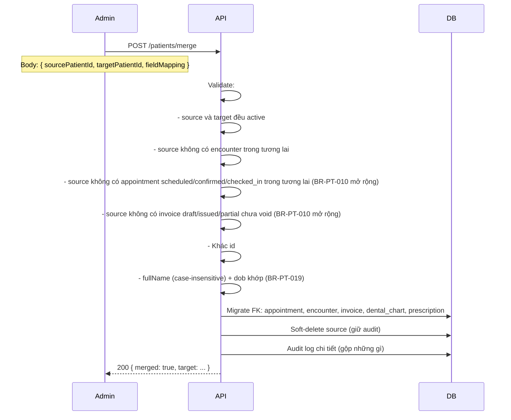
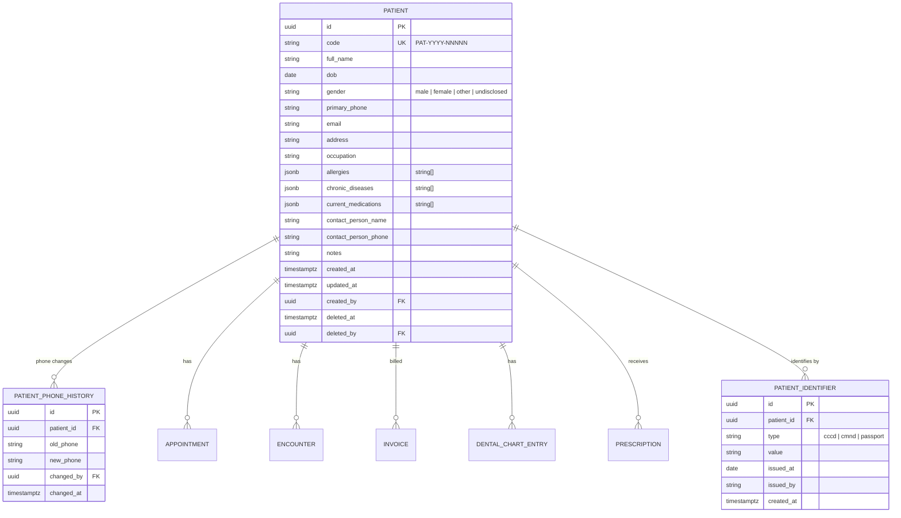

# SPEC — Patients Module

> **Module:** `Patients`
> **Ngày tạo:** 2026-07-13
> **Trạng thái:** Draft (chờ review)
> **Phiên bản:** 1.0
>
> **Đây là spec duy nhất cho module Patients.** Mọi implementation, code, test, API đều phải tham chiếu file này.

---

## Tổng quan nhanh

| Phần | Tóm tắt |
| ---- | ------- |
| Purpose | Quản lý thông tin bệnh nhân (hồ sơ cá nhân) |
| Bounded context | Patients — module độc lập |
| Modules phụ thuộc | _(không — root entity)_ |
| Được dùng bởi | Appointments, Medical Records, Billing |
| Permission riêng | `patient.create`, `patient.read`, `patient.read.basic`, `patient.read.medical_history`, `patient.update`, `patient.delete` |

---

## 1. Purpose (Mục đích)

### 1.1 Bối cảnh

Phòng khám cần quản lý hồ sơ bệnh nhân phục vụ:

1. **Lễ tân tra cứu nhanh** khi bệnh nhân đến (theo SĐT / tên / mã).
2. **Bác sĩ xem lịch sử khám** trước khi vào encounter.
3. **Tạo appointment / encounter** mà không phải nhập lại thông tin.
4. **Compliance:** lưu trữ dài hạn (tối thiểu 10 năm theo Luật Khám chữa bệnh VN 2023).

### 1.2 Phạm vi (Scope)

#### ✅ Có

- CRUD bệnh nhân (create / read / update / soft-delete).
- Mã bệnh nhân `code` tự động theo format `PAT-YYYY-NNNNN` (xem BD-0006).
- Lookup tra cứu nhanh + gợi ý duplicate (xem BD-0007).
- Thông tin cơ bản: họ tên, ngày sinh, giới tính, SĐT, email, địa chỉ, nghề nghiệp.
- Thông tin y tế cơ bản: dị ứng (`allergies`), bệnh nền (`chronicDiseases`), thuốc đang dùng (`currentMedications`).
- Liên hệ khẩn cấp: tên + SĐT.
- CCCD/CMND/Passport (optional).
- Lịch sử SĐT (audit) — khi SĐT bị đổi.
- Soft-delete + restore (xem ADR-0006).
- Liên kết sang encounter / invoice / dental chart (read-only proxy).
- Gộp 2 bệnh nhân trùng (merge) — chỉ admin.

#### ❌ Không có ở MVP

- Upload ảnh đại diện / ảnh CCCD.
- Lưu trữ file scan giấy tờ.
- Đồng bộ với hệ thống bên ngoài (BHXH, eID).
- Địa chỉ cấu trúc hóa (tỉnh/quận/xã) — chỉ text tự do.
- Patient portal / mobile app cho BN tự cập nhật.
- Bệnh nhân đăng ký online tự động tạo record.
- ICD-10 / SNOMED code (xem business-context.md).
- Bảo hiểm y tế / thẻ BHYT.
- Gia đình / liên hệ phức tạp (chỉ 1 contactPerson).

---

## 2. Business Flow (Luồng nghiệp vụ)

### 2.1 Tạo bệnh nhân mới (với lookup duplicate)



**Post-condition:**

- BN mới tồn tại với `code` duy nhất.
- Audit log ghi nhận.
- FE redirect sang chi tiết BN.

### 2.2 Tra cứu & Xem chi tiết



**Post-condition:** FE hiển thị thông tin cơ bản + summary (lần khám gần nhất, BS phụ trách, tổng chi phí năm nay — chỉ nếu có quyền).

### 2.3 Cập nhật thông tin



**Đặc biệt:**

- **Không cho đổi `code`** (immutable sau khi tạo).
- **Không cho đổi `dob`** nếu đã có encounter trước đó (để đảm bảo audit integrity). Admin vẫn có thể override với lý do.
- **Đổi phone** → tự động lưu lịch sử.

### 2.4 Soft-delete & Restore



**Restore** (admin only):



### 2.5 Merge (gộp 2 bệnh nhân trùng)



### 2.6 Edge cases thường gặp

| Case | Xử lý |
| ---- | ----- |
| BN mới nhập SĐT của người nhà | Cho phép. Lookup có thể gợi ý người nhà. Lễ tân xác nhận "đây là người mới". |
| BN nhập tên bằng tiếng Anh | Hỗ trợ unicode. Trim + chuẩn hóa 1 chữ cái đầu viết hoa. |
| BN đổi SĐT liên tục | Lưu lịch sử, giữ SĐT mới nhất làm primary. |
| BN có 2 lần tạo trùng (lỗi) | Admin dùng merge để gộp. |
| BN trẻ em chưa có CCCD | OK, không bắt buộc. |
| BN nước ngoài | Hỗ trợ ký tự unicode. Address tự do. |
| Lễ tân không tìm thấy BN cũ | Tra cứu trong soft-deleted (`includeDeleted=true`, admin only). |
| BN đã tạo > 5 năm, có 50+ encounter | Performance: list vẫn OK. Encounter detail là từng cái. |
| BN chết / rời phòng khám | Soft-delete. Giữ nguyên lịch sử. |

---

## 3. Actors

| Actor | Quyền liên quan | Xem chi tiết |
| ----- | -------------- | ------------ |
| **Clinic Administrator** | Tất cả patient.* | [`../../01_Architecture/actor-permissions-matrix.md`](../../01_Architecture/actor-permissions-matrix.md) §3.1 |
| **Receptionist** | Tạo, đọc cơ bản, cập nhật (không clinical_history) | |
| **Dentist** | Đọc BN mình từng khám, không tạo mới | |

---

## 4. Screens (Danh sách màn hình)

| Tên màn hình | Mục đích | Primary actor | Route dự kiến |
| ------------ | -------- | ------------- | ------------- |
| Patient list | Danh sách + search | Lễ tân, Admin, BS | `/patients` |
| Patient create | Tạo BN (có lookup panel) | Lễ tân, Admin | `/patients/new` |
| Patient detail | Xem chi tiết + lịch sử + summary | Lễ tân, Admin, BS | `/patients/:code` |
| Patient edit | Sửa thông tin cơ bản | Lễ tân, Admin | `/patients/:code/edit` |
| Patient phone history | Xem lịch sử đổi SĐT | Lễ tân, Admin | `/patients/:code/phones` |
| Patient soft-deleted list | List đã xóa + restore | Admin | `/admin/patients/deleted` |
| Patient merge | Form gộp 2 BN | Admin | `/admin/patients/merge` |
| Patient lookup modal | Tra cứu nhanh khi tạo appointment | Lễ tân | (modal) |

> Wireframe chi tiết → `docs/06_UI/` (Giai đoạn 7).

---

## 5. Entities (Thực thể)



### 5.1 Enum

```text
Patient.gender ∈ { 'male', 'female', 'other', 'undisclosed' }
PatientIdentifier.type ∈ { 'cccd', 'cmnd', 'passport' }
```

### 5.2 Audit fields

Mọi table có: `created_at`, `updated_at`, `created_by` (cho Patient).

---

## 6. Business Rules

| Rule ID | Mô tả | Chi tiết |
| ------- | ----- | -------- |
| BR-PT-001 | Code auto-sinh | Format `PAT-{year}-{seq 5 số zero-pad}`. Unique. Reset sequence mỗi năm. |
| BR-PT-002 | Phone format | Optional strict ở MVP. Nếu nhập: 10–11 chữ số, bắt đầu bằng `0` (SĐT VN). Cho phép rỗng. |
| BR-PT-003 | DOB hợp lệ | Phải trước today, sau 1900-01-01. |
| BR-PT-004 | Họ tên | Trim; 1–200 ký tự; bắt buộc. |
| BR-PT-005 | Email | Optional. Nếu có: format RFC 5322. Lưu lowercase. |
| BR-PT-006 | CCCD/CMND/Passport | Optional. CCCD 12 số, CMND 9 số. Unique per type trên **active patients** (DB enforce qua partial unique index). Soft-deleted patient KHÔNG block identifier mới. |
| BR-PT-007 | Address | Optional. Tối đa 500 ký tự. |
| BR-PT-008 | Phone KHÔNG unique | 1 SĐT có thể thuộc nhiều BN (gia đình, đổi SĐT). Lookup sẽ gợi ý. |
| BR-PT-009 | Lưu lịch sử phone | Khi update `primaryPhone`, tạo row `PatientPhoneHistory` (không ghi đè). |
| BR-PT-010 | Soft-delete block | Không soft-delete BN nếu có (a) appointment `scheduled`/`confirmed`/`checked_in` trong tương lai, (b) invoice `draft`/`issued`/`partial` chưa hủy. |
| BR-PT-011 | Soft-delete giữ history | BN soft-delete vẫn còn trong DB. Encounter / invoice không xóa theo. |
| BR-PT-012 | ContactPerson cho trẻ em | Nếu `age < 12` tại thời điểm tạo → bắt buộc có `contactPersonName` + `contactPersonPhone`. |
| BR-PT-013 | Liên hệ tối thiểu | Có ít nhất 1 trong: `primaryPhone`, `contactPersonPhone`. |
| BR-PT-014 | Row-level filter (BS) | Dentist chỉ thấy BN đã từng có encounter do mình phụ trách. |
| BR-PT-015 | Receptionist không thấy medical history | Receptionist có `patient.read.basic` nhưng KHÔNG có `patient.read.medical_history`. |
| BR-PT-016 | Code immutable sau khi tạo | API không nhận `code` trong PATCH. |
| BR-PT-017 | DOB locked sau encounter | Nếu BN đã có ≥ 1 encounter, không cho đổi DOB (chỉ admin override với lý do). |
| BR-PT-018 | Deactivated patient không login | Mặc dù BN không phải user, rule này nhắc nhở: code vẫn bị khóa cho mọi flow tạo appointment/invoice mới nếu BN đã soft-delete (phải restore trước). |
| BR-PT-019 | Merge chỉ cho BN cùng name+dob | Chỉ merge khi `fullName` khớp case-insensitive và `dob` khớp. |
| BR-PT-020 | Merge chỉ 1 chiều | Source → Target. Source bị soft-delete, target giữ lại. Code của target không đổi. |
| BR-PT-021 | Summary field masking | Field trong `summary` ở response GET /patients/:id bị mask theo role (xem §8.5 bảng). Receptionist: chỉ thấy `lastVisitAt`, `lastVisitBy`, `totalEncounters`. Các field tài chính trả về `null`. Quy tắc này enforced ở application service, không qua permission code (vì cùng endpoint). |

---

## 7. Permissions

> Xem danh sách đầy đủ: [`../../01_Architecture/actor-permissions-matrix.md`](../../01_Architecture/actor-permissions-matrix.md) §3.1

### 7.1 Permission của module Patients

| Permission code | Admin | Receptionist | Dentist |
| --------------- | :---: | :----------: | :-----: |
| `patient.create` | ✅ | ✅ | ❌ |
| `patient.read` | ✅ | ✅ | ✅ (row-level filter) |
| `patient.read.basic` | ✅ | ✅ | ✅ |
| `patient.read.medical_history` | ✅ | ❌ | ✅ (row-level) |
| `patient.update` | ✅ | ✅ | ❌ |
| `patient.delete` | ✅ | ❌ | ❌ |

### 7.2 Ma trận endpoint × permission

| Endpoint | Method | Permission |
| -------- | ------ | ---------- |
| `/patients/lookup` | GET | `patient.read` |
| `/patients` | GET | `patient.read` |
| `/patients` | POST | `patient.create` |
| `/patients/:id` | GET | `patient.read` (+ `medical_history` nếu gọi `/encounters`, `/dental-chart`) |
| `/patients/:id` | PATCH | `patient.update` |
| `/patients/:id` | DELETE | `patient.delete` |
| `/patients/:id/restore` | POST | `patient.delete` |
| `/patients/:id/phones` | GET | `patient.read` |
| `/patients/:id/encounters` | GET | `patient.read.medical_history` (proxy Medical Records) |
| `/patients/:id/invoices` | GET | `invoice.read` (own) — kiểm tra riêng |
| `/patients/:id/dental-chart` | GET | `dental_chart.read` (proxy Medical Records) |
| `/patients/merge` | POST | `patient.delete` + `patient.update` (admin role mặc định) |

---

## 8. API

### 8.1 Quy ước chung

- Tất cả endpoints prefix `/api/v1/patients`.
- Auth: yêu cầu access token, trừ đã đăng nhập thì bị reject.
- Lỗi trả theo **RFC 7807** (xem SPEC Auth §8.3).
- Pagination: cursor-based (`?pageSize=20&cursor=<lastId>&sort=createdAt:desc`). Default pageSize=20, max 100. Response: `{ data, pagination: { pageSize, nextCursor, hasMore } }`. Đã thống nhất với api-conventions.md §2.3.

### 8.2 GET `/api/v1/patients/lookup`

Dùng để tra cứu nhanh + gợi ý duplicate khi lễ tân tạo BN mới.

**Query params:**

| Param | Type | Required | Description |
| ----- | ---- | -------- | ----------- |
| `phone` | string | optional | SĐT (exact match) |
| `name` | string | optional | Tên (fuzzy, ILIKE) |
| `dob` | date | optional | Ngày sinh (exact match) |
| `cccd` | string | optional | CCCD/CMND (exact match) |
| `limit` | int | optional | Default 5, max 10 |

**Logic ưu tiên:**

1. Nếu `phone` exact match → trả các BN có `primaryPhone = phone`.
2. Nếu `cccd` exact match → trả các BN có identifier khớp.
3. Nếu `name + dob` → trả các BN khớp cả 2 (case-insensitive).
4. Nếu chỉ `name` → fuzzy match (ILIKE %name%).

**Response 200:**

```json
{
  "candidates": [
    {
      "id": "uuid",
      "code": "PAT-2026-00012",
      "fullName": "Nguyen Van A",
      "dob": "1990-05-12",
      "gender": "male",
      "primaryPhone": "0912345678",
      "lastVisitAt": "2026-06-15T10:00:00Z"
    }
  ],
  "total": 1,
  "matchType": "phone_exact"
}
```

### 8.3 GET `/api/v1/patients`

List với search/filter.

**Query params:**

| Param | Type | Description |
| ----- | ---- | ----------- |
| `q` | string | Search name/phone/code (ILIKE) |
| `gender` | enum | Filter |
| `dobFrom` / `dobTo` | date | Filter theo năm sinh |
| `includeDeleted` | bool | Default false. Admin only. |
| `page`, `pageSize` | int | Pagination |

**Response 200:**

```json
{
  "data": [
    {
      "id": "uuid",
      "code": "PAT-2026-00012",
      "fullName": "Nguyen Van A",
      "dob": "1990-05-12",
      "gender": "male",
      "primaryPhone": "0912345678",
      "createdAt": "2026-01-15T08:00:00Z",
      "lastVisitAt": "2026-06-15T10:00:00Z"
    }
  ],
  "pagination": {
    "pageSize": 20,
    "nextCursor": "uuid-of-last-item-or-null",
    "hasMore": true
  }
}
```

### 8.4 POST `/api/v1/patients`

Tạo BN mới.

**Body:**

```json
{
  "fullName": "Nguyen Van A",
  "dob": "1990-05-12",
  "gender": "male",
  "primaryPhone": "0912345678",
  "email": "a@example.com",
  "address": "123 Le Loi, Q1, TP.HCM",
  "occupation": "Engineer",
  "allergies": ["Penicillin"],
  "chronicDiseases": ["Hypertension"],
  "currentMedications": ["Amlodipine 5mg"],
  "contactPersonName": "Nguyen Thi B",
  "contactPersonPhone": "0987654321",
  "identifiers": [
    { "type": "cccd", "value": "079123456789", "issuedAt": "2021-03-15", "issuedBy": "CA TP.HCM" }
  ],
  "notes": "Lần đầu đến, giới thiệu bởi BS X"
}
```

**Validation:** BR-PT-001 → BR-PT-007, BR-PT-012, BR-PT-013.

**Response 201:**

```json
{
  "id": "uuid",
  "code": "PAT-2026-00045",
  "fullName": "Nguyen Van A",
  "createdAt": "2026-07-13T12:00:00Z"
}
```

**Response 400:** validation error (RFC 7807 với `errors[]`).

**Response 409:** nếu CCCD đã thuộc BN khác đang active (BR-PT-006).

### 8.5 GET `/api/v1/patients/:id`

**Response 200:**

```json
{
  "id": "uuid",
  "code": "PAT-2026-00045",
  "fullName": "Nguyen Van A",
  "dob": "1990-05-12",
  "gender": "male",
  "primaryPhone": "0912345678",
  "email": "a@example.com",
  "address": "123 Le Loi, Q1, TP.HCM",
  "occupation": "Engineer",
  "allergies": ["Penicillin"],
  "chronicDiseases": ["Hypertension"],
  "currentMedications": ["Amlodipine 5mg"],
  "contactPersonName": "Nguyen Thi B",
  "contactPersonPhone": "0987654321",
  "notes": "...",
  "identifiers": [
    { "id": "uuid", "type": "cccd", "value": "079123456789", "issuedAt": "2021-03-15", "issuedBy": "CA TP.HCM" }
  ],
  "summary": {
    "totalEncounters": 5,
    "totalInvoices": 4,
    "totalPaid": 1200000,
    "totalOutstanding": 0,
    "lastVisitAt": "2026-06-15T10:00:00Z",
    "lastVisitBy": "BS. Tran Thi C"
  },
  "createdAt": "2026-01-15T08:00:00Z",
  "updatedAt": "2026-07-13T12:00:00Z",
  "deletedAt": null
}
```

> **Quy tắc visibility của `summary`** (BR-PT-021) — service-layer field masking:
>
> | Field | Admin | Receptionist | Dentist |
> | ----- | :---: | :----------: | :-----: |
> | `lastVisitAt`, `lastVisitBy` | ✅ | ✅ | ✅ |
> | `totalEncounters` | ✅ | ✅ | ✅ (row-level: only own) |
> | `totalInvoices`, `totalPaid`, `totalOutstanding` | ✅ | ❌ | 🔒 (only if `invoice.read.own`) |
>
> Receptionist chỉ thấy `lastVisitAt`, `lastVisitBy`, `totalEncounters` (phần còn lại trả về `null`).
>
> **Ví dụ response cho Receptionist:**
>
> ```json
> {
>   "id": "uuid",
>   "code": "PAT-2026-00045",
>   "fullName": "Nguyen Van A",
>   "dob": "1990-05-12",
>   "gender": "male",
>   "primaryPhone": "0912345678",
>   "email": "a@example.com",
>   "address": "...",
>   "identifiers": [...],
>   "summary": {
>     "totalEncounters": 5,
>     "lastVisitAt": "2026-06-15T10:00:00Z",
>     "lastVisitBy": "BS. Tran Thi C"
>   },
>   "createdAt": "...",
>   "updatedAt": "...",
>   "deletedAt": null
> }
> ```

### 8.6 PATCH `/api/v1/patients/:id`

Body: subset các field từ POST. Không cho gửi `code`, không cho đổi `dob` (trừ admin với reason).

**Response 200:** như GET.

**Response 409 (BR-PT-017):** khi đổi dob và BN đã có encounter.

### 8.7 DELETE `/api/v1/patients/:id`

Soft-delete.

**Body:**

```json
{ "reason": "BN chuyển sang phòng khám khác" }
```

**Response 204.**

**Response 409 (BR-PT-010):**

```json
{
  "type": "https://example.com/probs/patient-delete-conflict",
  "title": "Cannot delete patient",
  "status": 409,
  "detail": "Patient has 2 future appointments and 1 outstanding invoice",
  "errors": [
    { "code": "future_appointment", "count": 2 },
    { "code": "outstanding_invoice", "count": 1 }
  ]
}
```

### 8.8 POST `/api/v1/patients/:id/identifiers`

Thêm CCCD/CMND/Passport sau khi tạo Patient. Permission: `patient.update`.

**Body:**
```json
{
  "type": "cccd",
  "value": "079123456789",
  "issuedAt": "2021-03-15",
  "issuedBy": "CA TP.HCM"
}
```

**Response 201:**
```json
{
  "data": {
    "id": "uuid",
    "type": "cccd",
    "value": "079123456789",
    "issuedAt": "2021-03-15",
    "issuedBy": "CA TP.HCM",
    "createdAt": "2026-07-13T14:00:00Z"
  }
}
```

**Response 409:** CCCD đã thuộc BN khác đang active (BR-PT-006).

**Audit:** `patient_identifier_added`.

### 8.8.1 DELETE `/api/v1/patients/:id/identifiers/:identId`

Xóa identifier. Permission: `patient.update`.

**Response 204.**

**Audit:** `patient_identifier_removed`.

### 8.8 POST `/api/v1/patients/:id/restore`

Khôi phục soft-deleted. Admin only.

**Response 200:** Patient restored.

**Response 409:** code conflict (BR-PT-016 collision).

### 8.9 GET `/api/v1/patients/:id/phones`

Lịch sử SĐT.

**Response 200:**

```json
{
  "data": [
    {
      "id": "uuid",
      "oldPhone": "0901234567",
      "newPhone": "0912345678",
      "changedBy": "Nguyen Van LT",
      "changedAt": "2026-03-01T14:00:00Z"
    }
  ],
  "currentPhone": "0912345678"
}
```

### 8.10 POST `/api/v1/patients/merge`

Admin only.

**Body:**

```json
{
  "sourcePatientId": "uuid",
  "targetPatientId": "uuid",
  "reason": "Duplicate: same person, created twice"
}
```

**Response 200:**

```json
{
  "merged": true,
  "target": { "id": "uuid", "code": "PAT-..." },
  "sourceArchived": { "id": "uuid", "code": "PAT-..." },
  "migrated": {
    "appointments": 3,
    "encounters": 5,
    "invoices": 4,
    "dentalChartEntries": 12,
    "prescriptions": 2
  }
}
```

**Response 409:** nếu không thỏa BR-PT-019, BR-PT-020.

### 8.11 Proxy endpoints (cross-module)

Các endpoint sau **proxy** sang module tương ứng, không lưu data trong Patients module:

| Endpoint | Method | Forward to | Permission | Row-level filter |
| -------- | ------ | ---------- | ---------- | ---------------- |
| `/patients/:id/encounters` | GET | Medical Records | `encounter.read.any` (Admin/BS của BN) hoặc `encounter.read.own` (BS chỉ của mình) | Theo `dentist_id` của Encounter, KHÔNG theo patient filter (BS có thể xem encounter của BN do BS khác tạo nếu trong cùng phòng khám) |
| `/patients/:id/dental-chart` | GET | Medical Records | `dental_chart.read` | Theo encounter: nếu patient chưa có encounter → 404. Nếu có → trả chart của encounter gần nhất. Dentist chỉ xem encounter mình tạo |
| `/patients/:id/invoices` | GET | Billing | `invoice.read.any` (Admin/Receptionist) hoặc `invoice.read.own` (Dentist) | Admin/Receptionist: tất cả. Dentist: chỉ invoices liên quan encounter của mình (BR-BILL-003) |

**BR-PT-022 (Proxy permission rules):**
1. Proxy endpoint **KHÔNG** inherit `patient.read.*` permission — phải có permission của module target.
2. Row-level filter áp dụng ở module target, độc lập với patient row-level filter.
3. Nếu patient đã soft-delete: trả 404 (proxy không truy cập được data của soft-deleted BN trừ khi `includeDeleted=true` query param).
4. Audit log: ghi `proxy.{module}.read` để phân biệt với direct access.

---

## 9. Database

### 9.1 Tables summary

| Table | Note |
| ----- | ---- |
| `patients` | Xem ERD ở §5. Index: `code` (unique), `primary_phone`, `full_name` (trigram), `(dob, full_name)` composite. |
| `patient_phone_histories` | Index `(patient_id, changed_at DESC)`. |
| `patient_identifiers` | Unique `(patient_id, type, value)`. **Cross-patient partial unique index** `WHERE patient.deleted_at IS NULL` trên `(type, value)` — đảm bảo CCCD chỉ thuộc 1 BN active. |

### 9.2 Indexes

| Index | Column | Purpose |
| ----- | ------ | ------- |
| `idx_patients_code` | `code` (unique) | Tra cứu nhanh theo mã |
| `idx_patients_phone` | `primary_phone` | Lookup |
| `idx_patients_name_trgm` | `full_name` (gin trgm_ops) | Fuzzy search |
| `idx_patients_dob_name` | `(dob, full_name)` | Exact match + check duplicate |
| `idx_patients_deleted_at` | `deleted_at` | Lọc active/soft-deleted |

> Cần extension `pg_trgm` để dùng gin trigram.

### 9.3 Sequence cho code

Dùng database sequence per-year:

```sql
CREATE SEQUENCE patient_code_seq_2026 START 1;
```

Hoặc 1 sequence chung + công thức format trong application. Recommendation: **1 sequence chung** (reset không cần thiết vì format đã chứa năm) — đơn giản hơn, không phải tạo sequence mỗi năm. Code vẫn unique.

### 9.4 Migration

Migration `001_patients.sql` tạo 3 table + indexes + sequence.
Migration `.md` mô tả nghiệp vụ:

```markdown
# Migration 001 — Patients tables

Tạo schema cho module Patients theo SPEC.md §5.
- Bảng patients với audit fields + soft-delete.
- Bảng patient_phone_histories để audit đổi SĐT.
- Bảng patient_identifiers cho CCCD/CMND/Passport.
- Index cho lookup performance.
```

---

## 10. Validation & Acceptance Criteria

### 10.1 Validation rules

| Field | Rule | Thông báo |
| ----- | ---- | --------- |
| `fullName` | Required, 1–200 chars, trim | "Họ tên là bắt buộc" |
| `dob` | Date, < today, > 1900-01-01 | "Ngày sinh không hợp lệ" |
| `gender` | Enum | "Giới tính không hợp lệ" |
| `primaryPhone` | Optional. Nếu có: 10–11 chữ số, đầu `0` | "Số điện thoại không hợp lệ" |
| `email` | Optional. RFC 5322 nếu có | "Email không hợp lệ" |
| `address` | Optional. ≤ 500 chars | — |
| `identifiers[].value` (CCCD) | 12 số | "CCCD phải 12 số" |
| `identifiers[].value` (CMND) | 9 số | "CMND phải 9 số" |
| `contactPersonName` + `contactPersonPhone` | Required nếu BN < 12 tuổi | "BN nhỏ hơn 12 tuổi cần người liên hệ" |
| `primaryPhone` hoặc `contactPersonPhone` | ≥ 1 trong 2 | "Cần ít nhất 1 số liên lạc" |

### 10.2 Acceptance criteria (Gherkin)

```gherkin
Feature: Patient Creation
  Scenario: Tạo BN mới thành công
    Given lễ tân đã login
    When POST /patients với data hợp lệ
    Then response 201
    And response.code có format PAT-YYYY-NNNNN
    And response.code unique trong DB
    And DB có audit log "patient_created"

  Scenario: Lookup gợi ý duplicate
    Given có BN "Nguyen Van A" với phone 0912345678
    When lễ tân gõ phone 0912345678 vào lookup
    Then response trả về candidate có cùng phone
    And UI hiển thị panel "Có thể BN đã tồn tại"

  Scenario: Tạo BN thiếu phone + contactPerson
    When POST /patients không có primaryPhone, contactPersonPhone
    Then response 400 với error code "missing_contact"

  Scenario: Tạo BN < 12 tuổi thiếu contactPerson
    Given dob = 2020-01-01 (age = 6)
    When POST /patients không có contactPersonName
    Then response 400 với error code "missing_contact_for_minor"

  Scenario: Đổi phone → lưu lịch sử
    Given BN có primaryPhone = "0901234567"
    When PATCH /patients/:id với primaryPhone = "0912345678"
    Then response 200
    And DB có 1 row patient_phone_histories với old/new
    And patient.primary_phone = "0912345678"

  Scenario: Soft-delete BN có future appointment
    Given BN có 1 appointment scheduled trong tương lai
    When DELETE /patients/:id
    Then response 409 với detail future_appointment count

  Scenario: Soft-delete BN clean → thành công
    Given BN không có appointment tương lai, không có invoice outstanding
    When DELETE /patients/:id
    Then response 204
    And patient.deleted_at != null

  Scenario: Restore BN bị soft-delete
    When POST /patients/:id/restore
    Then response 200
    And patient.deleted_at = null

  Scenario: Dentist chỉ thấy BN mình đã khám
    Given dentist D chỉ từng khám 1 BN
    When GET /patients
    Then response chỉ chứa BN đó

  Scenario: Receptionist không thấy summary medical
    When GET /patients/:id (lễ tân)
    Then response.summary không chứa totalEncounters/clinical info

  Scenario: Merge 2 BN trùng
    Given source BN (chỉ có 2 encounter cũ) và target BN (BN chính)
    When POST /patients/merge với source, target
    Then target có thêm 2 encounter (FK migrated)
    And source bị soft-delete
    And response.migrated đếm đúng
```

### 10.3 Test plan

| Layer | Test |
| ----- | ---- |
| Domain | Entity invariants (DOB, gender, contact rule) |
| Application | Use cases: CreatePatient, UpdatePatient, DeletePatient, MergePatients, LookupPatients |
| Infrastructure | Prisma repo integration test |
| HTTP | Controller via Supertest: lookup → create → patch → delete → restore → merge |
| Security | Permission check (mỗi permission code); row-level filter cho dentist |
| E2E (sau) | Playwright: tạo BN mới, lookup duplicate, soft-delete, merge |

### 10.4 Tiêu chí "xong" module Patients

- [ ] Spec đã review + chốt ở file này.
- [ ] Migration `001_patients.sql` + `.md`.
- [ ] Domain entities (Patient, PhoneHistory, Identifier) + unit test ≥ 90%.
- [ ] Use cases + unit test (mock repo).
- [ ] Controller + DTO + Zod validation + Swagger annotation.
- [ ] Service sinh `code` theo BR-PT-001.
- [ ] Service `LookupPatients` đúng logic ưu tiên (phone > cccd > name+dob > name).
- [ ] Row-level filter cho dentist (test thực tế).
- [ ] Frontend:
  - [ ] Patient list với search debounce
  - [ ] Patient create form có lookup panel
  - [ ] Patient detail với summary
  - [ ] Phone history view
  - [ ] Soft-delete (admin)
  - [ ] Restore (admin)
  - [ ] Merge (admin)
- [ ] Audit log cho: create, update, delete, restore, merge, phone change.
- [ ] CI pass.
- [ ] Integration test với 1 phòng khám mock chạy full flow.

---

## Liên kết

- [`BLUEPRINT.md`](./BLUEPRINT.md) — bản blueprint dùng để khám phá trước khi viết spec.
- Template: [`../../Templates/MODULE_SPEC_TEMPLATE.md`](../../Templates/MODULE_SPEC_TEMPLATE.md).
- [`../../01_Architecture/actor-permissions-matrix.md`](../../01_Architecture/actor-permissions-matrix.md) §3.1 — RBAC.
- [`../../01_Architecture/business-flow-overview.md`](../../01_Architecture/business-flow-overview.md) — flow #1, #2 dùng Patients.
- [`../../01_Architecture/business-decisions.md`](../../01_Architecture/business-decisions.md) — BD-0006, BD-0007 quyết định chính của module.
- [`../../02_Glossary/GLOSSARY.md`](../../02_Glossary/GLOSSARY.md).
- ADR liên quan:
  - [`../../ADR/0003-patient-is-not-user.md`](../../ADR/0003-patient-is-not-user.md) — Patient ≠ User.
  - [`../../ADR/0005-id-strategy.md`](../../ADR/0005-id-strategy.md) — UUID v7.
  - [`../../ADR/0006-soft-delete.md`](../../ADR/0006-soft-delete.md) — soft-delete mặc định.
- Spec phụ thuộc:
  - [`../Auth/SPEC.md`](../Auth/SPEC.md) — authentication.
  - Spec Appointments (sẽ viết) — ref `patientId`.
  - Spec Medical Records (sẽ viết) — ref `patientId`.
  - Spec Billing (sẽ viết) — ref `patientId`.
- API spec chi tiết (Giai đoạn 6): `docs/05_API/patients.md` _(sẽ viết)_.
- UI spec (Giai đoạn 7): `docs/06_UI/screens/patients-*.md` _(sẽ viết)_.