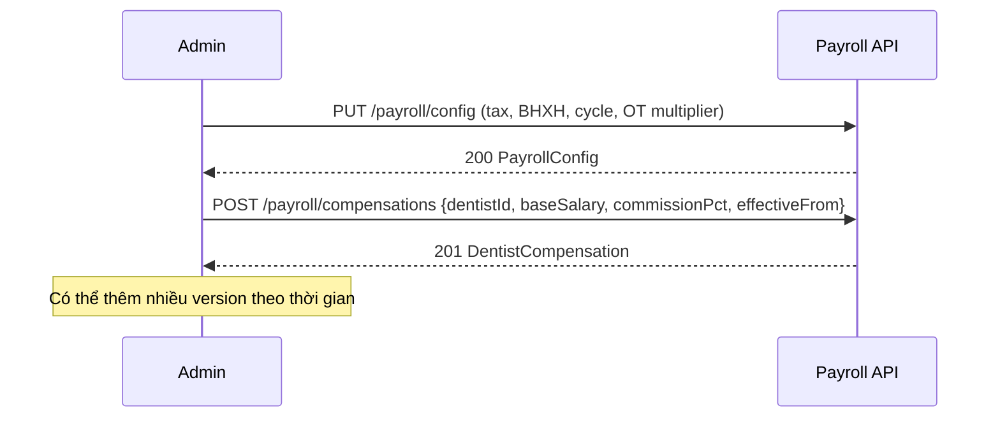
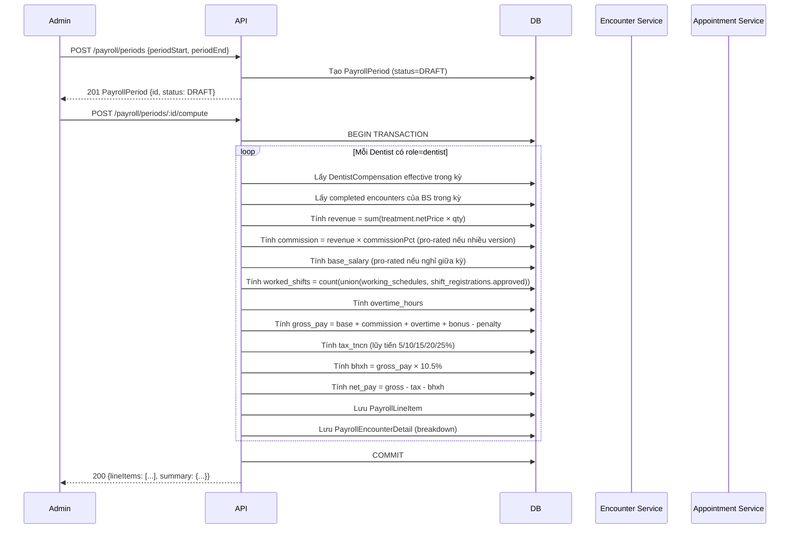
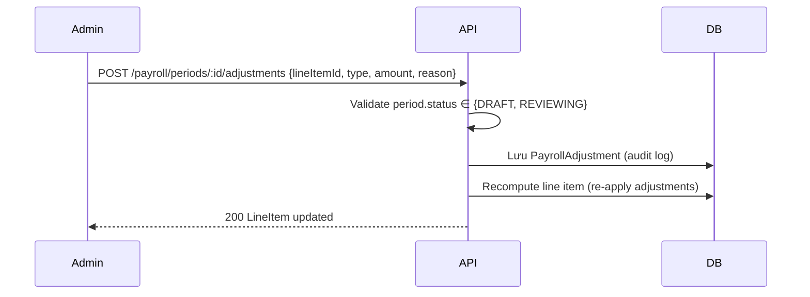
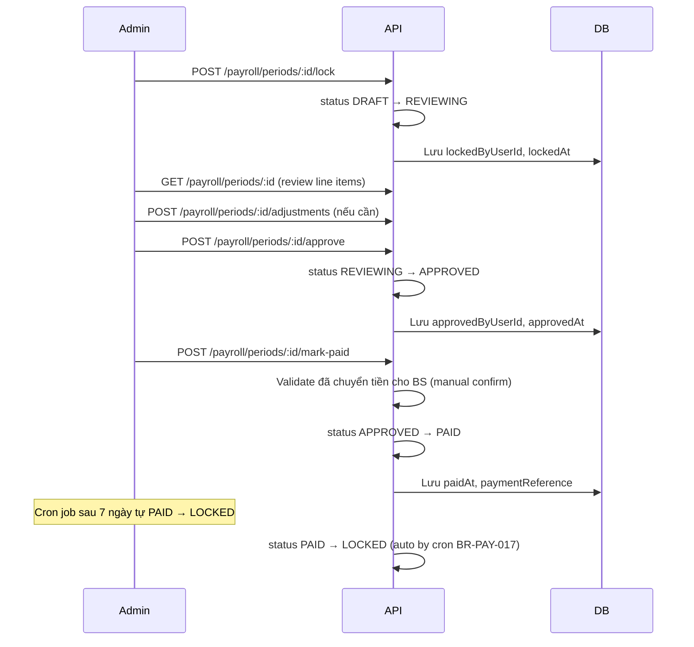
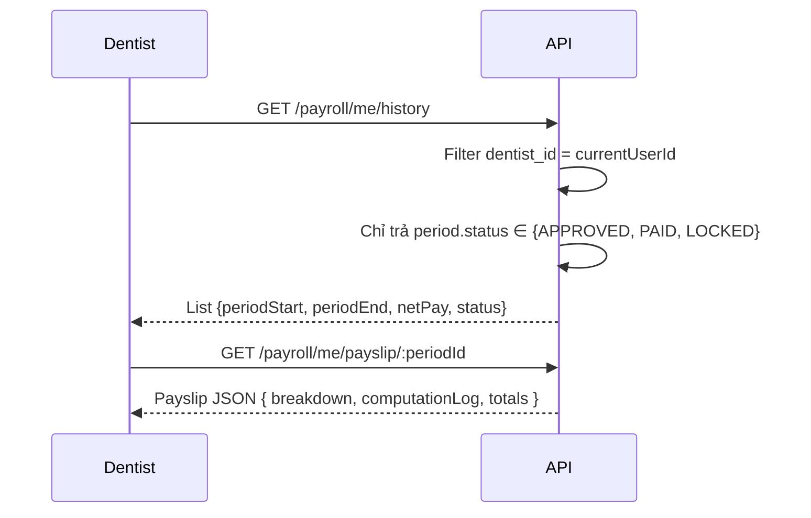
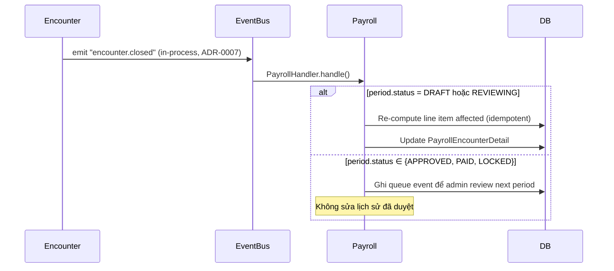

# SPEC — Payroll Module

> **Module:** `Payroll`
> **Ngày tạo:** 2026-07-15
> **Trạng thái:** Draft (chờ review)
> **Phiên bản:** 1.0
>
> **Đây là spec duy nhất cho module Payroll.** Mọi implementation, code, test, API đều phải tham chiếu file này.
> Tham khảo: BD-0009 (mô hình HYBRID base + commission), BD-0010 (ca làm việc cố định + tự đăng ký).

---

## Tổng quan nhanh

| Phần | Tóm tắt |
| ---- | ------- |
| Purpose | Tính lương bác sĩ hàng tháng (lương nền + commission), quản lý kỳ lương, phát payslip. |
| Bounded context | Payroll — module độc lập |
| Modules phụ thuộc | Auth (User), Appointments (WorkingSchedule, ShiftRegistration, Appointment), Medical Records (Encounter, Treatment), Billing (Invoice, Payment) |
| Được dùng bởi | _(admin-only, BS xem own)_ |
| Permission riêng | `payroll.*`, `payslip.*`, `shift.*` |

---

## 1. Purpose (Mục đích)

### 1.1 Bối cảnh

Phòng khám cần:

1. **Cấu hình chính sách lương** cho từng BS (lương nền + % commission, có thể thay đổi theo thời gian).
2. **Tính lương tự động** hàng tháng dựa trên doanh thu treatment đã hoàn thành + ca làm việc thực tế.
3. **Khấu trừ thuế TNCN + BHXH** theo quy định VN hiện hành.
4. **Duyệt & khóa kỳ lương** theo quy trình 5 bước (DRAFT → REVIEWING → APPROVED → PAID → LOCKED).
5. **Phát payslip** cho BS xem lịch sử lương của mình.
6. **Audit log** mọi thao tác (lương là dữ liệu PII).

### 1.2 Phạm vi (Scope)

#### ✅ Có (MVP)

- Cấu hình `PayrollConfig` (tax rate, BHXH, overtime multiplier, cycle).
- `DentistCompensation` với effective dating (lương nền + commission %).
- Tính lương tự động theo cycle monthly.
- Pro-rate khi BS nghỉ việc / thay đổi compensation giữa kỳ.
- Manual adjustments (bonus/penalty/deduction) với audit.
- State machine kỳ lương: DRAFT → REVIEWING → APPROVED → PAID → LOCKED.
- Payslip view cho BS (own only).
- Audit log mọi action.

#### ❌ Không có ở MVP

- Tích hợp ngân hàng (auto disbursement).
- Payslip PDF (chỉ JSON view).
- Multi-currency (chỉ VND).
- Payroll cho non-dentist staff (lễ tân, admin) — chỉ BS.
- Commission cho invoice khác ngoài treatment (vd: thuốc, vật tư).
- Split commission cho multi-BS encounter (chỉ BS chính được commission).
- Tự động tạo kỳ lương khi đến hạn (admin phải tạo tay, cron chỉ nhắc).

---

## 2. Business Flow (Luồng nghiệp vụ)

### 2.1 Setup chính sách lương (Initial Setup)



**Post-condition:** Mỗi BS có ít nhất 1 DentistCompensation active.

### 2.2 Tính lương kỳ (Compute Payroll)



**Post-condition:** Period vẫn ở DRAFT nhưng đã có line items. Có thể re-compute nhiều lần.

### 2.3 Manual adjustment



### 2.4 Duyệt & Khóa kỳ lương



**Post-condition:** Kỳ lương LOCKED = immutable, lưu vĩnh viễn.

### 2.5 BS xem lương của mình



### 2.6 Auto update từ event (re-compute in-place)



### 2.7 Edge cases thường gặp

| Case | Xử lý |
| ---- | ----- |
| Encounter completed sau khi period PAID | Event handler ghi queue, admin manual review kỳ tiếp theo. |
| Invoice refund sau khi tính lương | Tạo PayrollAdjustment DEDUCTION kỳ tiếp theo. |
| BS nghỉ việc giữa kỳ | Pro-rate base salary theo ngày làm việc (BR-PAY-012). |
| Config tax thay đổi giữa kỳ | Snapshot config tại periodStart. Re-compute trong DRAFT mới dùng config mới. |
| Compensation cũ hết hạn, mới active cùng kỳ | Pro-rate theo số ngày (BR-PAY-013). |
| Encounter có 2 BS | Tính cho cả 2 theo `performedByUserId`. Verify sum(commission) ≤ revenue (chống gian lận). |
| Period overlap (admin tạo 2 kỳ overlap) | 422 "Period overlap". |
| BS không có encounter trong kỳ | Vẫn tạo line item với base_salary + 0 commission. Không tính OT. |
| Manual adjustment số âm | OK (penalty > bonus). Audit. |
| Re-compute trên kỳ PAID | 422 "Period is immutable". |

---

## 3. Actors

| Actor | Vai trò với module | Xem chi tiết |
| ----- | ------------------ | ------------ |
| **Clinic Administrator** | Toàn quyền: cấu hình, tạo kỳ, compute, duyệt, khóa, adjust | [`../../01_Architecture/actor-permissions-matrix.md`](../../01_Architecture/actor-permissions-matrix.md) §3.9 |
| **Receptionist** | Duyệt ShiftRegistration (permission `shift.approve`). Không có quyền payroll. | §3.8 |
| **Dentist** | Đăng ký ca tự do (own). Xem lương của mình (own). Xem compensation của mình (own). | §3.8, §3.9 |

---

## 4. Screens (Danh sách màn hình)

| Tên màn hình | Mục đích | Primary actor | Route dự kiến |
| ------------ | -------- | ------------- | ------------- |
| Payroll config | Cấu hình tax, BHXH, cycle, OT | Admin | `/admin/payroll/config` |
| Compensation list | Danh sách chính sách lương các BS | Admin | `/admin/payroll/compensations` |
| Compensation editor | Tạo/sửa chính sách 1 BS | Admin | `/admin/payroll/compensations/:dentistId` |
| Period list | Danh sách kỳ lương | Admin | `/admin/payroll/periods` |
| Period detail | Xem line items + breakdown | Admin | `/admin/payroll/periods/:id` |
| Period compute trigger | Modal trigger compute | Admin | (modal) |
| Manual adjustment | Form thêm bonus/penalty | Admin | (modal) |
| Period approve/paid actions | Action bar (lock, approve, mark-paid) | Admin | (component) |
| My payroll history | Lịch sử lương của BS | Dentist | `/my-payroll` |
| My payslip | Xem phiếu lương chi tiết | Dentist | `/my-payroll/:periodId` |
| My compensation | Xem chính sách lương của mình | Dentist | `/my-compensation` |

> Wireframe chi tiết → `docs/06_UI/` (Phase 9 — sẽ viết).

---

## 5. Entities (Thực thể)

```mermaid
erDiagram
  USER ||--o{ DENTIST_COMPENSATION : "has policy"
  USER ||--o{ PAYROLL_LINE_ITEM : "receives"
  USER ||--o{ SHIFT_REGISTRATION : "self-registers" (mod Appointments)
  USER ||--o{ PAYROLL_ADJUSTMENT : "adjusted by"

  PAYROLL_CONFIG ||--|| PAYROLL_CONFIG : "singleton"
  PAYROLL_PERIOD ||--o{ PAYROLL_LINE_ITEM : "contains"
  PAYROLL_LINE_ITEM ||--o{ PAYROLL_ENCOUNTER_DETAIL : "details"
  PAYROLL_LINE_ITEM ||--o{ PAYROLL_ADJUSTMENT : "manual"

  PAYROLL_CONFIG {
    uuid id PK
    string payroll_cycle "WEEKLY|BIWEEKLY|MONTHLY (default MONTHLY)"
    decimal overtime_multiplier "default 1.5"
    decimal default_tax_tncn_pct "snapshot khi period khởi tạo"
    decimal bhxh_pct "8%"
    decimal bhyt_pct "1.5%"
    decimal bhtn_pct "1%"
    decimal min_gross_for_bhxh "lương tối thiểu đóng BHXH"
    decimal probation_salary_pct "thử việc × 85%"
    json tax_brackets_json "lũy tiến 5/10/15/20/25%"
    uuid updated_by_user_id FK
    timestamptz updated_at
  }

  DENTIST_COMPENSATION {
    uuid id PK
    uuid dentist_id FK
    date effective_from
    date effective_to "nullable, exclusive"
    decimal base_salary_vnd
    decimal commission_pct "0.0 - 1.0"
    decimal overtime_hourly_vnd
    uuid approved_by_user_id FK
    timestamptz approved_at
    string notes
    timestamptz created_at
    timestamptz updated_at
  }

  PAYROLL_PERIOD {
    uuid id PK
    date period_start
    date period_end
    string payroll_cycle
    string status "DRAFT|REVIEWING|APPROVED|PAID|LOCKED"
    uuid created_by_user_id FK
    timestamptz created_at
    uuid locked_by_user_id FK
    timestamptz locked_at
    uuid approved_by_user_id FK
    timestamptz approved_at
    uuid marked_paid_by_user_id FK
    timestamptz paid_at
    string payment_reference
    timestamptz locked_immutable_at
  }

  PAYROLL_LINE_ITEM {
    uuid id PK
    uuid payroll_period_id FK
    uuid dentist_id FK
    int encounters_count
    bigint total_revenue_vnd
    int worked_shifts
    decimal total_hours
    decimal overtime_hours
    bigint base_salary_vnd "pro-rated"
    bigint commission_vnd
    bigint overtime_pay_vnd
    bigint bonus_vnd
    bigint penalty_vnd
    bigint gross_pay_vnd
    bigint tax_tncn_vnd
    bigint bhxh_vnd
    bigint net_pay_vnd
    json computation_log "breakdown từng BR"
    boolean manually_adjusted
    string adjustment_note
    timestamptz computed_at
    timestamptz updated_at
  }

  PAYROLL_ENCOUNTER_DETAIL {
    uuid id PK
    uuid payroll_line_item_id FK
    uuid encounter_id FK
    bigint treatment_revenue_vnd
    timestamptz encounter_start_at
    timestamptz encounter_end_at
    int duration_minutes
    json treatment_breakdown
  }

  PAYROLL_ADJUSTMENT {
    uuid id PK
    uuid payroll_line_item_id FK
    string type "BONUS|PENALTY|DEDUCTION|MANUAL_OVERRIDE"
    bigint amount_vnd "có thể âm cho penalty"
    string reason
    uuid adjusted_by_user_id FK
    timestamptz adjusted_at
  }
```

### 5.1 Status enums

```text
PayrollPeriod.status ∈ {
  'DRAFT',       -- vừa tạo, có thể (re)compute
  'REVIEWING',   -- đã lock, admin review/manual adjust
  'APPROVED',    -- đã duyệt, immutable (chỉ tính toán)
  'PAID',        -- đã trả tiền cho BS
  'LOCKED'       -- immutable forever (cron auto sau 7 ngày PAID)
}

PayrollAdjustment.type ∈ {
  'BONUS',             -- thưởng (+)
  'PENALTY',           -- phạt (-)
  'DEDUCTION',         -- khấu trừ (vd: tạm ứng) (-)
  'MANUAL_OVERRIDE'    -- sửa tay net_pay (BR-PAY-018, cần reason rõ)
}
```

---

## 6. Business Rules

| Rule ID | Mô tả | Chi tiết |
| ------- | ----- | -------- |
| BR-PAY-001 | Cycle | Payroll cycle mặc định MONTHLY. Có thể config WEEKLY/BIWEEKLY trong `PayrollConfig`. |
| BR-PAY-002 | Period boundaries | Period start = ngày 1 (monthly), period end = ngày cuối tháng (inclusive). |
| BR-PAY-003 | Period không overlap | Hai period active không được overlap date range (BR unique index). |
| BR-PAY-004 | Auto-create period | Cron hàng ngày 00:00 check nếu thiếu period cho tháng hiện tại → tạo DRAFT (BR-PAY-004 cron). Admin vẫn có thể tạo tay trước. |
| BR-PAY-005 | Commission base | Commission = `treatment.unitPriceCents × qty × commissionPct` cho encounter status=completed, đã đóng trong kỳ. |
| BR-PAY-006 | Effective dating | Compensation lấy theo version có `effective_from <= encounter.closedAt < effective_to`. |
| BR-PAY-007 | Pro-rate compensation | Nếu nhiều compensation version trong kỳ → pro-rate theo số ngày áp dụng (BR-PAY-013). |
| BR-PAY-008 | Pro-rate base salary | BS nghỉ việc giữa kỳ (deactivate date != period_start) → base_salary × `(days_worked / days_in_period)`. |
| BR-PAY-009 | Thuế TNCN lũy tiến | Áp dụng bậc lũy tiến VN (giảm trừ gia cảnh 11 triệu/người/tháng). Bậc: 5% (≤5tr), 10% (5-10tr), 15% (10-18tr), 20% (18-32tr), 25% (>32tr). Snapshot trong `PayrollConfig.tax_brackets_json` để update theo NĐ. |
| BR-PAY-010 | BHXH + BHYT + BHTN | Tổng 10.5% trên `min(gross_pay, 20 × lương cơ sở)` (trần đóng). Lương cơ sở cập nhật theo NĐ. |
| BR-PAY-011 | Overtime | Worked hours > `standard_hours_per_week × weeks_in_period` × `overtime_multiplier` → OT pay. |
| BR-PAY-012 | Net pay formula | `net_pay = gross_pay - tax_tncn - bhxh_total - other_deductions + adjustments`. |
| BR-PAY-013 | Pro-rate rules | Days overlap dùng inclusive bounds. Pro-rate = `actual_days / period_days`. |
| BR-PAY-014 | Late cancel penalty | Nếu ShiftRegistration bị cancel < N giờ trước giờ ca (N config = 24) → admin có thể tạo PayrollAdjustment PENALTY. |
| BR-PAY-015 | No-show BS | Nếu BS không đến ca (no ca nào completed encounter hôm đó, dù có appointment) → không tính lương ca đó. Admin có thể penalty (BR-PAY-015 manual). |
| BR-PAY-016 | Audit log | Mọi action trên Payroll (create period, compute, adjust, approve, mark-paid, view payslip) đều audit log với `actor`, `target`, `before`, `after`. |
| BR-PAY-017 | Auto-lock after PAID | 7 ngày sau PAID → cron tự LOCKED. Immutable. |
| BR-PAY-018 | MANUAL_OVERRIDE | Nếu admin dùng type=MANUAL_OVERRIDE → bắt buộc `reason` ≥ 50 ký tự + audit riêng. |
| BR-PAY-019 | Re-open period | Sau PAID/LOCKED muốn sửa → admin tạo "Adjustment period" (BR-PAY-019) chứ không sửa trực tiếp. |
| BR-PAY-020 | Shift conflict | WorkingSchedule và ShiftRegistration overlap giờ → reject (BD-0010). |
| BR-PAY-021 | Ca không tính lương | Ca có `isPaidShift = false` HOẶC status `PENDING/REJECTED/CANCELLED` HOẶC BS no-show → không tính. |
| BR-PAY-022 | Idempotent compute | Re-run compute trên period DRAFT → xóa hết line item cũ + tạo mới. Không duplicate. |
| BR-PAY-023 | Config snapshot | Mỗi period snapshot `PayrollConfig` lúc tạo period. Re-compute sau config change KHÔNG thay đổi kỳ đã tạo. |
| BR-PAY-024 | Payslip redaction | BS chỉ xem payslip của mình. Admin xem tất cả. Receptionist không xem lương. |

---

## 7. Permissions

> Xem danh sách đầy đủ: [`../../01_Architecture/actor-permissions-matrix.md`](../../01_Architecture/actor-permissions-matrix.md) §3.8, §3.9

### 7.1 Permission của module Payroll

| Permission code | Admin | Receptionist | Dentist |
| --------------- | :---: | :----------: | :-----: |
| `payroll.read.any` | ✅ | ❌ | ❌ |
| `payroll.read.own` | ✅ | ❌ | ✅ |
| `payroll.config.read` | ✅ | ❌ | ❌ |
| `payroll.config.update` | ✅ | ❌ | ❌ |
| `payroll.compensation.read` | ✅ | ❌ | 🔒 (own) |
| `payroll.compensation.update` | ✅ | ❌ | ❌ |
| `payroll.period.create` | ✅ | ❌ | ❌ |
| `payroll.period.compute` | ✅ | ❌ | ❌ |
| `payroll.period.adjust` | ✅ | ❌ | ❌ |
| `payroll.period.lock` | ✅ | ❌ | ❌ |
| `payroll.period.approve` | ✅ | ❌ | ❌ |
| `payroll.period.mark_paid` | ✅ | ❌ | ❌ |
| `payslip.read.own` | ✅ | ❌ | ✅ |
| `payslip.read.any` | ✅ | ❌ | ❌ |
| `shift.register` | 🔒 (own) | ❌ | 🔒 (own) |
| `shift.read.any` | ✅ | ✅ | ❌ |
| `shift.read.own` | ✅ | ❌ | ✅ |
| `shift.approve` | ✅ | ✅ | ❌ |
| `shift.cancel` | ✅ | ❌ | 🔒 (own, ≥24h) |

### 7.2 Ma trận endpoint × permission

| Endpoint | Method | Permission | Note |
| -------- | ------ | ---------- | ---- |
| `/payroll/config` | GET | `payroll.config.read` | |
| `/payroll/config` | PUT | `payroll.config.update` | Singleton |
| `/payroll/compensations` | GET | `payroll.compensation.read` | Filter by own if dentist |
| `/payroll/compensations` | POST | `payroll.compensation.update` | |
| `/payroll/compensations/:id` | PATCH | `payroll.compensation.update` | |
| `/payroll/compensations/:id` | DELETE | `payroll.compensation.update` | Soft delete (set effective_to = today) |
| `/payroll/periods` | GET | `payroll.read.any` | |
| `/payroll/periods` | POST | `payroll.period.create` | |
| `/payroll/periods/:id` | GET | `payroll.read.any` | Full breakdown |
| `/payroll/periods/:id/compute` | POST | `payroll.period.compute` | Idempotent |
| `/payroll/periods/:id/adjustments` | POST | `payroll.period.adjust` | Body has lineItemId + type + amount + reason |
| `/payroll/periods/:id/lock` | POST | `payroll.period.lock` | DRAFT → REVIEWING |
| `/payroll/periods/:id/approve` | POST | `payroll.period.approve` | REVIEWING → APPROVED |
| `/payroll/periods/:id/mark-paid` | POST | `payroll.period.mark_paid` | APPROVED → PAID + payment reference |
| `/payroll/periods/:id/adjustments/:adjId` | DELETE | `payroll.period.adjust` | Period phải DRAFT/REVIEWING |
| `/payroll/me/history` | GET | `payroll.read.own` | Row-level filter |
| `/payroll/me/payslip/:periodId` | GET | `payslip.read.own` | Period phải APPROVED+ |
| `/payroll/me/compensation` | GET | `payroll.compensation.read` | Effective hôm nay |
| `/payroll/me/preview` | GET | `payroll.read.own` | Ước tính current draft period |
| `/shifts/registrations` | GET | `shift.read.*` | Filter by own if dentist |
| `/shifts/registrations` | POST | `shift.register` | Dentist: own; Admin: any |
| `/shifts/registrations/:id` | GET | `shift.read.*` | |
| `/shifts/registrations/:id/approve` | POST | `shift.approve` | PENDING → APPROVED |
| `/shifts/registrations/:id/reject` | POST | `shift.approve` | PENDING → REJECTED (with reason) |
| `/shifts/registrations/:id/cancel` | POST | `shift.cancel` | Own + ≥24h trước giờ ca |

---

## 8. API

### 8.1 PUT `/api/v1/payroll/config`

**Body:**
```json
{
  "payrollCycle": "MONTHLY",
  "overtimeMultiplier": 1.5,
  "defaultTaxTncnPct": 0.10,
  "bhxhPct": 0.08,
  "bhytPct": 0.015,
  "bhtnPct": 0.01,
  "minGrossForBhxh": 4680000,
  "probationSalaryPct": 0.85,
  "taxBrackets": {
    "personalDeductionVnd": 11000000,
    "brackets": [
      { "thresholdVnd": 5000000, "rate": 0.05 },
      { "thresholdVnd": 10000000, "rate": 0.10 },
      { "thresholdVnd": 18000000, "rate": 0.15 },
      { "thresholdVnd": 32000000, "rate": 0.20 },
      { "thresholdVnd": null, "rate": 0.25 }
    ]
  }
}
```

**Response 200:** `PayrollConfig`. Singleton (chỉ 1 row).

### 8.2 POST `/api/v1/payroll/compensations`

**Body:**
```json
{
  "dentistId": "uuid",
  "effectiveFrom": "2026-08-01",
  "effectiveTo": null,
  "baseSalaryVnd": 15000000,
  "commissionPct": 0.30,
  "overtimeHourlyVnd": 200000,
  "notes": "Khởi điểm BS A"
}
```

**Response 201:** `DentistCompensation`.

**Validation:**
- BR-PAY-006: effective_from < effective_to (nếu có).
- BR-PAY-022 (consistency): không overlap với compensation khác cùng BS.

### 8.3 POST `/api/v1/payroll/periods`

**Body:**
```json
{
  "periodStart": "2026-08-01",
  "periodEnd": "2026-08-31"
}
```

**Response 201:** `PayrollPeriod { status: DRAFT, payrollCycle: snapshot từ config }`.

**Response 422 (BR-PAY-003):** period overlap.

### 8.4 POST `/api/v1/payroll/periods/:id/compute`

**Response 200:**
```json
{
  "id": "uuid",
  "status": "DRAFT",
  "lineItems": [
    {
      "dentistId": "uuid",
      "dentistName": "BS. Trần Văn A",
      "encountersCount": 25,
      "totalRevenueVnd": 75000000,
      "workedShifts": 22,
      "totalHours": 176,
      "overtimeHours": 8,
      "baseSalaryVnd": 15000000,
      "commissionVnd": 22500000,
      "overtimePayVnd": 1600000,
      "bonusVnd": 0,
      "penaltyVnd": 0,
      "grossPayVnd": 39100000,
      "taxTncnVnd": 3950000,
      "bhxhVnd": 1825000,
      "netPayVnd": 33325000,
      "manuallyAdjusted": false,
      "computationLog": {
        "compensationVersion": "id-uuid",
        "taxBreakdown": [...],
        "bhxhBreakdown": {...}
      }
    }
  ],
  "summary": {
    "totalGrossPayVnd": 39100000,
    "totalNetPayVnd": 33325000,
    "totalEncounters": 25
  }
}
```

**Response 422:** period status không phải DRAFT/REVIEWING.

### 8.5 POST `/api/v1/payroll/periods/:id/adjustments`

**Body:**
```json
{
  "lineItemId": "uuid",
  "type": "BONUS",
  "amountVnd": 1000000,
  "reason": "Thưởng tháng vì vượt KPI doanh thu 30%"
}
```

**Response 200:** LineItem đã re-compute.

**Validation:**
- BR-PAY-018: MANUAL_OVERRIDE cần reason ≥ 50 chars.
- Period status ∈ {DRAFT, REVIEWING}.

### 8.6 POST `/api/v1/payroll/periods/:id/lock`

**Response 200:** Period với status = REVIEWING.

### 8.7 POST `/api/v1/payroll/periods/:id/approve`

**Response 200:** Period với status = APPROVED.

### 8.8 POST `/api/v1/payroll/periods/:id/mark-paid`

**Body:**
```json
{
  "paymentReference": "VCB-2026-08-31-001",
  "paymentDate": "2026-09-05"
}
```

**Response 200:** Period với status = PAID.

### 8.9 GET `/api/v1/payroll/me/history`

**Response 200:**
```json
{
  "data": [
    {
      "periodId": "uuid",
      "periodStart": "2026-07-01",
      "periodEnd": "2026-07-31",
      "status": "PAID",
      "netPayVnd": 28500000,
      "paidAt": "2026-08-05T10:00:00Z"
    }
  ]
}
```

### 8.10 GET `/api/v1/payroll/me/payslip/:periodId`

**Response 200:** Payslip JSON (đầy đủ breakdown).
**Response 403:** period chưa APPROVED.

### 8.11 POST `/api/v1/shifts/registrations`

**Body (BS tự đăng ký):**
```json
{
  "date": "2026-08-15",
  "startTime": "18:00",
  "endTime": "21:00",
  "maxEncounters": 5,
  "notes": "Ca tối thứ 6, BS tự nguyện"
}
```

**Body (Admin tạo cho BS khác):**
```json
{
  "dentistId": "uuid",
  "date": "2026-08-15",
  "startTime": "18:00",
  "endTime": "21:00"
}
```

**Response 201:** `ShiftRegistration { status: PENDING }`.

**Response 422 (BR-PAY-020):** overlap với WorkingSchedule ngày đó.

### 8.12 POST `/api/v1/shifts/registrations/:id/approve`

**Response 200:** `ShiftRegistration { status: APPROVED, approvedAt, approvedByUserId }`.

**Response 422:** Ca đã qua giờ (BR-APPT-029).

### 8.13 POST `/api/v1/shifts/registrations/:id/reject`

**Body:** `{ "reason": "Phòng khám đóng cửa ngày lễ" }`

**Response 200:** `ShiftRegistration { status: REJECTED, rejectionReason }`.

### 8.14 POST `/api/v1/shifts/registrations/:id/cancel`

**Response 200:** `ShiftRegistration { status: CANCELLED }`.

**Response 403 (BR-APPT-028):** BS cancel < 24h trước giờ ca.

---

## 9. Database

### 9.1 Tables summary

| Table | Note |
| ----- | ---- |
| `payroll_config` | Singleton (chỉ 1 row enforced by app + partial unique index) |
| `dentist_compensations` | Index `(dentist_id, effective_from)`, `(effective_from, effective_to)` |
| `payroll_periods` | Index `(status, period_start)`, unique `(period_start, period_end) WHERE status NOT IN ('LOCKED')` (BR-PAY-003) |
| `payroll_line_items` | Index `(payroll_period_id, dentist_id)`, unique `(payroll_period_id, dentist_id)` |
| `payroll_encounter_details` | Index `(payroll_line_item_id)`, unique `(encounter_id, payroll_line_item_id)` |
| `payroll_adjustments` | Index `(payroll_line_item_id, adjusted_at DESC)` |
| `shift_registrations` | Index `(dentist_id, date)`, `(status, date)` |
| `working_schedules` (existing) | Thêm `is_paid_shift BOOLEAN`, `shift_type VARCHAR(16)` |

### 9.2 Indexes quan trọng

```sql
-- BR-PAY-003: prevent overlap
CREATE UNIQUE INDEX idx_payroll_periods_unique_active
  ON payroll_periods (period_start, period_end)
  WHERE status != 'LOCKED';

-- BR-PAY-022: idempotent compute
CREATE UNIQUE INDEX idx_payroll_line_items_unique
  ON payroll_line_items (payroll_period_id, dentist_id);

-- Performance: lookup compensation by date
CREATE INDEX idx_dentist_comp_effective
  ON dentist_compensations (dentist_id, effective_from, effective_to);

-- BR-PAY-020: shift conflict check
CREATE INDEX idx_shift_registrations_date
  ON shift_registrations (dentist_id, date)
  WHERE status = 'APPROVED';
```

### 9.3 Migration

Migration `009_payroll.sql` + `010_appointments_shift_registration.sql`:

```markdown
# Migration 009 — Payroll tables

Tạo schema cho module Payroll theo SPEC.md §5.
- payroll_config (singleton, chứa tax brackets + BHXH rates)
- dentist_compensations (effective dating)
- payroll_periods (state machine)
- payroll_line_items (computed result)
- payroll_encounter_details (breakdown)
- payroll_adjustments (manual bonus/penalty)

# Migration 010 — Appointments: ShiftRegistration + WorkingSchedule fields

Thêm field vào working_schedules:
- is_paid_shift BOOLEAN DEFAULT TRUE
- shift_type VARCHAR(16) DEFAULT 'FULL_DAY'

Tạo bảng mới:
- shift_registrations (10 columns)
```

---

## 10. Validation & Acceptance Criteria

### 10.1 Validation rules (DTOs)

| Field | Rule | Thông báo |
| ----- | ---- | --------- |
| `baseSalaryVnd` | ≥ 0, ≤ 1e12 | "Lương nền không hợp lệ" |
| `commissionPct` | 0.0 ≤ x ≤ 1.0 | "% commission không hợp lệ" |
| `effectiveFrom` | date, required | |
| `effectiveTo` | date, optional, > effective_from | "effectiveTo phải sau effectiveFrom" |
| `periodStart` / `periodEnd` | date, periodEnd > periodStart, periodStart = ngày 1 (monthly) | "Kỳ lương phải bắt đầu từ ngày 1" |
| `adjustment.amountVnd` | != 0, |x| ≤ gross_pay | "Số tiền điều chỉnh không hợp lệ" |
| `adjustment.reason` | 5-500 chars (MANUAL_OVERRIDE: ≥ 50) | |

### 10.2 Acceptance criteria (Gherkin)

```gherkin
Feature: Compensation Setup
  Scenario: Tạo compensation cho BS mới
    Given BS A chưa có compensation
    When POST /payroll/compensations {baseSalary: 15tr, commissionPct: 30%, effectiveFrom: today}
    Then response 201
    And DB có 1 DentistCompensation active cho BS A

  Scenario: Tạo compensation overlap
    Given BS A đã có compensation 2026-08-01 → 2026-12-31
    When POST /payroll/compensations {effectiveFrom: 2026-10-01}
    Then response 422 "Compensation overlap"

Feature: Compute Payroll
  Scenario: Compute kỳ monthly
    Given kỳ 2026-08-01 → 2026-08-31, status DRAFT
    And BS A có 25 encounter completed trong kỳ, total revenue = 75tr
    And BS A có compensation: base 15tr, commission 30%
    When POST /payroll/periods/:id/compute
    Then response 200 với lineItem:
      | baseSalaryVnd    | 15000000        |
      | commissionVnd    | 22500000 (75tr × 30%) |
      | grossPayVnd      | 37500000        |
      | taxTncnVnd       | ~3.95tr         |
      | bhxhVnd          | ~1.825tr        |
      | netPayVnd        | ~31.7tr         |

  Scenario: Pro-rate compensation giữa kỳ
    Given BS A compensation: 15tr từ 2026-08-01 → 2026-08-15, 18tr từ 2026-08-16 → 2026-12-31
    When compute kỳ 2026-08
    Then base_salary = 15tr × 15/31 + 18tr × 16/31 = ~16.55tr

  Scenario: Encounter completed sau khi period PAID
    Given period 2026-08 status = PAID
    When encounter X closedAt = 2026-09-02 (sau period end)
    Then KHÔNG thêm vào period 2026-08
    And KHÔNG tự động thêm vào period 2026-09 (sẽ là DRAFT)
    And emit event "payroll.encounter.orphan" cho admin review

Feature: Approve Flow
  Scenario: Lock → Approve → Mark paid
    Given period status = DRAFT, có 5 line items
    When POST /lock → status REVIEWING
    And POST /approve → status APPROVED
    And POST /mark-paid {paymentReference: "VCB-001"}
    Then status = PAID, paidAt = now
    And cron 7 ngày sau auto → LOCKED

Feature: Manual Adjustment
  Scenario: Bonus đơn giản
    Given period status = REVIEWING
    When POST /adjustments {lineItemId, type: BONUS, amount: 1tr, reason: "Thưởng KPI"}
    Then lineItem.bonusVnd tăng 1tr
    And lineItem.netPayVnd tăng 1tr
    And PayrollAdjustment được tạo với audit

  Scenario: MANUAL_OVERRIDE thiếu reason
    When POST /adjustments {type: MANUAL_OVERRIDE, reason: "abc"}
    Then response 422 "MANUAL_OVERRIDE cần reason ≥ 50 ký tự"

Feature: Tax TNCN lũy tiến
  Scenario: Net taxable = 20tr (sau giảm trừ gia cảnh 11tr = 9tr taxable)
    Given gross_pay = 30tr, personal_deduction = 11tr
    Then taxable = 19tr
    And tax = (5tr × 5%) + (5tr × 10%) + (8tr × 15%) + (1tr × 20%) = 250k + 500k + 1.2tr + 200k = 2.15tr

Feature: Shift Registration
  Scenario: BS đăng ký ca không conflict
    Given BS A có WorkingSchedule Thứ 3 08:00-17:00
    When POST /shifts/registrations {date: 2026-08-21 (Thứ 5), 18:00-21:00}
    Then response 201, status PENDING

  Scenario: BS đăng ký ca conflict với WorkingSchedule
    Given BS A có WorkingSchedule Thứ 3 08:00-17:00
    When POST /shifts/registrations {date: 2026-08-19 (Thứ 3), 14:00-16:00}
    Then response 422 "Overlaps with existing working schedule"

  Scenario: Admin duyệt ca
    Given ShiftRegistration status = PENDING
    When POST /shifts/registrations/:id/approve
    Then status = APPROVED
    And workingShifts tăng 1 cho BS đó trong payroll

  Scenario: BS cancel ca < 24h
    Given ShiftRegistration APPROVED, giờ ca = 2026-08-21 18:00
    And now = 2026-08-21 09:00 (9h trước)
    When BS POST /shifts/registrations/:id/cancel
    Then response 403 "BS chỉ cancel được ca trước 24h"

  Scenario: Ca đã qua giờ mà vẫn PENDING
    Given ShiftRegistration PENDING, date = 2026-08-20 (đã qua)
    When admin POST /shifts/registrations/:id/approve
    Then response 422 "Ca đã qua giờ, không thể duyệt"
```

### 10.3 Test plan

| Layer | Test |
| ----- | ---- |
| Domain | Tax calculator (BR-PAY-009 lũy tiến), pro-rate calculator, compensation effective lookup |
| Application | Compute use case (mock repo, test BR-PAY-005/007/008/013) |
| Infrastructure | Prisma repo + partial unique index test |
| HTTP | Controller + Supertest; approve flow, adjustment flow |
| Cron | Auto-create period (BR-PAY-004), auto-lock after 7d PAID (BR-PAY-017) |
| Security | Permission check từng endpoint; row-level cho dentist |
| Event integration | `EncounterClosed` → re-compute in DRAFT (BR-PAY listener) |
| E2E (sau) | Playwright: setup config → compensation → period → compute → adjust → approve → BS xem payslip |

### 10.4 Tiêu chí "xong" module Payroll

- [ ] Spec đã review + chốt.
- [ ] Migration `009_payroll.sql` + `010_appointments_shift_registration.sql`.
- [ ] Prisma schema update.
- [ ] Domain entities + unit test (tax calculator, pro-rate) ≥ 95% coverage.
- [ ] Use cases: CreateCompensation, ComputePayroll, AddAdjustment, LockPeriod, ApprovePeriod, MarkPaid, RegisterShift, ApproveShift.
- [ ] Listener cho `EncounterClosed` event (BR-PAY in-place update).
- [ ] Cron jobs: auto-create period (00:00 daily), auto-lock after 7d PAID.
- [ ] Controller + DTO + Zod + Swagger.
- [ ] Audit log cho mọi action (BR-PAY-016).
- [ ] Frontend: Admin pages (config, compensations, periods) + BS pages (my-payroll, my-compensation, register shift).
- [ ] CI pass.
- [ ] Integration test: full flow setup → compute → approve → paid → locked.

---

## Liên kết

- BD-0009 (mô hình HYBRID), BD-0010 (ca làm: cố định + tự đăng ký) — [`../../01_Architecture/business-decisions.md`](../../01_Architecture/business-decisions.md).
- [`../../01_Architecture/actor-permissions-matrix.md`](../../01_Architecture/actor-permissions-matrix.md) §3.8, §3.9.
- [`../Appointments/SPEC.md`](../Appointments/SPEC.md) — WorkingSchedule + ShiftRegistration.
- [`../MedicalRecords/SPEC.md`](../MedicalRecords/SPEC.md) — Encounter close event.
- [`../Billing/SPEC.md`](../Billing/SPEC.md) — Invoice payment event.
- ADR-0007 (in-process event bus pattern).
- API spec chi tiết (Phase 9): `docs/05_API/payroll.md` _(sẽ viết)_.
- UI spec (Phase 9): `docs/06_UI/screens/payroll.md` _(sẽ viết)_.

---

## v1.1 Changelog — Phase 9.1 Major Fixes (2026-07-15)

Sau self-review (Guardian of the Project), đã apply 10 major fixes:

### Thay đổi cấu trúc

| ID | Fix | Schema/migration mới |
|---|---|---|
| M#1 | BR-PAY-023: snapshot config tại `payroll_periods.config_snapshot JSONB NOT NULL` | `migrations/009_payroll.sql` (updated), `011_payroll_config_snapshot_backfill.sql` (new) |
| M#1 | BR-PAY-019: `payroll_periods.opened_from_period_id UUID` self-reference | `migrations/009_payroll.sql` (updated) |

### Thay đổi business logic

| ID | BR | Behavior change |
|---|---|---|
| M#2 | BR-PAY-011 | Overtime threshold = `weeks × 5 workdays × 8 hours/day` (trước: `min(22, days×5/7) × 8`). Threshold logged vào `computation_log.overtimeThresholdHours`. |
| M#3 | BR-PAY-019 | Endpoint `POST /payroll/periods/:id/open-adjustment` — tạo period mới DRAFT với `openedFromPeriodId` link, copy line items gốc. |
| M#4 | BR-PAY-020 | Conflict check cũng chặn khi có PENDING shift cùng ngày (trước: chỉ APPROVED). |
| M#5 | BR-PAY-020 | Iterate `findMany` WorkingSchedule thay vì `findFirst`. |
| M#6 | RBAC | `addAdjustment` chỉ admin mới adjust được (check `payroll.period.adjust && payslip.read.any`). |
| M#7 | BR-PAY-018 | MANUAL_OVERRIDE dùng audit action `ADJUSTMENT_MANUAL_OVERRIDE` + metadata.severity='HIGH' (compliance queries). |
| M#8 | BR-PAY-014 | Admin late-cancel (< 24h) APPROVED shift → audit log có `lateCancelByAdmin=true` + recommendation string. Không auto-create adjustment (admin quyết định). |
| M#9 | BR-PAY-015 | New endpoint `POST /shifts/registrations/no-show-detection` returns BS-approved shifts không có encounter completed trong ngày. |

### Tests added (~25 cases)

- `payroll.service.major.spec.ts`: snapshot freeze, row-level security, MANUAL_OVERRIDE audit, openAdjustmentPeriod
- `shift-registration.service.major.spec.ts`: iterate schedules, PENDING check, late-cancel audit, no-show detection
- `compute-worked-hours.spec.ts`: BR-PAY-011 SPEC formula verification

### Backwards-compatible notes

- Existing periods sau khi deploy `009` column NOT NULL fail → chạy `011_payroll_config_snapshot_backfill.sql` để backfill từ `payroll_config` hiện tại.
- Frontend không thay đổi contract cho `GET /payroll/periods/:id` (chỉ thêm field `configSnapshot`, `openedFromPeriodId`).
- Schedule hours hiển thị có thêm `overtimeThresholdHours` để user check.
