# ERD Tổng quan — Dental Clinic Management System

> **Mục đích:** Bức tranh toàn hệ thống. Mỗi module sẽ có schema chi tiết trong `schema-per-module/`.
> **Ngày tạo:** 2026-07-13
> **Trạng thái:** Draft (Phase 5 — Database Design)

---

## Quy ước chung (áp dụng toàn hệ thống)

| Quy ước | Quyết định | Nguồn |
| ------- | ---------- | ----- |
| Primary key | UUID v7 (`@default(uuid(7))`) | [ADR-0005](../ADR/0005-id-strategy.md) |
| Soft delete mặc định | `deleted_at TIMESTAMPTZ NULL` | [ADR-0006](../ADR/0006-soft-delete.md) |
| Audit fields | `created_at`, `updated_at`, `created_by`, `updated_by` | Quy ước chung |
| Audit log nhạy cảm | Dùng bảng `audit_logs` riêng của module Auth | [SPEC Auth §5](../03_Specification/Auth/SPEC.md#5-entities-thực-thể) |
| Tiền tệ | `DECIMAL(12,2)` cho đơn giá, `DECIMAL(12,4)` cho đơn vị nhỏ (g, ml) | Khuyến cáo |
| Timestamp | `TIMESTAMPTZ` (timezone-aware) | PostgreSQL best practice |
| Enum | `String` + check constraint (Prisma không hỗ trợ native enum cross-DB tốt) | Prisma |
| FK on delete | Mặc định `RESTRICT`; soft-delete thì FK chỉ filter | ADR-0006 |

---

## Bức tranh tổng (high-level)

```mermaid
erDiagram
  %% ========== AUTH ==========
  USERS ||--o{ USER_ROLES : has
  ROLES ||--o{ USER_ROLES : assigned_to
  ROLES ||--o{ ROLE_PERMISSIONS : grants
  PERMISSIONS ||--o{ ROLE_PERMISSIONS : "granted in"
  USERS ||--o{ REFRESH_TOKENS : has
  USERS ||--o{ PASSWORD_RESET_TOKENS : has
  USERS ||--o{ AUDIT_LOGS : performed

  %% ========== PATIENTS ==========
  PATIENTS ||--o{ PATIENT_PHONE_HISTORY : "phone changes"
  PATIENTS ||--o{ PATIENT_IDENTIFIERS : "identifies by"
  PATIENTS ||--o{ PATIENT_MERGE_LOGS : "merged from"

  %% ========== APPOINTMENTS ==========
  PATIENTS ||--o{ APPOINTMENTS : books
  USERS ||--o{ APPOINTMENTS : "assigned to dentist"
  USERS ||--o{ WORKING_SCHEDULES : has
  USERS ||--o{ TIME_OFFS : has
  APPOINTMENTS ||--o{ APPOINTMENT_RESCHEDULE_LOGS : history

  %% ========== MEDICAL RECORDS ==========
  APPOINTMENTS ||--|| ENCOUNTERS : "1-1 (BD-0002)"
  PATIENTS ||--o{ ENCOUNTERS : has
  USERS ||--o{ ENCOUNTERS : "as dentist"
  ENCOUNTERS ||--|| CLINICAL_NOTES : has
  CLINICAL_NOTES ||--o{ CLINICAL_NOTE_ADDENDUMS : "amended by"
  ENCOUNTERS ||--o{ TREATMENTS : contains
  TREATMENTS ||--o{ TREATMENT_INVENTORY_USAGES : uses
  ENCOUNTERS ||--|| PRESCRIPTIONS : has
  PRESCRIPTIONS ||--o{ PRESCRIPTION_LINES : has
  ENCOUNTERS ||--|| DENTAL_CHART_SNAPSHOTS : has
  ENCOUNTERS ||--o{ ENCOUNTER_AUDITS : logged

  %% ========== BILLING ==========
  ENCOUNTERS ||--|| INVOICES : "1-1 (auto-create)"
  PATIENTS ||--o{ INVOICES : billed
  USERS ||--o{ INVOICES : "issued by"
  INVOICES ||--o{ INVOICE_ITEMS : contains
  TREATMENTS ||--o{ INVOICE_ITEMS : "snapshotted from"
  INVOICES ||--o{ PAYMENTS : paid_by
  USERS ||--o{ PAYMENTS : "received by"
  INVOICES ||--o{ INVOICE_AUDITS : logged

  %% ========== INVENTORY ==========
  INVENTORY_CATEGORIES ||--o{ INVENTORY_ITEMS : contains
  INVENTORY_CATEGORIES ||--o{ INVENTORY_CATEGORIES : "parent of"
  INVENTORY_ITEMS ||--o{ STOCK_MOVEMENTS : has
  ENCOUNTERS ||--o{ STOCK_MOVEMENTS : "stock-out ref"
```



---

## Thống kê tổng

| Module | Bảng | Quan hệ (FK) | Ghi chú |
| ------ | :--: | :-----------: | ------- |
| Auth | 8 | 12 | User, Role, Permission, UserRole, RolePermission, RefreshToken, PasswordResetToken, AuditLog |
| Patients | 4 | 4 | Patient (central), PatientPhoneHistory, PatientIdentifier, PatientMergeLog |
| Appointments | 4 | 4 | Appointment (central), WorkingSchedule, TimeOff, AppointmentRescheduleLog |
| Medical Records | 9 | 12 | Encounter (central), ClinicalNote, ClinicalNoteAddendum, Treatment, TreatmentInventoryUsage, Prescription, PrescriptionLine, DentalChartSnapshot, EncounterAudit |
| Billing | 4 | 7 | Invoice (central), InvoiceItem, Payment, InvoiceAudit |
| Inventory | 3 | 4 | InventoryCategory, InventoryItem, StockMovement |
| **Tổng** | **~32** | **~43** | |

> Lưu ý: Bảng `audit_logs` của Auth riêng. Bảng `encounter_audits` (Medical Records) và `invoice_audits` (Billing) là append-only per-module.

---

## Bảng core & ownership

Mỗi module có bảng **central** mà các module khác tham chiếu:

| Bảng core | Module sở hữu | Module tham chiếu |
| --------- | ------------- | ----------------- |
| `users` | Auth | Appointments (`dentist_id`), Medical Records (`dentist_id`), Billing (`issued_by`, `received_by`), Inventory (`created_by`) |
| `patients` | Patients | Appointments, Medical Records, Billing |
| `appointments` | Appointments | Medical Records (`appointment_id` 1-1) |
| `encounters` | Medical Records | Billing (`invoice.encounter_id`) |
| `invoices` | Billing | (leaf — không ai tham chiếu) |
| `inventory_items` | Inventory | Medical Records (`TreatmentInventoryUsage`) |

> **Quy tắc ownership:** Module sở hữu bảng được INSERT/UPDATE/DELETE. Module khác chỉ được SELECT (thông qua FK). Nếu cần mutate → qua event handler (ADR-0007).

---

## Cross-module transactionality (tổng hợp)

Vì sao schema có các FK cross-module (`Encounter.appointment_id` → Appointments, `Invoice.encounter_id` → Medical Records, etc.)? Vì sao KHÔNG dùng eventual consistency đơn thuần?

Xem chi tiết tại:
- [ADR-0007](../ADR/0007-cross-module-event-bus.md) — Pattern in-process event bus.
- [ADR-0008](../ADR/0008-transactional-encounter-close.md) — Atomic transaction cho EncounterClose → Stock-out + Invoice.
- [BD-0008](../01_Architecture/business-decisions.md#bd-0008--cascade-cancel-appointment--encounter) — Cascade cancel.

### Các cross-module atomic chains

```
1. Appointments /start
   appointment.status: scheduled → in_progress
   + encounter.create  (cùng tx)

2. Encounter close
   encounter.status: in_progress → completed
   + appointment.status: in_progress → completed
   + invoice.create (status = draft)
   + stock_movement.create (type = stock_out)
   → tất cả trong CÙNG transaction (ADR-0008)

3. Cascade cancel appointment (BD-0008)
   appointment.status → cancelled
   + encounter.status: in_progress → cancelled (nếu có)
   → CÙNG transaction

4. Cascade cancel encounter
   encounter.status → cancelled
   -KHÔNG- trigger encounter.closed event
   -KHÔNG- stock-out
   -KHÔNG- invoice
```

---

## Indexes tổng hợp (high-traffic lookups)

Đây là các index **bắt buộc** (performance-critical):

| Bảng | Index | Dùng cho |
| ---- | ----- | -------- |
| `patients` | `(code)` UNIQUE | Tra cứu theo mã BN |
| `patients` | `(primary_phone)` | Lookup duplicate SĐT |
| `patients` | `(deleted_at, full_name)` | List tìm kiếm |
| `appointments` | `(dentist_id, start_at)` | Calendar view, slot check |
| `appointments` | `(start_at, status)` | Cron auto no-show |
| `appointments` | `(patient_id, start_at DESC)` | BN lịch sử khám |
| `encounters` | `(appointment_id)` UNIQUE | BD-0002 1-1 |
| `encounters` | `(patient_id, started_at DESC)` | Lịch sử encounter |
| `invoices` | `(patient_id, created_at DESC)` | BN tab hóa đơn |
| `invoices` | `(status, outstanding_amount)` | Báo cáo công nợ |
| `invoice_items` | `(treatment_id)` | Invoice recreate từ treatment |
| `inventory_items` | `(sku)` UNIQUE | Tìm theo SKU |
| `inventory_items` | `(quantity_on_hand, min_stock_level)` WHERE `quantity_on_hand < min_stock_level` | Low-stock query (partial index) |
| `stock_movements` | `(inventory_item_id, performed_at DESC)` | Lịch sử movement |
| `audit_logs` | `(occurred_at DESC)` | List log |
| `audit_logs` | `(actor_user_id, occurred_at DESC)` | Login history per user |
| `refresh_tokens` | `(token_hash)` UNIQUE | Lookup từ cookie |

---

## Conventions về enum

Prisma không tốt với native enum cross-DB, nên dùng String + check constraint (qua `@@check` hoặc Postgres trigger):

```prisma
// prisma/schema.prisma
enum AppointmentStatus {
  SCHEDULED
  CONFIRMED
  CHECKED_IN
  IN_PROGRESS
  COMPLETED
  CANCELLED
  NO_SHOW
  // ...
}
```

Prisma sẽ tạo **native Postgres enum** (an toàn, fast). Khi extend thêm giá trị → migration ALTER TYPE ADD VALUE.

---

## Soft delete (ADR-0006)

Hầu hết bảng có `deleted_at TIMESTAMPTZ NULL`. Rule:

- `NULL` = đang hoạt động.
- Khác `NULL` = đã xóa mềm.
- Foreign key từ bảng khác reference bản ghi đã xóa mềm: **vẫn OK**, nhưng query business phải filter `deleted_at IS NULL`.
- Index trên `deleted_at IS NULL` (partial index) cho performance.

---

## Module docs

Mỗi module có 1 file schema chi tiết:

- `schema-per-module/auth.md`
- `schema-per-module/patients.md`
- `schema-per-module/appointments.md`
- `schema-per-module/medical-records.md`
- `schema-per-module/billing.md`
- `schema-per-module/inventory.md`

Schema per module gồm:
1. **Tables** — danh sách bảng, ERD module.
2. **Columns** — chi tiết từng cột (type, null, default, comment).
3. **Indexes** — index tạo sẵn.
4. **Constraints** — unique, check, FK.
5. **Sample queries** — query thường gặp đã optimize.

---

## Migration plan (tóm tắt)

Xem `migration-plan.md` cho chi tiết. Thứ tự:

1. Auth (cần thiết cho mọi bảng có `created_by`, `updated_by` FK).
2. Patients (root entity, không phụ thuộc).
3. Inventory (root, có thể làm song song với Patients).
4. Appointments (depends on Users, Patients).
5. Medical Records (depends on Appointments, Patients, Users, Inventory).
6. Billing (depends on Medical Records, Patients, Users).

---

## Câu hỏi mở (cần quyết trước khi viết schema)

| # | Câu hỏi | Ảnh hưởng |
| - | ------- | --------- |
| 1 | `unit` trên `InventoryItem` vs `TreatmentInventoryUsage.unit` — dùng chung FK (`inventory_unit` table) hay free text? | BR-INV-010 (free text ở MVP) — OK |
| 2 | `payment_method` enum — chỉ `cash` + `bank_transfer`, hay thêm `card`, `e_wallet`? | MVP: cash + bank_transfer (SPEC Billing) — OK |
| 3 | `audit_log.target_type` và `action` — dùng String tự do hay enum? | String tự do + validate ở app layer |
| 4 | `TimeOff.type` (`vacation|sick|training|other`) — enum Prisma hay String? | Enum (small set) |

> Nếu bạn OK các decision ở trên, tôi tiếp tục viết schema per module. Nếu cần thay đổi, nói trước.

## Related

- [ADR-0005: ID Strategy](../ADR/0005-id-strategy.md)
- [ADR-0006: Soft Delete](../ADR/0006-soft-delete.md)
- [ADR-0007: Cross-Module Event Bus](../ADR/0007-cross-module-event-bus.md)
- [ADR-0008: Transactional Encounter Close](../ADR/0008-transactional-encounter-close.md)
- [BD-0002: 1-1 Appointment ↔ Encounter](../01_Architecture/business-decisions.md#bd-0002--quan-hệ-1-1-giữa-appointment-và-encounter)
- [BD-0008: Cascade Cancel](../01_Architecture/business-decisions.md#bd-0008--cascade-cancel-appointment--encounter)
