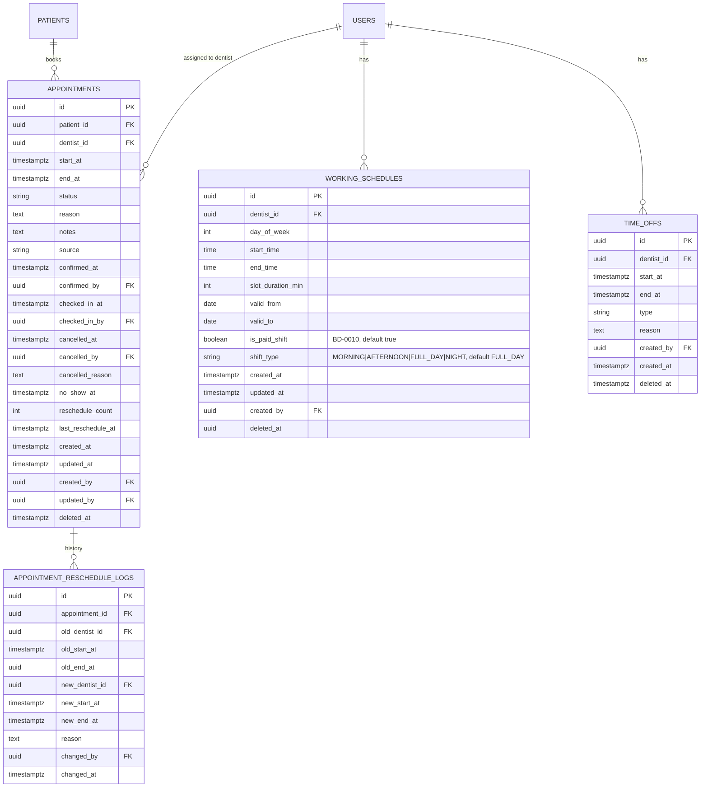

# Schema — Appointments Module

> **Module:** Appointments
> **File này:** Chi tiết schema cho 4 bảng của Appointments.
> **Ngày tạo:** 2026-07-13

---

## ERD module



---

## Bảng 1: `appointments`

### Columns

| Column | Type | Null | Default | Comment |
| ------ | ---- | :--: | ------- | ------- |
| `id` | UUID v7 | NO | `uuidv7()` | PK |
| `patient_id` | UUID | NO | — | FK → `patients.id` |
| `dentist_id` | UUID | NO | — | FK → `users.id` (BS) |
| `start_at` | TIMESTAMPTZ | NO | — | BR-APPT-005: must be > now() |
| `end_at` | TIMESTAMPTZ | NO | — | start_at + slot_duration |
| `status` | VARCHAR(20) | NO | `'scheduled'` | enum: `scheduled`, `confirmed`, `checked_in`, `in_progress`, `completed`, `cancelled`, `no_show` |
| `reason` | TEXT | YES | NULL | Lý do khám |
| `notes` | TEXT | YES | NULL | Ghi chú nội bộ |
| `source` | VARCHAR(20) | NO | `'phone'` | enum: `walk_in`, `phone`, `online`, `returning` |
| `confirmed_at` | TIMESTAMPTZ | YES | NULL | Khi status → confirmed |
| `confirmed_by` | UUID | YES | NULL | FK → `users.id` |
| `checked_in_at` | TIMESTAMPTZ | YES | NULL | |
| `checked_in_by` | UUID | YES | NULL | FK → `users.id` |
| `cancelled_at` | TIMESTAMPTZ | YES | NULL | |
| `cancelled_by` | UUID | YES | NULL | FK → `users.id` |
| `cancelled_reason` | TEXT | YES | NULL | Required if cancelled |
| `no_show_at` | TIMESTAMPTZ | YES | NULL | |
| `reschedule_count` | INTEGER | NO | 0 | BR-APPT-016: max 3 |
| `last_reschedule_at` | TIMESTAMPTZ | YES | NULL | |
| `created_at` | TIMESTAMPTZ | NO | `now()` | |
| `updated_at` | TIMESTAMPTZ | NO | `now()` | |
| `created_by` | UUID | YES | NULL | FK → `users.id` |
| `updated_by` | UUID | YES | NULL | FK → `users.id` |
| `deleted_at` | TIMESTAMPTZ | YES | NULL | Soft-delete (rare; chủ yếu dùng cancelled) |

### Indexes

```sql
-- BR-APPT-002: Slot unique (trừ cancelled/no_show)
CREATE UNIQUE INDEX idx_appointments_slot_unique
  ON appointments (dentist_id, start_at)
  WHERE deleted_at IS NULL AND status NOT IN ('cancelled', 'no_show');

-- Calendar view theo BS
CREATE INDEX idx_appointments_dentist_date ON appointments (dentist_id, start_at)
  WHERE deleted_at IS NULL AND status NOT IN ('cancelled', 'no_show');

-- Auto no-show cron (BR-APPT-012)
CREATE INDEX idx_appointments_auto_no_show
  ON appointments (start_at)
  WHERE deleted_at IS NULL AND status IN ('scheduled', 'confirmed');

-- Lịch sử BN
CREATE INDEX idx_appointments_patient ON appointments (patient_id, start_at DESC)
  WHERE deleted_at IS NULL;

-- Status filter chung
CREATE INDEX idx_appointments_status ON appointments (status, start_at)
  WHERE deleted_at IS NULL;
```

### Constraints

```sql
ALTER TABLE appointments ADD CONSTRAINT chk_appointments_status
  CHECK (status IN ('scheduled', 'confirmed', 'checked_in', 'in_progress', 'completed', 'cancelled', 'no_show'));

ALTER TABLE appointments ADD CONSTRAINT chk_appointments_source
  CHECK (source IN ('walk_in', 'phone', 'online', 'returning'));

ALTER TABLE appointments ADD CONSTRAINT chk_appointments_time
  CHECK (end_at > start_at);

ALTER TABLE appointments ADD CONSTRAINT chk_appointments_reschedule
  CHECK (reschedule_count >= 0 AND reschedule_count <= 3);
```

### Sample queries

#### 1. Available slots for dentist in date range

```sql
-- Lấy working schedule
SELECT day_of_week, start_time, end_time, slot_duration_min
FROM working_schedules
WHERE dentist_id = $1
  AND deleted_at IS NULL
  AND valid_from <= $2::date AND (valid_to IS NULL OR valid_to >= $2::date);

-- Lấy time-off trùng
SELECT start_at, end_at
FROM time_offs
WHERE dentist_id = $1
  AND deleted_at IS NULL
  AND start_at < $3 AND end_at > $2;  -- $3 = next day end

-- Lấy appointment đã book
SELECT start_at, end_at
FROM appointments
WHERE dentist_id = $1
  AND deleted_at IS NULL
  AND status NOT IN ('cancelled', 'no_show')
  AND start_at >= $2 AND start_at < $3;
```

#### 2. Auto no-show cron (every 15 min)

```sql
UPDATE appointments
SET status = 'no_show',
    no_show_at = now(),
    updated_at = now()
WHERE start_at < now() - INTERVAL '15 minutes'
  AND status IN ('scheduled', 'confirmed')
  AND deleted_at IS NULL
RETURNING id, patient_id, dentist_id;
```

#### 3. Waiting queue (FIFO BD-0001)

```sql
SELECT a.id, a.patient_id, a.checked_in_at, p.code AS patient_code, p.full_name
FROM appointments a
JOIN patients p ON p.id = a.patient_id
WHERE a.dentist_id = $1
  AND a.status = 'checked_in'
  AND a.checked_in_at >= $2::date  -- today
  AND a.checked_in_at < $2::date + INTERVAL '1 day'
  AND a.deleted_at IS NULL
ORDER BY a.checked_in_at ASC;  -- FIFO
```

---

## Bảng 2: `working_schedules`

### Columns

| Column | Type | Null | Default | Comment |
| ------ | ---- | :--: | ------- | ------- |
| `id` | UUID v7 | NO | `uuidv7()` | PK |
| `dentist_id` | UUID | NO | — | FK → `users.id` |
| `day_of_week` | INTEGER | NO | — | 0=Sun, 1=Mon, ..., 6=Sat (Postgres DOW) |
| `start_time` | TIME | NO | — | VD: `08:00` |
| `end_time` | TIME | NO | — | VD: `17:00` |
| `slot_duration_min` | INTEGER | NO | 30 | Default 30 phút (BR-APPT-001) |
| `valid_from` | DATE | NO | — | Lịch có hiệu lực từ (BR-APPT-014) |
| `valid_to` | DATE | YES | NULL | NULL = vô thời hạn |
| `created_at` | TIMESTAMPTZ | NO | `now()` | |
| `updated_at` | TIMESTAMPTZ | NO | `now()` | |
| `created_by` | UUID | YES | NULL | FK → `users.id` |
| `deleted_at` | TIMESTAMPTZ | YES | NULL | |

### Indexes

```sql
CREATE INDEX idx_ws_dentist ON working_schedules (dentist_id, day_of_week, valid_from DESC)
  WHERE deleted_at IS NULL;
```

### Constraints

```sql
ALTER TABLE working_schedules ADD CONSTRAINT chk_ws_dow
  CHECK (day_of_week BETWEEN 0 AND 6);

ALTER TABLE working_schedules ADD CONSTRAINT chk_ws_time
  CHECK (end_time > start_time);

ALTER TABLE working_schedules ADD CONSTRAINT chk_ws_slot_duration
  CHECK (slot_duration_min > 0 AND slot_duration_min <= 240);

ALTER TABLE working_schedules ADD CONSTRAINT chk_ws_valid_range
  CHECK (valid_to IS NULL OR valid_to >= valid_from);

-- BR-APPT-018: cùng dentist + dayOfWeek không overlap giờ
-- Enforce bằng exclusion constraint của Postgres
ALTER TABLE working_schedules ADD CONSTRAINT ex_ws_no_overlap
  EXCLUDE USING GIST (
    dentist_id WITH =,
    day_of_week WITH =,
    tsrange(
      ('2000-01-01'::date + start_time)::timestamp,
      ('2000-01-01'::date + end_time)::timestamp,
      '[)'
    ) WITH &&
  )
  WHERE (deleted_at IS NULL);
```

> **Lưu ý:** Exclusion constraint cần `btree_gist` extension: `CREATE EXTENSION IF NOT EXISTS btree_gist;`

---

## Bảng 3: `time_offs`

### Columns

| Column | Type | Null | Default | Comment |
| ------ | ---- | :--: | ------- | ------- |
| `id` | UUID v7 | NO | `uuidv7()` | PK |
| `dentist_id` | UUID | NO | — | FK → `users.id` |
| `start_at` | TIMESTAMPTZ | NO | — | |
| `end_at` | TIMESTAMPTZ | NO | — | |
| `type` | VARCHAR(20) | NO | — | enum: `vacation`, `sick`, `training`, `other` |
| `reason` | TEXT | YES | NULL | |
| `created_by` | UUID | NO | — | FK → `users.id` (admin hoặc BS) |
| `created_at` | TIMESTAMPTZ | NO | `now()` | |
| `deleted_at` | TIMESTAMPTZ | YES | NULL | |

### Indexes

```sql
-- Query range theo dentist + thời gian
CREATE INDEX idx_time_offs_dentist_range
  ON time_offs (dentist_id, start_at, end_at)
  WHERE deleted_at IS NULL;
```

### Constraints

```sql
ALTER TABLE time_offs ADD CONSTRAINT chk_time_off_type
  CHECK (type IN ('vacation', 'sick', 'training', 'other'));

ALTER TABLE time_offs ADD CONSTRAINT chk_time_off_range
  CHECK (end_at > start_at);

-- BR-APPT-019: tránh overlap giữa 2 time-off cùng dentist
ALTER TABLE time_offs ADD CONSTRAINT ex_time_offs_no_overlap
  EXCLUDE USING GIST (
    dentist_id WITH =,
    tsrange(start_at, end_at, '[)') WITH &&
  )
  WHERE (deleted_at IS NULL);
```

---

## Bảng 4: `appointment_reschedule_logs`

Append-only: mỗi lần reschedule → INSERT 1 row.

### Columns

| Column | Type | Null | Default | Comment |
| ------ | ---- | :--: | ------- | ------- |
| `id` | UUID v7 | NO | `uuidv7()` | PK |
| `appointment_id` | UUID | NO | — | FK → `appointments.id` |
| `old_dentist_id` | UUID | YES | NULL | NULL nếu không đổi BS |
| `old_start_at` | TIMESTAMPTZ | NO | — | |
| `old_end_at` | TIMESTAMPTZ | NO | — | |
| `new_dentist_id` | UUID | YES | NULL | |
| `new_start_at` | TIMESTAMPTZ | NO | — | |
| `new_end_at` | TIMESTAMPTZ | NO | — | |
| `reason` | TEXT | YES | NULL | |
| `changed_by` | UUID | NO | — | FK → `users.id` |
| `changed_at` | TIMESTAMPTZ | NO | `now()` | |

### Indexes

```sql
CREATE INDEX idx_reschedule_logs_appt
  ON appointment_reschedule_logs (appointment_id, changed_at DESC);
```

### Sample query

```sql
SELECT
  old_dentist_id, old_start_at,
  new_dentist_id, new_start_at,
  reason, changed_by, changed_at
FROM appointment_reschedule_logs
WHERE appointment_id = $1
ORDER BY changed_at DESC;
```

---

## Tổng kết số liệu

| Object | Count |
| ------ | :---: |
| Bảng | 4 + 1 (shift_registrations, Phase 9) |
| Indexes | 9 + 3 (shift_registrations) |
| Constraints | 10 |
| Exclusion constraints | 2 (cần `btree_gist`) |

---

## Open questions

| # | Câu hỏi | Default decision |
| - | ------- | ---------------- |
| 1 | Cron auto-no-show ở NestJS (decorator) hay external scheduler (Bull)? | NestJS `@Cron` đơn giản cho MVP |
| 2 | `reason` field trên `appointments` — free text hay enum có sẵn? | Free text |
| 3 | `end_at` derived hay stored? | Stored (cho queries nhanh) |

---

## Related

- [SPEC Appointments](../../03_Specification/Appointments/SPEC.md)
- [SPEC Payroll](../../03_Specification/Payroll/SPEC.md)
- [BD-0001: FIFO Waiting Queue](../../01_Architecture/business-decisions.md#bd-0001--waiting-queue-theo-fifo-đến-trước-khám-trước)
- [BD-0008: Cascade Cancel](../../01_Architecture/business-decisions.md#bd-0008--cascade-cancel-appointment--encounter)
- [BD-0010: Ca làm việc BS — cố định + tự đăng ký](../../01_Architecture/business-decisions.md#bd-0010--ca-làm-việc-bs-cố-định--tự-đăng-ký-cùng-tồn-tại)
- [ADR-0007: Cross-Module Event Bus](../../ADR/0007-cross-module-event-bus.md)
