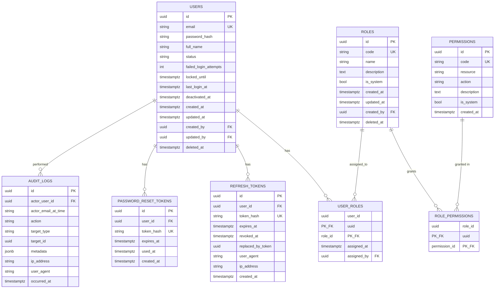

# Schema — Authentication & Identity Module

> **Module:** Auth
> **File này:** Chi tiết schema cho 8 bảng của Auth.
> **Source of truth cho runtime:** `backend/prisma/schema.prisma` (sẽ viết sau khi chốt các schema per module).
> **Ngày tạo:** 2026-07-13

---

## ERD module



---

## Bảng 1: `users`

### Columns

| Column | Type | Null | Default | Comment |
| ------ | ---- | :--: | ------- | ------- |
| `id` | UUID v7 | NO | `uuidv7()` | PK |
| `email` | VARCHAR(255) | NO | — | Unique, lowercase trước khi lưu |
| `password_hash` | TEXT | NO | — | argon2id encoded hash |
| `full_name` | VARCHAR(200) | NO | — | Trim |
| `status` | VARCHAR(20) | NO | `'active'` | enum: `active`, `pending_setup`. Check constraint. |
| `failed_login_attempts` | INTEGER | NO | 0 | BR-AUTH-003 |
| `locked_until` | TIMESTAMPTZ | YES | NULL | Sau 5 fail → set `now + 15min` |
| `last_login_at` | TIMESTAMPTZ | YES | NULL | Update khi login thành công |
| `deactivated_at` | TIMESTAMPTZ | YES | NULL | Soft-delete (ADR-0006) |
| `created_at` | TIMESTAMPTZ | NO | `now()` | |
| `updated_at` | TIMESTAMPTZ | NO | `now()` | Trigger update |
| `created_by` | UUID | YES | NULL | FK → `users.id` (self-ref) |
| `updated_by` | UUID | YES | NULL | FK → `users.id` (self-ref) |
| `deleted_at` | TIMESTAMPTZ | YES | NULL | Soft-delete marker (cho data của user đã xóa hoàn toàn) |

### Indexes

```sql
CREATE UNIQUE INDEX idx_users_email ON users (email) WHERE deleted_at IS NULL;
CREATE INDEX idx_users_status ON users (status) WHERE deleted_at IS NULL;
CREATE INDEX idx_users_active ON users (id) WHERE deactivated_at IS NULL AND deleted_at IS NULL;
```

### Constraints

```sql
ALTER TABLE users ADD CONSTRAINT chk_users_status
  CHECK (status IN ('active', 'pending_setup'));
```

> **Lưu ý:** Email unique chỉ enforce khi `deleted_at IS NULL` (partial unique index). Cho phép tạo lại user với email cũ sau khi admin xóa cứng.

---

## Bảng 2: `roles`

### Columns

| Column | Type | Null | Default | Comment |
| ------ | ---- | :--: | ------- | ------- |
| `id` | UUID v7 | NO | `uuidv7()` | PK |
| `code` | VARCHAR(50) | NO | — | snake_case, unique. VD: `clinic_admin`, `receptionist`, `dentist`. |
| `name` | VARCHAR(100) | NO | — | Tên hiển thị |
| `description` | TEXT | YES | NULL | Mô tả role |
| `is_system` | BOOLEAN | NO | `false` | BR-AUTH-009: true = không xóa |
| `created_at` | TIMESTAMPTZ | NO | `now()` | |
| `updated_at` | TIMESTAMPTZ | NO | `now()` | |
| `created_by` | UUID | YES | NULL | FK → `users.id` |
| `deleted_at` | TIMESTAMPTZ | YES | NULL | BR-AUTH-009: system role không bao giờ set |

### Indexes

```sql
CREATE UNIQUE INDEX idx_roles_code ON roles (code) WHERE deleted_at IS NULL;
```

---

## Bảng 3: `permissions`

### Columns

| Column | Type | Null | Default | Comment |
| ------ | ---- | :--: | ------- | ------- |
| `id` | UUID v7 | NO | `uuidv7()` | PK |
| `code` | VARCHAR(100) | NO | — | snake_case. VD: `patient.create`, `invoice.mark_paid`. |
| `resource` | VARCHAR(50) | NO | — | Resource name: `patient`, `appointment`, `invoice`, ... |
| `action` | VARCHAR(50) | NO | — | Action: `create`, `read`, `update`, `delete`, `cancel`, ... |
| `description` | TEXT | YES | NULL | Mô tả dùng cho admin UI |
| `is_system` | BOOLEAN | NO | `true` | BR-AUTH-010: không thêm/sửa qua API |
| `created_at` | TIMESTAMPTZ | NO | `now()` | |

### Indexes

```sql
CREATE UNIQUE INDEX idx_permissions_code ON permissions (code);
CREATE INDEX idx_permissions_resource ON permissions (resource);
```

### Seed data

Bảng này **được seed từ migration**, KHÔNG thêm mới qua API (BR-AUTH-010). Khoảng 30 permission theo `actor-permissions-matrix.md` (sẽ được add trong migration).

---

## Bảng 4: `user_roles` (composite PK)

### Columns

| Column | Type | Null | Default | Comment |
| ------ | ---- | :--: | ------- | ------- |
| `user_id` | UUID | NO | — | PK (part), FK → `users.id` |
| `role_id` | UUID | NO | — | PK (part), FK → `roles.id` |
| `assigned_at` | TIMESTAMPTZ | NO | `now()` | |
| `assigned_by` | UUID | YES | NULL | FK → `users.id` (admin đã gán) |

### Indexes

```sql
CREATE INDEX idx_user_roles_user ON user_roles (user_id);
CREATE INDEX idx_user_roles_role ON user_roles (role_id);
```

---

## Bảng 5: `role_permissions` (composite PK)

### Columns

| Column | Type | Null | Default | Comment |
| ------ | ---- | :--: | ------- | ------- |
| `role_id` | UUID | NO | — | PK (part), FK → `roles.id`. ON DELETE CASCADE. |
| `permission_id` | UUID | NO | — | PK (part), FK → `permissions.id`. ON DELETE CASCADE. |

> Note: ON DELETE CASCADE vì nếu role/permission bị xóa → user-role-permission mapping cũng xóa theo.

---

## Bảng 6: `refresh_tokens`

### Columns

| Column | Type | Null | Default | Comment |
| ------ | ---- | :--: | ------- | ------- |
| `id` | UUID v7 | NO | `uuidv7()` | PK |
| `user_id` | UUID | NO | — | FK → `users.id` |
| `token_hash` | VARCHAR(64) | NO | — | SHA256 hex digest (BR-AUTH-005) |
| `expires_at` | TIMESTAMPTZ | NO | — | `now() + 7 days` |
| `revoked_at` | TIMESTAMPTZ | YES | NULL | Set khi logout / rotate |
| `replaced_by_token` | UUID | YES | NULL | FK self-ref. Mỗi refresh → revoke old, link đến new (BR-AUTH-006) |
| `user_agent` | TEXT | YES | NULL | |
| `ip_address` | VARCHAR(45) | YES | NULL | IPv4 (15) hoặc IPv6 (45) |
| `created_at` | TIMESTAMPTZ | NO | `now()` | |

### Indexes

```sql
CREATE UNIQUE INDEX idx_refresh_tokens_hash ON refresh_tokens (token_hash);
CREATE INDEX idx_refresh_tokens_user_active ON refresh_tokens (user_id)
  WHERE revoked_at IS NULL AND expires_at > now();
CREATE INDEX idx_refresh_tokens_expires ON refresh_tokens (expires_at)
  WHERE revoked_at IS NULL;
```

### Sample query (validate token)

```sql
SELECT id, user_id, expires_at
FROM refresh_tokens
WHERE token_hash = $1
  AND revoked_at IS NULL
  AND expires_at > now()
LIMIT 1;
```

---

## Bảng 7: `password_reset_tokens`

### Columns

| Column | Type | Null | Default | Comment |
| ------ | ---- | :--: | ------- | ------- |
| `id` | UUID v7 | NO | `uuidv7()` | PK |
| `user_id` | UUID | NO | — | FK → `users.id` |
| `token_hash` | VARCHAR(64) | NO | — | SHA256 hex |
| `expires_at` | TIMESTAMPTZ | NO | — | `now() + 1 hour` |
| `used_at` | TIMESTAMPTZ | YES | NULL | Set khi user dùng token (1 lần duy nhất) |
| `created_at` | TIMESTAMPTZ | NO | `now()` | |

### Indexes

```sql
CREATE UNIQUE INDEX idx_prt_hash ON password_reset_tokens (token_hash);
CREATE INDEX idx_prt_user ON password_reset_tokens (user_id);
```

---

## Bảng 8: `audit_logs`

### Columns

| Column | Type | Null | Default | Comment |
| ------ | ---- | :--: | ------- | ------- |
| `id` | UUID v7 | NO | `uuidv7()` | PK |
| `actor_user_id` | UUID | YES | NULL | FK → `users.id`. NULL nếu action bởi anonymous (vd: failed login) |
| `actor_email_at_time` | VARCHAR(255) | YES | NULL | Snapshot email (kể cả user đã xóa) |
| `action` | VARCHAR(100) | NO | — | enum-like: `login_success`, `login_failed`, `refresh_reuse_detected`, ... |
| `target_type` | VARCHAR(50) | YES | NULL | VD: `user`, `role`, `patient`, `permission` |
| `target_id` | UUID | YES | NULL | ID của đối tượng bị tác động |
| `metadata` | JSONB | YES | NULL | Action-specific extra data |
| `ip_address` | VARCHAR(45) | YES | NULL | |
| `user_agent` | TEXT | YES | NULL | |
| `occurred_at` | TIMESTAMPTZ | NO | `now()` | |

> **BR-AUTH-016:** Không bao giờ UPDATE/DELETE. Chỉ INSERT.

### Indexes

```sql
CREATE INDEX idx_audit_logs_occurred ON audit_logs (occurred_at DESC);
CREATE INDEX idx_audit_logs_actor ON audit_logs (actor_user_id, occurred_at DESC)
  WHERE actor_user_id IS NOT NULL;
CREATE INDEX idx_audit_logs_action ON audit_logs (action, occurred_at DESC);
CREATE INDEX idx_audit_logs_target ON audit_logs (target_type, target_id)
  WHERE target_id IS NOT NULL;
```

---

## Seed data (chạy trong migration đầu tiên)

```sql
-- 3 system roles
INSERT INTO roles (id, code, name, is_system, created_at, updated_at) VALUES
  (uuidv7(), 'clinic_admin', 'Quản trị viên', true, now(), now()),
  (uuidv7(), 'receptionist', 'Lễ tân', true, now(), now()),
  (uuidv7(), 'dentist', 'Bác sĩ', true, now(), now());

-- ~30 permissions (sẽ generate từ actor-permissions-matrix.md)
-- Seed 1 super admin user với status = 'pending_setup',
-- password random, in ra console để admin biết password lần đầu
```

---

## Sample queries quan trọng

### 1. Lấy user + roles + permissions (cho `GET /auth/me`)

```sql
SELECT
  u.id, u.email, u.full_name, u.status,
  array_agg(DISTINCT r.code) AS roles,
  array_agg(DISTINCT p.code) AS permissions
FROM users u
LEFT JOIN user_roles ur ON ur.user_id = u.id
LEFT JOIN roles r ON r.id = ur.role_id AND r.deleted_at IS NULL
LEFT JOIN role_permissions rp ON rp.role_id = r.id
LEFT JOIN permissions p ON p.id = rp.permission_id
WHERE u.id = $1 AND u.deactivated_at IS NULL AND u.deleted_at IS NULL
GROUP BY u.id;
```

### 2. Check user có permission không (cho @RequirePermission guard)

```sql
-- Input: userId, permissionCode
SELECT EXISTS (
  SELECT 1
  FROM users u
  JOIN user_roles ur ON ur.user_id = u.id
  JOIN roles r ON r.id = ur.role_id AND r.deleted_at IS NULL
  JOIN role_permissions rp ON rp.role_id = r.id
  JOIN permissions p ON p.id = rp.permission_id
  WHERE u.id = $1 AND u.status = 'active' AND u.deactivated_at IS NULL
    AND p.code = $2
) AS has_permission;
```

### 3. Refresh token validation

```sql
SELECT id, user_id, expires_at, replaced_by_token
FROM refresh_tokens
WHERE token_hash = $1
  AND revoked_at IS NULL
  AND expires_at > now();
```

### 4. Login history (cho `GET /auth/me/login-history`)

```sql
SELECT occurred_at, action, ip_address, user_agent
FROM audit_logs
WHERE actor_user_id = $1
  AND action IN ('login_success', 'login_failed', 'logout_all')
ORDER BY occurred_at DESC
LIMIT $2 OFFSET $3;
```

---

## Open questions

| # | Câu hỏi | Ảnh hưởng |
| - | ------- | --------- |
| 1 | Email lowercase: enforce ở DB (CHECK constraint LOWER(email) = email) hay app layer? | App layer (đơn giản hơn) |
| 2 | `password_hash` TEXT có cần giới hạn length? | argon2id output ~95 chars, TEXT đủ |
| 3 | `audit_logs.metadata` có cần schema validation ở DB không? | Không — flexible JSONB |

---

## Related

- [SPEC Auth](../../03_Specification/Auth/SPEC.md)
- [ADR-0004: Permission-based RBAC](../../ADR/0004-permission-based-rbac.md)
- [ADR-0005: ID Strategy](../../ADR/0005-id-strategy.md)
- [ADR-0006: Soft Delete](../../ADR/0006-soft-delete.md)
- [Actor Permissions Matrix](../../01_Architecture/actor-permissions-matrix.md)
