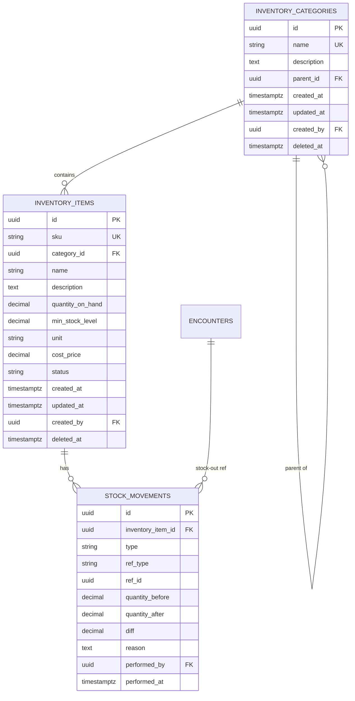

# Schema — Inventory Module

> **Module:** Inventory
> **File này:** Chi tiết schema cho 3 bảng của Inventory.
> **Đặc biệt:** Chỉ đếm và trừ (BD-0004). Không có lot/expiry cho MVP. Auto stock-out qua event handler xem [ADR-0008](../../ADR/0008-transactional-encounter-close.md).
> **Ngày tạo:** 2026-07-13

---

## ERD module



---

## Bảng 1: `inventory_categories`

### Columns

| Column | Type | Null | Default | Comment |
| ------ | ---- | :--: | ------- | ------- |
| `id` | UUID v7 | NO | `uuidv7()` | PK |
| `name` | VARCHAR(100) | NO | — | VD: "Composite", "Cement", "Anesthesia" |
| `description` | TEXT | YES | NULL | |
| `parent_id` | UUID | YES | NULL | FK self-ref. BR-INV-015: không cycle |
| `created_at` | TIMESTAMPTZ | NO | `now()` | |
| `updated_at` | TIMESTAMPTZ | NO | `now()` | |
| `created_by` | UUID | YES | NULL | FK → `users.id` |
| `deleted_at` | TIMESTAMPTZ | YES | NULL | BR-INV-001: unique name per active parent |

### Indexes

```sql
-- BR-INV-016: name unique per parent
CREATE UNIQUE INDEX idx_categories_name_per_parent
  ON inventory_categories (COALESCE(parent_id, '00000000-0000-0000-0000-000000000000'::uuid), name)
  WHERE deleted_at IS NULL;

CREATE INDEX idx_categories_parent ON inventory_categories (parent_id)
  WHERE deleted_at IS NULL;
```

---

## Bảng 2: `inventory_items`

### Columns

| Column | Type | Null | Default | Comment |
| ------ | ---- | :--: | ------- | ------- |
| `id` | UUID v7 | NO | `uuidv7()` | PK |
| `sku` | VARCHAR(50) | NO | — | Unique. VD: `COMP-A2-001` |
| `category_id` | UUID | YES | NULL | FK → `inventory_categories.id` |
| `name` | VARCHAR(200) | NO | — | VD: "Composite A2 shade 4g" |
| `description` | TEXT | YES | NULL | |
| `quantity_on_hand` | DECIMAL(12,4) | NO | 0 | BR-INV-002: ≥ 0 |
| `min_stock_level` | DECIMAL(12,4) | NO | 0 | BR-INV-012: low-stock condition |
| `unit` | VARCHAR(20) | NO | — | Free text BR-INV-010: "g", "ml", "cái", "hộp" |
| `cost_price` | DECIMAL(12,4) | YES | NULL | BR-INV-011: ≥ 0 |
| `status` | VARCHAR(20) | NO | `'active'` | enum: `active`, `discontinued` (BR-INV-014) |
| `created_at` | TIMESTAMPTZ | NO | `now()` | |
| `updated_at` | TIMESTAMPTZ | NO | `now()` | |
| `created_by` | UUID | YES | NULL | FK → `users.id` |
| `deleted_at` | TIMESTAMPTZ | YES | NULL | BR-INV-013: soft-delete giữ stock |

### Indexes

```sql
-- SKU unique
CREATE UNIQUE INDEX idx_items_sku ON inventory_items (sku) WHERE deleted_at IS NULL;

-- Category filter
CREATE INDEX idx_items_category ON inventory_items (category_id)
  WHERE deleted_at IS NULL;

-- BR-INV-012 + BR-INV-020: low-stock query
-- Partial index CHỈ chứa row thỏa điều kiện low-stock
CREATE INDEX idx_items_low_stock
  ON inventory_items (quantity_on_hand, min_stock_level)
  WHERE status = 'active' AND deleted_at IS NULL AND quantity_on_hand < min_stock_level;

-- Tên fuzzy search
CREATE INDEX idx_items_name_trgm ON inventory_items
  USING GIN (name gin_trgm_ops)
  WHERE deleted_at IS NULL;
```

### Constraints

```sql
ALTER TABLE inventory_items ADD CONSTRAINT chk_item_status
  CHECK (status IN ('active', 'discontinued'));

ALTER TABLE inventory_items ADD CONSTRAINT chk_item_quantity
  CHECK (quantity_on_hand >= 0);

ALTER TABLE inventory_items ADD CONSTRAINT chk_item_cost
  CHECK (cost_price IS NULL OR cost_price >= 0);
```

### Sample queries

#### 1. Low-stock items (BR-INV-006)

```sql
SELECT id, sku, name, quantity_on_hand, min_stock_level, unit,
       (min_stock_level - quantity_on_hand) AS shortage
FROM inventory_items
WHERE status = 'active'
  AND deleted_at IS NULL
  AND quantity_on_hand < min_stock_level
ORDER BY shortage DESC
LIMIT 20;
```

#### 2. Lookup item available for treatment selection

```sql
SELECT id, sku, name, unit, quantity_on_hand
FROM inventory_items
WHERE deleted_at IS NULL
  AND status = 'active'  -- discontinued: không dùng cho encounter mới (BR-INV-014)
  AND category_id = $1
ORDER BY name;
```

---

## Bảng 3: `stock_movements`

Append-only (BR-INV-009). Mọi thay đổi `quantity_on_hand` đều INSERT 1 row vào đây.

### Columns

| Column | Type | Null | Default | Comment |
| ------ | ---- | :--: | ------- | ------- |
| `id` | UUID v7 | NO | `uuidv7()` | PK |
| `inventory_item_id` | UUID | NO | — | FK → `inventory_items.id` |
| `type` | VARCHAR(20) | NO | — | enum: `stock_in`, `stock_out`, `adjustment` |
| `ref_type` | VARCHAR(20) | YES | NULL | enum: `encounter`, `manual`, `adjustment` |
| `ref_id` | UUID | YES | NULL | ID tham chiếu. VD: `encounter_id` cho stock_out từ encounter |
| `quantity_before` | DECIMAL(12,4) | NO | — | Snapshot trước khi thay đổi |
| `quantity_after` | DECIMAL(12,4) | NO | — | Snapshot sau |
| `diff` | DECIMAL(12,4) | NO | — | = quantity_after - quantity_before |
| `reason` | TEXT | YES | NULL | Required cho manual stock-out (BR-INV-006), adjustment (BR-INV-008) |
| `performed_by` | UUID | NO | — | FK → `users.id` (NULL cho system auto stock-out)? |
| `performed_at` | TIMESTAMPTZ | NO | `now()` | |

> **Lưu ý về performed_by NULL:** Auto stock-out từ encounter close có `performed_by = encounter.dentist_id`. Manual có `performed_by = currentUser`.

### Indexes

```sql
CREATE INDEX idx_movements_item_time
  ON stock_movements (inventory_item_id, performed_at DESC);

-- Report tồn kho theo tháng
CREATE INDEX idx_movements_type_time
  ON stock_movements (type, performed_at);

-- Theo encounter (cho audit)
CREATE INDEX idx_movements_ref
  ON stock_movements (ref_type, ref_id)
  WHERE ref_id IS NOT NULL;
```

### Constraints

```sql
ALTER TABLE stock_movements ADD CONSTRAINT chk_movement_type
  CHECK (type IN ('stock_in', 'stock_out', 'adjustment'));

ALTER TABLE stock_movements ADD CONSTRAINT chk_movement_ref_consistent
  CHECK (
    (type = 'stock_out' AND ref_type = 'encounter' AND ref_id IS NOT NULL)
    OR (type = 'stock_in' AND ref_type = 'manual' AND performed_by IS NOT NULL)
    OR (type = 'adjustment' AND ref_type = 'adjustment' AND performed_by IS NOT NULL AND reason IS NOT NULL)
  );

ALTER TABLE stock_movements ADD CONSTRAINT chk_movement_diff
  CHECK (
    (type = 'stock_in' AND diff > 0)
    OR (type = 'stock_out' AND diff < 0)
    OR (type = 'adjustment')  -- adjustment có thể âm hoặc dương
  );

ALTER TABLE stock_movements ADD CONSTRAINT chk_movement_quantities
  CHECK (
    quantity_after >= 0
    AND quantity_after = quantity_before + diff
  );
```

> **BR-INV-023:** `quantity_before = quantity_after` → skip INSERT movement (không tạo adjustment record no-op).

### Cross-module reference

`ref_id` cho stock_out **soft-reference** (không FK) encounter.id:

- Lý do: tránh cascade — encounter soft-delete không xóa stock_movements
- App layer validate `ref_id` tồn tại khi insert
- `ON DELETE SET NULL` để encounter delete → movements giữ lại với `ref_id = NULL`

> **Decision:** không FK constraint cứng, chỉ validate ở app + index ở DB.

---

## Tổng kết số liệu

| Object | Count |
| ------ | :---: |
| Bảng | 3 |
| Indexes | 6 |
| Constraints | 7 |
| Extensions | 1 (`pg_trgm`) |

---

## Cross-module chain (auto stock-out)

Khi encounter close (BR-INV-005, ADR-0008), trong **cùng transaction**:

```sql
-- Handler returns:
[
  {
    "inventory_item_id": "<uuid>",
    "quantity_before": 0.5,
    "quantity_after": 0.0,  -- trừ 0.5
    "diff": -0.5,
    "ref_type": "encounter",
    "ref_id": "<encounter_id>",
    "performed_by": "<dentist_id>"
  }
]

-- Publisher (MedicalRecords) INSERTs:
INSERT INTO stock_movements (
  id, inventory_item_id, type, ref_type, ref_id,
  quantity_before, quantity_after, diff,
  reason, performed_by, performed_at
) VALUES (...);

UPDATE inventory_items
SET quantity_on_hand = quantity_on_hand + diff,
    updated_at = now()
WHERE id = $item_id
  AND quantity_on_hand + $diff >= 0;  -- safety check
```

Nếu safety check fail → ROLLBACK toàn bộ chain (encounter không đóng).

---

## Open questions

| # | Câu hỏi | Default decision |
| - | ------- | ---------------- |
| 1 | `unit` có nên là enum chuẩn? | MVP free text (BR-INV-010). Sau này có thể normalize. |
| 2 | `cost_price` có nên tracking cost mỗi stock-in? | MVP: 1 cost trên item, không tracking FIFO. |
| 3 | Có cần `expiry_date` cho MVP? | Không (BD-0004). |
| 4 | Low-stock alert: chỉ trả data cho badge, hay còn push notification? | Chỉ trả data (BR-INV-006). FE polling hoặc dashboard. |

---

## Related

- [SPEC Inventory](../../03_Specification/Inventory/SPEC.md)
- [BD-0004: Inventory scope MVP](../../01_Architecture/business-decisions.md#bd-0004--inventory-chỉ-đếm-và-trừ-không-quản-lý-lôhạn)
- [ADR-0008: Transactional Encounter Close](../../ADR/0008-transactional-encounter-close.md)
