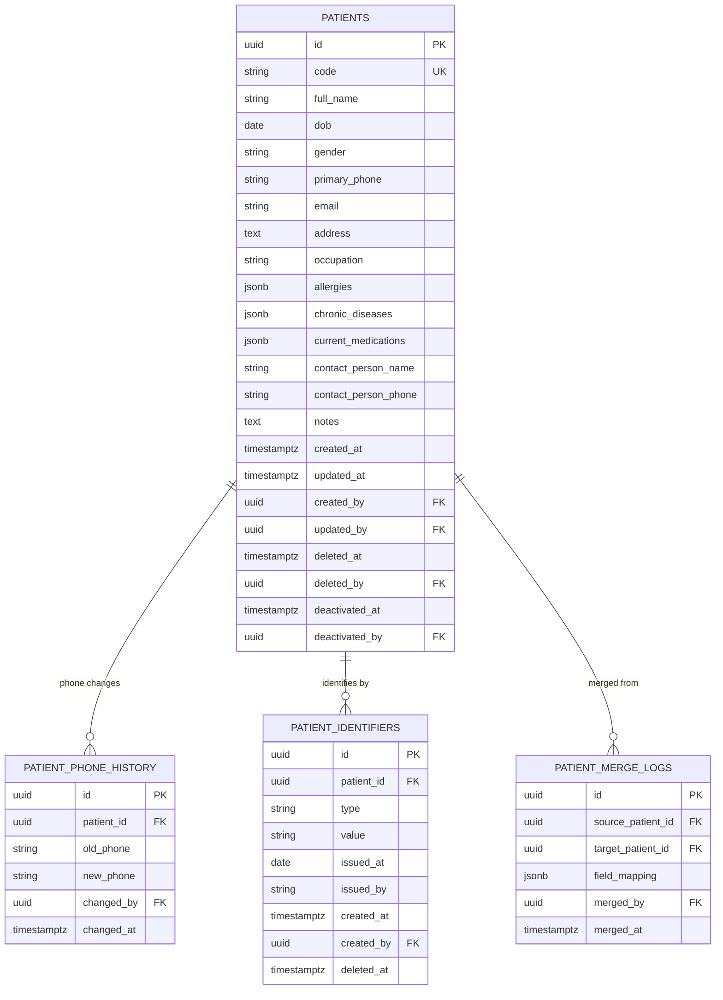

# Schema — Patients Module

> **Module:** Patients
> **File này:** Chi tiết schema cho 4 bảng của Patients.
> **Ngày tạo:** 2026-07-13

---

## ERD module



---

## Bảng 1: `patients`

### Columns

| Column | Type | Null | Default | Comment |
| ------ | ---- | :--: | ------- | ------- |
| `id` | UUID v7 | NO | `uuidv7()` | PK |
| `code` | VARCHAR(20) | NO | — | `PAT-YYYY-NNNNN` (BD-0006). Unique. |
| `full_name` | VARCHAR(200) | NO | — | Trim (BR-PT-004) |
| `dob` | DATE | NO | — | (BR-PT-003): trước today, sau 1900-01-01 |
| `gender` | VARCHAR(20) | NO | — | enum: `male`, `female`, `other`, `undisclosed` |
| `primary_phone` | VARCHAR(20) | YES | NULL | 10-11 chữ số VN (BR-PT-002). Có thể rỗng. |
| `email` | VARCHAR(255) | YES | NULL | RFC 5322, lowercase (BR-PT-005) |
| `address` | TEXT | YES | NULL | ≤ 500 chars (BR-PT-007) |
| `occupation` | VARCHAR(100) | YES | NULL | |
| `allergies` | JSONB | NO | `'[]'` | `string[]` — VD: `["Penicillin"]` |
| `chronic_diseases` | JSONB | NO | `'[]'` | `string[]` — VD: `["Hypertension"]` |
| `current_medications` | JSONB | NO | `'[]'` | `string[]` — VD: `["Amlodipine 5mg"]` |
| `contact_person_name` | VARCHAR(200) | YES | NULL | Bắt buộc nếu BN < 12 tuổi (BR-PT-012) |
| `contact_person_phone` | VARCHAR(20) | YES | NULL | |
| `notes` | TEXT | YES | NULL | |
| `created_at` | TIMESTAMPTZ | NO | `now()` | |
| `updated_at` | TIMESTAMPTZ | NO | `now()` | |
| `created_by` | UUID | YES | NULL | FK → `users.id` |
| `updated_by` | UUID | YES | NULL | FK → `users.id` |
| `deleted_at` | TIMESTAMPTZ | YES | NULL | Soft-delete (ADR-0006). BR-PT-010 block conditions. |
| `deleted_by` | UUID | YES | NULL | FK → `users.id` |
| `deactivated_at` | TIMESTAMPTZ | YES | NULL | Phân biệt soft-delete vs inactive (sau này không dùng) |
| `deactivated_by` | UUID | YES | NULL | FK → `users.id` |

### Indexes

```sql
-- Lookup chính (BR-PT-001: code unique per active)
CREATE UNIQUE INDEX idx_patients_code ON patients (code) WHERE deleted_at IS NULL;

-- Tìm kiếm SĐT (lookup duplicate - BR-PT-008)
CREATE INDEX idx_patients_phone ON patients (primary_phone)
  WHERE deleted_at IS NULL AND primary_phone IS NOT NULL;

-- Tìm kiếm name (ILIKE)
CREATE INDEX idx_patients_full_name_trgm ON patients
  USING GIN (full_name gin_trgm_ops)
  WHERE deleted_at IS NULL;

-- Filter list view (active + sortable)
CREATE INDEX idx_patients_active ON patients (created_at DESC)
  WHERE deleted_at IS NULL;

-- Last visit (cho dashboard)
CREATE INDEX idx_patients_created_recent ON patients (created_at DESC)
  WHERE deleted_at IS NULL;
```

> **Extension cần thiết:** `pg_trgm` (cho GIN trigram index trên `full_name`). Cài trong migration đầu: `CREATE EXTENSION IF NOT EXISTS pg_trgm;`

### Constraints

```sql
ALTER TABLE patients ADD CONSTRAINT chk_patients_gender
  CHECK (gender IN ('male', 'female', 'other', 'undisclosed'));

ALTER TABLE patients ADD CONSTRAINT chk_patients_dob_range
  CHECK (dob >= DATE '1900-01-01' AND dob <= CURRENT_DATE);

ALTER TABLE patients ADD CONSTRAINT chk_patients_phone_format
  CHECK (
    primary_phone IS NULL
    OR primary_phone ~ '^[0-9]{10,11}$'
  );

-- BR-PT-013: ít nhất 1 contact method (check ở app layer vì có logic)
```

### Sample queries

#### Lookup duplicate SĐT (BR-PT-008)

```sql
SELECT id, code, full_name, dob, gender, primary_phone, last_visit_at
FROM patients p
WHERE primary_phone = $1 AND deleted_at IS NULL
ORDER BY created_at DESC
LIMIT 10;
```

#### Full-text search tên + filter

```sql
SELECT id, code, full_name, dob, gender, primary_phone
FROM patients
WHERE deleted_at IS NULL
  AND full_name ILIKE '%' || $1 || '%'
  AND ($2::date IS NULL OR dob >= $2)
  AND ($3::date IS NULL OR dob <= $3)
ORDER BY created_at DESC
LIMIT 20;
```

---

## Bảng 2: `patient_phone_history`

Lưu mỗi lần BN đổi SĐT (BR-PT-009). Không ghi đè.

### Columns

| Column | Type | Null | Default | Comment |
| ------ | ---- | :--: | ------- | ------- |
| `id` | UUID v7 | NO | `uuidv7()` | PK |
| `patient_id` | UUID | NO | — | FK → `patients.id` |
| `old_phone` | VARCHAR(20) | YES | NULL | NULL nếu là lần đầu set |
| `new_phone` | VARCHAR(20) | NO | — | |
| `changed_by` | UUID | YES | NULL | FK → `users.id` |
| `changed_at` | TIMESTAMPTZ | NO | `now()` | |

### Indexes

```sql
CREATE INDEX idx_phone_history_patient ON patient_phone_history (patient_id, changed_at DESC);
```

### Sample query

```sql
SELECT old_phone, new_phone, changed_at
FROM patient_phone_history
WHERE patient_id = $1
ORDER BY changed_at DESC;
```

---

## Bảng 3: `patient_identifiers`

Lưu các giấy tờ tùy thân (CCCD/CMND/passport). Một BN có thể có nhiều identifier.

### Columns

| Column | Type | Null | Default | Comment |
| ------ | ---- | :--: | ------- | ------- |
| `id` | UUID v7 | NO | `uuidv7()` | PK |
| `patient_id` | UUID | NO | — | FK → `patients.id` |
| `type` | VARCHAR(20) | NO | — | enum: `cccd`, `cmnd`, `passport` |
| `value` | VARCHAR(50) | NO | — | Số CCCD/CMND/passport. CCCD 12 số, CMND 9 số |
| `issued_at` | DATE | YES | NULL | Ngày cấp |
| `issued_by` | VARCHAR(200) | YES | NULL | Nơi cấp |
| `created_at` | TIMESTAMPTZ | NO | `now()` | |
| `created_by` | UUID | YES | NULL | FK → `users.id` |
| `deleted_at` | TIMESTAMPTZ | YES | NULL | BR-PT-006: unique per type per active patient |

### Indexes

```sql
-- BR-PT-006: Unique CCCD/CMND per type per active patient
-- (partial unique index — chỉ enforce khi BN active)
CREATE UNIQUE INDEX idx_patients_identifier_unique
  ON patient_identifiers (type, value)
  WHERE deleted_at IS NULL;

CREATE INDEX idx_patients_identifier_patient
  ON patient_identifiers (patient_id)
  WHERE deleted_at IS NULL;
```

### Sample query (lookup CCCD)

```sql
SELECT pi.patient_id, p.code, p.full_name
FROM patient_identifiers pi
JOIN patients p ON p.id = pi.patient_id AND p.deleted_at IS NULL
WHERE pi.type = 'cccd' AND pi.value = $1 AND pi.deleted_at IS NULL;
```

---

## Bảng 4: `patient_merge_logs`

Log khi admin merge 2 BN (BR-PT-019/020). Append-only.

### Columns

| Column | Type | Null | Default | Comment |
| ------ | ---- | :--: | ------- | ------- |
| `id` | UUID v7 | NO | `uuidv7()` | PK |
| `source_patient_id` | UUID | NO | — | FK → `patients.id`. BN bị merge (sẽ soft-delete) |
| `target_patient_id` | UUID | NO | — | FK → `patients.id`. BN giữ lại |
| `field_mapping` | JSONB | NO | — | `{"primary_phone": "kept", "email": "updated_to_source", ...}` |
| `migrated_fk_count` | JSONB | NO | — | `{"appointments": 5, "encounters": 3, "invoices": 2}` |
| `merged_by` | UUID | NO | — | FK → `users.id` |
| `merged_at` | TIMESTAMPTZ | NO | `now()` | |

### Indexes

```sql
CREATE INDEX idx_merge_logs_target ON patient_merge_logs (target_patient_id, merged_at DESC);
CREATE INDEX idx_merge_logs_source ON patient_merge_logs (source_patient_id);
```

---

## Tổng kết số liệu

| Object | Count |
| ------ | :---: |
| Bảng | 4 |
| Indexes | 8 |
| Constraints | 3 |
| Extensions | 1 (`pg_trgm`) |
| Sample queries | 4 |

---

## Open questions

| # | Câu hỏi | Default decision |
| - | ------- | ---------------- |
| 1 | Có cần bảng `patient_address_history` (track đổi địa chỉ)? | MVP: không — đổi địa chỉ không cần audit trail |
| 2 | `allergies`, `chronic_diseases`, `current_medications` nên là JSONB hay bảng riêng? | JSONB cho MVP (BD-0005: simple scope) |
| 3 | `code` sequence: dùng Postgres SEQUENCE riêng hay app layer? | App layer (giống BD-0006) |

---

## Related

- [SPEC Patients](../../03_Specification/Patients/SPEC.md)
- [BD-0006: Patient Code](../../01_Architecture/business-decisions.md#bd-0006--bệnh-nhân-có-mã-bệnh-nhân-patient-code-để-intra-cứu)
- [BD-0007: Trùng bệnh nhân](../../01_Architecture/business-decisions.md#bd-0007--trùng-bệnh-nhân-hệ-thống-gợi-ý-lễ-tân-xác-nhận)
- [ADR-0006: Soft Delete](../../ADR/0006-soft-delete.md)
