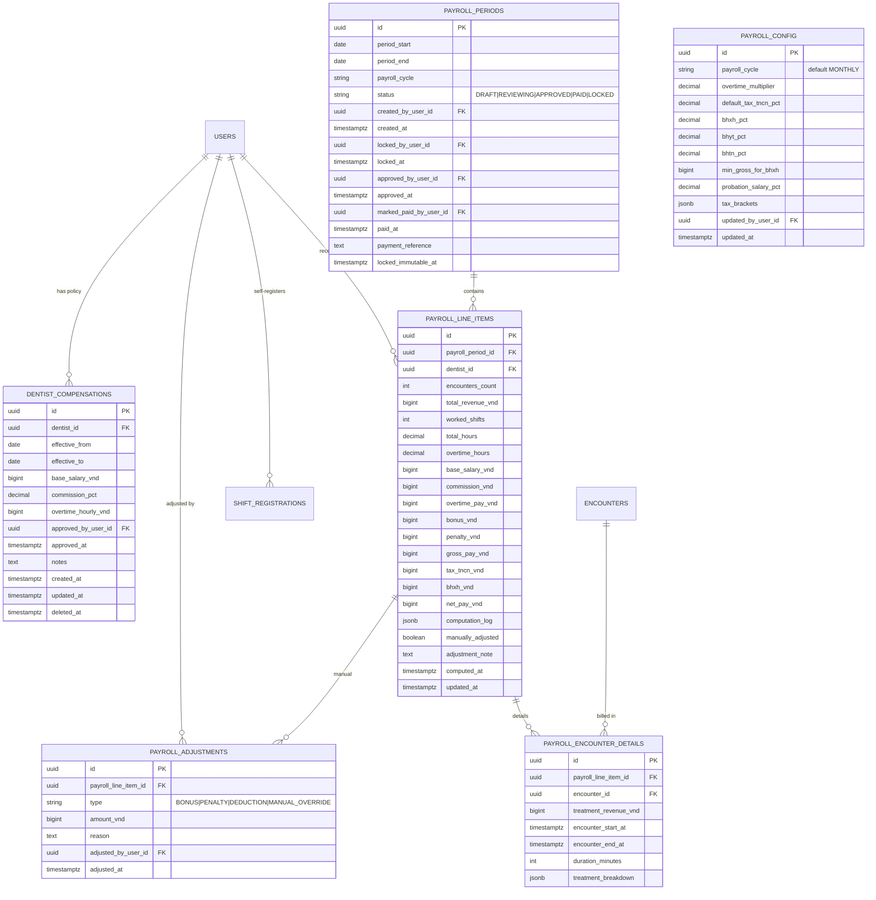

# Schema — Payroll Module

> **Module:** Payroll
> **File này:** Chi tiết schema cho 6 bảng của Payroll.
> **Ngày tạo:** 2026-07-15
> **Tham khảo:** `../03_Specification/Payroll/SPEC.md`, BD-0009, BD-0010.

---

## ERD module



---

## Bảng 1: `payroll_config`

> Singleton. Partial unique index enforce chỉ 1 row active.

### Columns

| Column | Type | Null | Default | Comment |
| ------ | ---- | :--: | ------- | ------- |
| `id` | UUID v7 | NO | `uuidv7()` | PK |
| `payroll_cycle` | VARCHAR(16) | NO | `'MONTHLY'` | enum: `WEEKLY`, `BIWEEKLY`, `MONTHLY` |
| `overtime_multiplier` | DECIMAL(4,2) | NO | 1.50 | BR-PAY-011 |
| `default_tax_tncn_pct` | DECIMAL(5,4) | NO | 0.10 | Snapshot default cho override (BR-PAY-009) |
| `bhxh_pct` | DECIMAL(5,4) | NO | 0.08 | BR-PAY-010 |
| `bhyt_pct` | DECIMAL(5,4) | NO | 0.015 | BR-PAY-010 |
| `bhtn_pct` | DECIMAL(5,4) | NO | 0.01 | BR-PAY-010 |
| `min_gross_for_bhxh` | BIGINT | NO | 4680000 | Lương tối thiểu vùng (BR-PAY-010 trần đóng) |
| `probation_salary_pct` | DECIMAL(4,2) | NO | 0.85 | Hệ số thử việc |
| `tax_brackets` | JSONB | NO | `{...}` | Bậc lũy tiến (BR-PAY-009) |
| `updated_by_user_id` | UUID | YES | NULL | FK → `users.id` |
| `updated_at` | TIMESTAMPTZ | NO | `now()` | |

### `tax_brackets` JSON structure

```json
{
  "personalDeductionVnd": 11000000,
  "brackets": [
    { "thresholdVnd": 5000000,  "rate": 0.05 },
    { "thresholdVnd": 10000000, "rate": 0.10 },
    { "thresholdVnd": 18000000, "rate": 0.15 },
    { "thresholdVnd": 32000000, "rate": 0.20 },
    { "thresholdVnd": null,      "rate": 0.25 }
  ]
}
```

### Indexes

```sql
CREATE UNIQUE INDEX idx_payroll_config_singleton
  ON payroll_config ((true));  -- chỉ cho phép 1 row
```

---

## Bảng 2: `dentist_compensations`

> Effective dating. Có thể nhiều version cho cùng BS theo thời gian.

### Columns

| Column | Type | Null | Default | Comment |
| ------ | ---- | :--: | ------- | ------- |
| `id` | UUID v7 | NO | `uuidv7()` | PK |
| `dentist_id` | UUID | NO | — | FK → `users.id` (role=dentist) |
| `effective_from` | DATE | NO | — | Inclusive |
| `effective_to` | DATE | YES | NULL | Exclusive (NULL = open-ended) |
| `base_salary_vnd` | BIGINT | NO | — | Lương nền VND/tháng |
| `commission_pct` | DECIMAL(5,4) | NO | 0 | 0.0 - 1.0 |
| `overtime_hourly_vnd` | BIGINT | NO | 0 | BR-PAY-011 |
| `approved_by_user_id` | UUID | YES | NULL | FK → `users.id` |
| `approved_at` | TIMESTAMPTZ | YES | NULL | |
| `notes` | TEXT | YES | NULL | |
| `created_at` | TIMESTAMPTZ | NO | `now()` | |
| `updated_at` | TIMESTAMPTZ | NO | `now()` | |
| `deleted_at` | TIMESTAMPTZ | YES | NULL | Soft delete |

### Indexes

```sql
-- Lookup compensation effective tại 1 ngày
CREATE INDEX idx_dentist_comp_effective
  ON dentist_compensations (dentist_id, effective_from, effective_to)
  WHERE deleted_at IS NULL;

-- BR-PAY-022: chống overlap
CREATE EXTENSION IF NOT EXISTS btree_gist;
CREATE EXCLUDE INDEX idx_dentist_comp_no_overlap
  ON dentist_compensations (dentist_id WITH =, daterange(effective_from, effective_to, '[)') WITH &&)
  WHERE deleted_at IS NULL;
```

---

## Bảng 3: `payroll_periods`

> State machine: DRAFT → REVIEWING → APPROVED → PAID → LOCKED.

### Columns

| Column | Type | Null | Default | Comment |
| ------ | ---- | :--: | ------- | ------- |
| `id` | UUID v7 | NO | `uuidv7()` | PK |
| `period_start` | DATE | NO | — | BR-PAY-002 |
| `period_end` | DATE | NO | — | BR-PAY-002 |
| `payroll_cycle` | VARCHAR(16) | NO | — | Snapshot từ PayrollConfig tại lúc tạo (BR-PAY-023) |
| `status` | VARCHAR(16) | NO | `'DRAFT'` | enum: `DRAFT`, `REVIEWING`, `APPROVED`, `PAID`, `LOCKED` |
| `created_by_user_id` | UUID | YES | NULL | FK → `users.id` |
| `created_at` | TIMESTAMPTZ | NO | `now()` | |
| `locked_by_user_id` | UUID | YES | NULL | FK → `users.id` (DRAFT→REVIEWING) |
| `locked_at` | TIMESTAMPTZ | YES | NULL | |
| `approved_by_user_id` | UUID | YES | NULL | FK → `users.id` (REVIEWING→APPROVED) |
| `approved_at` | TIMESTAMPTZ | YES | NULL | |
| `marked_paid_by_user_id` | UUID | YES | NULL | FK → `users.id` (APPROVED→PAID) |
| `paid_at` | TIMESTAMPTZ | YES | NULL | |
| `payment_reference` | TEXT | YES | NULL | Mã giao dịch NH/ck |
| `locked_immutable_at` | TIMESTAMPTZ | YES | NULL | PAID→LOCKED (cron, BR-PAY-017) |

### Indexes

```sql
-- BR-PAY-003: chống overlap
CREATE UNIQUE INDEX idx_payroll_periods_no_overlap
  ON payroll_periods (period_start, period_end)
  WHERE status != 'LOCKED';

-- Lookup period
CREATE INDEX idx_payroll_periods_status_start
  ON payroll_periods (status, period_start DESC);

-- Cron auto-lock
CREATE INDEX idx_payroll_periods_paid_auto_lock
  ON payroll_periods (paid_at)
  WHERE status = 'PAID';
```

---

## Bảng 4: `payroll_line_items`

> 1 row per (period × dentist). BR-PAY-022 idempotent.

### Columns

| Column | Type | Null | Default | Comment |
| ------ | ---- | :--: | ------- | ------- |
| `id` | UUID v7 | NO | `uuidv7()` | PK |
| `payroll_period_id` | UUID | NO | — | FK → `payroll_periods.id` |
| `dentist_id` | UUID | NO | — | FK → `users.id` |
| `encounters_count` | INTEGER | NO | 0 | |
| `total_revenue_vnd` | BIGINT | NO | 0 | Net revenue (sau discount) |
| `worked_shifts` | INTEGER | NO | 0 | Union WorkingSchedule + ShiftRegistration.approved |
| `total_hours` | DECIMAL(8,2) | NO | 0 | Tổng giờ làm thực tế |
| `overtime_hours` | DECIMAL(8,2) | NO | 0 | BR-PAY-011 |
| `base_salary_vnd` | BIGINT | NO | 0 | Pro-rated (BR-PAY-008/013) |
| `commission_vnd` | BIGINT | NO | 0 | BR-PAY-005/006/007 |
| `overtime_pay_vnd` | BIGINT | NO | 0 | OT × overtime_multiplier |
| `bonus_vnd` | BIGINT | NO | 0 | Tổng bonus từ adjustments |
| `penalty_vnd` | BIGINT | NO | 0 | Tổng penalty (số dương) |
| `gross_pay_vnd` | BIGINT | NO | 0 | base + commission + overtime + bonus - penalty |
| `tax_tncn_vnd` | BIGINT | NO | 0 | BR-PAY-009 |
| `bhxh_vnd` | BIGINT | NO | 0 | BR-PAY-010 |
| `net_pay_vnd` | BIGINT | NO | 0 | BR-PAY-012 |
| `computation_log` | JSONB | NO | `'{}'` | Breakdown từng bước (debug + audit) |
| `manually_adjusted` | BOOLEAN | NO | false | True nếu có adjustment |
| `adjustment_note` | TEXT | YES | NULL | Tổng hợp note (optional) |
| `computed_at` | TIMESTAMPTZ | NO | `now()` | Lần compute gần nhất |
| `updated_at` | TIMESTAMPTZ | NO | `now()` | |

### Indexes

```sql
-- BR-PAY-022: idempotent compute
CREATE UNIQUE INDEX idx_payroll_line_items_unique
  ON payroll_line_items (payroll_period_id, dentist_id);

-- Lookup own payslip
CREATE INDEX idx_payroll_line_items_dentist
  ON payroll_line_items (dentist_id, computed_at DESC);
```

---

## Bảng 5: `payroll_encounter_details`

> Breakdown mỗi encounter contributing vào line item.

### Columns

| Column | Type | Null | Default | Comment |
| ------ | ---- | :--: | ------- | ------- |
| `id` | UUID v7 | NO | `uuidv7()` | PK |
| `payroll_line_item_id` | UUID | NO | — | FK → `payroll_line_items.id` (cascade delete) |
| `encounter_id` | UUID | NO | — | FK → `encounters.id` |
| `treatment_revenue_vnd` | BIGINT | NO | — | Sum treatment của encounter này |
| `encounter_start_at` | TIMESTAMPTZ | NO | — | |
| `encounter_end_at` | TIMESTAMPTZ | NO | — | |
| `duration_minutes` | INTEGER | NO | — | |
| `treatment_breakdown` | JSONB | NO | `'{}'` | Per-treatment: id, qty, price |

### Indexes

```sql
-- BR-PAY-022: 1 encounter chỉ contribute 1 line item
CREATE UNIQUE INDEX idx_payroll_encounter_detail_unique
  ON payroll_encounter_details (payroll_line_item_id, encounter_id);

CREATE INDEX idx_payroll_encounter_detail_encounter
  ON payroll_encounter_details (encounter_id);
```

---

## Bảng 6: `payroll_adjustments`

> Manual bonus/penalty/deduction. Audit trail.

### Columns

| Column | Type | Null | Default | Comment |
| ------ | ---- | :--: | ------- | ------- |
| `id` | UUID v7 | NO | `uuidv7()` | PK |
| `payroll_line_item_id` | UUID | NO | — | FK → `payroll_line_items.id` (cascade delete) |
| `type` | VARCHAR(20) | NO | — | enum: `BONUS`, `PENALTY`, `DEDUCTION`, `MANUAL_OVERRIDE` |
| `amount_vnd` | BIGINT | NO | — | Có thể âm |
| `reason` | TEXT | NO | — | BR-PAY-018: MANUAL_OVERRIDE ≥ 50 chars |
| `adjusted_by_user_id` | UUID | NO | — | FK → `users.id` |
| `adjusted_at` | TIMESTAMPTZ | NO | `now()` | |

### Indexes

```sql
CREATE INDEX idx_payroll_adjustments_line_item
  ON payroll_adjustments (payroll_line_item_id, adjusted_at DESC);
```

---

## Bảng 7: `shift_registrations` (Module Appointments)

> BS tự đăng ký ca. Cross-ref với Appointments SPEC §5.

### Columns

| Column | Type | Null | Default | Comment |
| ------ | ---- | :--: | ------- | ------- |
| `id` | UUID v7 | NO | `uuidv7()` | PK |
| `dentist_id` | UUID | NO | — | FK → `users.id` (BS tự đăng ký) |
| `date` | DATE | NO | — | Ngày ca |
| `start_time` | TIME | NO | — | |
| `end_time` | TIME | NO | — | |
| `max_encounters` | INTEGER | YES | NULL | Optional cap |
| `notes` | TEXT | YES | NULL | |
| `status` | VARCHAR(16) | NO | `'PENDING'` | enum: `PENDING`, `APPROVED`, `REJECTED`, `CANCELLED` |
| `approved_by_user_id` | UUID | YES | NULL | FK → `users.id` |
| `approved_at` | TIMESTAMPTZ | YES | NULL | |
| `rejection_reason` | TEXT | YES | NULL | Khi REJECTED |
| `cancelled_at` | TIMESTAMPTZ | YES | NULL | |
| `created_at` | TIMESTAMPTZ | NO | `now()` | |
| `updated_at` | TIMESTAMPTZ | NO | `now()` | |
| `deleted_at` | TIMESTAMPTZ | YES | NULL | Soft delete |

### Indexes

```sql
-- BR-PAY-020: conflict check
CREATE INDEX idx_shift_registrations_dentist_date
  ON shift_registrations (dentist_id, date)
  WHERE status = 'APPROVED';

-- Cron auto-cancel pending sau khi date qua
CREATE INDEX idx_shift_registrations_pending
  ON shift_registrations (date)
  WHERE status = 'PENDING';
```

---

## Quan hệ với modules khác

- **Appointments**: `shift_registrations` không FK trực tiếp vào `working_schedules` (xử lý overlap ở application layer). WorkingSchedule thêm 2 field (xem `appointments.md` §6 mới).
- **Medical Records**: `payroll_encounter_details.encounter_id` FK → `encounters.id` (read-only sau khi encounter closed).
- **Billing**: Không FK cứng; payroll đọc `invoices.paidAt` thông qua `EncounterClosed` event hoặc query ngược từ `encounter_id`.
- **Auth**: `dentist_id`, `created_by_user_id`, etc. FK → `users.id`.

---

## Liên kết

- Spec: [`../../03_Specification/Payroll/SPEC.md`](../../03_Specification/Payroll/SPEC.md)
- BD: [`../../01_Architecture/business-decisions.md`](../../01_Architecture/business-decisions.md) §BD-0009, §BD-0010
- Migration SQL: [`../migrations/009_payroll.sql`](../migrations/009_payroll.sql), [`../migrations/010_appointments_shift_registration.sql`](../migrations/010_appointments_shift_registration.sql)