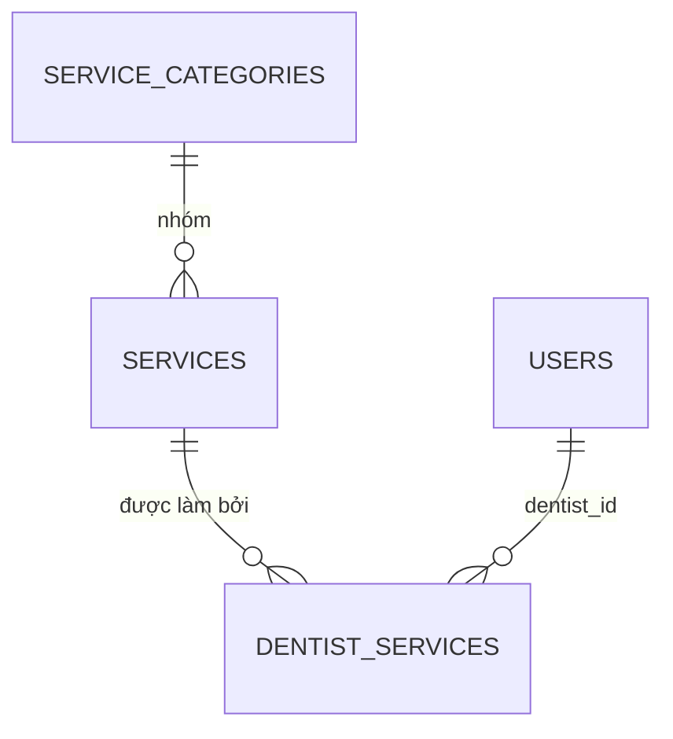

# Schema — Danh mục dịch vụ & phân công bác sĩ (Giai đoạn 2)

> **Module:** Catalog (`backend/src/catalog/`, `frontend/src/features/catalog/`)
> **Quyết định kiến trúc:** [ADR-0009](../../ADR/0009-staff-dentist-service-scheduling-model.md): D1 (bác sĩ = `users.id`), D4 (buffer lưu riêng), D6 (snapshot dịch vụ ở lịch hẹn, giai đoạn 5)
> **Migration:** `020_service_catalog`
> **Ngày tạo:** 2026-09-25 · **Trạng thái:** Đã triển khai (PR-2)

---

## 1. Bảng

### `service_categories`
| Cột | Kiểu | Ghi chú |
|---|---|---|
| `code` | VARCHAR(30), duy nhất | Chữ in hoa, số, `_`, `-` |
| `name` | VARCHAR(100) | |
| `sort_order` | SMALLINT | Thứ tự hiển thị |
| `is_active` | BOOLEAN | Không cho ngừng khi còn dịch vụ đang hoạt động |

### `services`
| Cột | Kiểu | Ghi chú |
|---|---|---|
| `code` | VARCHAR(30), duy nhất | Không đổi sau khi tạo |
| `category_id` | FK `service_categories` | |
| `name`, `description` | | |
| `default_duration_min` | SMALLINT | 5–480, bội số của 5 |
| `buffer_before_min`, `buffer_after_min` | SMALLINT | 0–60; thời gian chuẩn bị/dọn, **không** tính vào thời lượng khám (D4) |
| `base_price` | NUMERIC(15,0) | VND, ≥ 0 |
| `required_specialty` | VARCHAR(30), có thể trống | Mã chuyên môn (giống `dentist_profiles.specialties`) mà bác sĩ phải có |
| `is_active` | BOOLEAN | Ngừng thay cho xóa |

### `dentist_services`
Mỗi dòng là **một khoảng thời gian** bác sĩ làm dịch vụ đó.

| Cột | Kiểu | Ghi chú |
|---|---|---|
| `dentist_id` | FK `users` | D1 |
| `service_id` | FK `services` | |
| `duration_min` | SMALLINT, có thể trống | Thời lượng riêng của bác sĩ; trống = theo dịch vụ |
| `price` | NUMERIC(15,0), có thể trống | Giá riêng; trống = giá niêm yết |
| `effective_from` | DATE | Ngày bắt đầu (tính theo ngày phòng khám) |
| `effective_to` | DATE, có thể trống | Ngày cuối, **tính cả ngày đó**; trống = không thời hạn |

Ràng buộc:
- Unique một phần `(dentist_id, service_id) WHERE effective_to IS NULL`: tối đa một khoảng mở.
- Chồng lấn giữa các khoảng đã đóng được kiểm tra ở service, dưới advisory lock lịch của bác sĩ.

## 2. Quy tắc nghiệp vụ

| Mã | Quy tắc |
|---|---|
| BR-SVC-001 | Mã nhóm và mã dịch vụ duy nhất, không sửa được. |
| BR-SVC-002 | Thời lượng 5–480 phút, bội số của 5; buffer 0–60 phút; giá ≥ 0. |
| BR-SVC-003 | Ngừng dịch vụ thay cho xóa. Khi ngừng: phân công đang chạy kết thúc **hôm nay**, phân công chưa bắt đầu bị hủy. Dịch vụ đã ngừng không phân công mới được. |
| BR-SVC-004 | Chỉ phân công cho bác sĩ có hồ sơ `ACTIVE`, dịch vụ đang hoạt động, và bác sĩ có `required_specialty` nếu dịch vụ yêu cầu. Ngày bắt đầu không ở quá khứ. Không cho hai khoảng của cùng bác sĩ + dịch vụ chồng nhau. |
| BR-SVC-005 | Ngừng phân công bằng cách đặt ngày kết thúc, không xóa, để giữ lịch sử. Riêng phân công chưa bắt đầu thì bị hủy (xóa). |
| BR-SVC-006 | Thời lượng/giá thực tế = giá trị riêng của bác sĩ nếu có, ngược lại theo dịch vụ. |
| BR-SVC-007 | Mọi thay đổi danh mục và phân công đều ghi audit log (đổi giá ghi cả giá cũ/mới). |

## 3. Phân quyền

| Mã quyền | clinic_admin | receptionist | dentist |
|---|:-:|:-:|:-:|
| `service.read` | ✓ | ✓ | ✓ |
| `service.manage` | ✓ | — | — |
| `dentist.assign_service` (từ giai đoạn 1) | ✓ | — | — |

## 4. API

| Method | Path | Quyền |
|---|---|---|
| GET | `/service-categories?includeInactive=` | `service.read` |
| POST / PATCH | `/service-categories`, `/service-categories/:id` | `service.manage` |
| GET | `/services?q=&categoryId=&includeInactive=` | `service.read` |
| POST / GET / PATCH | `/services`, `/services/:id` | `service.manage` / `service.read` |
| POST | `/services/:id/deactivate`, `/services/:id/activate` | `service.manage` |
| GET | `/services/:id/dentists?date=` | `service.read`: bác sĩ đang hành nghề làm được dịch vụ vào ngày đó |
| GET | `/dentists/:userId/services?date=` | `dentist.read` hoặc `service.read` |
| POST | `/dentists/:userId/services` | `dentist.assign_service` |
| POST | `/dentists/:userId/services/:id/end` | `dentist.assign_service` |

## 5. Dữ liệu mẫu

`prisma/catalog-seed.ts` (gọi từ `seed-clinical.ts`, chạy lại được):
- 6 nhóm và 10 dịch vụ, lấy từ bảng giá đang dùng trong seed điều trị.
- Gán chuyên môn cho 4 bác sĩ demo và phân công dịch vụ phù hợp với chuyên môn của từng người.

## 6. Chưa làm ở giai đoạn này

- Lịch hẹn chọn dịch vụ, tính thời lượng/buffer và lưu snapshot: giai đoạn 5.
- `treatments.service_id` và điền sẵn khi thêm điều trị/hóa đơn: giai đoạn 6.
- Lọc bác sĩ theo dịch vụ khi tính slot trống: giai đoạn 4 (AvailabilityService).
