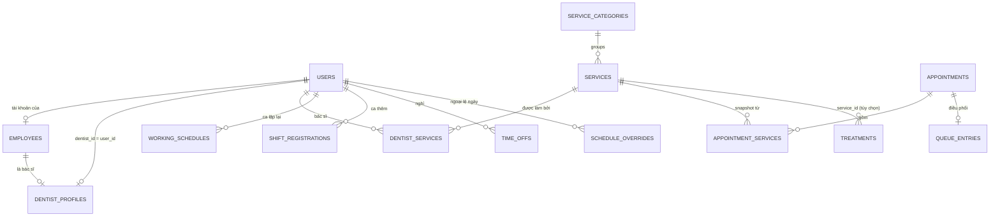

# ADR-0009 — Mô hình nhân sự, bác sĩ, dịch vụ, lịch làm việc và điều phối

> **Status:** Accepted
> **Date:** 2026-09-25
> **Context:** Hoàn thiện nghiệp vụ bác sĩ – dịch vụ – lịch làm việc – lịch hẹn – điều phối (kế hoạch 7 giai đoạn). Hệ thống hiện chỉ có bác sĩ = `User` có role `dentist`, chưa có danh mục dịch vụ, và "hàng đợi" chỉ là danh sách lịch hẹn `CHECKED_IN`.

---

## Context

Kế hoạch yêu cầu tách **User / Employee / DentistProfile**, thêm **danh mục dịch vụ** và **phân công dịch vụ cho bác sĩ**, một **AvailabilityService** duy nhất, lịch hẹn **nhiều dịch vụ**, và **hàng đợi điều phối** riêng.

Code hiện tại có những ràng buộc mà kế hoạch không nhắc tới:

| Hiện trạng | Hệ quả khi thiết kế |
|---|---|
| 23 cột `dentist_id` trỏ tới `users.id`: `appointments`, `working_schedules`, `time_offs`, `shift_registrations`, `encounters`, `dentist_compensations`, `payroll_*`… | Đổi khóa định danh bác sĩ đồng nghĩa với việc migrate toàn bộ các bảng này, kể cả module lương. |
| `AppointmentStatus` = `SCHEDULED, CONFIRMED, CHECKED_IN, IN_PROGRESS, COMPLETED, CANCELLED, NO_SHOW`, dùng ở frontend, backend, báo cáo và lương | Đổi tên trạng thái tốn công sửa khắp nơi mà không thêm giá trị nghiệp vụ. |
| `ShiftRegistration` (ca đăng ký thêm, có duyệt) đã mở slot đặt lịch (BR-APPT-027) và là đầu vào tính lương (BR-PAY-021) | Loại "làm thêm" trong `ScheduleOverride` sẽ trùng chức năng. |
| `Treatment.procedure` và `InvoiceItem` nhập tay (chữ tự do và giá) | Danh mục dịch vụ nên nối được vào điều trị và hóa đơn. |
| `Encounter` và `Appointment` đều có trạng thái `IN_PROGRESS` | Nếu hàng đợi có thêm `IN_ROOM`/`IN_PROGRESS` thì sẽ có ba máy trạng thái cùng mô tả một việc. |

## Decision

### D1 — Khóa định danh bác sĩ vẫn là `users.id`

- `DentistProfile` có `user_id UNIQUE NOT NULL` → mỗi bác sĩ **bắt buộc có tài khoản đăng nhập**.
- Mọi cột `dentist_id` hiện có giữ nguyên, **không migrate khóa ngoại**.
- `Employee.user_id` có thể để trống: nhân viên không phải bác sĩ (phụ tá, tạp vụ…) được phép không có tài khoản.
- Quy tắc: `dentist_profiles.user_id` phải bằng `employees.user_id` của chính nhân viên đó. Service layer kiểm tra điều này khi tạo hoặc cập nhật.

### D2 — Giữ tên trạng thái lịch hẹn, chỉ thêm `LEFT`

- `SCHEDULED` giữ nghĩa "đã đặt, chờ xác nhận" (tương đương `PENDING` trong kế hoạch).
- Thêm `LEFT`: bệnh nhân đã check-in nhưng rời về trước khi khám. Thay cho cách hiện tại là hủy `CHECKED_IN` sau giờ hẹn kèm lý do (BR-APPT-025).
- `NO_SHOW` tạm giữ như hiện tại: cron tự đánh cho cả `SCHEDULED` lẫn `CONFIRMED` sau khi hết khung check-in và hết giờ hẹn (BR-APPT-012). Kế hoạch chỉ cho `CONFIRMED → NO_SHOW`; **cần chốt ở giai đoạn 6**, vì nếu áp dụng thì lịch `SCHEDULED` không ai xác nhận sẽ không bao giờ được đóng.
  - **Đã chốt ở giai đoạn 6:** giữ cả `SCHEDULED` lẫn `CONFIRMED` → `NO_SHOW` (xem [`dispatch.md`](../04_Database/schema-per-module/dispatch.md) §5).

### D3 — `ShiftRegistration` là nguồn duy nhất cho "làm thêm"

- `ScheduleOverride` chỉ có hai loại: `CLOSED` (đóng lịch cả ngày hoặc một khoảng) và `CHANGED_HOURS` (thay giờ làm của một ngày).
- "Làm thêm" tiếp tục đi qua `ShiftRegistration`, vì bảng này đã có quy trình duyệt và gắn với lương.
- "Thay bác sĩ" không phải là ngoại lệ lịch làm việc mà là thao tác điều phối lại lịch hẹn (đổi bác sĩ hàng loạt), nên được làm ở giai đoạn 6.

### D4 — Buffer lưu riêng, chỉ tính một lần

- Lịch hẹn lưu `start_at`/`end_at` là **thời gian khám thực tế**, cộng thêm `buffer_before_min` và `buffer_after_min`.
- Kiểm tra trùng lịch và tính slot trống dùng khoảng chiếm chỗ `[start_at − buffer_before, end_at + buffer_after]`.
- Thời lượng mặc định là tổng thời lượng các dịch vụ; buffer bằng buffer lớn nhất trong các dịch vụ đã chọn. Nhân viên được sửa thời lượng khám nhưng phải ghi lý do (`duration_override_reason`).

### D5 — Hàng đợi chỉ lo phần trước khi khám

- `QueueEntry` có các trạng thái `WAITING → CALLED`, và các nhánh ngoại lệ `SKIPPED`, `LEFT`.
- Khi bác sĩ bắt đầu khám, hàng đợi đóng lại (`done_at`); từ đó trạng thái đi theo `Appointment` (`IN_PROGRESS → COMPLETED`) và `Encounter`.
- Không thêm `IN_ROOM`/`IN_PROGRESS` vào hàng đợi, để chỉ có một nguồn sự thật cho giai đoạn khám.

### D6 — Danh mục dịch vụ nối vào điều trị và hóa đơn

- `treatments` thêm `service_id` (có thể để trống, để dữ liệu cũ vẫn hợp lệ). Khi chọn từ danh mục thì điền sẵn tên, giá và thời lượng; vẫn cho phép nhập tay.
- `appointment_services` lưu **snapshot** mã, tên, giá, thời lượng và buffer tại thời điểm đặt lịch.

### Quy ước chung

- Múi giờ nghiệp vụ cố định `Asia/Ho_Chi_Minh`. `TIMESTAMPTZ` lưu instant; `TIME`/`"HH:mm"` là giờ tường của phòng khám (đã theo quy ước từ PR #6).
- Ngừng hoạt động thay cho xóa cứng (ADR-0006): danh mục dùng `is_active` hoặc `effective_to`, hồ sơ dùng `deleted_at`.
- Mọi bảng mới dùng `uuid_generate_v7()` (ADR-0005), có `created_at/updated_at/created_by/updated_by`, và ghi audit log cho thay đổi quan trọng.
- Phân quyền theo mã quyền (ADR-0004). Giữ các mã cũ (`schedule.write`, `schedule.read`…) trong thời gian chuyển đổi.

## Mô hình đích (tất cả giai đoạn)

| Bảng | Giai đoạn | Ghi chú |
|---|---|---|
| `employees`, `dentist_profiles` | 1 — Nhân sự, bác sĩ | Chi tiết: [`schema-per-module/staff.md`](../04_Database/schema-per-module/staff.md) |
| `service_categories`, `services`, `dentist_services` | 2 — Dịch vụ | `dentist_services` có hiệu lực theo thời gian, thời lượng/giá riêng của bác sĩ. Chi tiết: [`schema-per-module/services.md`](../04_Database/schema-per-module/services.md) |
| `schedule_overrides`; `time_offs` thêm `status/decided_by/decided_at/decision_note` | 3 — Lịch làm việc | Nghỉ chờ duyệt **chưa** chặn slot; chỉ `APPROVED` chặn. Chi tiết: [`schema-per-module/schedule.md`](../04_Database/schema-per-module/schedule.md) |
| (không bảng mới) `AvailabilityService` | 4 — Slot trống | Gộp `getAvailability` + `ensureSlotAvailable`; một nguồn cho đặt lịch, đổi lịch, điều phối. Chi tiết: [`schema-per-module/availability.md`](../04_Database/schema-per-module/availability.md) |
| `appointment_services`; `appointments` thêm `visit_kind` (`BOOKED`/`WALK_IN`), `buffer_*`, `calculated_duration_min`, `duration_override_reason`; enum thêm `LEFT` | 5 — Lịch hẹn | Walk-in được đặt tại thời điểm hiện tại. Chi tiết: [`schema-per-module/appointment-services.md`](../04_Database/schema-per-module/appointment-services.md) |
| `queue_entries`; `treatments.service_id` | 6 — Điều phối | Ưu tiên: cấp cứu > đúng giờ > trễ > walk-in > giờ check-in. Chi tiết: [`schema-per-module/dispatch.md`](../04_Database/schema-per-module/dispatch.md) |

## Lộ trình

Mỗi giai đoạn là một PR riêng, merge xong mới làm giai đoạn sau. Mỗi PR gồm migration, seed, backend, frontend, test, và vẫn tương thích với các API lịch hẹn hiện có.

1. **PR-1 Nhân sự, bác sĩ:** migration 019, chuyển dữ liệu bác sĩ/nhân viên từ `users`, API + màn hình nhân sự/bác sĩ.
2. **PR-2 Dịch vụ:** danh mục, phân công dịch vụ cho bác sĩ, seed dịch vụ nha khoa mẫu.
3. **PR-3 Lịch làm việc:** duyệt nghỉ phép, `schedule_overrides`, cảnh báo lịch hẹn bị ảnh hưởng.
4. **PR-4 AvailabilityService:** gộp logic slot trống, test bảng quyết định.
5. **PR-5 Lịch hẹn nhiều dịch vụ:** snapshot, buffer, walk-in, `LEFT`, lịch sử thay đổi.
6. **PR-6 Điều phối:** hàng đợi, ưu tiên, gọi/bỏ qua/chuyển bác sĩ.
7. **PR-7 E2E và nghiệm thu:** luồng từ tạo nhân viên tới hoàn thành khám, rà soát phân quyền, audit, hiệu năng.

## Consequences

**Tích cực**
- Không đụng tới 23 khóa ngoại `dentist_id` hay module lương; rủi ro migration thấp.
- Mỗi khái niệm chỉ có một nguồn sự thật: làm thêm, trạng thái khám, slot trống.
- Có thể làm từng giai đoạn độc lập vì API cũ vẫn hoạt động.

**Tiêu cực / đánh đổi**
- Bác sĩ bắt buộc có tài khoản đăng nhập; phòng khám không thể thêm bác sĩ "chỉ để xếp lịch" mà không cấp tài khoản.
- `DentistProfile` lưu `user_id` trùng với `Employee.user_id`, nên cần kiểm tra ở service để hai giá trị luôn khớp.
- `SCHEDULED` không khớp tên `PENDING` trong tài liệu nghiệp vụ; thuật ngữ được ghi trong GLOSSARY.

## Alternatives considered

1. **`dentist_id` trỏ tới `dentist_profiles.id`.** Cho phép bác sĩ không cần tài khoản, nhưng phải migrate 23 khóa ngoại cùng dữ liệu lương. Để dành nếu sau này thật sự cần.
2. **Đổi `SCHEDULED` thành `PENDING`.** Chỉ đổi tên, không thêm giá trị nghiệp vụ, trong khi phải sửa frontend, backend, báo cáo và seed.
3. **Gộp `ShiftRegistration` vào `ScheduleOverride`.** Phải viết lại luồng duyệt ca và nguồn dữ liệu tính lương, ngoài phạm vi "chỉ HR Core".
