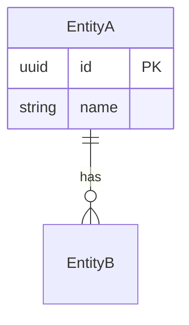

# Module Specification Template

> **Mục đích:** Chuẩn hóa format spec cho mọi module nghiệp vụ.
> **Quy tắc:** Module nào thiếu mục nào trong 10 mục bắt buộc → chưa coi là "spec xong" → chưa code module đó.

---

## Quy ước

- Mỗi module có một file spec duy nhất (hoặc nhiều file trong một thư mục con).
- Tên file: `SPEC.md` hoặc theo chủ đề nhỏ (VD: `appointment-create.md`).
- Tiếng Việt cho mô tả, tiếng Anh cho code identifier (resource, permission code, status code).
- Mọi từ viết tắt hoặc thuật ngữ đặc biệt phải có trong `docs/02_Glossary/GLOSSARY.md`.

---

## 10 mục bắt buộc

### 1. Purpose (Mục đích)

> Module giải quyết vấn đề gì? Cho ai? Tại sao cần thiết?

- Mô tả ngắn gọn 3–5 câu.
- Bối cảnh kinh doanh.
- Phạm vi (in/out of scope).

### 2. Business Flow (Luồng nghiệp vụ)

> Happy path từ đầu đến cuối. Có cả sơ đồ Mermaid nếu cần.

- **Luồng chính:** từ trigger → bước trung gian → kết quả.
- **Các luồng thay thế** (alternative flow): VD: huỷ lịch, hoàn tiền.
- **Exception flow:** VD: bệnh nhân không đến, thanh toán fail.

### 3. Actors (Vai trò liên quan)

| Actor | Quyền liên quan đến module |
| ----- | ------------------------- |
| Clinic Administrator | ... |
| Receptionist          | ... |
| Dentist               | ... |

### 4. Screens (Danh sách màn hình)

> Liệt kê các màn hình UI liên quan. Mỗi screen có mô tả 1 dòng.

| Tên màn hình | Mục đích | Primary actor |
| ----------- | -------- | ------------- |
| ... | ... | ... |

Chi tiết UI (wireframe, layout) sẽ ở `docs/06_UI/`.

### 5. Entities (Thực thể)

> Các entity chính + quan hệ. Có sơ đồ ERD nếu cần.



### 6. Business Rules (Quy tắc nghiệp vụ)

> Quy tắc cứng. Mỗi rule có ID, mô tả, ví dụ.

| Rule ID | Mô tả | Ví dụ |
| ------- | ----- | ----- |
| BR-001 | Bệnh nhân phải tồn tại trước khi tạo Appointment | ... |
| BR-002 | Không thể đặt 2 appointment trùng khung giờ cho cùng bác sĩ | ... |
| ... | ... | ... |

### 7. Permissions (Ma trận quyền)

> Role × Action.

| Action | Admin | Receptionist | Dentist | Permission code |
| ------ | ----- | ------------ | ------- | --------------- |
| Tạo   | ✅    | ✅           | ❌      | `xxx.create` |
| Đọc   | ✅    | ✅           | ✅      | `xxx.read` |
| ... | ... | ... | ... | ... |

### 8. API (Endpoints)

> REST endpoints. Sơ bộ, chi tiết sẽ ở `docs/05_API/`.

| Method | Endpoint | Permission | Mô tả |
| ------ | -------- | ---------- | ----- |
| GET    | /api/v1/xxx | ... | ... |
| POST   | /api/v1/xxx | ... | ... |

### 9. Database (Bảng/Field liên quan)

> Liệt kê bảng và field quan trọng. FK quan trọng.

| Table | Field | Note |
| ----- | ----- | ---- |
| ... | ... | ... |

### 10. Validation & Acceptance Criteria (Xác nhận hoàn thành)

**Validation:**
- Validate input gì, format gì, range nào.

**Acceptance criteria (mẫu Gherkin):**

```gherkin
Feature: ...

  Scenario: ...
    Given ...
    When ...
    Then ...
```

**Tiêu chí xong module:**

- [ ] Code đã viết theo layered architecture
- [ ] Unit test cho domain entities
- [ ] Application test cho use cases (với mock repo)
- [ ] Integration test cho controller (qua Supertest)
- [ ] Lint + Type check pass
- [ ] Migration có file `.md` mô tả nghiệp vụ
- [ ] Swagger tự generate đúng
- [ ] Audit log cho hành động nhạy cảm

---

## Bổ sung tuỳ chọn

- **Event (Domain Event):** event nào module này phát ra / lắng nghe.
- **Integration:** module này giao tiếp với module nào, qua cơ chế gì.
- **Reporting:** KPI / metric cho module này nếu có.
- **Migration plan:** nếu thay đổi schema của module cũ.

---

## Liên kết ngược

- ADR liên quan: <link>
- Spec module liên quan: <link>
- API spec: <link>
- UI spec: <link>
